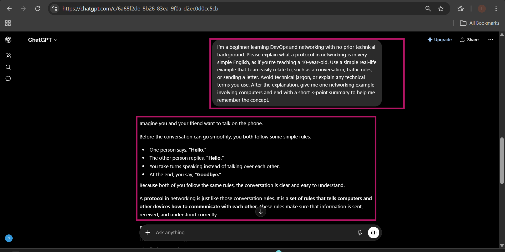
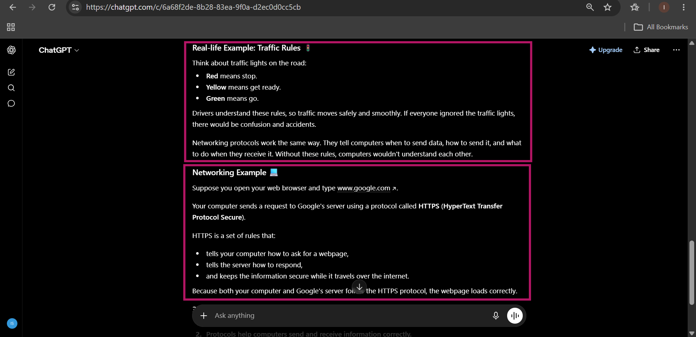
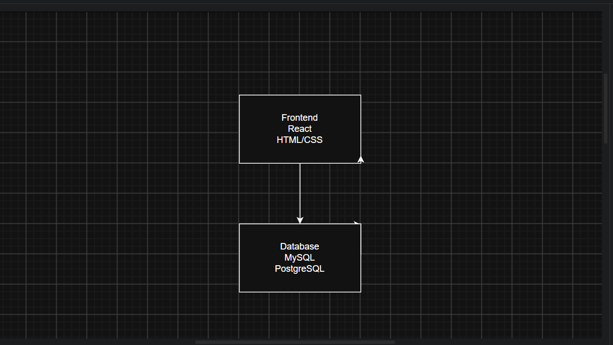
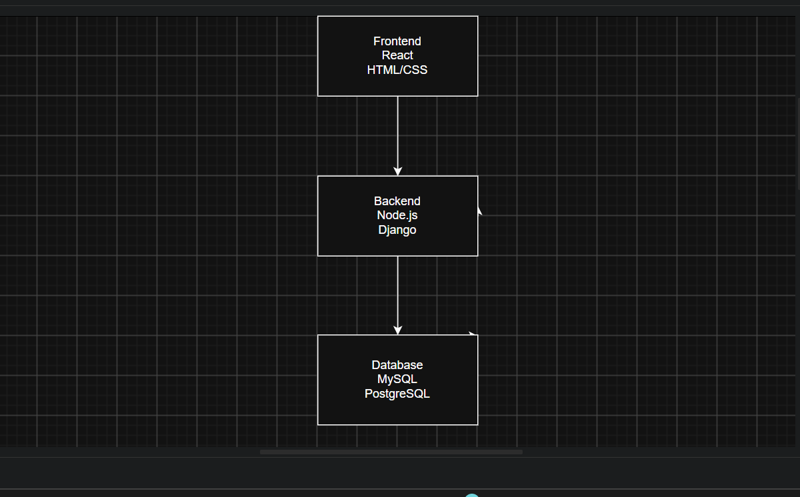
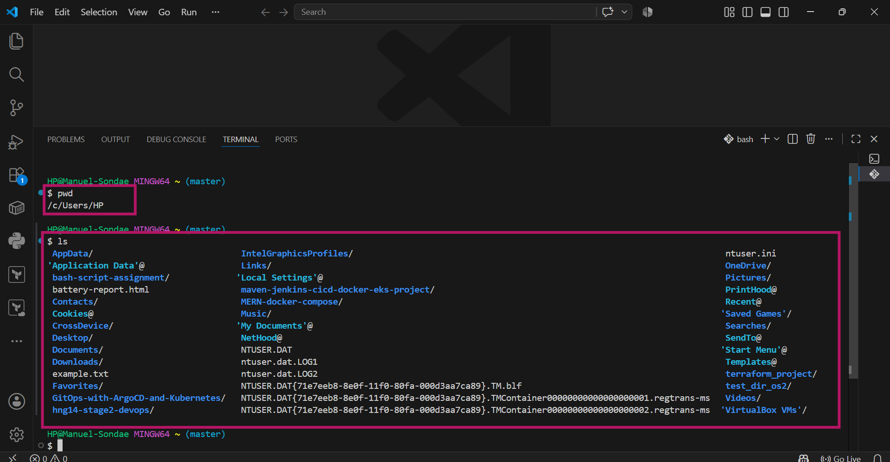

# Week 00 - Internet and Networking

Part of the DevOps Micro Internship (DMI) Cohort 3 with Agentic AI

---

# 🧑‍💻 Task 1: Using ChatGPT as Your Learning Assistant

## Scenario

You're new to DevOps and will frequently encounter technical questions. ChatGPT can be your learning companion.

## Your Task

Write a clear ChatGPT prompt to help you understand:

> "What is a protocol in networking? Explain with a simple real-life example."

Take a screenshot of your interaction showing:

* Your detailed prompt (with clear expectations)
* ChatGPT's simplified response with an example

## Screenshot

Save your screenshot in the `screenshots` folder and update the file name below.




---

## What I Learned (2–3 lines)

1. A protocol is a set of rules for communication.
2. Protocols help computers send and receive information correctly.
3. Without protocols, computers would not be able to understand each other or communicate reliably.

---

# 🌐 Task 2: Internet and Networking

## Scenario

Your friend is launching an online bookstore named **EpicReads**.

He asked you to explain how users globally can access his website hosted in Finland.

## Your Task

Write a short explanation (**100–150 words**) that includes:

* Packet Switching
* IP Address
* TCP/IP
* HTTP/HTTPS

💡 **Tip:** You may use ChatGPT (as demonstrated in Task 1) to refine your explanation.

## Answer

When someone anywhere in the world visits the EpicReads website, their browser first finds the server in Finland using its IP address, which is like the server's unique home address on the internet. The browser and server communicate using the TCP/IP protocol suite. TCP (Transmission Control Protocol) breaks the data into small pieces called packets, ensures they arrive correctly, and puts them back in the right order. IP (Internet Protocol) helps each packet find the best route to the destination. This process is known as packet switching, where packets can travel along different paths before being reassembled. Finally, HTTP or the more secure HTTPS protocol is used to request and deliver the web pages. HTTPS also encrypts the data, helping protect users' personal information and online transactions.


---

# 🏗️ Task 3: Application Architecture & Stack

## Scenario

EpicReads bookstore has two application versions:

### Two-Tier Application

* Frontend
* Database

### Three-Tier Application

* Frontend
* Backend
* Database

## Your Task

* Draw simple diagrams (hand-drawn or tool-based such as draw.io)
* Label each layer clearly
* List at least two common technologies or tools used for each layer
* Submit a screenshot or photo clearly showing your own drawing

## Diagram Screenshot / Photo





---

## Technologies Used

### Frontend

* React
* HTML/CSS

### Backend

* Node.js
* Django

### Database

* mySQL
* postgreSQL

---

# 🌍 Task 4: Domain Name & DNS (Basic Concepts)

## Scenario

Your friend's bookstore **EpicReads** is currently accessible through:

```text
52.172.142.222:3000
```

He purchased the domain:

```text
epicreads.com
```

## Your Task

In **50–100 words**, explain in your own words:

1. What is DNS (Domain Name System)?
2. Which DNS record type should be used to connect the domain to the given IP, and why?

## Answer

The Domain Name System (DNS) is like the internet's phonebook. It translates a human-friendly domain name, such as epicreads.com, into an IP address that computers use to find a website. To connect epicreads.com to 52.172.142.222, you should use an A (Address) record because it maps a domain name directly to an IPv4 address. This allows users to access the website by typing the domain name instead of remembering the numeric IP address.


---

# 💻 Task 5: Visual Studio Code Setup (Hands-on)

## Your Task

Install Visual Studio Code (if not already installed).

Take a screenshot of your VS Code environment showing:

* Terminal open inside VS Code
* Running a basic command:

### Windows

```powershell
dir
```

### Linux / macOS

```bash
pwd
ls
```

* Your selected VS Code theme clearly visible

⚠️ **Important:** The screenshot must show your username or another identifiable detail to confirm it is your environment.

## Screenshot


---

# 🔗 Task 6: Publish Your Assignment as a LinkedIn Post

## Objective

Publishing on LinkedIn helps you:

* Build your professional online presence
* Reinforce your learning
* Document your DevOps journey publicly

## Your Task

Summarize your answers from Tasks 1–5 into a LinkedIn post.

Clearly structure your post into the following sections:

* ChatGPT
* Internet & Networking
* App Architecture
* DNS
* VS Code Setup

Add the following credit note at the end of your post:

> **P.S. This post is part of the DevOps Micro Internship (DMI) with Agentic AI — Cohort 3 — by Pravin Mishra. My graded progress is public: https://dmi.pravinmishra.com/s/YOUR-GITHUB-USERNAME.html · Start your DevOps journey: https://dmi.pravinmishra.com/?utm_source=student&utm_medium=ps-linkedin&utm_campaign=cohort3**

---

## LinkedIn Post URL

https://www.linkedin.com/posts/emmanuel-sunday-210a08323_join-the-dmi-devops-micro-internship-activity-7473695494494531584-2xIW?utm_source=share&utm_medium=member_desktop&rcm=ACoAAFHXXywBq0IrgBBhbi5ULmCrDuZgCEYc6fQ


---

## LinkedIn Post Backup Copy

Paste the full text of your LinkedIn post here:

My DevOps Learning Journey – Building Foundational Skills
I’ve been exploring the basics of DevOps and core internet technologies through a structured learning exercise, and it has really helped me understand how everything connects behind the scenes.
🔹 ChatGPT as a Learning Assistant
I used ChatGPT to simplify complex networking concepts and guide me through practice tasks. It helped me learn faster by breaking down topics into clear, beginner-friendly explanations.

🔹 Internet & Networking
I learned how data moves across the internet using IP addresses, packet switching, and protocols like TCP/IP. I also understood how HTTP/HTTPS enables communication between browsers and servers.

🔹 Application Architecture
I explored how applications are structured using two-tier and three-tier architectures. Introducing a backend layer improves scalability, security, and overall system design.

🔹 DNS (Domain Name System)
DNS works like the internet’s phonebook, translating domain names into IP addresses. An A record is used to map a domain directly to an IPv4 address, allowing users to access servers easily.

🔹 VS Code Setup (Hands-on Practice)
I set up Visual Studio Code and worked with the integrated terminal using basic commands like pwd and ls. This helped me get comfortable with a real development environment.

💡 This experience helped me see how networking, application design, and developer tools work together to power modern web systems.
I’m excited to continue building and improving my DevOps skills step by step.

P.S. This learning journey is part of the DevOps Micro Internship with Agentic AI Cohort run by Pravin Mishra https://lnkd.in/dUfughTR. Join the community here: https://lnkd.in/dp3W8PwC

hashtag#DevOps hashtag#CloudComputing hashtag#Networking hashtag#Linux hashtag#AWS hashtag#TechJourney hashtag#LearningInPublic hashtag#BeginnerDeveloper hashtag#BuildInPublic

---

# Reflection – Week 0

### What did you find easy?

I found it easy to use ChatGPT to understand networking concepts in simple terms. It also helped me explain technical topics clearly and organise my answers for the tasks

---

### What was difficult?

The most challenging part was understanding how networking concepts such as packet switching, TCP/IP, DNS, and application architecture work together. Creating the application architecture diagram also took some time because I wanted to label each layer correctly.

---

### What will you improve next week?

Next week, I will spend more time practising networking fundamentals and creating diagrams on my own. I also want to improve my understanding of DNS, application architecture, and other DevOps concepts by doing more hands-on practice and reading the documentation.

## 📌 About DMI & CloudAdvisory

DevOps Micro Internship (DMI) is a project-based DevOps program run by Pravin Mishra (The CloudAdvisory) focused on real-world execution, systems thinking, and career readiness.

It helps learners build strong DevOps foundations with hands-on experience.


## 📌 Resources

- 🌐 **DMI Official Website:** https://pravinmishra.com/dmi  
- 🎓 **DevOps for Beginners (Udemy):** https://www.udemy.com/course/devops-for-beginners-docker-k8s-cloud-cicd-4-projects/  
- 🎓 **Ultimate Agentic AI DevOps with Clude Code** https://www.udemy.com/course/ultimate-agentic-ai-devops-with-claude-code/?referralCode=448389767BC96284087B
- 🎓 **DevOps with Claude Code: Terraform, EKS, ArgoCD & Helm** https://www.udemy.com/course/devops-with-claude-code-terraform-eks-argocd-helm/?referralCode=1C5B734505D65A010FA3
- ▶️ **YouTube Playlist (DMI Cohort 3):** https://www.youtube.com/playlist?list=PLFeSNDtI4Cho  
- 🔗 **Pravin Mishra (LinkedIn):** https://www.linkedin.com/in/pravin-mishra-aws-trainer/  
- 🏢 **CloudAdvisory (LinkedIn):** https://www.linkedin.com/company/thecloudadvisory/

---

*This submission is part of DevOps Micro Internship (DMI) Cohort 3 — Agentic AI Track*