# Assignment 3 — Production Maintenance Drill (OPS Checklist)

Part of the DevOps Micro Internship (DMI) Cohort 3 with Agentic AI

---

## Purpose

In this assignment, you will treat your already deployed React application (on Ubuntu VM with Nginx) as a live production system. You will perform structured operational checks covering network validation, service health, log analysis, resource monitoring, configuration verification, and incident simulation with recovery — mirroring real on-call DevOps responsibilities.

---

# Task 1 — Server Access & Networking Validation

## Goal

Verify that the deployed React application is reachable from the browser and confirm basic network connectivity of the Ubuntu VM.

### Evidence

#### Screenshot 1 — Browser showing the React app with your Full Name visible on the UI

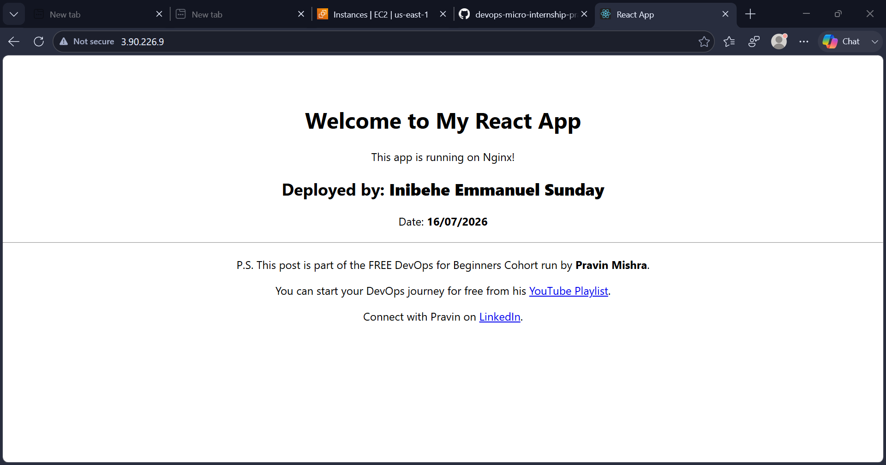

#### Screenshot 2 — Output of `ip a`

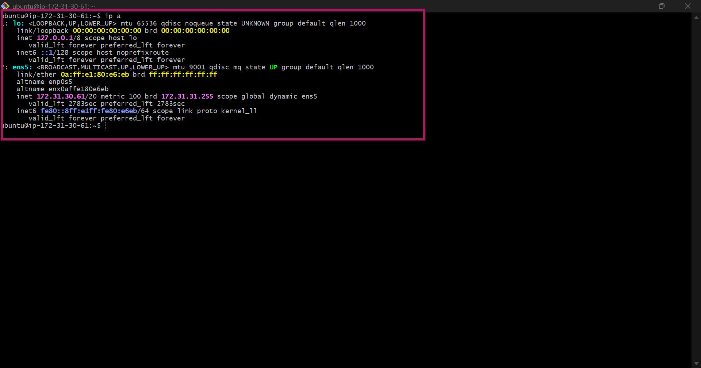

#### Screenshot 3 — Output of `sudo ss -tulpen`

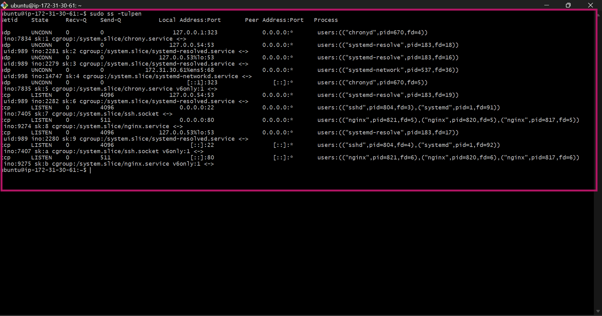

#### Screenshot 4 — Output of `sudo ufw status`

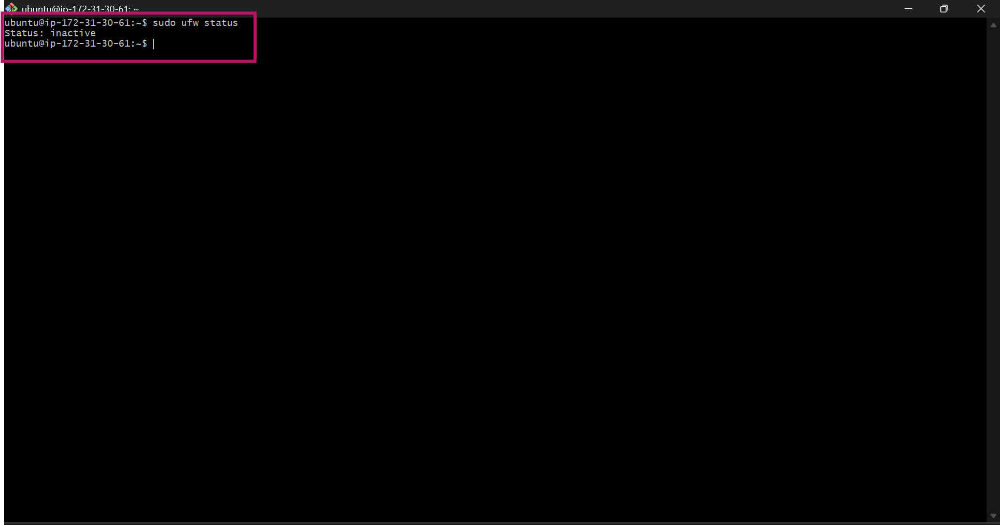

### Notes

Answer the following in your own words:

**1. What proves Nginx is listening on 0.0.0.0:80?**

tcp      LISTEN    0         511                    0.0.0.0:80              0.0.0.0:*       users:(("nginx",pid=821,fd=5),("nginx",pid=820,fd=5),("nginx",pid=817,fd=5))     ino:9274 sk:8 cgroup:/system.slice/nginx.service <->

**2. What proves SSH is active on port 22?**

tcp      LISTEN    0         4096                   0.0.0.0:22              0.0.0.0:*       users:(("sshd",pid=804,fd=3),("systemd",pid=1,fd=91))                            ino:7405 sk:7 cgroup:/system.slice/ssh.socket <->

**3. Did you find any unexpected open ports? Explain briefly.**

Based on the ss -tulpen output, no unexpected open ports were found.

# Task 2 — Service Health & Systemd Validation (Nginx)

## Goal

Verify that Nginx is properly installed, running, enabled at boot, and safely configured.

### Evidence

#### Screenshot 1 — Output of `systemctl status nginx --no-pager`

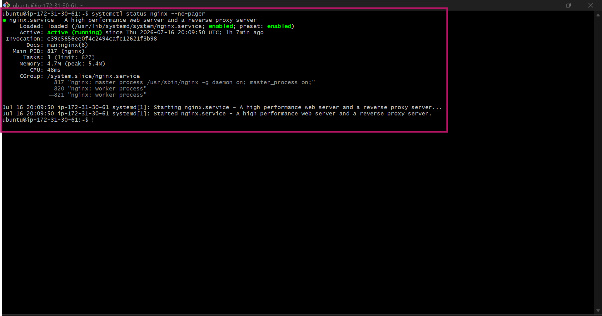

#### Screenshot 2 — Output of `sudo nginx -t`

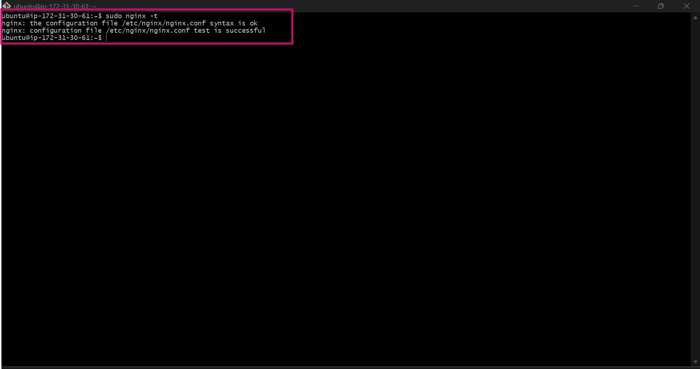

#### Screenshot 3 — Output of `sudo ss -lptn '( sport = :80 )'`

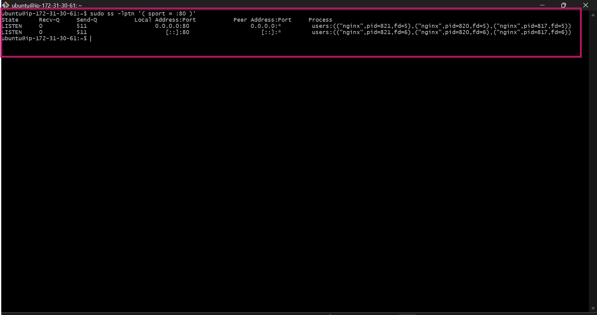

### Notes

Answer the following in your own words:

**1. What happens if Nginx fails to restart in production?**

If Nginx fails to restart in a production environment, you run sudo systemctl reload nginx

**2. What's your basic rollback plan?**

1. Revert: Restore the pre-deployment backup file to overwrite the broken configuration.
2. Restart: Run 'sudo systemctl restart nginx' to immediately bring the web server back online.
3. Verify: Execute 'sudo nginx -t' and test live site access to confirm full recovery.

# Task 3 — Logs & Request Trace

## Goal

Verify real traffic flow and analyze logs to understand system behavior and errors.

### Evidence

#### Screenshot 1 — Output of `sudo tail -n 30 /var/log/nginx/access.log`

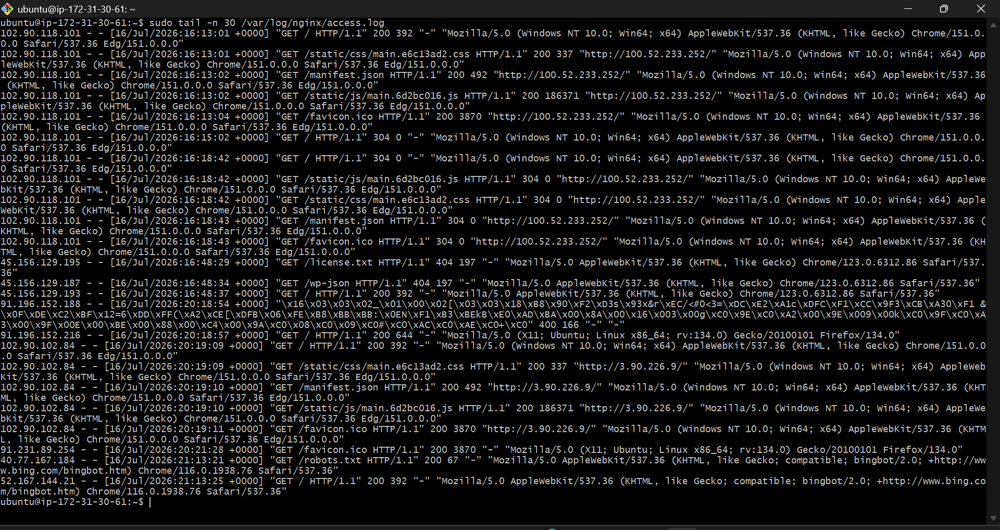

#### Screenshot 2 — Output of `sudo tail -n 30 /var/log/nginx/error.log`

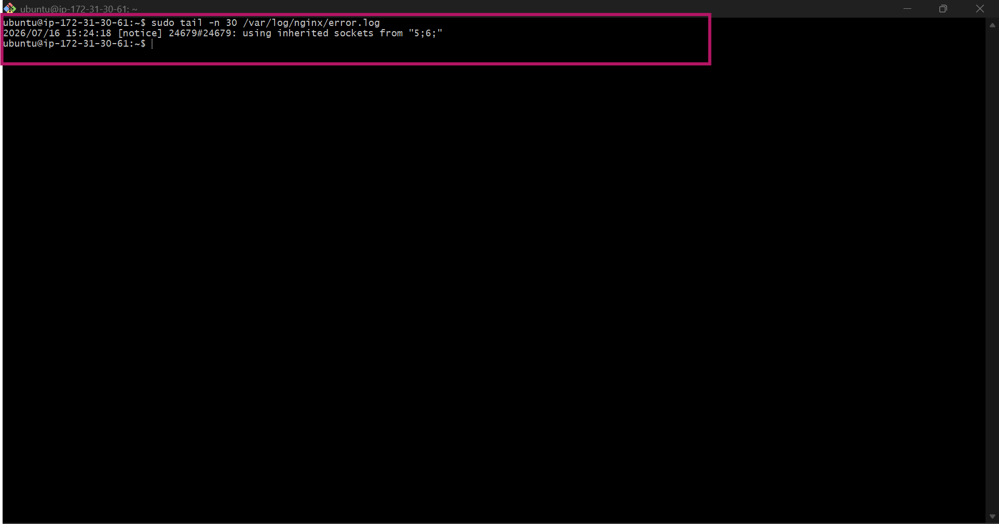

#### Screenshot 3 — Output of `sudo journalctl -u nginx --no-pager -n 50`

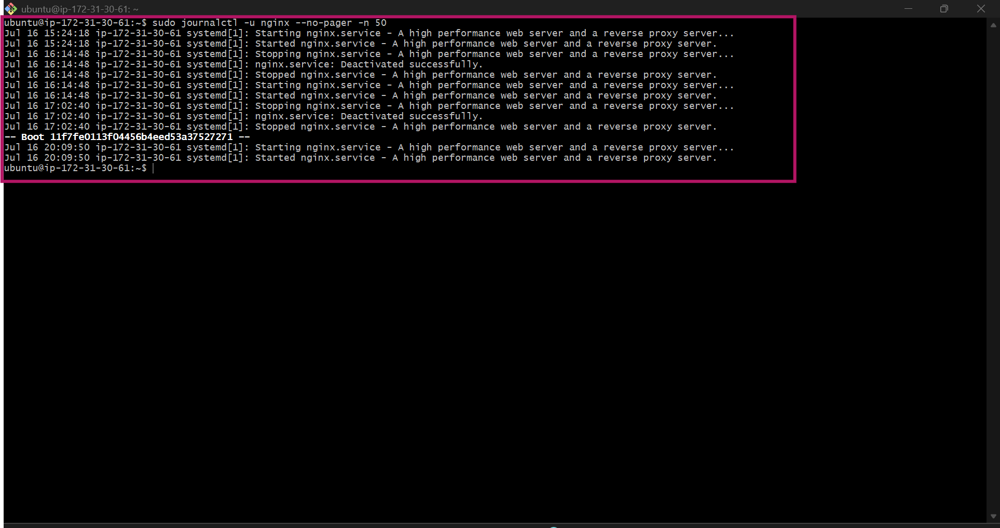

### Notes

Answer the following in your own words:

**1. Were there any errors in the logs?**

- If yes, mention 1–2 example error lines from the logs and explain what each one means in simple terms.
- If no, explain what it means if the error log is empty or shows no recent errors during your check.

### 1. Were there any errors in the logs?

No, there were no errors in the logs.The file only showed a standard system "notice" line regarding inherited sockets, which is an informational update rather than an error indicator.

**2. If there were no errors, what does that indicate about the system?**

An empty or error-free log means that your Nginx server configuration is structurally healthy, the service is running stably without background crashes, and the system is not encountering critical runtime or file permission failures.

**3. Based on the access logs, were your curl requests visible in the log entries? What does that prove about traffic flow?**

No, curl requests are not visible in these logs; all entries show standard web browsers or bots. This proves that any curl tests run were either pushed out of the recent view by other traffic, or they were sent as outbound requests (like curl ifconfig.me) which do not trigger Nginx's incoming traffic logs.

# Task 4 — System Resource Health Check (Capacity Red Flags)

## Goal

Assess server capacity and detect potential performance or failure risks.

### Evidence

#### Screenshot 1 — Output of `uptime`

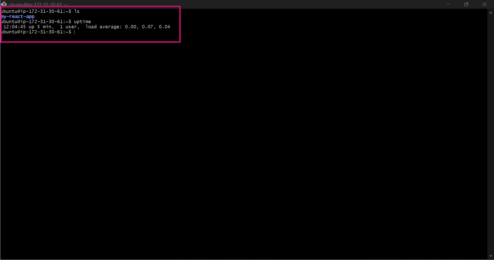

#### Screenshot 2 — Output of `free -h`

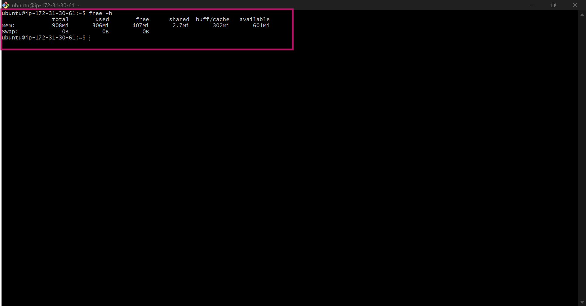

#### Screenshot 3 — Output of `df -h`

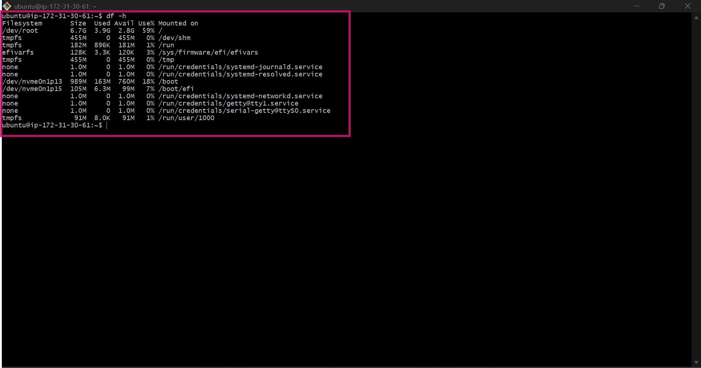

#### Screenshot 4 — Output of `sudo du -sh /var/* | sort -h`

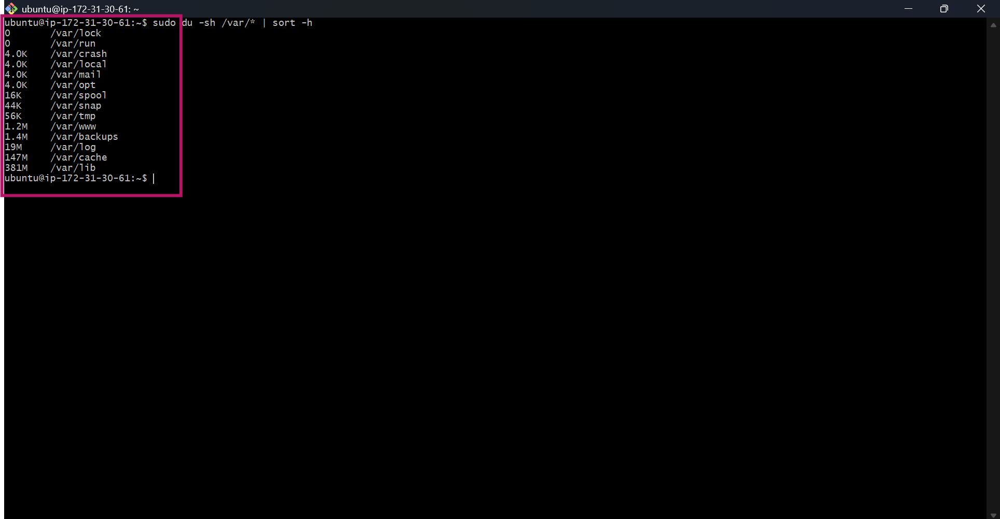

### Notes

Answer the following in your own words:

**1. Which resource looks most critical right now? (CPU/load, memory, or disk) Explain why.**

Memory (RAM) is the most critical resource. 

* Low Capacity: The system only has 908 MB of total RAM, and 313 MB is already used while sitting idle. 
* No Safety Net: Swap space is disabled (0B). Without swap, there is no backup memory buffer. 
* Crash Risk: If a new application is started, the system will immediately run out of memory and crash.

**2. What happens if disk becomes 100% full in a production server?**

A 100% full disk causes an immediate operational crisis.

* Database Corruption: Databases cannot commit transactions or write new data, often leading to table corruption and sudden service shutdowns.
* Application Crashes: Services like Nginx or Apache crash instantly because they can no longer write to log files (/var/log) or temporary directories (/tmp).
* Admin Lockout: System administrators can be entirely locked out of the server because SSH requires writing session data to function.
* Total Outage: External users will immediately experience 500 Internal Server Errors, and background tasks (cron jobs) will fail completely.

# Task 5 — Configuration & Deployment Verification

## Goal

Ensure the correct React build is deployed and Nginx is serving it properly.

### Evidence

#### Screenshot 1 — Output of `ls -lah /var/www/html | head -n 20`

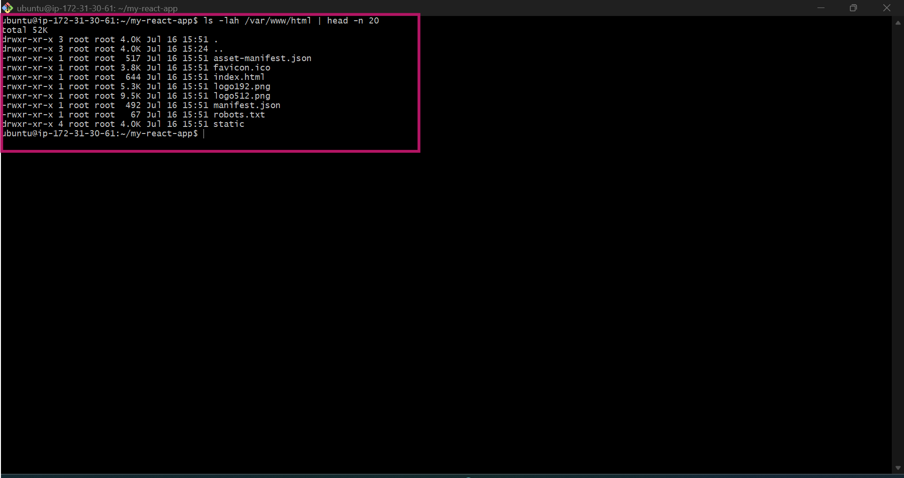

#### Screenshot 2 — Output of `grep -R "Deployed by" -n /var/www/html 2>/dev/null | head`

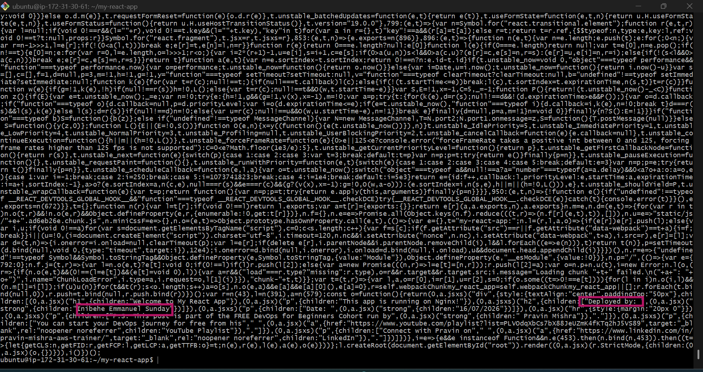

#### Screenshot 3 — Output of `grep -n "try_files" /etc/nginx/sites-available/default`

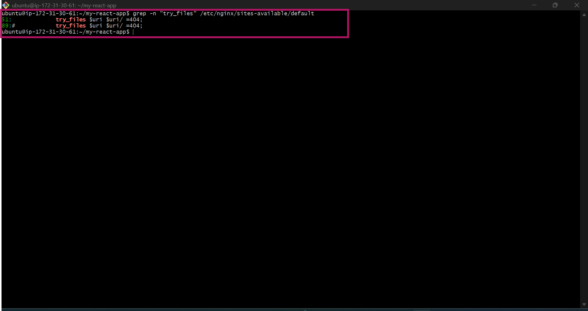

### Notes

Answer the following in your own words:

**1. How do you confirm that the correct version of the application is deployed?**

Confirming the correct version of a deployed Nginx application involves checking these specific layers:

* Command Line Flags: Run 'nginx -v' via SSH to get the short version string, or use 'nginx -V' to see the exact version along with compiled-in modules and build arguments.
* HTTP Response Headers: Run 'curl -sI http://localhost | grep Server' to inspect the response header. It will expose the running version (e.g., Server: nginx/1.24.0) unless intentionally hidden for security.
* Package Manager Check: Run 'apt show nginx' or 'dpkg -l nginx' on Ubuntu/Debian systems to verify that the package version installed on the disk aligns with your deployment goals.

# Task 6 — Nginx Configuration Failure Simulation

## Goal

Simulate a real-world Nginx misconfiguration and recover the service safely.

### Evidence

#### Screenshot 1 — Output of `sudo nginx -t` showing the syntax error (broken config)

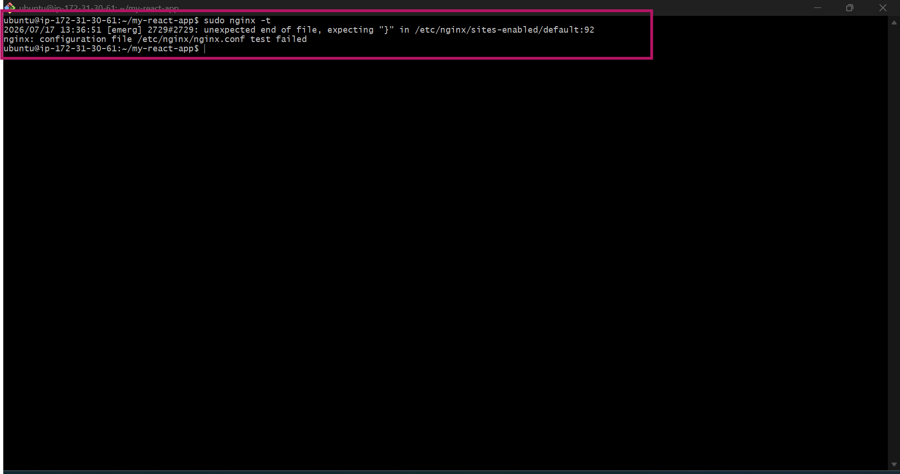

#### Screenshot 2 — Output of `sudo nginx -t` showing syntax ok (fixed config)

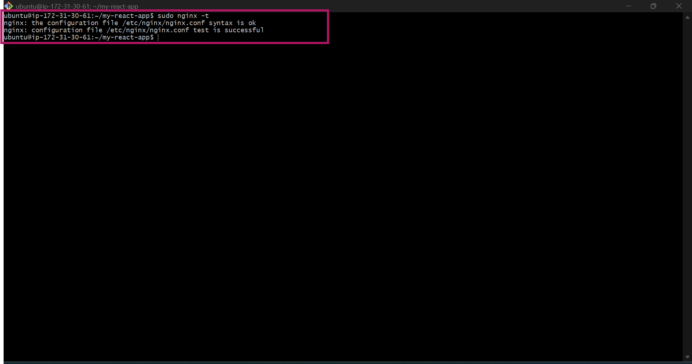

#### Screenshot 3 — Output of `curl -I http://<public-ip>` confirming recovery (200 OK)

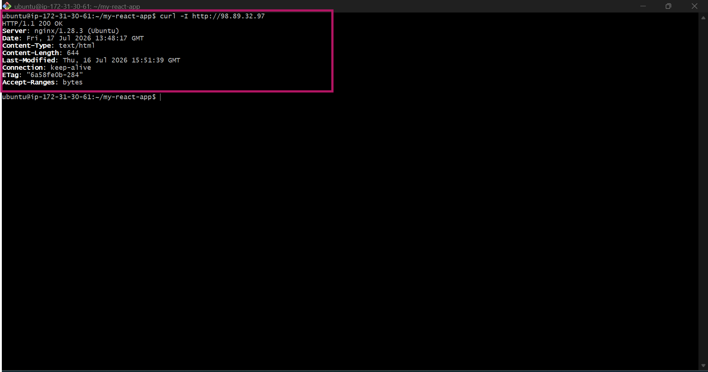

### Notes

Answer the following in your own words:

**1. What caused the configuration failure?**

 A closing curly brace (}) was intentionally omitted from the /etc/nginx/sites-enabled/default file. When running nginx -t, the engine fails validation due to an unexpected end of file. This prevents NGINX from starting or reloading, protecting the server from launching a broken configuration.

**2. How did you fix the issue?**

I fixed the issue by adding the missing closing curly brace (}) to structurally close the server block.

**3. How can you avoid this kind of issue in real production systems?**

To avoid configuration issues in production, always run sudo nginx -t to validate syntax automatically before executing a graceful reload rather than a full service restart. 

# Task 7 — Web Application Failure Simulation

## Goal

Simulate missing deployment content and recover the application safely.

### Evidence

#### Screenshot 1 — Output of `curl -I http://<public-ip>` showing failure (non-200 response)

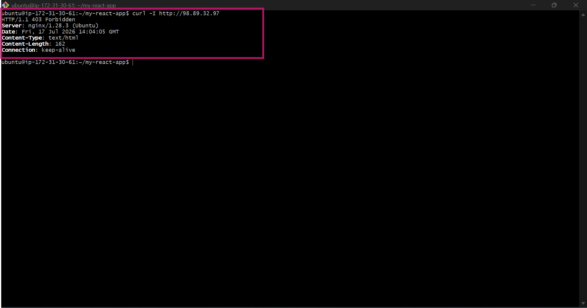

#### Screenshot 2 — Output of `curl -I http://<public-ip>` confirming recovery (200 OK)

### Notes

Answer the following in your own words:

**1. What caused the application to break in this scenario?**

The application broke because the primary landing file (index.html) was missing from the server's web root directory (/var/www/html). Because NGINX could not find the default index file to display, it denied access to the empty directory and automatically returned an HTTP error response to the user.

**2. How did you fix the issue and restore the application?**

The issue was fixed by moving the backup file (index.html.bak) back to its original name and location inside the web root directory (/var/www/html). Once the file was restored, NGINX was immediately able to locate the default landing page and serve the website successfully with an HTTP 200 OK status.

**3. What steps would you take to prevent this kind of issue in real production systems?**

To prevent missing content in traditional NGINX static file hosting, engineers use atomic deployments with symbolic links so live production files are never directly edited or moved [1]. Additionally, automated file integrity tools constantly monitor the web root directory to detect unauthorized deletions and trigger immediate alerts if an error occurs.

# Task 8 — Security & Reliability Review

## Goal

Review and reflect on the security and reliability practices applied during this assignment.

### Security & Reliability Notes

Answer the following in your own words:

**1. Why is SSH key-based authentication more secure than sharing passwords?**

SSH key-based authentication is more secure because it uses cryptographic algorithms that are virtually impossible to brute-force, unlike standard passwords.

**2. Why should only required ports be open on a production server?**

Only required ports should be open on a production server to minimize the attack surface and prevent unauthorized access to internal services. Leaving unused ports open creates unnecessary entry points for automated scanning bots and malicious hackers.

**3. Why is it important for Nginx to be enabled on boot?**

It is critical for Nginx to be enabled on boot to ensure immediate application availability and automatic recovery if the underlying server crashes, restarts, or undergoes maintenance.

**4. What are the risks of sharing secrets, keys, or credentials publicly?**

Sharing secrets, keys, or credentials publicly exposes an infrastructure to immediate compromise, leading to data breaches, unauthorized resource consumption, and complete system takeover. Once private keys or passwords are leaked to public repositories, automated malicious bots harvest them within seconds to exploit the host environment.

**5. Why should cloud resources be stopped or terminated when they are no longer needed?**

Cloud resources should be stopped or terminated when no longer needed to eliminate unnecessary financial costs and reduce the environment's security attack surface.

# LinkedIn Post (Required)

## Evidence

#### LinkedIn Post URL

Paste your LinkedIn post URL here:

https://www.linkedin.com/feed/update/urn:li:ugcPost:7483892473786687488/

#### Screenshot — Published LinkedIn post

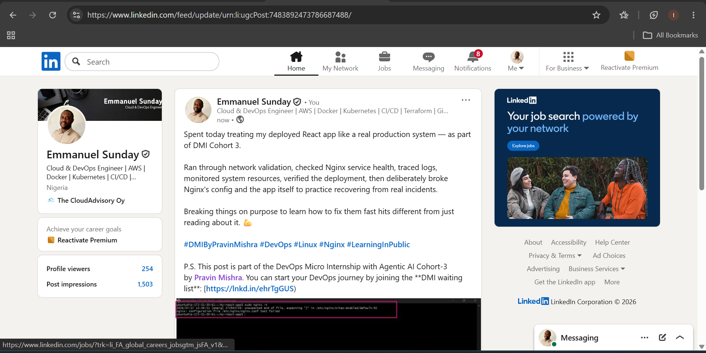

# Submission Instructions

- Add all required screenshots in your submission
- Full name must be visible in required screenshots
- Do not expose sensitive information (keys, passwords, account IDs)

---

# Completion Checklist

- [ ] Task 1: Screenshots (browser, ip a, ss -tulpen, ufw status) + Notes answered
- [ ] Task 2: Screenshots (nginx status, nginx -t, ss port 80) + Notes answered
- [ ] Task 3: Screenshots (access log, error log, journalctl) + Notes answered
- [ ] Task 4: Screenshots (uptime, free -h, df -h, du -sh) + Notes answered
- [ ] Task 5: Screenshots (ls html, grep deployed by, grep try_files) + Notes answered
- [ ] Task 6: Screenshots (nginx -t fail, nginx -t pass, curl recovery) + Notes answered
- [ ] Task 7: Screenshots (curl failure, curl recovery) + Notes answered
- [ ] Task 8: Security & Reliability Notes answered
- [ ] LinkedIn post published and URL submitted
- [ ] Full Name visible in all required screenshots
- [ ] No sensitive data exposed

---

## 📌 About DMI & CloudAdvisory

DevOps Micro Internship (DMI) is a project-based DevOps program run by Pravin Mishra (The CloudAdvisory) focused on real-world execution, systems thinking, and career readiness.

It helps learners build strong DevOps foundations with hands-on experience.

---

## 📌 Resources

- 🌐 DMI Official Website: https://pravinmishra.com/dmi  
- 🎓 DevOps for Beginners (Udemy): https://www.udemy.com/course/devops-for-beginners-docker-k8s-cloud-cicd-4-projects/  
- 🎓 Agentic AI DevOps with Claude Code: https://www.udemy.com/course/ultimate-agentic-ai-devops-with-claude-code/  
- 🎓 DevOps with Claude Code: Terraform, EKS, ArgoCD & Helm: https://www.udemy.com/course/devops-with-claude-code-terraform-eks-argocd-helm/  
- ▶️ YouTube Playlist: https://www.youtube.com/playlist?list=PLFeSNDtI4Cho  
- 🔗 Pravin Mishra (LinkedIn): https://www.linkedin.com/in/pravin-mishra-aws-trainer/  
- 🏢 CloudAdvisory (LinkedIn): https://www.linkedin.com/company/thecloudadvisory/

---

*This submission is part of DevOps Micro Internship (DMI) Cohort 3 — Agentic AI Track.*