# Assignment 5 — Bash Script Automation Drill (OPS Checklist)

Part of the DevOps Micro Internship (DMI) Cohort 3 with Agentic AI

---

## Purpose

In this assignment, you will practice Bash scripting by building a series of small automation scripts covering environment setup, variables, arrays, loops, file conditionals, if-else logic, and functions. These scripts form the foundation of real-world Linux automation used in DevOps, cloud, and production support environments.

---

# Task 1 — Bash Environment & Workspace Setup

## Goal

Verify that Bash is available on your system and create a clean workspace for this assignment.

### Evidence

#### Screenshot 1 — Output of `echo $SHELL` and `bash --version`

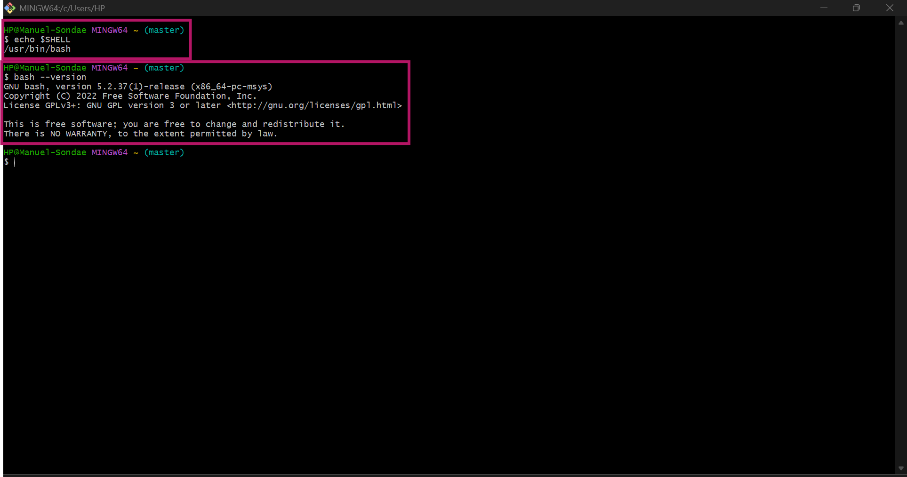

#### Screenshot 2 — Output of `pwd` and `ls -lah` showing the scripts directory

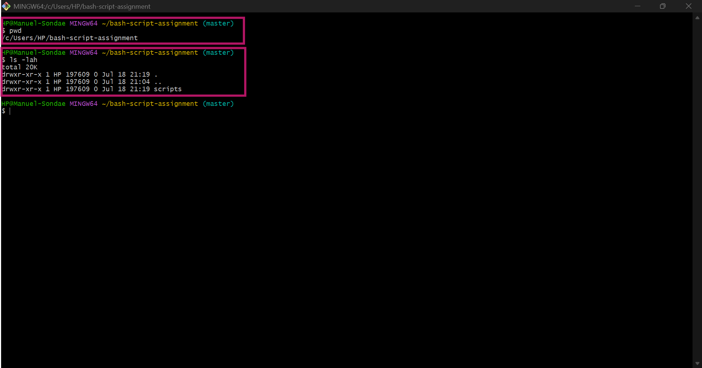

### Notes

Answer the following in your own words:

**1. What is Bash?**

Bash (short for Bourne-Again SHell) is a command-line interpreter and scripting language. It allows you to interact directly with an operating system's kernel using text commands rather than a graphical interface

**2. What is the difference between shell and Bash?**

Bash is a specific type of shell, which is a text-based program that lets you interact with a computer's operating system. While a shell is the general category for any command-line interface, Bash is a popular, modern version used as the industry standard for Linux automation and server management.

**3. Why is it important to confirm the Bash version before writing scripts?**

Confirming the Bash version ensures your script runs reliably without crashing. Different versions support different programming features, meaning a script written for a newer version will fail on an older system. Checking beforehand prevents unexpected syntax errors, guarantees compatibility across different servers, and protects against security vulnerabilities.

# Task 2 — Your First Bash Script

## Goal

Create your first Bash script, make it executable, and run it from the terminal.

### Evidence

#### Screenshot 1 — Content of `first-script.sh`

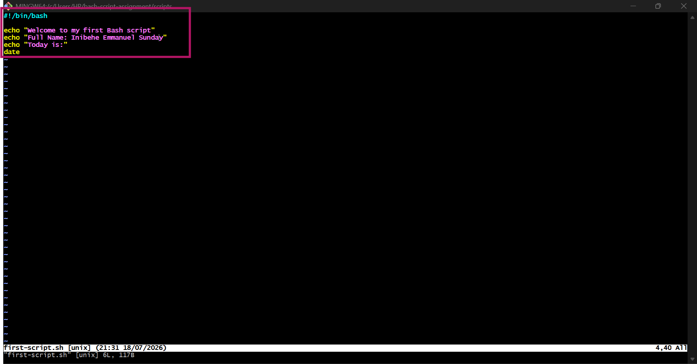

#### Screenshot 2 — Output of `./first-script.sh`

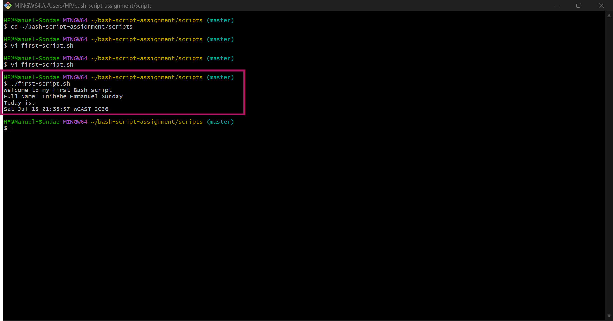

#### Screenshot 3 — Output of `ls -l first-script.sh` showing executable permission

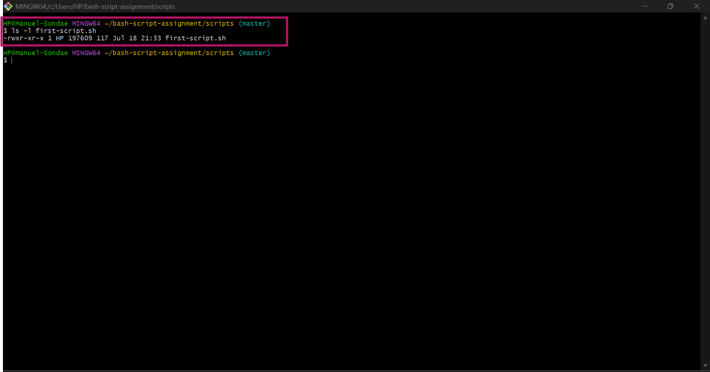

### Notes

Answer the following in your own words:

**1. What is the purpose of `#!/bin/bash`?**

The line #!/bin/bash (called a shebang) tells the operating system exactly which interpreter to use to execute the script. Without it, the system might try to run the file using a different shell, which can cause the script to fail.

**2. Why do we use `chmod +x` before running a script?**

We use chmod +x because all newly created text files in Unix-like systems are restricted from running as programs by default for safety. The command modifies the file's security permissions to grant it executable status.

**3. What is the difference between running a script using `./script.sh` and `bash script.sh`?**

Using ./script.sh requires the file to have executable permissions and relies on the internal shebang line (like #!/bin/bash) to choose the interpreter. In contrast, bash script.sh forces the file to run directly through the Bash program, bypassing both the shebang line and the need for executable permissions.

# Task 3 — Variables: User Information Script

## Goal

Use variables to store and display user-related information.

### Evidence

#### Screenshot 1 — Content of `user-info.sh`

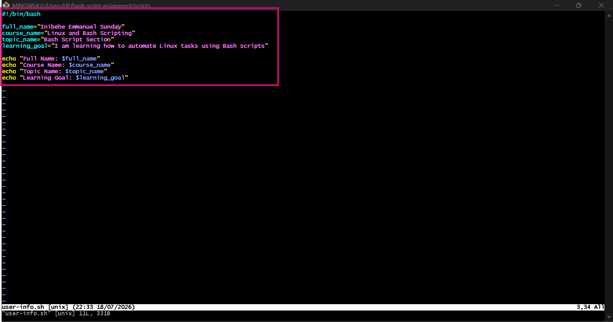

#### Screenshot 2 — Output of `./user-info.sh`

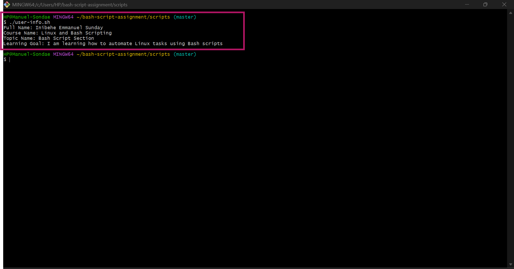

### Notes

Answer the following in your own words:

**1. What is a variable in Bash?**

A variable in Bash is a temporary storage location identified by a specific name that holds a piece of text data or a numerical value in the computer's memory. It allows scripts to store, modify, and reuse dynamic information—such as user inputs, file paths, or command outputs—throughout their execution.

**2. Why should we avoid spaces around the `=` sign when creating variables?**

We must avoid spaces around the = sign because Bash relies on spaces to separate commands from their arguments. Including spaces completely changes how the system interprets your code, resulting in syntax errors.

**3. How do you access the value stored inside a Bash variable?**

To access the value stored inside a Bash variable, you must prefix the variable name with a dollar sign ($).

# Task 4 — Arrays & Loops: Tools Checklist Script

## Goal

Use arrays and loops to print a checklist of tools used in Bash scripting.

### Evidence

#### Screenshot 1 — Content of `tools-checklist.sh`

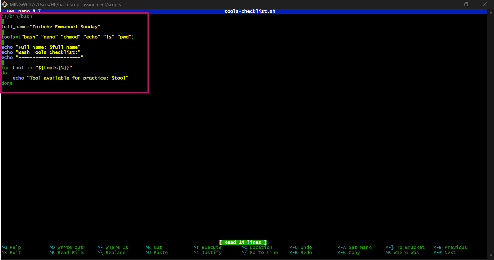

#### Screenshot 2 — Output of `./tools-checklist.sh`

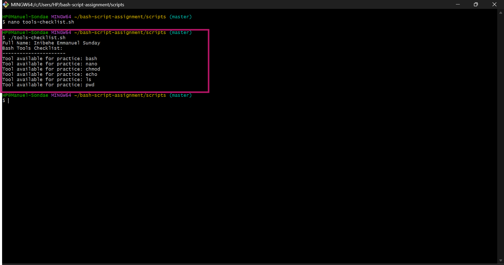

### Notes

Answer the following in your own words:

**1. What is an array in Bash?**

An array in Bash is a variable that can store multiple distinct values or pieces of text under a single name. Instead of creating ten separate variables for ten items, you can group them together sequentially into one structured list.

**2. Why are arrays useful in scripts?**

Arrays are useful because they allow you to organize related data and process large collections of information efficiently. Instead of writing separate lines of code for every single file, user, or tool, you can put them in an array and use a single loop to perform the exact same action on all of them automatically.

**3. What does `"${tools[@]}"` mean?**

The syntax "${tools[@]}" tells Bash to expand and retrieve every single individual item stored inside the tools array. The @ symbol acts as a wildcard meaning "all elements," and wrapping it in double quotes ensures that items containing spaces are treated safely as single pieces of text.

**4. What is the purpose of the `for` loop in this script?**

The purpose of the for loop is to iterate through the list of tools one by one. It automates the repetitive task of printing, extracting each tool's name from the array and displaying it on the screen so you do not have to write a separate echo command for every single item.

# Task 5 — Loops: Number Counter Script

## Goal

Use loops to repeat a task multiple times.

### Evidence

#### Screenshot 1 — Content of `counter.sh`

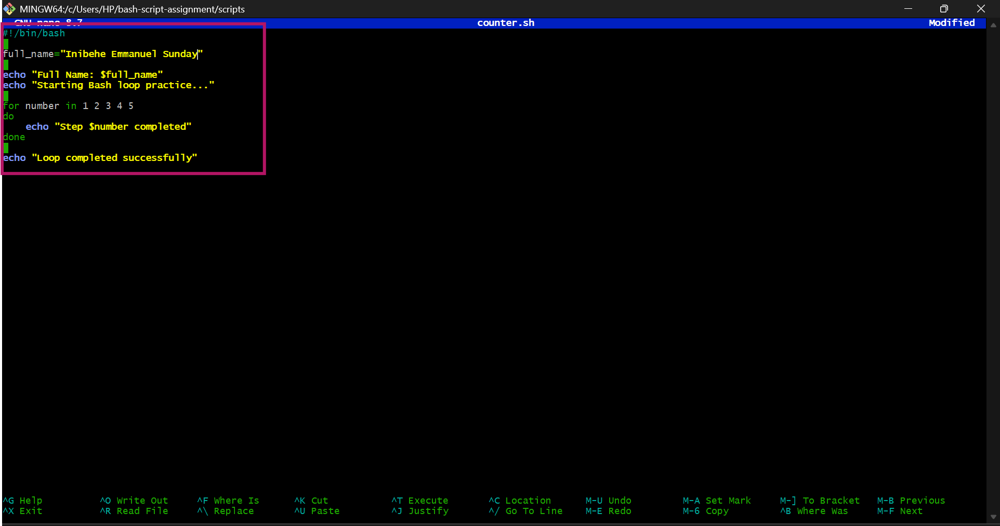

#### Screenshot 2 — Output of `./counter.sh`

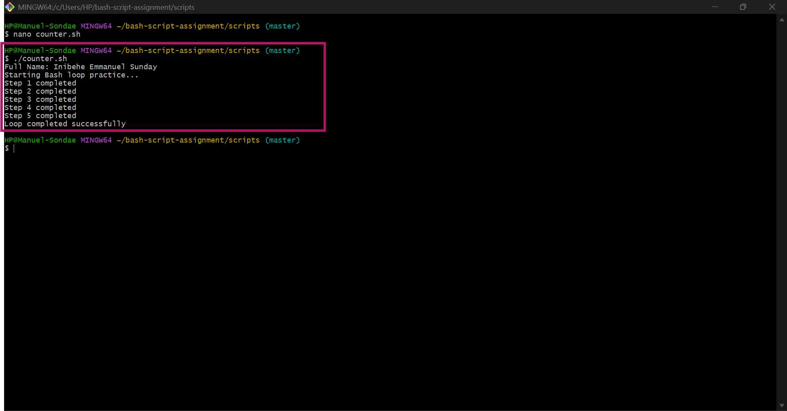
### Notes

Answer the following in your own words:

**1. What is a loop?**

A loop is a programming structure that repeats a specific block of code multiple times. It tells the computer to execute the same set of instructions over and over again as long as a condition is met or until it finishes running through a specific list of items.

**2. Why do we use loops in Bash scripting?**

We use loops to automate repetitive tasks without rewriting the exact same commands over and over. They save time, reduce the length of your code, and minimize mistakes when processing large batches of data—such as renaming hundreds of files, creating multiple user accounts, or scanning system logs.

**3. How many times did the loop run in your script?**

The loop ran exactly 5 times. This is because the list provided to the for statement contained exactly five explicit numbers (1 2 3 4 5), causing the loop to trigger once for each number.

**4. What would you change if you wanted the loop to run 10 times?**

To make it run 10 times, you would update the sequence list in the for statement to include the numbers 1 through 10. You can do this manually by typing for number in 1 2 3 4 5 6 7 8 9 10, or by using the cleaner Bash range shortcut: for number in {1..10}.

# Task 6 — Files & Conditionals: File Validation Script

## Goal

Use file checks and conditionals to verify whether files and directories exist.

### Evidence

#### Screenshot 1 — Output of `ls -lah ../test-folder`

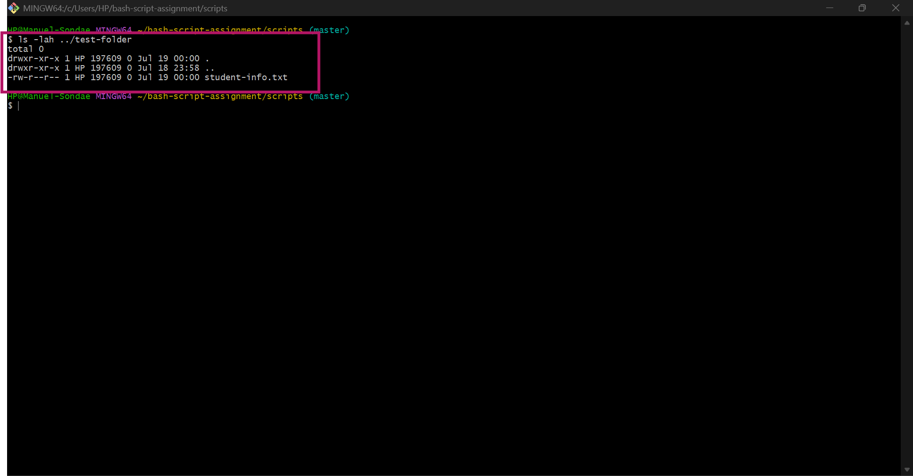

#### Screenshot 2 — Content of `file-check.sh`

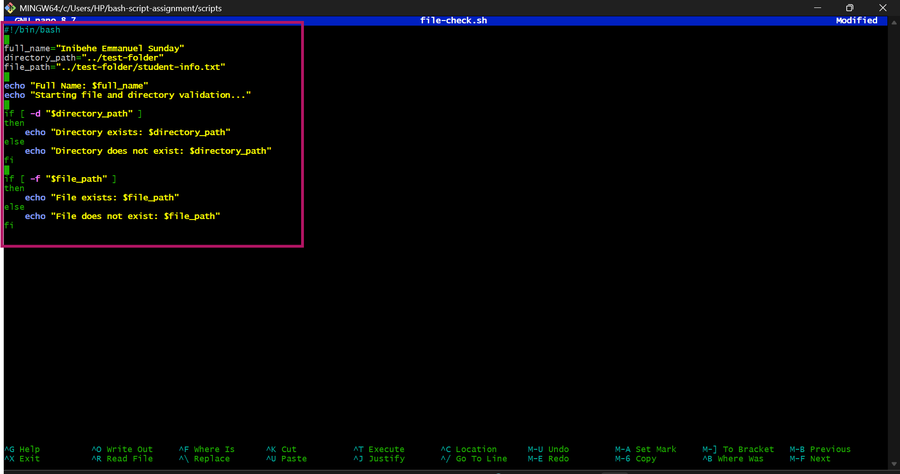

#### Screenshot 3 — Output of `./file-check.sh`

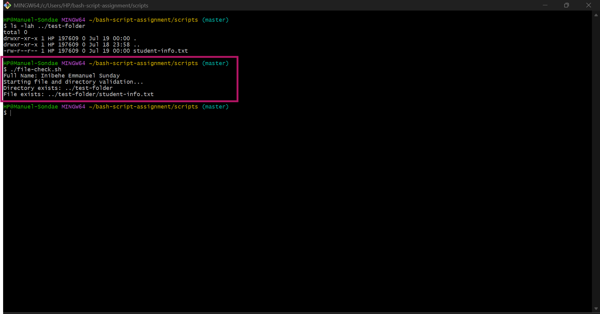

### Notes

Answer the following in your own words:

**1. What does `-d` check in Bash?**

The -d flag is a conditional test used to check if a specific path exists and is a directory (folder). If the path points to an actual folder on the system, the test returns true; if it does not exist or is a regular file, it returns false.

**2. What does `-f` check in Bash?**

The -f flag is a conditional test used to check if a specific path exists and is a regular file (like a .txt, .sh, or .png file). It ensures you are targeting an actual file rather than a directory, a shortcut, or a completely non-existent path.

**3. Why should file and directory paths be stored in variables?**

Storing paths in variables keeps your scripts clean, prevents typos, and makes them easy to update. If a folder path changes later, you only have to update it once at the top of your script in the variable definition, instead of searching and changing it across dozens of lines of code.

**4. What happens if the file does not exist?**

If a file does not exist when a script tries to read, move, or modify it, Bash will throw an error message (like "No such file or directory") and the script may fail or crash.

# Task 7 — Conditionals: Pass or Retry Script

## Goal

Use if-else conditionals to make decisions based on a variable value.

### Evidence

#### Screenshot 1 — Content of `score-check.sh` with `score=85`

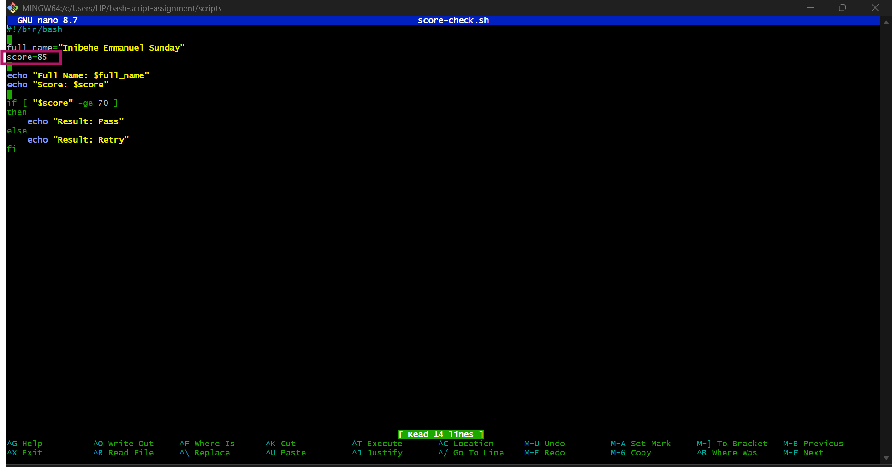

#### Screenshot 2 — Output showing `Result: Pass`

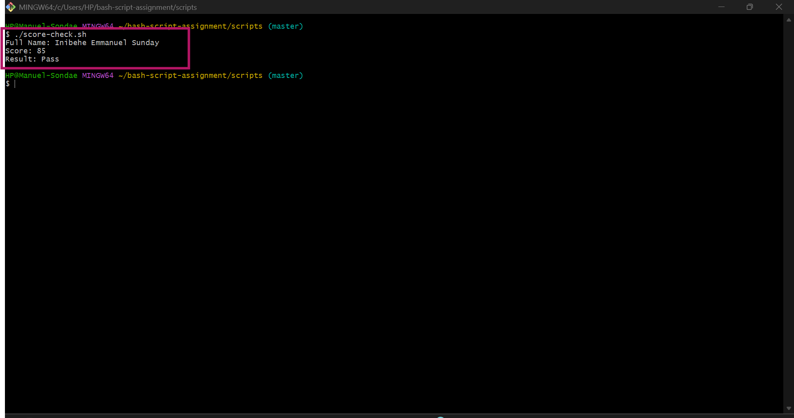

#### Screenshot 3 — Content of `score-check.sh` with `score=55`

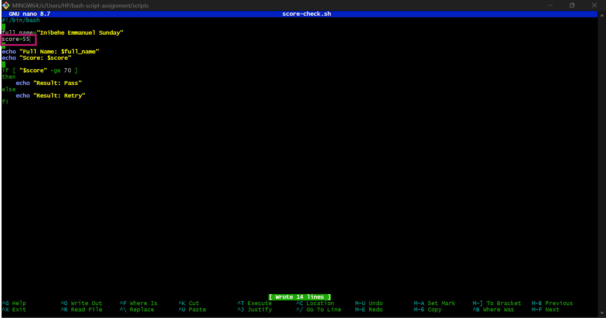

#### Screenshot 4 — Output showing `Result: Retry`

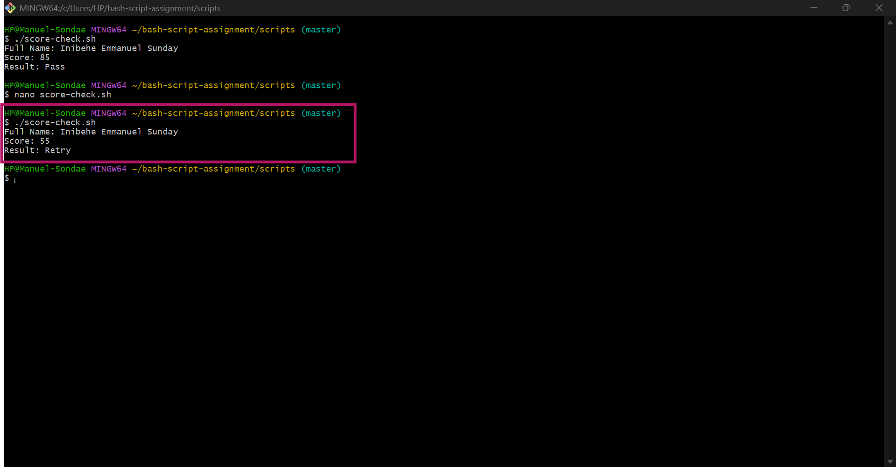

### Notes

Answer the following in your own words:

**1. What is the purpose of if-else in Bash?**

The purpose of if-else is to let your script make decisions and execute different paths of code based on changing conditions. It allows the script to check if a specific condition is true (like a file existing or a number being high enough); if it is true, the script runs one set of commands, and if it is false, it runs an alternative set of commands

**2. What does `-ge` mean?**

The -ge flag is a comparison operator that stands for "greater than or equal to." It is used inside conditional brackets to compare two integers, returning true if the first number is either larger than or exactly equal to the second number.

**3. Why should conditions be tested with different values?**

Testing conditions with different values is critical to verify that your script handles all scenarios correctly and safely. By feeding the script low values, high values, edge cases (like exactly matching the threshold), and invalid inputs, you ensure that the logic holds up and doesn't crash or behave unpredictably when deployed in the real world.

**4. How can conditionals help in automation scripts?**

Conditionals turn passive scripts into smart, safe automation tools by allowing them to adapt to different environments without human intervention. For example, a conditional can check if a server backup directory is running out of storage before saving a file, verify if a user has administrative permissions before running an update, or check if a network connection is alive before attempting a download.

# Task 8 — Functions: Final Bash Automation Script

## Goal

Create a final Bash script using functions to organize reusable code.

### Evidence

#### Screenshot 1 — Content of `final-automation.sh`

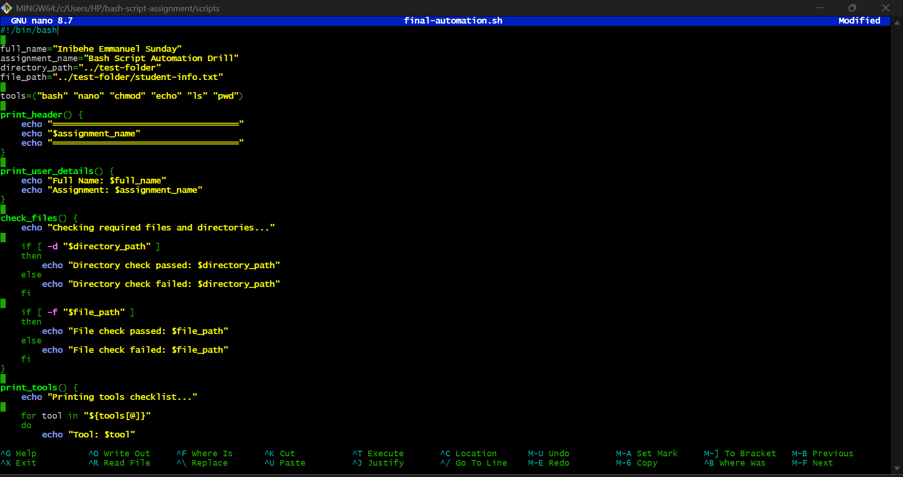
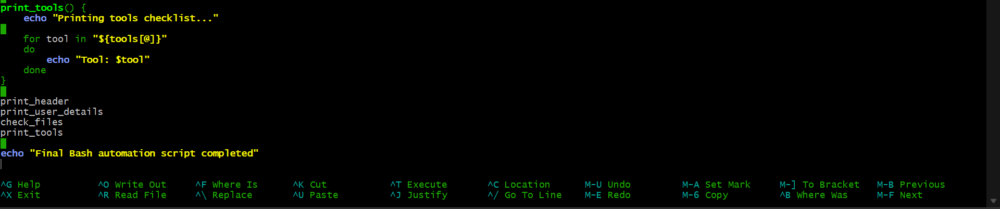

#### Screenshot 2 — Output of `./final-automation.sh`

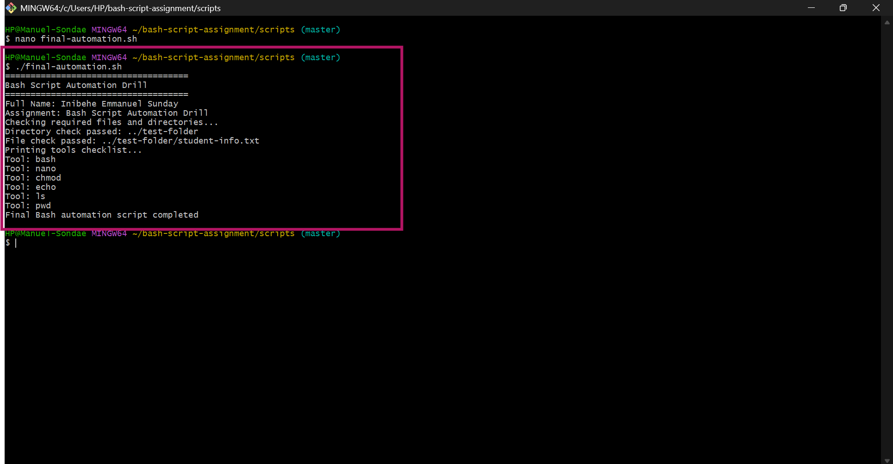

#### Screenshot 3 — Output of `ls -lah` showing all created scripts

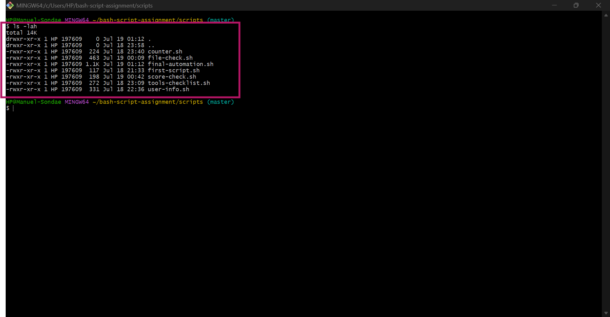

### Notes

Answer the following in your own words:

**1. What is a function in Bash?**

A function is a reusable block of code that is grouped together under a specific name. Instead of writing the same set of commands multiple times throughout a script, you define the logic once within a function and then execute it anywhere in the script simply by calling its name.

**2. Why are functions useful in scripts?**

Functions are useful because they make scripts modular, clean, and easy to maintain. They eliminate repetitive code, break complex scripts into smaller, manageable pieces, and allow you to fix a bug or update a command in one single location instead of hunting through hundreds of lines of code.

**3. Which functions did you create in this script?**

Four distinct functions were created in this script:
1. print_header: Displays a stylized visual border and the title of the assignment.
2. print_user_details: Outputs the user's name and assignment name using defined variables.
3.check_files: Runs safety tests to confirm if the specified directory and file paths      actually exist on the system.
4. print_tools: Generates a checklist of command-line utilities

**4. How does this final script combine variables, arrays, loops, conditionals, files, and functions?**

This script operates as a complete ecosystem where all these core concepts work together seamlessly:

Variables and Files: The script starts by storing configuration details and specific file/directory system paths inside text variables (full_name, file_path, etc.).

Arrays: Multiple related tool names are neatly grouped together into a single list variable called tools.

Functions: All the actual logic is organized into four distinct, named action blocks rather than letting the code run loosely from top to bottom.

Conditionals: Inside the check_files function, if-else statements use -d and -f to physically check the file system and decide whether to print a "passed" or "failed" status message.

Loops: Inside the print_tools function, a for loop dynamically reads the array to print out each tool one by one without needing manual commands for each item.

Execution: Finally, the script triggers everything by calling the functions in order, creating a highly organized, automated system.

# LinkedIn Post (Required)

## Evidence

#### LinkedIn Post URL

https://www.linkedin.com/feed/update/urn:li:share:7484405883616083968/

#### Screenshot — Published LinkedIn post

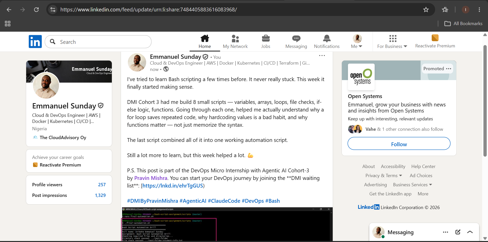

# Submission Instructions

- Add all required screenshots in your submission
- Full name must be visible in required screenshots
- All script files must be created and run successfully
- Required notes must be answered clearly for every task
- Do not expose sensitive information (keys, passwords, credentials)

---

# Completion Checklist

- [ ] Task 1: Environment setup verified, workspace created (Screenshots 1–2, Notes answered)
- [ ] Task 2: First script created, executed, permissions verified (Screenshots 1–3, Notes answered)
- [ ] Task 3: Variables script created and run (Screenshots 1–2, Notes answered)
- [ ] Task 4: Arrays and loops script created and run (Screenshots 1–2, Notes answered)
- [ ] Task 5: Counter loop script created and run (Screenshots 1–2, Notes answered)
- [ ] Task 6: File validation script created and run (Screenshots 1–3, Notes answered)
- [ ] Task 7: Pass/Retry conditional script tested with both values (Screenshots 1–4, Notes answered)
- [ ] Task 8: Final automation script created and run (Screenshots 1–3, Notes answered)
- [ ] All scripts run without errors
- [ ] Full Name visible in all required screenshots
- [ ] LinkedIn post published and URL submitted
- [ ] No sensitive data exposed

---

## 📌 About DMI & CloudAdvisory

DevOps Micro Internship (DMI) is a project-based DevOps program run by Pravin Mishra (The CloudAdvisory) focused on real-world execution, systems thinking, and career readiness.

It helps learners build strong DevOps foundations with hands-on experience.

---

## 📌 Resources

- 🌐 DMI Official Website: https://pravinmishra.com/dmi  
- 🎓 DevOps for Beginners (Udemy): https://www.udemy.com/course/devops-for-beginners-docker-k8s-cloud-cicd-4-projects/  
- 🎓 Agentic AI DevOps with Claude Code: https://www.udemy.com/course/ultimate-agentic-ai-devops-with-claude-code/  
- 🎓 DevOps with Claude Code: Terraform, EKS, ArgoCD & Helm: https://www.udemy.com/course/devops-with-claude-code-terraform-eks-argocd-helm/  
- ▶️ YouTube Playlist: https://www.youtube.com/playlist?list=PLFeSNDtI4Cho  
- 🔗 Pravin Mishra (LinkedIn): https://www.linkedin.com/in/pravin-mishra-aws-trainer/  
- 🏢 CloudAdvisory (LinkedIn): https://www.linkedin.com/company/thecloudadvisory/

---

*This submission is part of DevOps Micro Internship (DMI) Cohort 3 — Agentic AI Track.*