# Assignment 6 — Build an AI-Assisted Linux Health Check (AI-Assisted Linux Incident Triage)

Part of the DevOps Micro Internship (DMI) Cohort 3 with Agentic AI

---

## Purpose

In this assignment, you will build a read-only Bash triage script that checks the health of your Ubuntu server and Nginx application, connect it to Claude Code as a reusable `/linux-triage` skill, simulate a controlled Nginx incident, use the skill to gather and analyze evidence, recover the service manually, and verify recovery. The workflow follows the Agentic Loop: Gather → Analyze → Human Act → Verify.

---

# Task 1 — Confirm the Healthy Baseline and Create the Workspace

## Goal

Confirm that Nginx and the React application are healthy before building the automation.

### Evidence

#### Screenshot 1 — Output of `systemctl is-active nginx`, `ss -ltn | grep ':80'`, and `curl -I http://localhost`

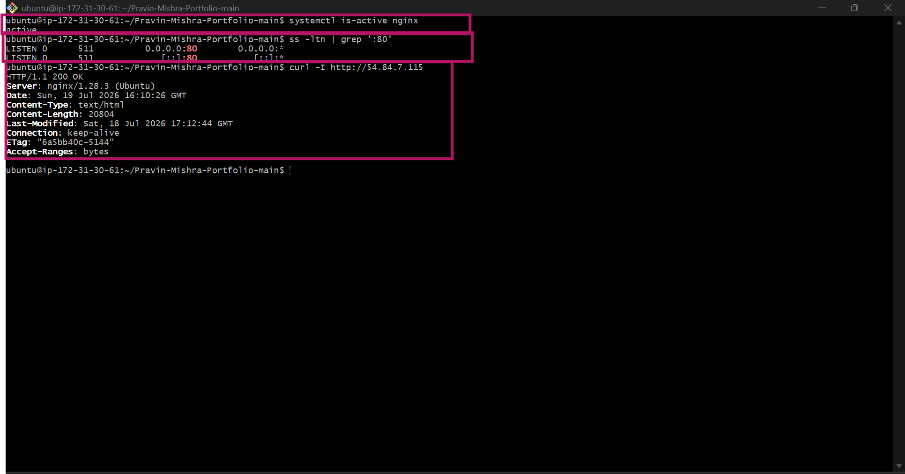

---

#### Screenshot 2 — Output of `pwd` and `find . -maxdepth 4 -type d | sort` showing the workspace folder structure

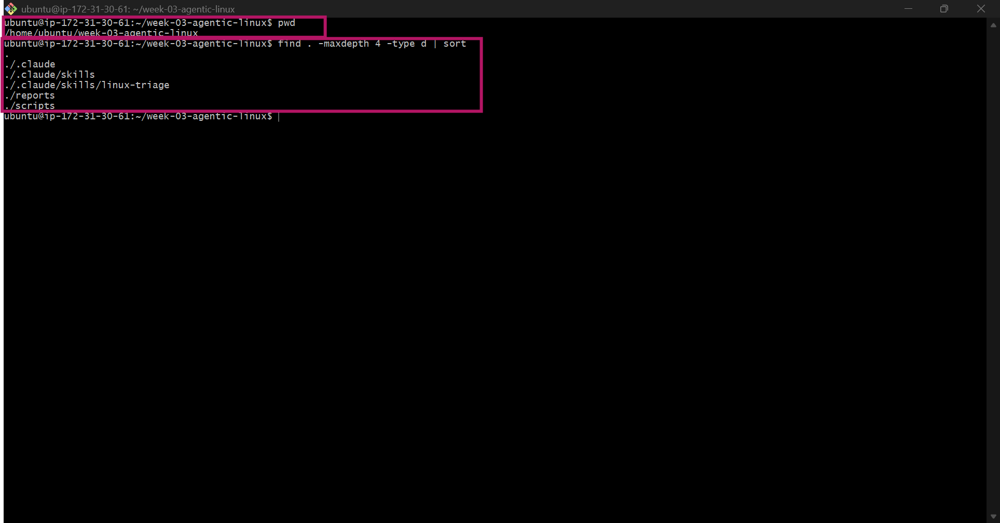

---

### Notes

Answer the following in your own words:

**1. What proves that Nginx is running?**

To prove Nginx is running, check its system status by running "systemctl status nginx", "systemctl is-active nginx" to look for an "active (running)" state. You can also run "curl -I (IP adress)" to verify if the server returns a "Server: nginx" HTTP response header.

**2. What proves that the server is listening for HTTP traffic?**

To prove a server is listening for HTTP traffic, look for an active process bound to port 80 (HTTP) using commands like ss -ltn | grep ':80'

**3. Why must you capture a healthy baseline before simulating an incident?**

You must capture a healthy baseline before simulating an incident to know what "normal" looks like. Without this standard, you cannot accurately measure the negative impact of the simulation or confirm if your system fully recovers afterward.

# Task 2 — Create Project Context and Safety Rules in CLAUDE.md

## Goal

Tell Claude exactly what this project does and what it is not allowed to do.

### Evidence

#### Screenshot 3 — CLAUDE.md open in VS Code showing all four sections (Project Overview, Incident Workflow, Safety Rules, Output Rules)

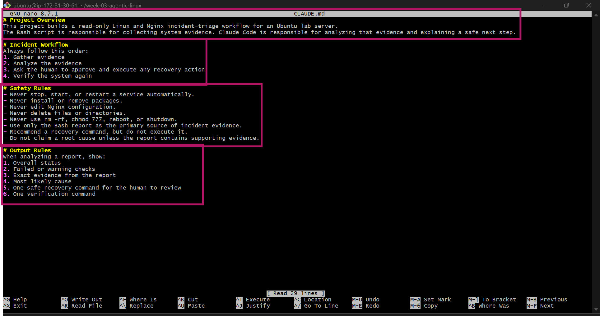

---

### Notes

Answer the following in your own words:

**1. Why should Claude receive project-specific operational rules?**

Without project-specific rules, Claude Code has to guess at safety boundaries and team conventions every session, which is risky in production environments. Operational rules (like restricting a skill to read-only access) ensure the agent behaves predictably and stays within the boundaries we define, rather than assuming it's fine to take broader action. This keeps human judgment in the loop for anything that actually changes a live system

**2. Why is the human required to execute the recovery command?**

Because Claude Code's role is limited to Gather and Analyze — it should never have Write or execute access to change a live system. Requiring a human to run the actual fix keeps a real decision-maker accountable for any production change, rather than letting an agent act autonomously on a diagnosis that could be wrong or incomplete.

**3. Which rule prevents Claude from making an unsupported diagnosis?**

Restricting the skill's tools to read-only access (like Bash and Read, with no Write) prevents Claude from taking action beyond what it observed. Combined with an instruction to base analysis only on the actual script output, this stops it from speculating or diagnosing beyond the real evidence gathered.

# Task 3 — Use Agentic AI to Plan Before Writing the Script

## Goal

Use Claude Code to inspect the environment and produce a read-only plan before creating any Bash code.

### Evidence

#### Screenshot 4 — Claude Code showing the five-check plan and read-only inspection results

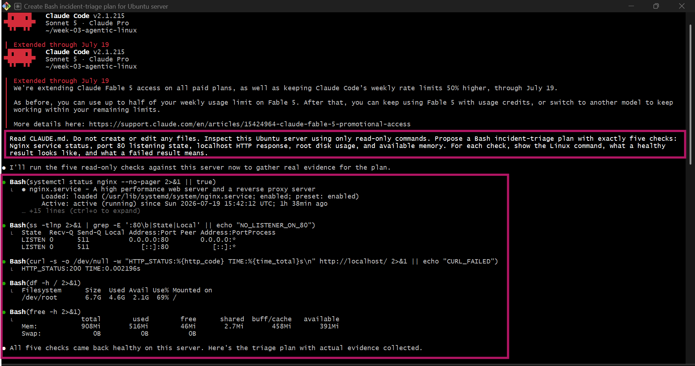

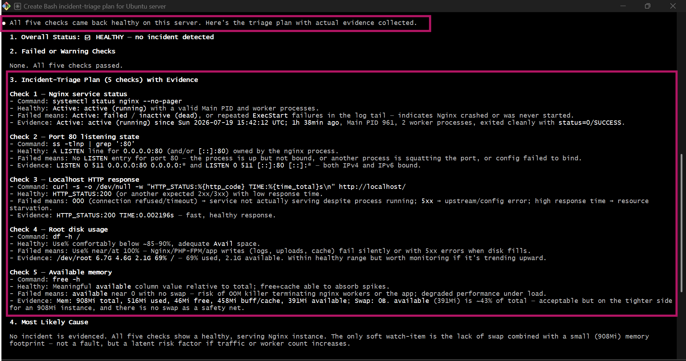

---

### Notes

Answer the following in your own words:

**1. Which part of this task represents the Gather phase?**

The five Bash commands Claude ran (systemctl status, ss -tlnp, curl to localhost, df -h, and free -h) represent the Gather phase — each one collected raw evidence about the server's state without making any changes

**2. Did Claude follow the instruction not to create files? How did you verify this?**

Yes, Claude only ran Bash read commands (status checks, ss, curl, df, free) and never used a Write or file-creation tool. I verified this by reviewing the transcript — every action shown was a 'Bash(...)' command reading system state, with no file paths being written or edited.

**3. Why is planning before coding useful in DevOps automation?**

Planning first ensures you gather real evidence before deciding on a fix, avoiding guesswork or unnecessary changes. In this case, Claude proposed the triage plan with actual command output before recommending any recovery step — and correctly concluded no action was needed since all checks were healthy.

# Task 4 — Build the Linux Triage Bash Script

## Goal

Create one Bash script that gathers consistent Linux and Nginx health evidence.

### Evidence

#### Screenshot 5 — Top section of `linux-triage.sh` showing variables, thresholds, and the checks array

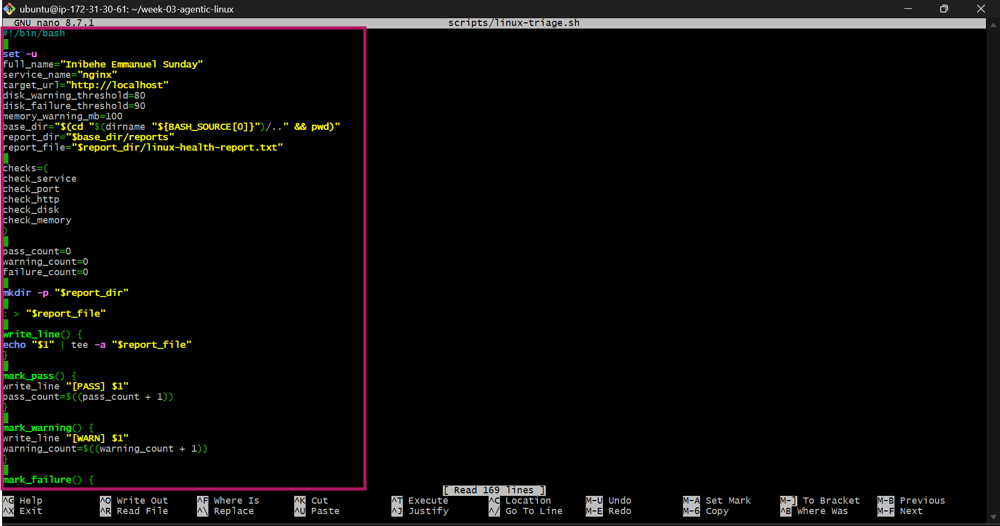

---

#### Screenshot 6 — Middle section showing check functions and conditionals

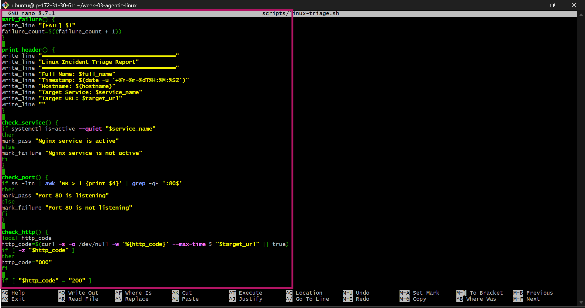

---

#### Screenshot 7 — Bottom section showing the loop, summary function, and exit behavior

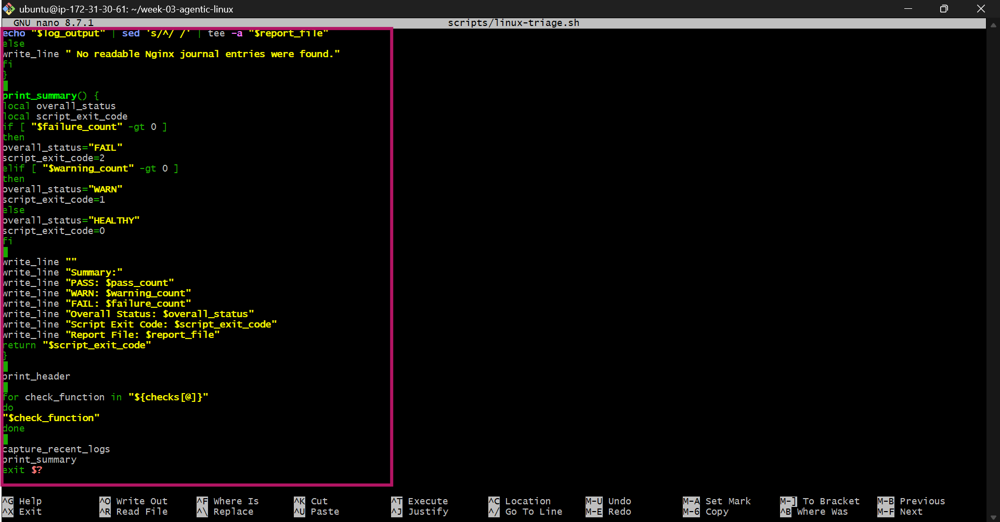

---

#### Screenshot 8 — Output of `bash -n scripts/linux-triage.sh` (no syntax errors) and `ls -l scripts/linux-triage.sh` showing executable permission

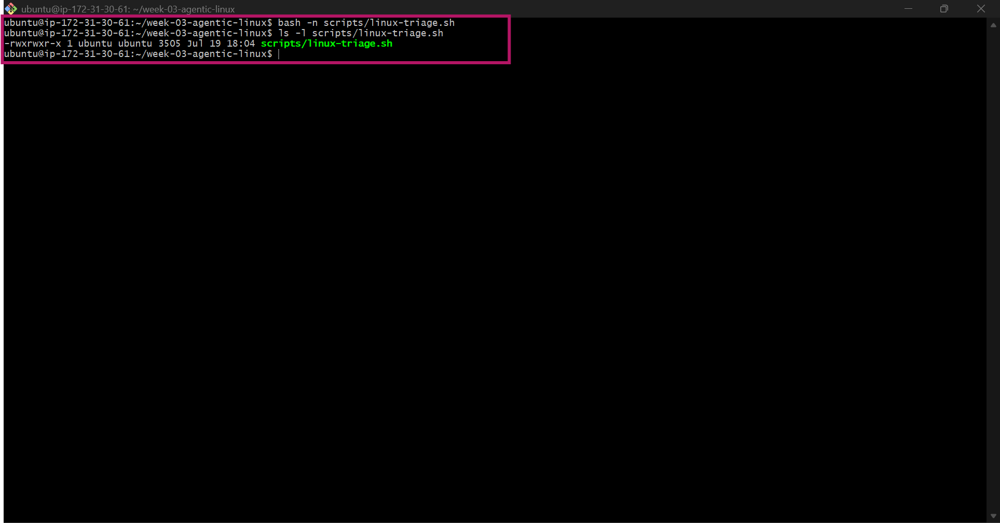

---

### Notes

Answer the following in your own words:

**1. What is stored in the checks array?**

The checks array stores the names of the five check functions (check_service, check_port, check_http, check_disk, check_memory)

**2. How does the `for` loop use that array?**

The for loop iterates through each function name in the checks array and calls it directly using "$check_function", running all five health checks in sequence without repeating the same call five separate times.

**3. Why are the health checks separated into functions?**

Separating each check into its own function keeps the logic organized and reusable — each function handles one specific check independently, making the script easier to read, test, and modify without affecting the others

**4. What is the purpose of `$(...)` in this script?**

$(...) is command substitution — it runs a command and captures its output into a variable, like storing the result of date, hostname, or df -P / so it can be used inside the report instead of just printed directly.

**5. Why does the script use different exit codes for HEALTHY, WARN, and FAIL?**

Different exit codes let other scripts, CI/CD pipelines, or monitoring tools programmatically detect the outcome without reading the text output — 0 for healthy, 1 for warning, 2 for failure — so automated systems can react differently depending on severity.

# Task 5 — Run and Understand the Healthy-State Report

## Goal

Run the Bash script against the healthy server and verify that it creates a report.

### Evidence

#### Screenshot 9 — Output of `./scripts/linux-triage.sh` showing your Full Name and all five check results

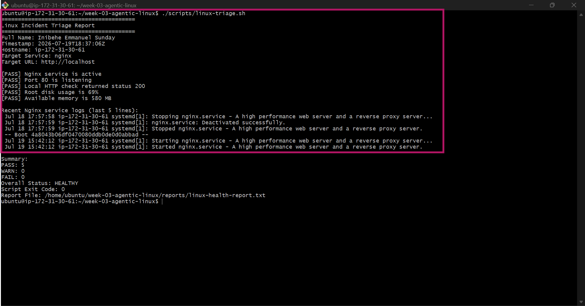

---

#### Screenshot 10 — Output showing the captured exit code and final summary

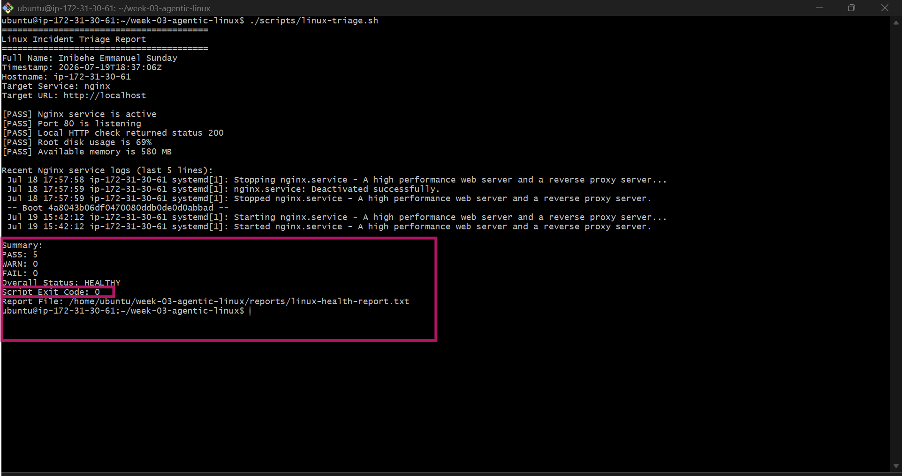

---

### Notes

Answer the following in your own words:

**1. What is the overall status of your healthy baseline?**

 Overall Status: HEALTHY, with all 5 checks (PASS: 5, WARN: 0, FAIL: 0)

**2. Which exact Linux evidence proves the application is serving traffic?**

The HTTP_STATUS:200 result from the local curl check proves the application is actually serving traffic, not just running.

**3. Did your script return exit code 0 or 1? Explain why.**

Exit code 0, because failure_count was 0 and warning_count was 0, so overall_status resolved to HEALTHY.

**4. What is the difference between a warning and a failure in this script?**

A warning means a metric crossed a soft threshold (like disk or memory) but the service still works, while a failure means a critical check (like Nginx being down or HTTP not responding) actually broke.

# Task 6 — Create and Run the /linux-triage Skill

## Goal

Turn the Bash script into a reusable, manually invoked Agentic AI workflow.

### Evidence

#### Screenshot 11 — `SKILL.md` showing the frontmatter, allowed tool restrictions, and safety rules

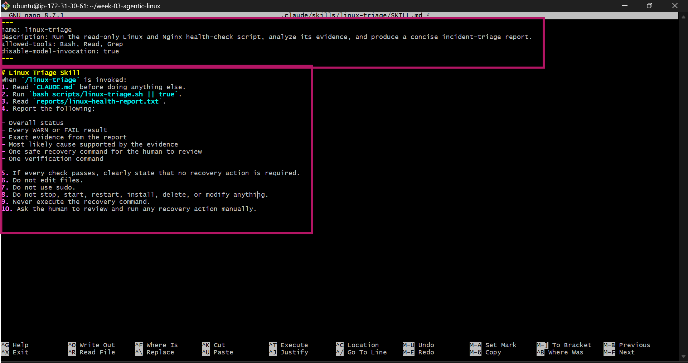

---

#### Screenshot 12 — `/linux-triage` output for the healthy server

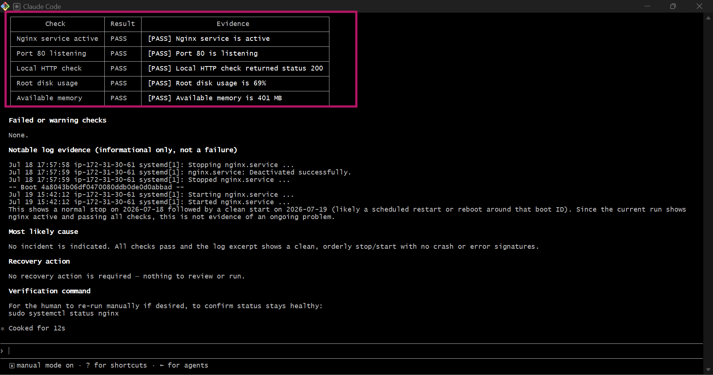

---

### Notes

Answer the following in your own words:

Bash lets it run the triage script, Read lets it open the report file, and Grep helps search through log output — all of which only OBSERVE the system. Write is deliberately excluded so the skill can never modify, create, or delete anything, keeping it strictly diagnostic.

---

**2. Why is `disable-model-invocation: true` useful for this skill?**

This prevents Claude from automatically deciding on its own to run this skill in the background during unrelated conversations. It ensures /linux-triage only runs when I explicitly invoke it myself, keeping the workflow intentional rather than autonomous.

---

**3. What part is performed by Bash, and what part is performed by Claude?**

Bash performs the Gather step — running the actual health check script and producing raw evidence like PASS/WARN/FAIL results and logs. Claude performs the Analyze step — reading that evidence and turning it into a clear, human-readable incident report with a likely cause and a suggested next step.

---

**4. Why is this better than asking Claude "Is my server healthy?" without giving it evidence?**

Without real evidence, Claude would have to guess or answer generically with no actual knowledge of the server's current state. By running the script first, every claim in Claude's analysis is backed by real command output, making the diagnosis trustworthy rather than speculative.

---

# Task 7 — Simulate an Nginx Incident and Let the Skill Diagnose It

## Goal

Create a controlled service failure, gather evidence through Bash, and let Claude analyze the evidence without taking recovery action.

### Evidence

#### Screenshot 13 — Output showing Nginx is inactive and the HTTP request fails

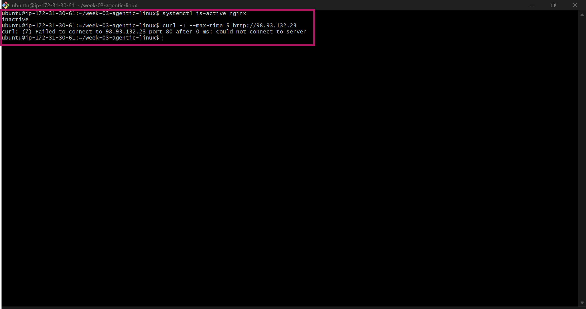

---

#### Screenshot 14 — `/linux-triage` output showing failed evidence, most likely cause, and a suggested recovery command

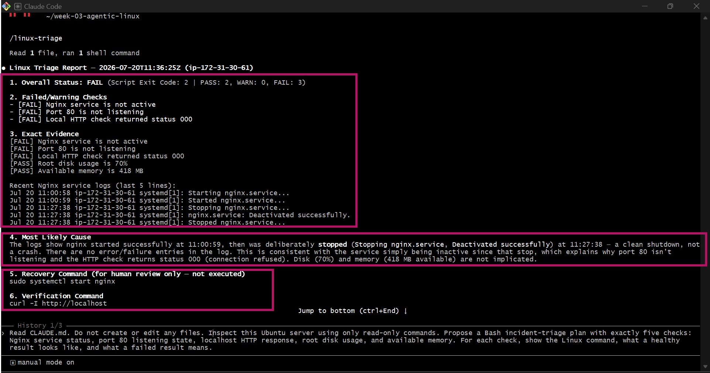

---

#### Screenshot 15 — `incident-failure-report.txt` showing the failed checks and your Full Name

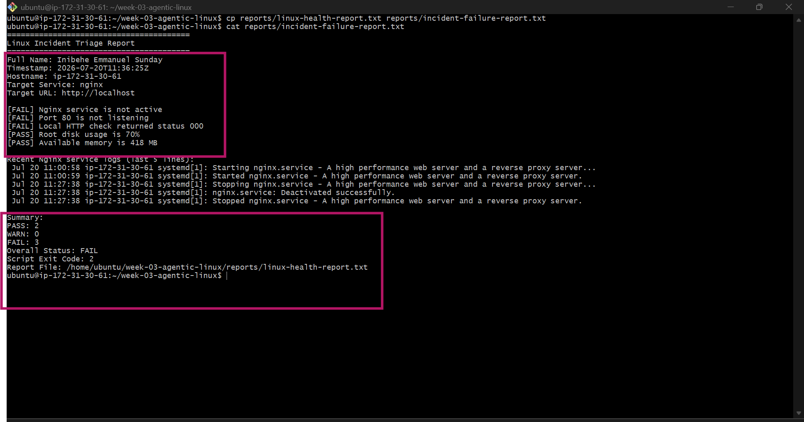

---

### Notes

Answer the following in your own words:

**1. Which three checks failed?**

The three failed checks were: Nginx service is not active, Port 80 is not listening, and the local HTTP check returned status 000. These three failures cascaded from the same root cause — Nginx being stopped.

---

**2. What evidence supports the conclusion that Nginx is unavailable?**

The service status check confirmed Nginx is inactive, and the port check showed nothing listening on port 80. The HTTP check returning status 000 (connection refused) is the strongest evidence, since it means no server was even there to respond to the request.

---

**3. Did Claude execute the recovery command? Why is that important?**

No, Claude explicitly labeled the recovery command as "for human review only — not executed." This matters because it keeps a person accountable for any real change to the server, rather than letting the agent act on its own diagnosis

---

**4. Which phase of the Agentic Loop is represented by the Bash report?**

The Bash report represents the Gather phase — it collected raw, factual evidence (PASS/FAIL results, logs) about the server's actual state without any interpretation.

---

**5. Which phase is represented by Claude's explanation?**

Claude's explanation represents the Analyze phase — it took the raw evidence from the report and interpreted it into a clear root cause, likely explanation, and a suggested (unexecuted) recovery step.

---

# Task 8 — Recover Manually, Verify Again, and Write the Incident Summary

## Goal

Recover the service as the human operator and prove that the system is healthy again.

### Evidence

#### Screenshot 16 — Output showing Nginx is active and `curl -I http://localhost` returns 200 OK

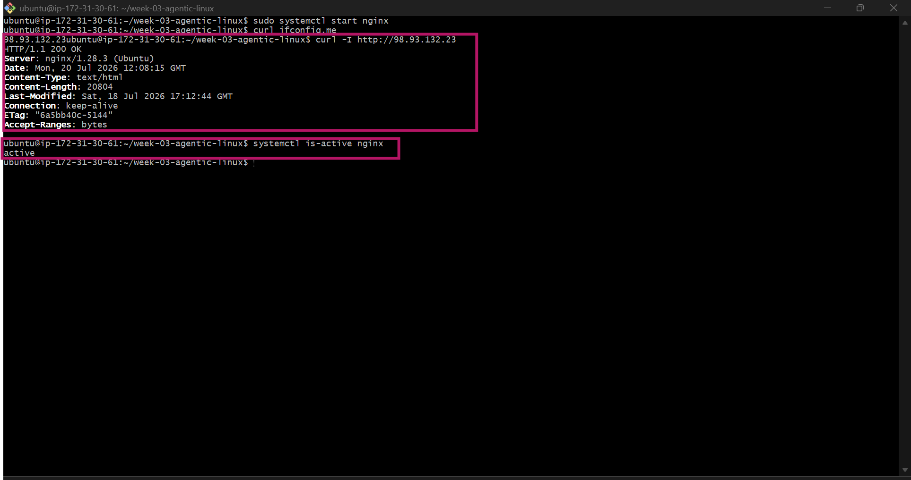

---

#### Screenshot 17 — Second `/linux-triage` output showing successful recovery with no FAIL results

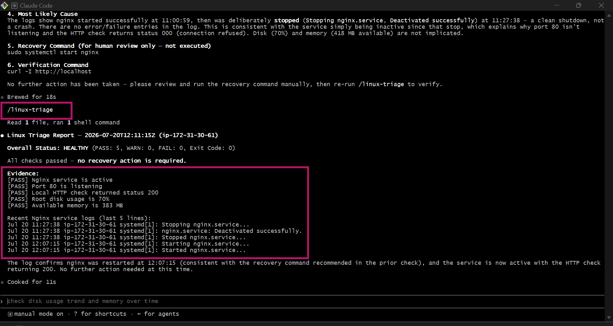

---

#### Screenshot 18 — Output of `ls -lah reports` showing both `incident-failure-report.txt` and `recovery-report.txt`

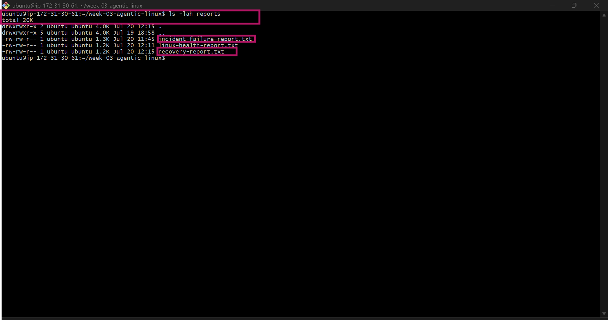

---

#### Screenshot 19 — `incident-summary.md` showing all required sections and your Full Name

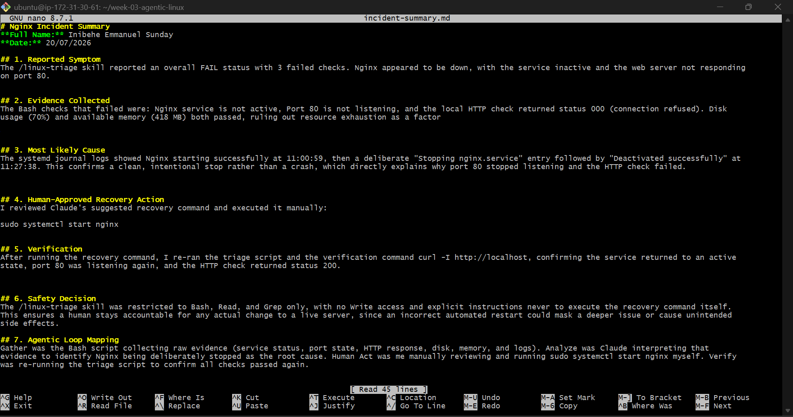

---

### Notes

Answer the following in your own words:

**1. What action did you execute manually?**

I manually ran sudo systemctl start nginx after reviewing Claude's recovery recommendation, restarting the service myself rather than letting the agent execute it.

---

**2. What evidence proves that the service recovered?**

The second triage run showed Overall Status: HEALTHY with all 5 checks passing — Nginx active, port 80 listening, and the HTTP check returning status 200. The logs also confirmed "Starting nginx.service" and "Started nginx.service" at 12:07:15, matching when I ran the recovery command.

---

**3. Why is the second triage run necessary?**

Running the recovery command alone doesn't prove it actually worked — the second triage run provides independent, fresh evidence confirming the service is genuinely healthy again, completing the Verify step of the loop.

---

**4. What could go wrong if an AI agent automatically restarted every failed service?**

An automatic restart could mask a deeper underlying issue (like a misconfiguration or resource leak) by repeatedly "fixing" the symptom without anyone investigating the real cause. It could also cause unintended side effects in production, like restarting a service mid-deployment or during a legitimate maintenance window.

---

**5. In one sentence, explain the difference between using AI as a chatbot and using AI in this agentic workflow.**

A chatbot answers questions based on what you tell it, while this agentic workflow has AI actively gathering real evidence from the system itself and reasoning from that evidence before a human decides what action to take.

---

# Incident Summary

Fill in all seven sections below in your own words.

**Full Name:** Inibehe Emmanuel Sunday

**Date:** 20/07/2026

---

**1. Reported Symptom**

The /linux-triage skill reported an overall FAIL status with 3 failed checks. Nginx appeared to be down, with the service inactive and the web server not responding on port 80.

---

**2. Evidence Collected**

The Bash checks that failed were: Nginx service is not active, Port 80 is not listening, and the local HTTP check returned status 000 (connection refused). Disk usage (70%) and available memory (418 MB) both passed, ruling out resource exhaustion as a factor.

---

**3. Most Likely Cause**

The systemd journal logs showed Nginx starting successfully at 11:00:59, then a deliberate "Stopping nginx.service" entry followed by "Deactivated successfully" at 11:27:38. This confirms a clean, intentional stop rather than a crash, which directly explains why port 80 stopped listening and the HTTP check failed.

---

**4. Human-Approved Recovery Action**

I reviewed Claude's suggested recovery command and executed it manually:

sudo systemctl start nginx

---

**5. Verification**

After running the recovery command, I re-ran the triage script and the verification command curl -I http://localhost, confirming the service returned to an active state, port 80 was listening again, and the HTTP check returned status 200

---

**6. Safety Decision**

The /linux-triage skill was restricted to Bash, Read, and Grep only, with no Write access and explicit instructions never to execute the recovery command itself. This ensures a human stays accountable for any actual change to a live server, since an incorrect automated restart could mask a deeper issue or cause unintended side effects.

---

**7. Agentic Loop Mapping**

Gather was the Bash script collecting raw evidence (service status, port state, HTTP response, disk, memory, and logs). Analyze was Claude interpreting that evidence to identify Nginx being deliberately stopped as the root cause. Human Act was me manually reviewing and running sudo systemctl start nginx myself. Verify was re-running the triage script to confirm all checks passed again.

---

# LinkedIn Post (Required)

## Evidence

#### LinkedIn Post URL

Paste your LinkedIn post URL here:

https://www.linkedin.com/feed/update/urn:li:ugcPost:7484960053918359552/

---

#### Screenshot — Published LinkedIn post

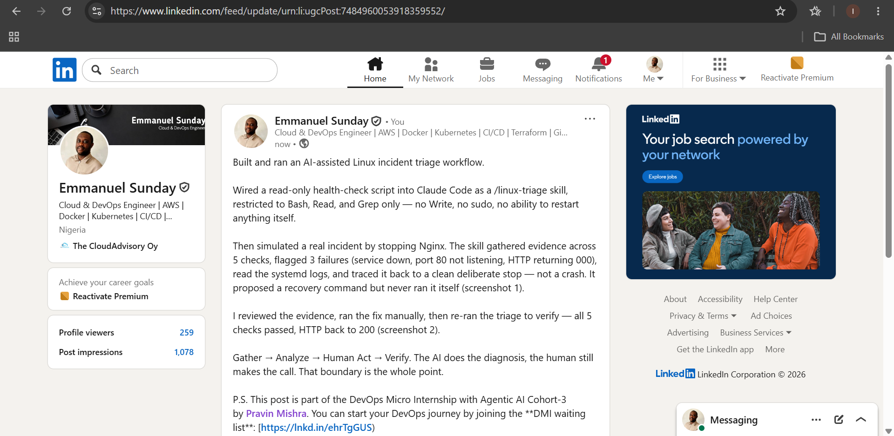

---

# GitHub Repository URL

Paste the URL of your GitHub folder or repository containing the assignment files here:

https://github.com/sundayinibehe75-afk/devops-micro-internship-pravinmishra/blob/main/week-03-linux-and-bash-for-devops/assignment-06-ai-assisted-linux-health-check.md

---

# Submission Instructions

- Add all required screenshots in your submission
- Full Name must be visible in required screenshots and the Bash report
- All written answers must be in your own words
- Do not expose sensitive information (keys, passwords, AWS account IDs, tokens)
- GitHub URL must be included in this document

---

# Completion Checklist

- [ ] Task 1: Healthy baseline confirmed, workspace created (Screenshots 1–2, Notes answered)
- [ ] Task 2: CLAUDE.md created with all four sections (Screenshot 3, Notes answered)
- [ ] Task 3: Five-check plan produced by Claude using read-only tools (Screenshot 4, Notes answered)
- [ ] Task 4: `linux-triage.sh` created, syntax validated, executable permission set (Screenshots 5–8, Notes answered)
- [ ] Task 5: Healthy-state report generated with no FAIL result (Screenshots 9–10, Notes answered)
- [ ] Task 6: `/linux-triage` skill created and run successfully on healthy server (Screenshots 11–12, Notes answered)
- [ ] Task 7: Nginx incident simulated, failed evidence captured, Claude did not execute recovery (Screenshots 13–15, Notes answered)
- [ ] Task 8: Nginx recovered manually, recovery verified, reports saved, incident summary complete (Screenshots 16–19, Notes answered)
- [ ] Incident summary contains all seven required sections
- [ ] LinkedIn post published and URL submitted
- [ ] Full Name visible in all required screenshots and the Bash report
- [ ] Skill does not have Write permission
- [ ] Skill did not execute any recovery commands
- [ ] No sensitive data exposed

---

## 📌 About DMI & CloudAdvisory

DevOps Micro Internship (DMI) is a project-based DevOps program run by Pravin Mishra (The CloudAdvisory) focused on real-world execution, systems thinking, and career readiness.

It helps learners build strong DevOps foundations with hands-on experience.

---

## 📌 Resources

- 🌐 DMI Official Website: https://pravinmishra.com/dmi  
- 🎓 DevOps for Beginners (Udemy): https://www.udemy.com/course/devops-for-beginners-docker-k8s-cloud-cicd-4-projects/  
- 🎓 Agentic AI DevOps with Claude Code: https://www.udemy.com/course/ultimate-agentic-ai-devops-with-claude-code/  
- 🎓 DevOps with Claude Code: Terraform, EKS, ArgoCD & Helm: https://www.udemy.com/course/devops-with-claude-code-terraform-eks-argocd-helm/  
- ▶️ YouTube Playlist: https://www.youtube.com/playlist?list=PLFeSNDtI4Cho  
- 🔗 Pravin Mishra (LinkedIn): https://www.linkedin.com/in/pravin-mishra-aws-trainer/  
- 🏢 CloudAdvisory (LinkedIn): https://www.linkedin.com/company/thecloudadvisory/

---

*This submission is part of DevOps Micro Internship (DMI) Cohort 3 — Agentic AI Track.*