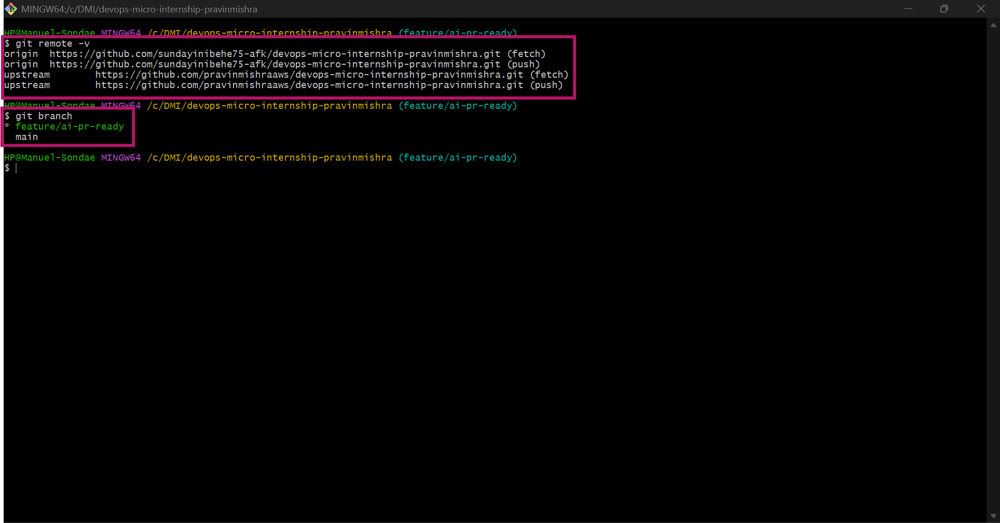
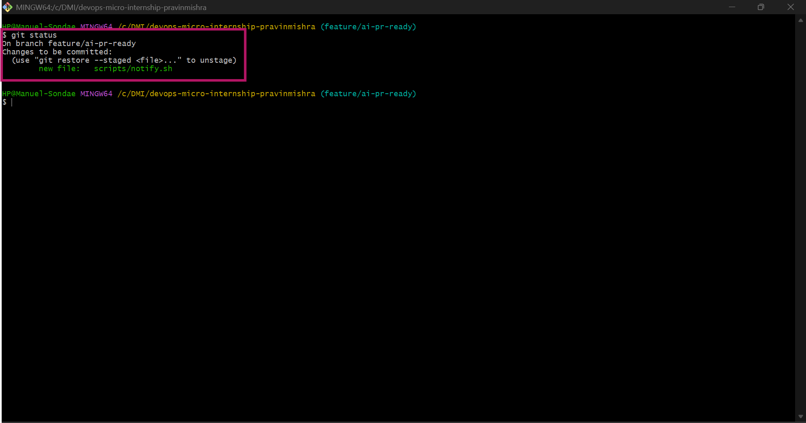
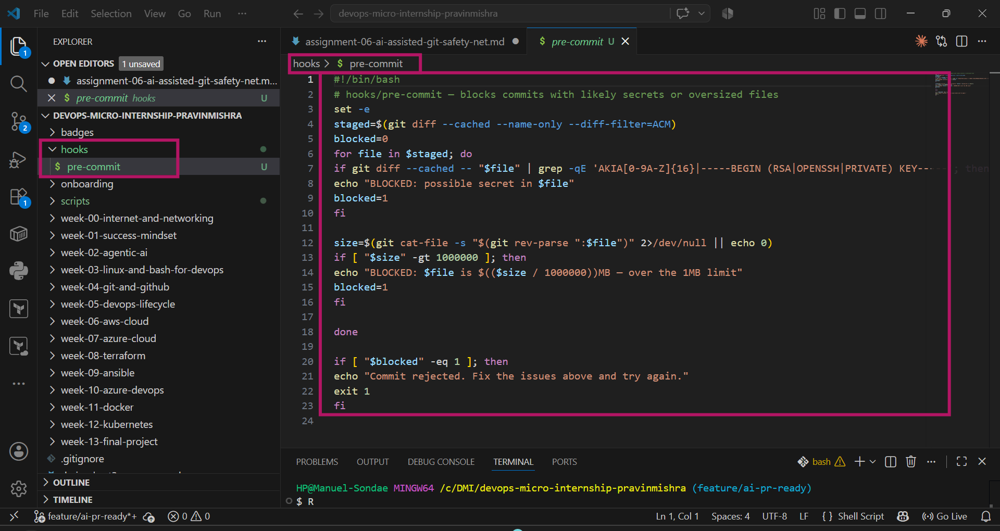
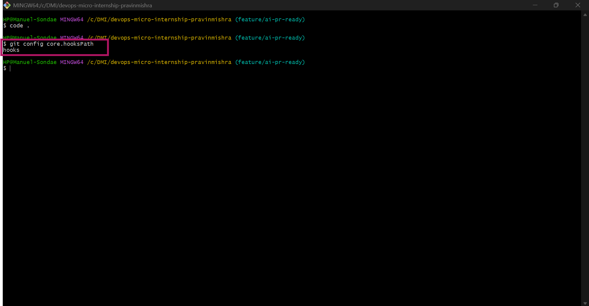
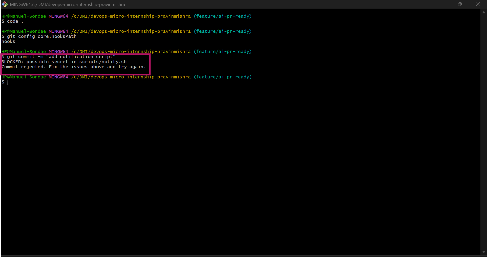
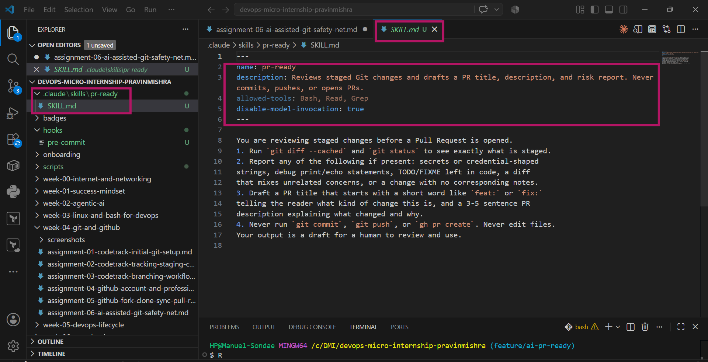
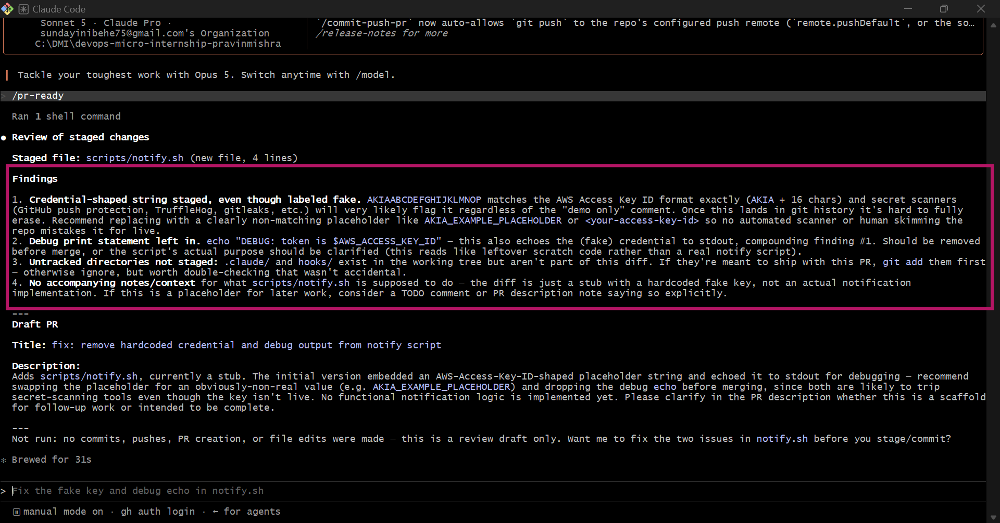
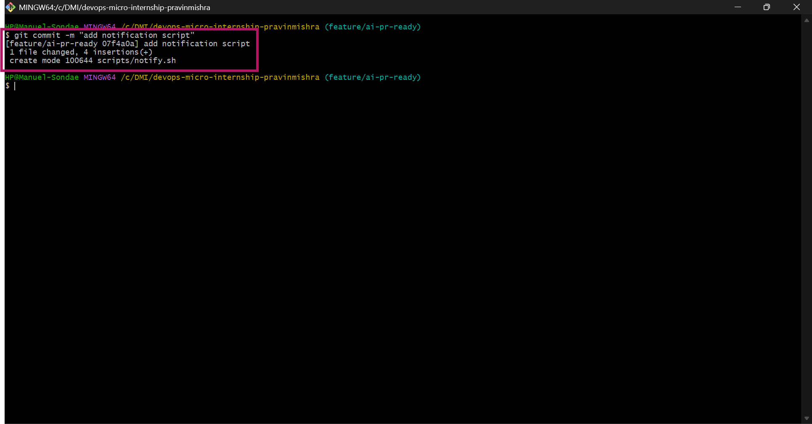
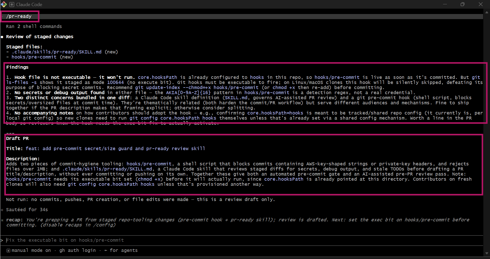
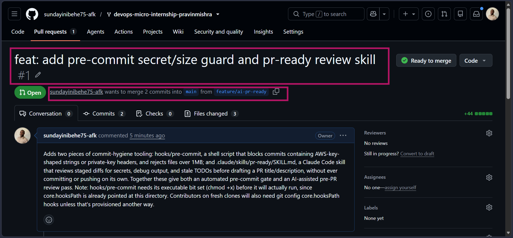

# Assignment 6 — Building an AI-Assisted Git Safety Net (PR Ready Check)

Part of the DevOps Micro Internship (DMI) Cohort 3 with Agentic AI

---

## Purpose

In Week 2 you built Claude Code hooks that block a dangerous action *before* it happens (`PreToolUse`), and a restricted skill that could look but not touch (`allowed-tools` without `Write`). In this assignment you will discover that Git has the exact same idea, decades older: a **pre-commit hook** that blocks a commit before it's created.

You will build both halves of a real "PR Ready" workflow:

1. A **Git hook that follows fixed rules** — scans staged changes for hardcoded secrets and oversized files and refuses the commit. No AI involved, no guessing, just a rule that gives the same answer every time.
2. A **restricted Claude Code skill** (`/pr-ready`) that reads your staged diff and drafts a Pull Request title, description, and a short list of things worth a second look — the kind of judgment a fixed rule can't make (mixed changes, missing context, unclear intent). The skill never commits, pushes, or opens the PR. You do that yourself, using its draft as a starting point.

This mirrors the Agentic Loop from Week 3's Linux triage assignment: **Gather → Analyze → Human Act → Verify**. The hook and the skill both gather and analyze; only you act.

---

# Task 0 — Confirm Your Fork and Create a Feature Branch

## Goal

Confirm you are working in your own fork, then create a dedicated branch for this assignment.

### Evidence

#### Screenshot 1 — Output of git remote -v and git branch showing the new branch

---

### Notes

**1. Why create a dedicated branch instead of doing this work on main?**

Creating a separate branch keeps your work isolated from the main branch. This allows you to develop, test, and make changes safely without affecting the stable version of the project. It also makes it easier to create a clean Pull Request that contains only the changes for this assignment.

---

# Task 1 — Stage a Change With Realistic Risk

## Goal

On your own fork of this repository (the one you've been submitting your DMI work in since onboarding), create a new branch and stage a change that a real reviewer should catch: a hardcoded-looking secret and a leftover debug statement.

### Evidence

#### Screenshot 1 — Output of  `git status` showing the staged file on feature/ai-pr-ready

---

### Notes

**1. Why does this assignment use an obviously fake key instead of a real one?**

This creates a realistic test case for the rest of the assignment. The staged file contains common security issues that the pre-commit hook and Claude Code skill are expected to detect before the code is committed, demonstrating how automated checks can help prevent sensitive information and debugging code from being pushed to a repository.

---

# Task 2 — Write a Real Git Pre-Commit Hook

## Goal

Create a tracked, shareable pre-commit hook that blocks a commit containing secret-like patterns or files over 1MB.

### Evidence

#### Screenshot 2 — `hooks/pre-commit` open in VS Code showing the full script

---

#### Screenshot 3 — Output of `git config core.hooksPath` confirming it points to `hooks`

---

### Notes

**1. Why is `hooks/pre-commit` tracked in the repo instead of living only in `.git/hooks/`?**

.git/hooks/ is local-only and never gets pushed or shared through Git, so every teammate would have to manually set it up themselves. Tracking it inside the repo (like hooks/pre-commit) means the hook ships with the project and can be pointed to via core.hooksPath, so everyone who clones the repo can use the same shared safety check.

---

**2. Compare this to `PreToolUse` from Week 2 Assignment 6. What does each one intercept, and what do they have in common?**

PreToolUse intercepts an AI agent's action before it executes a tool, while the pre-commit hook intercepts a git commit before it's created. Both share the same underlying idea: stop a risky action before it happens rather than trying to clean up after it already occurred.

---

# Task 3 — Prove the Hook Blocks the Risky Commit

## Goal

Attempt to commit the staged file from Task 1 and show the hook rejecting it.

### Evidence

#### Screenshot 4 — Terminal showing `git commit` rejected with the hook's "BLOCKED" message naming the exact file

---

### Notes

**1. Which line in `hooks/pre-commit` matched your fake key, and why did it match?**

The line checking for the pattern AKIA[0-9A-Z]{16} matched, because my fake key was deliberately written in that exact AWS access key format, which the regex is designed to detect.

---

**2. Could this hook have caught a poorly-named variable that stores a secret without the `AKIA` prefix? What does that tell you about the limits of a fixed rule like this?**

No — the hook only matches specific known patterns like AKIA... or private key headers, so a secret stored under a generic variable name without that exact format would pass through undetected. This shows fixed rules are only as good as the patterns they were explicitly written to catch, and they can't recognize risk outside that narrow definition

---

# Task 4 — Build the `/pr-ready` Skill

## Goal

Create a manually invoked Claude Code skill that reads your staged changes and produces a PR-readiness report and a draft PR description — without writing, committing, or pushing anything itself.

### Evidence

#### Screenshot 5 — `SKILL.md` frontmatter showing `allowed-tools: Bash, Read, Grep` (no `Write`) and `disable-model-invocation: true`

---

#### Screenshot 6 — `/pr-ready` output while the risky file is still staged, showing it flagged the secret and/or debug statement

---

### Notes

**1. Why does `/pr-ready` have `Bash` and `Read` but not `Write`?**

Bash lets it run commands like git diff --cached to gather evidence, and Read lets it inspect file contents, but excluding Write ensures it can only observe and report — it can never modify, create, or delete anything in the repo.

---

**2. The pre-commit hook and `/pr-ready` both looked at the same staged diff. Did they flag the same things? What did one catch that the other didn't?**

They overlapped on some findings, like detecting the fake secret pattern, but /pr-ready went further by also noticing things the hook has no concept of — like mixed concerns in a single commit, missing context, or later on, that the hook itself wasn't executable. The hook only checks fixed patterns, while /pr-ready reasons about the broader context of the change.

---

# Task 5 — Fix the Issues and Re-Verify

## Goal

Remove the secret and debug statement, then prove both gates now pass clean.

### Evidence

#### Screenshot 7 — `git commit` succeeding after the fix (no BLOCKED message)

---

#### Screenshot 8 — Second `/pr-ready` run showing a clean risk report and a drafted PR title + description

---

### Notes

**1. What exactly did you change to satisfy the pre-commit hook?**

I removed the fake AWS-style key and the leftover debug echo/print statement from the staged file, which cleared both conditions the hook was blocking on.

---

# Task 6 — Push and Open a Pull Request Using the AI Draft

## Goal

Push your branch and open a real Pull Request, using `/pr-ready`'s drafted title and description as your starting point — read it critically and edit before you use it.

**Important:** Open this Pull Request with base repository set to **your own fork** — not the shared upstream `pravinmishraaws/devops-micro-internship-pravinmishra` repository. This assignment's hook and skill files are your own practice work, not a change meant for the shared class repo.

### Evidence

#### Screenshot 9 — Your Pull Request showing the base repository is your own fork, plus the title and description, with the `/pr-ready` draft visible for comparison (paste it in the PR conversation or your notes below)

---

#### PR Link

https://github.com/sundayinibehe75-afk/devops-micro-internship-pravinmishra/pull/1

---

### Notes

**1. What, if anything, did you edit in the AI's drafted PR description before using it? Why?**

I used the draft largely as generated, since it accurately described the changes, but I made sure to actually act on its recommendation to fix the pre-commit hook's missing executable bit before opening the PR, rather than ignoring that flag.

---

**2. If you had blindly copy-pasted the AI's draft without reading it, what could go wrong?**

I could have opened a PR claiming the hook was fully functional when it actually wasn't executable yet, misleading a reviewer into approving something that wouldn't have worked on a fresh clone.

---

**3. Why does this PR need to target your own fork instead of the shared upstream repository?**

This work is personal practice for the assignment, not a change meant for the shared class repository, so keeping the PR within my own fork avoids cluttering the upstream repo with individual practice commits that aren't relevant to the wider group.

---

# Task 7 — Map the Workflow to the Agentic Loop

## Goal

Explain this assignment's workflow using the same Gather → Analyze → Human Act → Verify structure from Week 3.

### Notes

**1. Which step(s) represent Gather?**

The pre-commit hook scanning staged changes for secrets and oversized files, and /pr-ready running git diff --cached and git status to see exactly what's staged — both are collecting raw evidence about the changes before anything is decided

---

**2. Which step(s) represent Analyze?**

The pre-commit hook's pattern matching is a simple form of analysis, but the deeper analysis is /pr-ready interpreting the staged diff — flagging mixed concerns, missing context, or issues like the hook's own missing executable bit, and drafting a PR title/description from that evidence.

---

**3. Which step is Human Act, and why must a human — not Claude — run `git commit`, `git push`, and open the PR?**

Human Act is me actually running git commit, git push, and creating the Pull Request myself, using the AI's draft as a starting point rather than blindly submitting it. A human must do this because only a person can be accountable for what actually ships — the AI can surface issues and draft suggestions, but it has no ability to judge whether a flagged issue truly matters in context.

---

**4. Which step is Verify?**

Verify is re-running git commit after fixing the flagged issues and confirming it succeeds cleanly with no BLOCKED message, then running /pr-ready again to confirm a clean report.

---

**5. In one or two sentences: why do you need *both* the fixed-rule pre-commit hook and the AI skill? Isn't one enough?**

The pre-commit hook gives a consistent, deterministic check that never changes its answer, but it can only catch exactly what it was written to check for — it completely missed that it wasn't even executable yet. The AI skill caught that exact gap by reasoning about broader context rather than matching a fixed pattern, showing neither one alone is a complete safety net.

---

# Task 8 — LinkedIn Post

## Goal

Publish a LinkedIn post summarizing what you built and what you learned about combining fixed-rule safety checks with AI-assisted review.

### Evidence

#### LinkedIn Post URL

https://www.linkedin.com/posts/emmanuel-sunday-210a08323_dmibypravinmishra-agenticai-claudecode-activity-7486558408423415808-Rifv?utm_source=share&utm_medium=member_desktop&rcm=ACoAAFHXXywBq0IrgBBhbi5ULmCrDuZgCEYc6fQ

---

## Key Learnings

Add 3-5 bullet points on what you learned this week.

1. A fixed-rule pre-commit hook gives consistent, predictable protection, but it can only catch exactly what it was explicitly written to detect — nothing more.
2. An AI-assisted review can surface gaps a fixed rule misses entirely, like discovering my own hook wasn't executable yet — something no regex pattern was written to check.
3. Neither tool replaces human judgment: the AI drafts and flags, but I still have to decide what's actually true and act on it myself.
4. Tracking a hook inside the repo (instead of only in .git/hooks/) is what makes it shareable across a team, not just useful on my own machine.
5. This assignment connected directly back to a real mistake from a previous week (the 143MB Terraform binary that broke my push) — proving these safety nets exist because these exact failures actually happen.

---

# Submission Instructions

- Ensure `hooks/pre-commit` and `.claude/skills/pr-ready/SKILL.md` are committed to your GitHub repository
- Add all required screenshots to your submission
- All written answers must be in your own words
- Do not use a real secret or credential anywhere in your submission — the fake key in Task 1 is intentional and must stay clearly fake
- Open your Pull Request against your own fork, not the shared upstream repository
- Push your final changes to your forked repository
- Include your PR link and LinkedIn post URL

---

## GitHub Repository URL

https://github.com/sundayinibehe75-afk/devops-micro-internship-pravinmishra

---

# Completion Checklist

- [ ] Branch `feature/ai-pr-ready` created with a staged file containing a fake secret and a debug statement
- [ ] `hooks/pre-commit` created and tracked in the repo (not only in `.git/hooks/`)
- [ ] `core.hooksPath` configured to point at `hooks/`
- [ ] Pre-commit hook shown blocking the risky commit
- [ ] `.claude/skills/pr-ready/SKILL.md` created with correct `allowed-tools` (no `Write`) and `disable-model-invocation: true`
- [ ] `/pr-ready` run against the risky diff and shown flagging issues
- [ ] Risky file fixed; `git commit` succeeds cleanly
- [ ] `/pr-ready` re-run showing a clean report and drafted PR title/description
- [ ] Pull Request opened using the AI draft as a starting point, with your own fork as the base repository (not upstream), PR link included
- [ ] Agentic Loop mapping (Task 7) completed in your own words
- [ ] LinkedIn post published and URL submitted
- [ ] All required screenshots added
- [ ] GitHub repository URL provided

---

## 📌 About DMI & CloudAdvisory

DevOps Micro Internship (DMI) is a project-based DevOps program run by Pravin Mishra (The CloudAdvisory) focused on real-world execution, systems thinking, and career readiness.

It helps learners build strong DevOps foundations with hands-on experience.

---

## 📌 Resources

- 🌐 DMI Official Website: https://dmi.pravinmishra.com?utm_source=github&utm_medium=readme  
- 🎓 University: https://university.pravinmishra.com?utm_source=github&utm_medium=readme  
- 💬 Discord Community: https://discord.pravinmishra.com?utm_source=github&utm_medium=readme  
- 📝 Blog: https://dmi.pravinmishra.com/blog?utm_source=github&utm_medium=readme  
- ▶️ YouTube Playlist: https://www.youtube.com/playlist?list=PLFeSNDtI4Cho  
- 🔗 Pravin Mishra (LinkedIn): https://www.linkedin.com/in/pravin-mishra-aws-trainer/  
- 🏢 CloudAdvisory (LinkedIn): https://www.linkedin.com/company/thecloudadvisory/

---

*This submission is part of DevOps Micro Internship (DMI) Cohort 3 — Agentic AI Track.*
