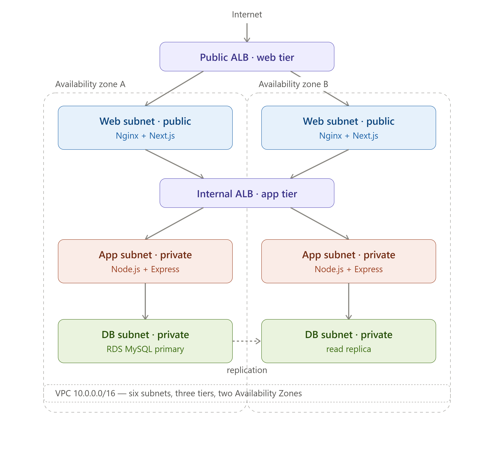
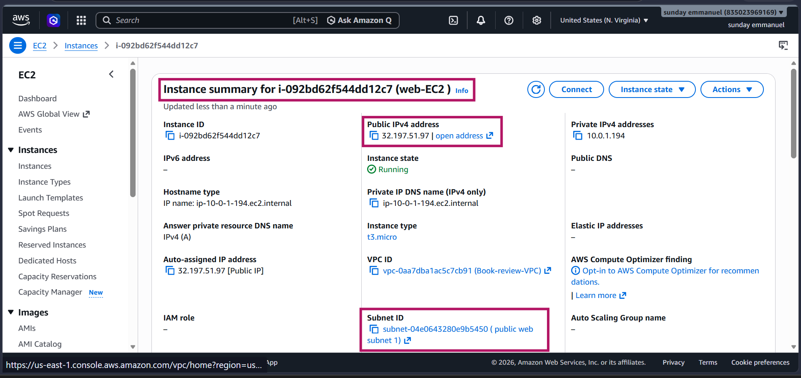
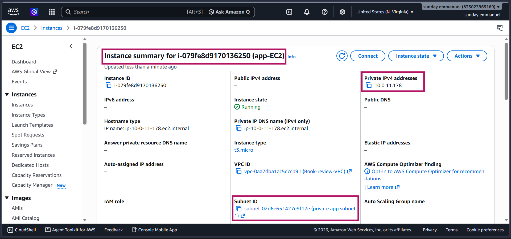
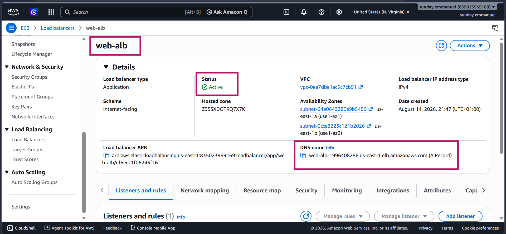
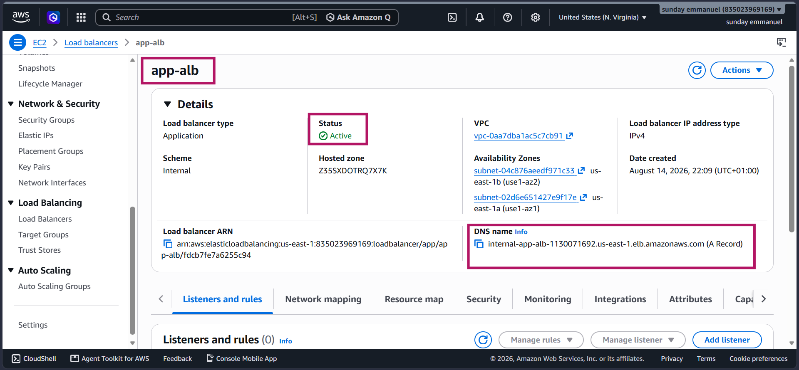
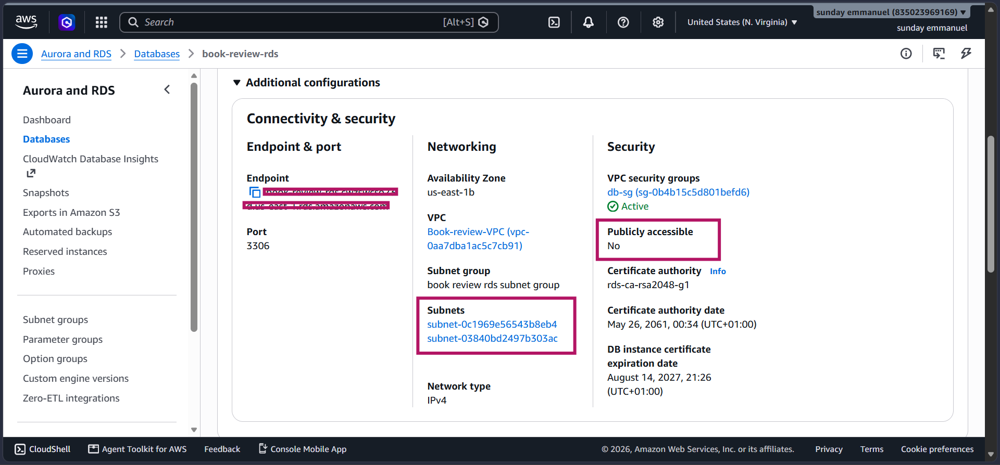
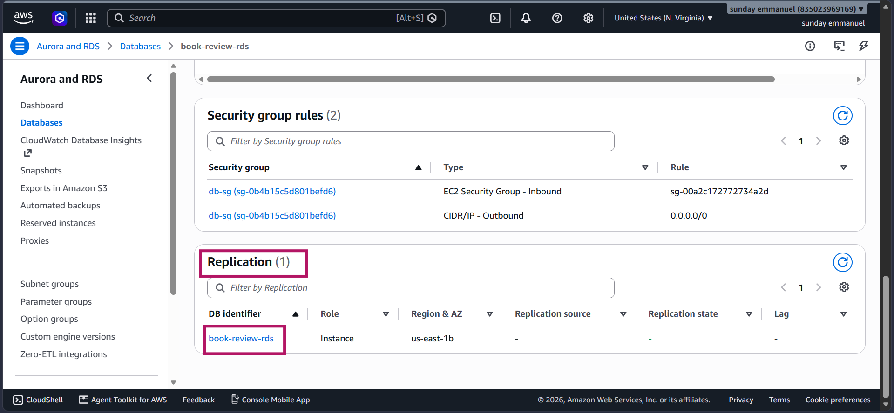
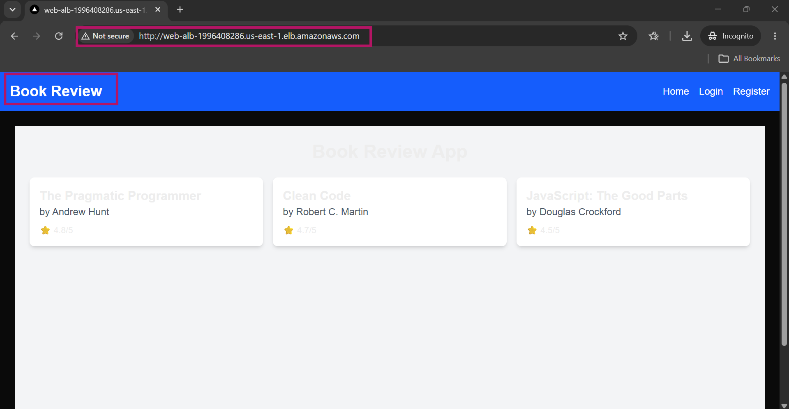
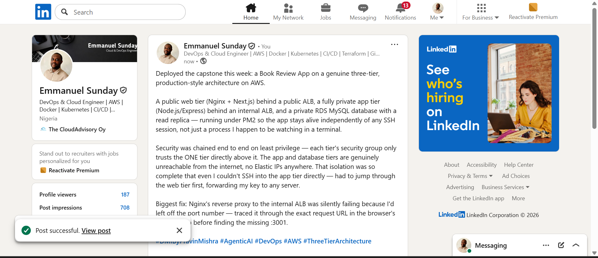

# Assignment 6 — Capstone Assignment — Deploy Book Review App (Three-Tier Architecture) on AWS

Part of the DevOps Micro Internship (DMI) Cohort 3 with Agentic AI

---

## Purpose

This is the most important assignment of the course. You will deploy the Book Review App in a fully production-style three-tier architecture on AWS: a Next.js Web Tier behind Nginx and a public ALB, a private Node.js/Express App Tier behind an internal ALB, and a private Multi-AZ MySQL RDS database with a read replica. You are expected to design, deploy, isolate, debug, and document the result independently.

---

# Task 1 — Architecture Diagram

## Goal

Create an architecture diagram showing the custom VPC (10.0.0.0/16), the six subnets across two Availability Zones (two public Web Tier, two private App Tier, two private Database Tier), the public ALB, Web Tier EC2/Nginx, internal ALB, private App Tier EC2, private Multi-AZ RDS with its read replica, and the permitted traffic flow.

### Evidence

#### Diagram image or link

---

# Task 2 — AWS Region & Services Used

## Goal

Record the AWS Region used and list every AWS service used across networking, compute, load balancing, security, and the database.

### Notes

**Region:**

us-east-1 (N. Virginia)

---

**Services:**

Networking:
- Amazon VPC (custom VPC, 10.0.0.0/16)
- Subnets (6 total — 2 public web tier, 2 private app tier, 
  2 private DB tier, across 2 Availability Zones)
- Internet Gateway
- NAT Gateway (Regional mode)
- Route Tables (public + private)
- Security Groups (chained: web-alb-sg → web-ec2-sg → 
  internal-alb-sg → app-ec2-sg → db-sg)

Compute:
- Amazon EC2 (2 instances — Web tier running Nginx + 
  Next.js, App tier running Node.js/Express)

Load Balancing:
- Application Load Balancer × 2 (public-facing for the 
  web tier, internal for the app tier)
- Target Groups × 2

Security:
- IAM (RDS credentials, EC2 key pairs)
- Security Groups (least-privilege chaining across all 
  three tiers)
- Private subnet isolation (App and DB tiers not publicly 
  accessible, no Elastic IPs)

Database:
- Amazon RDS for MySQL (Multi-AZ, private subnet, with 
  a read replica)

---

# Task 3 — Public Entry Point

## Goal

Confirm the Book Review App loads through the public ALB DNS name.

### Evidence

#### Public ALB DNS

Paste your public ALB DNS name here:

http://web-alb-1996408286.us-east-1.elb.amazonaws.com/

---

# Task 4 — Evidence Screenshots

## Goal

Capture visual proof of every tier and load balancer.

### Evidence

#### Web EC2

---

#### App EC2

---

#### Public ALB

---

#### Internal ALB

---

#### RDS + Replica

---

#### App UI proof

---

# Task 5 — Summary

## Goal

Summarize what worked in the final deployment, the issues encountered and how each was fixed, and the tools or sources used to research and debug.

### Notes

**What worked:**

Successfully deployed a full production-style three-tier 
architecture: a public web tier (Nginx + Next.js) behind 
a public ALB, a fully private app tier (Node.js/Express) 
behind an internal ALB, and a private RDS MySQL database 
with a read replica (single-AZ, staying within Free Tier). 
Security groups were chained end to end (web-alb-sg → 
web-ec2-sg → internal-alb-sg → app-ec2-sg → db-sg), with 
the app and database tiers genuinely unreachable from the 
internet — no Elastic IPs anywhere in the architecture, 
and a Regional NAT Gateway providing outbound access 
without the single-point-of-failure risk of a single 
Zonal NAT Gateway. The app successfully queries RDS 
through the full chain and displays real data in the 
browser.

---

**Issues + fixes:**

1. Outbound security group rules were too narrowly scoped 
   (only HTTP), blocking apt installs and GitHub clones 
   over HTTPS — fixed by opening outbound traffic properly.

2. Nginx's reverse proxy to the internal ALB was missing 
   the port number (:3001), causing traffic to silently 
   fail — fixed by adding the explicit port to proxy_pass.

3. MySQL table names were case-sensitive (Books vs books) 
   on this RDS instance, initially causing a "table doesn't 
   exist" error during manual verification — resolved by 
   matching the exact casing Sequelize created.

4. SSH access to the private App tier instance required 
   jumping through the Web tier instance using SSH agent 
   forwarding, since the App tier has no public IP by design.

---

**Tools/sources used:**

AWS Console (EC2, VPC, RDS, ELB), SSH with agent forwarding, 
MySQL CLI for direct database verification, browser DevTools 
Network tab for tracing the frontend API call, PM2 for 
process management and logs, the app's own README and video 
walkthrough for the correct database setup steps.

---

# LinkedIn Post (Required)

## Goal

Publish a LinkedIn post sharing the capstone deployment, including the public ALB DNS (or a redacted screenshot), three to five lines on what you built and why it is production-style, and one proof screenshot.

## Evidence

#### LinkedIn Post URL

Paste your LinkedIn post URL here:

https://www.linkedin.com/posts/emmanuel-sunday-210a08323_dmibypravinmishra-agenticai-devops-activity-7494767742361735168-oiu-?utm_source=share&utm_medium=member_desktop&rcm=ACoAAFHXXywBq0IrgBBhbi5ULmCrDuZgCEYc6fQ

---

#### Screenshot of LinkedIn post

---

# Submission Instructions

- Add all required screenshots and links in your submission
- Do not expose passwords, RDS credentials, connection strings, private keys, or account IDs

---

# Completion Checklist

- [ ] Task 1: Architecture diagram completed
- [ ] Task 2: AWS Region and services documented
- [ ] Task 3: Public ALB DNS confirmed working
- [ ] Task 4: All six evidence screenshots captured (Web Tier, App Tier, both ALBs, RDS + replica, app UI)
- [ ] Task 5: Deployment summary completed (what worked, issues/fixes, tools/sources)
- [ ] LinkedIn post published and URL submitted
- [ ] App Tier and Database Tier confirmed not publicly accessible
- [ ] No sensitive data exposed

---

## 📌 About DMI & CloudAdvisory

DevOps Micro Internship (DMI) is a project-based DevOps program run by Pravin Mishra (The CloudAdvisory) focused on real-world execution, systems thinking, and career readiness.

It helps learners build strong DevOps foundations with hands-on experience.

---

## 📌 Resources

- 🌐 DMI Official Website: https://dmi.pravinmishra.com?utm_source=github&utm_medium=readme  
- 🎓 University: https://university.pravinmishra.com?utm_source=github&utm_medium=readme  
- 💬 Discord Community: https://discord.pravinmishra.com?utm_source=github&utm_medium=readme  
- 📝 Blog: https://dmi.pravinmishra.com/blog?utm_source=github&utm_medium=readme  
- ▶️ YouTube Playlist: https://www.youtube.com/playlist?list=PLFeSNDtI4Cho  
- 🔗 Pravin Mishra (LinkedIn): https://www.linkedin.com/in/pravin-mishra-aws-trainer/  
- 🏢 CloudAdvisory (LinkedIn): https://www.linkedin.com/company/thecloudadvisory/

---

*This submission is part of DevOps Micro Internship (DMI) Cohort 3 — Agentic AI Track.*