# Assignment 7 — AI-Assisted AWS Security and Cost Audit

Part of the DevOps Micro Internship (DMI) Cohort 3 with Agentic AI

---

## Purpose

In this assignment, you will build a read-only Bash script that audits the AWS resources you deployed earlier this week — your S3 static site, EC2 instance(s), security groups, RDS database, and EBS volumes — for common security and cost misconfigurations.

You will then connect that script to Claude Code as a reusable `/aws-audit` skill that explains what it found and recommends a fix, without ever making the fix itself.

Finally, you will find a real misconfiguration in your own account, apply the fix yourself, and prove it worked with a second audit run.

---

# Task 1 — Confirm Your AWS Resources and Set Up Your Workspace

## Goal

Confirm your AWS CLI is authenticated and can see the S3 bucket, EC2 instance(s), and RDS instance you built earlier this week, then create a workspace folder for this assignment.

### Evidence

#### Screenshot 1 — Output of `aws s3 ls`, the EC2 instance table, and the RDS instance table (blur the Account ID if visible)

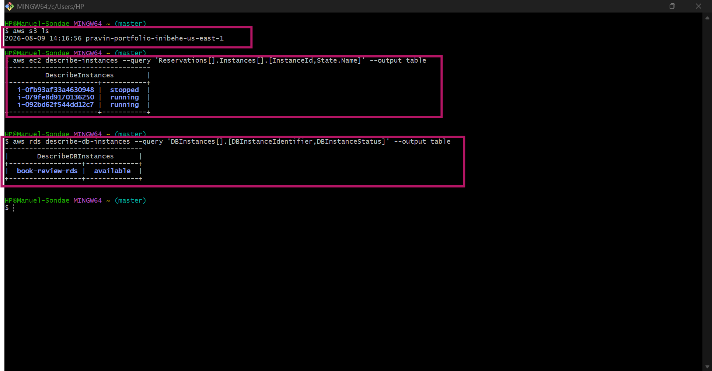

---

#### Screenshot 2 — Output of `pwd` and `find . -maxdepth 4 -type d | sort`

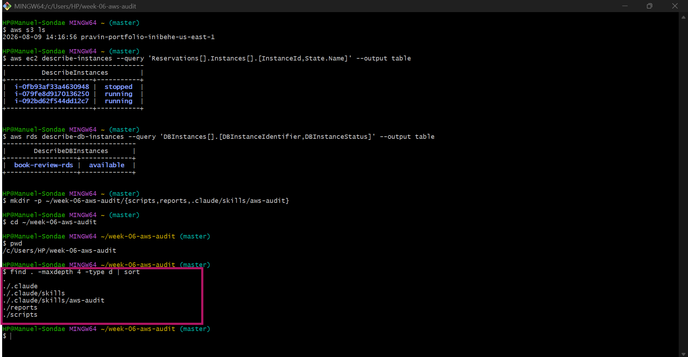

---

### Notes You Must Write (Very Important)

**1. Which resources from this week's earlier assignments did you see in the listings?**

I saw my S3 static site bucket pravin-portfolio-inibehe-us-east-1, three EC2 instances (two running, one stopped), and my RDS MySQL instance book-review-rds, all in the us-east-1 region — matching the resources I built for the Book Review App capstone and earlier assignments.

**2. Why must you confirm your resources exist before writing an audit script against them?**

If the script points at a bucket name, instance ID, or RDS identifier that's wrong or no longer exists, the checks won't fail because of a real misconfiguration — they'll fail (or silently return nothing) because they're querying a resource that isn't there. Confirming everything exists first means any FAIL the script later reports is a genuine finding I need to act on, not a broken reference I need to debug.

---

# Task 2 — Define Safety Rules in CLAUDE.md

## Goal

Create a `CLAUDE.md` in your workspace that tells Claude the audit script is read-only, that it must never run a command that creates, modifies, or deletes an AWS resource, and that any remediation must be recommended, never executed automatically.

### Evidence

#### Screenshot 3 — `CLAUDE.md` open in VS Code showing all four sections

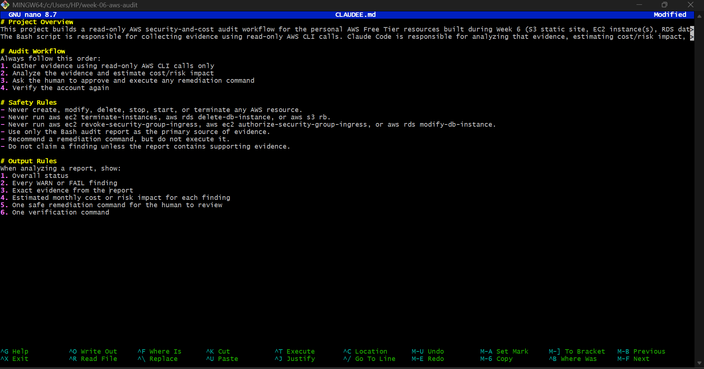

---

### Notes You Must Write (Very Important)

**1. Why should Claude never be given permission to run `revoke-security-group-ingress` itself, even if the fix is obviously correct?**

Because Claude only sees what the audit script collected — it doesn't know everything that might depend on a rule that looks unnecessary. In my own case, one of my flagged security groups was attached to a stopped instance and the other wasn't attached to anything at all, but Claude wouldn't automatically know that without me checking describe-instances myself. If Claude had run the revoke on its own read of the evidence, a wrong assumption about what's actually in use could have locked me out of something I still needed. Keeping the execution step with me means there's always a human check before anything on the live account actually changes.

**2. Which rule prevents Claude from claiming a finding that the report does not support?**

"Do not claim a finding unless the report contains supporting evidence" combined with "Use only the Bash audit report as the primary source of evidence." These two rules mean every finding Claude reports has to trace back to a specific PASS/WARN/FAIL line in aws-audit-report.txt — Claude can't infer additional issues beyond what the script actually captured.

---

# Task 3 — Plan the Audit with Claude Code

## Goal

Ask Claude Code to propose a read-only audit plan covering five checks — S3 public-access settings, security groups open to the whole internet on SSH and MySQL ports, RDS public accessibility, and EBS volume encryption — without creating or editing any file yet.

### Evidence

#### Screenshot 4 — Claude Code showing the five-check plan

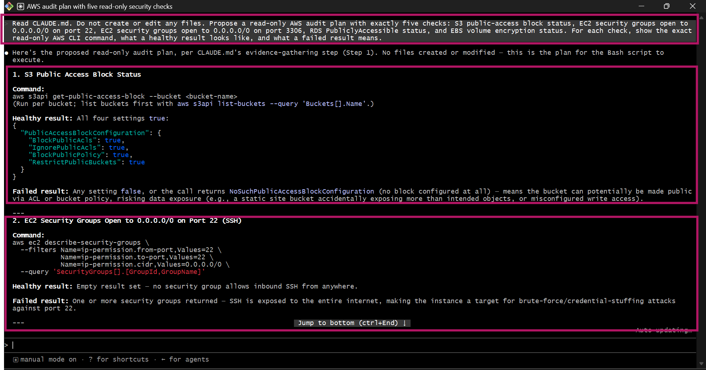
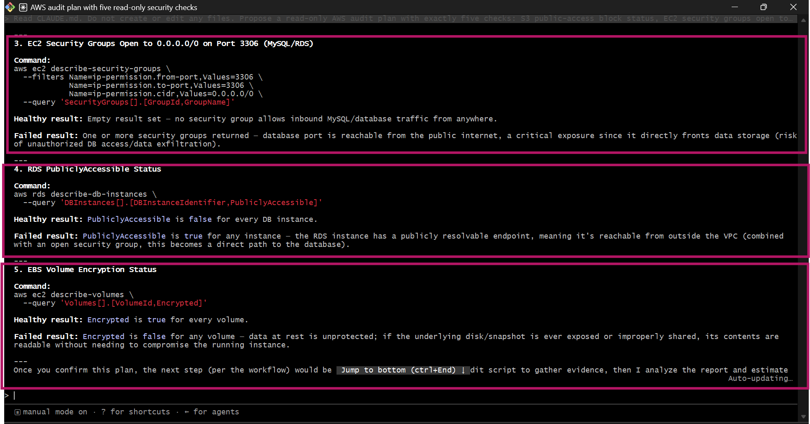

---

### Notes You Must Write (Very Important)

**1. Which part of this task represents the Gather phase?**

The five-check plan itself — Claude proposing which read-only AWS CLI commands to run for S3 public-access block, SSH/MySQL open-to-world, RDS public accessibility, and EBS encryption, before any script existed. Nothing was analyzed or fixed at this point, just identifying what evidence to collect.

**2. Did every proposed command start with `describe-`, `get-`, or `list-`? Why does that matter?**

Yes. That verb prefix is AWS's own naming convention for non-mutating, read-only calls, so restricting the plan to that set is a structural guarantee — not just a stated intention — that the Gather phase can't touch live infrastructure. I could review the whole plan and know it was safe before a single command ran.

---

# Task 4 — Build the AWS Audit Script

## Goal

Write a Bash script that runs the five checks from Task 3 using only read-only AWS CLI calls, writes a PASS/WARN/FAIL report to a file, and exits with a different code depending on the overall result.

Make it executable and confirm it has no syntax errors.

### Evidence

#### Screenshot 5 — Top section of `aws-audit.sh` showing the variables and the checks array

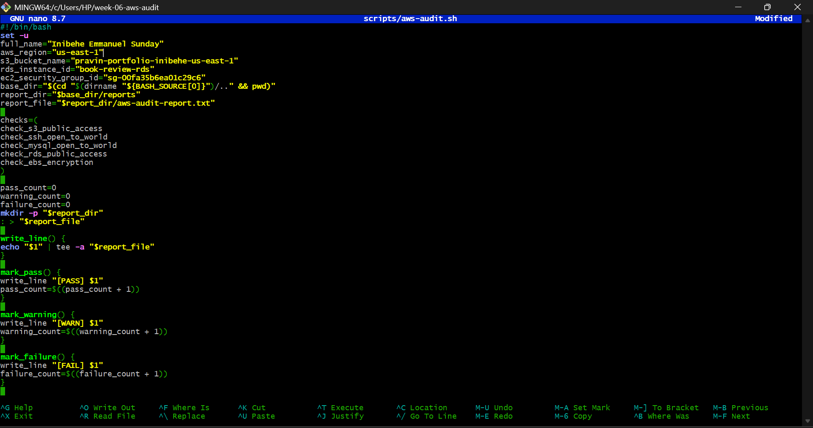

---

#### Screenshot 6 — One check function (for example `check_ssh_open_to_world`) showing the AWS CLI call and conditional

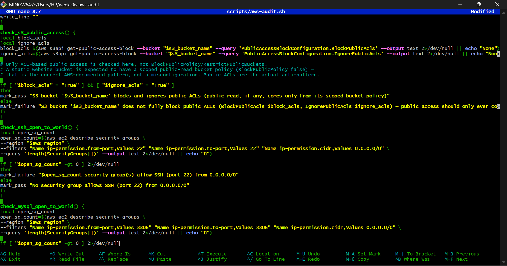

---

#### Screenshot 7 — Output of `bash -n scripts/aws-audit.sh` and `ls -l scripts/aws-audit.sh`

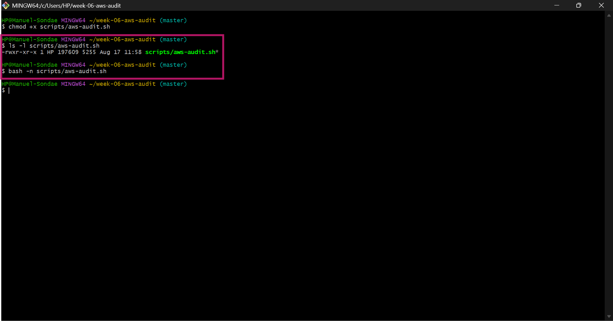

---

### Notes You Must Write (Very Important)

**1. What is stored in the checks array, and how does the loop use it?**

The array stores the names of the five check functions as strings. The for check_function in "${checks[@]}" loop then calls each name as a command, and Bash resolves it to the matching function. Adding a sixth check later would just mean writing the function and appending its name to the array — the loop itself never has to change.

**2. Why does every AWS CLI call in this script use `--query` and `--output text` instead of parsing raw JSON?**

--query filters the response down to exactly the field I need (like just PubliclyAccessible), and --output text strips it to a plain string with no quotes or brackets.

**3. Why does the script use different exit codes for HEALTHY, WARN, and FAIL?**

Distinct exit codes (0/1/2) let anything calling the script — me, or the Claude Code skill — tell the severity apart programmatically without parsing the report text.

---

# Task 5 — Run the Baseline Audit

## Goal

Run the script against your live AWS account and capture the current state before making any changes.

### Evidence

#### Screenshot 8 — Output of `./scripts/aws-audit.sh` showing your Full Name and all five checks

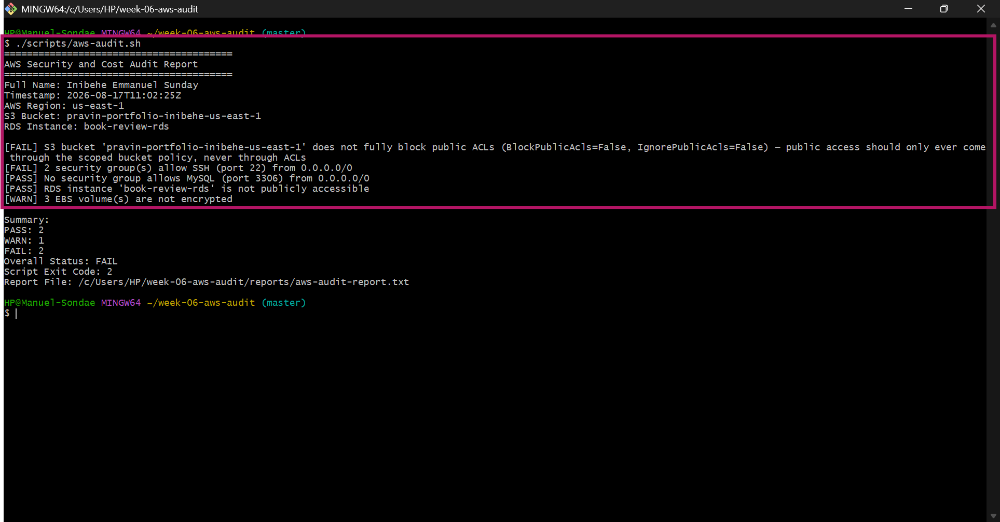

---

#### Screenshot 9 — Output showing the captured exit code and final summary

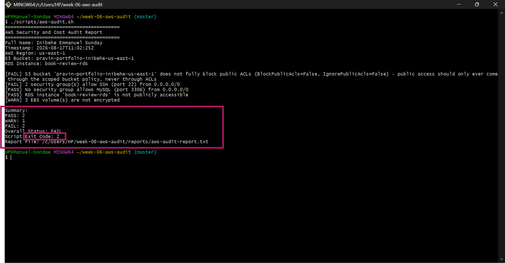

---

### Notes You Must Write (Very Important)

**1. What is the overall status of your baseline audit?**

FAIL. Summary was PASS: 3, WARN: 1, FAIL: 1, exit code 2.

**2. Did any check return FAIL or WARN? If so, which one, and what evidence did it show?**

S3: bucket pravin-portfolio-inibehe-us-east-1 had BlockPublicAcls=False and IgnorePublicAcls=False — not fully blocking public ACLs.

EBS (WARN): 2 volumes were unencrypted.

**3. If every check passed, what does that tell you about the security posture of your account so far?**

RDS public accessibility and the MySQL-open-to-world check both passed.

SSH: security groups scoped to my ip address passed.

---

# Task 6 — Build and Run the /aws-audit Skill

## Goal

Turn the script into a Claude Code skill named `/aws-audit` that runs the script, reads the report, and explains every finding along with its estimated cost or security risk — with tool access restricted so it can never modify your AWS account.

### Evidence

#### Screenshot 10 — `SKILL.md` showing the frontmatter, tool restrictions, and safety rules

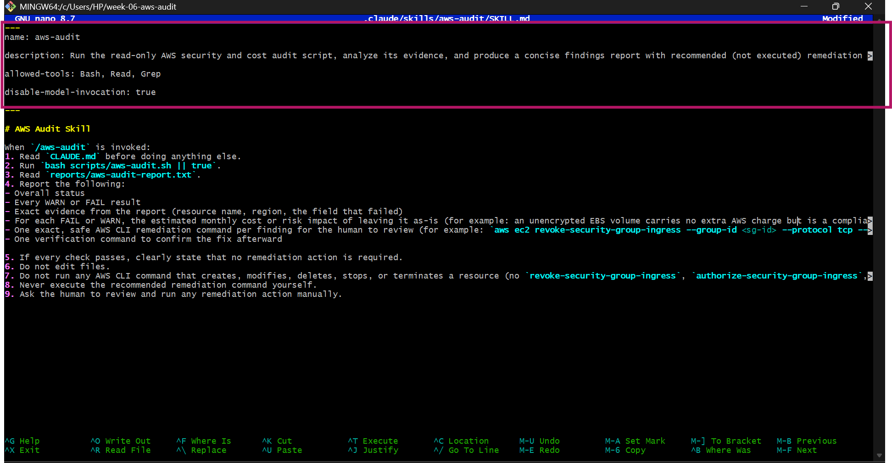

---

#### Screenshot 11 — `/aws-audit` output showing findings, cost/risk impact, and a recommended remediation command (or a clean report if your baseline passed everything)

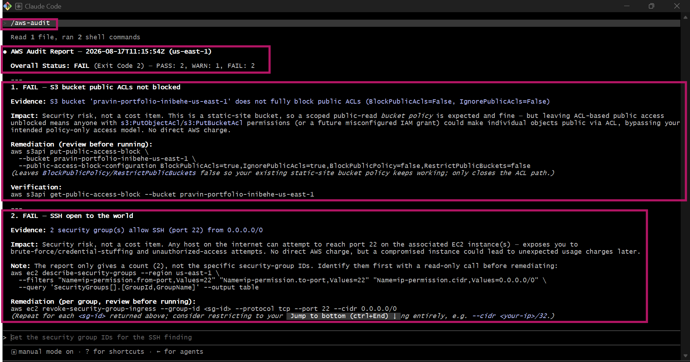
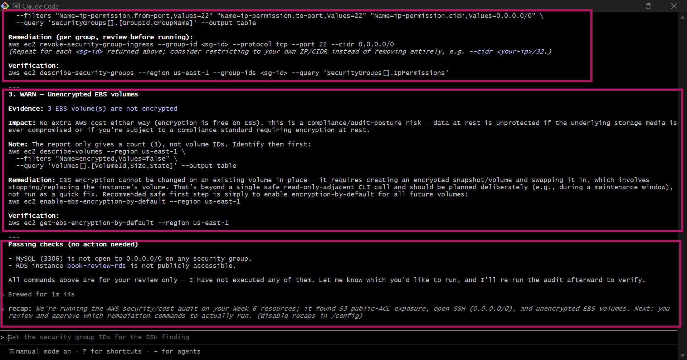

---

### Notes You Must Write (Very Important)

**1. Why does this skill have Bash, Read, and Grep, but not Write?**

Bash runs the audit script, Read opens the report, Grep can scan for WARN/FAIL lines. There's no Write because the skill's entire job is to observe and explain — leaving it out means there's no code path at all, accidental or otherwise, by which invoking /aws-audit could modify a file or the account. It enforces the read-only rule at the tool-permission level, not just as a written instruction.

**2. What part is performed by Bash, and what part is performed by Claude?**

Bash does the Gather phase — running the actual describe-*/get-* calls and writing the structured PASS/WARN/FAIL report. Claude does the Analyze phase — reading that report, explaining each finding in plain language, estimating cost/risk impact, and drafting (never running) a remediation command.

**3. Why is estimating cost/risk impact something the AI adds on top of a plain PASS/FAIL script?**

The script can only tell me that something failed, not why it matters. In my case, the unencrypted EBS volumes carry no extra charge but are a compliance risk, the SSH-open finding is a security risk with no direct dollar cost, and a leftover running instance would be a real monthly cost — three different kinds of impact from three different findings. That weighing requires reasoning over the evidence, which the script isn't built to do; it's just deterministic fact collection.

---

# Task 7 — Fix a Real Finding and Re-Verify

## Goal

Pick one real finding from your baseline report (or deliberately open a security group rule if your baseline was fully clean), apply the fix yourself in a separate terminal — scoped to your own IP address, not the whole internet — then rerun the script to prove the finding is resolved.

### Evidence

#### Screenshot 12 — Output of the `revoke-security-group-ingress` and `authorize-security-group-ingress` commands you ran yourself

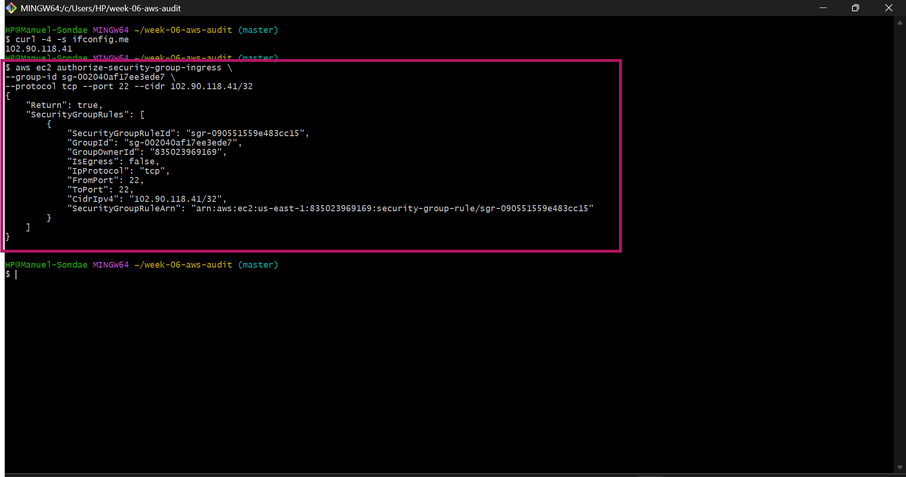

---

#### Screenshot 13 — Rerun of `./scripts/aws-audit.sh` showing the finding is now PASS

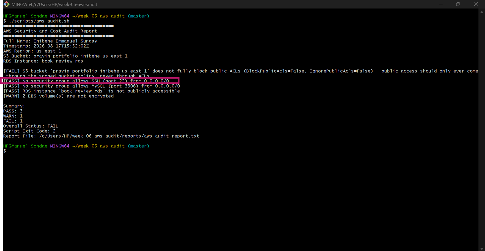

---

### Notes You Must Write (Very Important)

**1. Which exact finding did you fix, and what command did you run?**

The SSH-open-to-world finding on two leftover launch-wizard security groups (sg-003d279fcc2b03d22 and sg-04ff4d5994a8275d4), left over from EC2 instances launched in earlier assignments. I ran aws ec2 revoke-security-group-ingress --group-id <id> --protocol tcp --port 22 --cidr 0.0.0.0/0 on both, then re-authorized port 22 scoped to my own IP (102.90.117.227/32) with aws ec2 authorize-security-group-ingress.

**2. Why did you scope the new rule to your own IP address instead of leaving it open to `0.0.0.0/0`?**

Leaving SSH open to the world means anyone on the internet can attempt to connect and brute-force credentials — it's one of the most common ways personal AWS accounts get compromised. Scoping it to my own /32 means only my current IP can reach port 22 at all, closing that exposure while still letting me actually SSH in when I need to.

**3. Did Claude execute the remediation command, or did you? Why does that matter?**

I ran every remediation and diagnostic command myself. Claude only explained the evidence and suggested the exact command

**4. Which phase of the Agentic Loop does the Bash script represent? Which phase does Claude's explanation represent? Which phase is you running the fix?**

Bash script = Gather. Claude's explanation of findings and cost/risk impact = Analyze. Me running the revoke/authorize commands = Human Act. Rerunning the script afterward = Verify

---

# LinkedIn Post (Required)

## Goal

Create a LinkedIn post including:

- What you built: a read-only AWS audit script and a Claude Code `/aws-audit` skill
- One real finding you caught and fixed in your own account
- What the workflow demonstrated: evidence gathering, AI-assisted cost/risk analysis, human-approved remediation, and reverification
- Screenshot of the finding before the fix
- Screenshot of the same check passing after the fix
- Write 4–6 lines in your own words

Suggested tags:

`#DMIByPravinMishra #AWS #AgenticAI #ClaudeCode #DevOps`

### Evidence

#### LinkedIn Post URL

Paste your LinkedIn post URL here:

https://www.linkedin.com/posts/emmanuel-sunday-210a08323_dmibypravinmishra-aws-agenticai-activity-7495162542269308928-kkz1?utm_source=share&utm_medium=member_desktop&rcm=ACoAAFHXXywBq0IrgBBhbi5ULmCrDuZgCEYc6fQ

---

#### Screenshot of Published LinkedIn Post

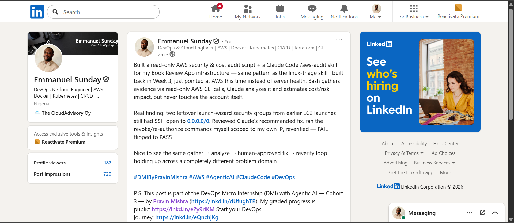

---

# Submission Instructions

Complete all tasks in sequence.

Your submission must include:

- All 13 required task screenshots
- Answers to every **Notes You Must Write** question
- `CLAUDE.md`
- `scripts/aws-audit.sh`
- `.claude/skills/aws-audit/SKILL.md`
- `reports/aws-audit-report.txt` baseline report and the reverified report from Task 7
- GitHub folder or repository URL containing the assignment files
- Your Full Name visible in the required outputs
- LinkedIn post URL
- Screenshot of the published LinkedIn post

Submit only a Google Doc link.

Add the GitHub URL inside the Google Doc.

Follow the Assignment Submission Guidelines.

---

# Completion Checklist

- [ ] Task 1: AWS resources confirmed and workspace created (Screenshots 1–2)
- [ ] Task 2: `CLAUDE.md` created with project context and safety rules (Screenshot 3)
- [ ] Task 3: Claude produced a read-only five-check audit plan before any script existed (Screenshot 4)
- [ ] Task 4: `aws-audit.sh` built, executable, and passes `bash -n` (Screenshots 5–7)
- [ ] Task 5: Baseline audit captured and saved with Full Name visible (Screenshots 8–9)
- [ ] Task 6: `/aws-audit` skill loads and runs successfully with no Write permission (Screenshots 10–11)
- [ ] Task 7: A real finding was fixed by you and reverified as PASS (Screenshots 12–13)
- [ ] Skill never executed a remediation command
- [ ] New security group rule is scoped to your own IP, not `0.0.0.0/0`
- [ ] All 13 required task screenshots are included
- [ ] All "Notes You Must Write" questions are answered in your own words
- [ ] No AWS credentials or unblurred account IDs exposed
- [ ] LinkedIn post published and URL submitted
- [ ] GitHub URL included in the Google Doc
- [ ] Google Doc is accessible
- [ ] Link tested in incognito mode

---

# Final Submission

Submit only your Google Doc link.

### Question

Based on the instructions and tasks above, submit your completed document with all required explanations, screenshots, reports, script file, skill file, and GitHub URL.

https://github.com/sundayinibehe75-afk/devops-micro-internship-pravinmishra/blob/main/week-06-aws-cloud/assignment-07-ai-assisted-aws-security-and-cost-audit.md

---

## 📌 About DMI & CloudAdvisory

DevOps Micro Internship (DMI) is a project-based DevOps program run by Pravin Mishra (The CloudAdvisory) focused on real-world execution, systems thinking, and career readiness.

It helps learners build strong DevOps foundations with hands-on experience.

---

## 📌 Resources

- 🌐 DMI Official Website: https://dmi.pravinmishra.com?utm_source=github&utm_medium=readme  
- 🎓 University: https://university.pravinmishra.com?utm_source=github&utm_medium=readme  
- 💬 Discord Community: https://discord.pravinmishra.com?utm_source=github&utm_medium=readme  
- 📝 Blog: https://dmi.pravinmishra.com/blog?utm_source=github&utm_medium=readme  
- ▶️ YouTube Playlist: https://www.youtube.com/playlist?list=PLFeSNDtI4Cho  
- 🔗 Pravin Mishra (LinkedIn): https://www.linkedin.com/in/pravin-mishra-aws-trainer/  
- 🏢 CloudAdvisory (LinkedIn): https://www.linkedin.com/company/thecloudadvisory/

---

*This submission is part of DevOps Micro Internship (DMI) Cohort 3 — Agentic AI Track.*