# Assignment 4 — Deploy EpicBook Application on AWS Using Terraform

Part of the DevOps Micro Internship (DMI) Cohort 3 with Agentic AI

---

## Purpose

In this assignment, you will use Terraform to provision AWS network infrastructure (VPC, public/private subnets, Security Groups), launch an Ubuntu 22.04 EC2 instance, and provision a private Amazon RDS for MySQL instance. You will then deploy EpicBook, connect it to MySQL, and validate the complete user flow.

---

# Task 1 — Create Network Infrastructure with Terraform

## Goal

Define a VPC (10.0.0.0/16) with a public subnet (10.0.1.0/24) and private subnet (10.0.2.0/24), an Internet Gateway with public routing, an EC2 Security Group (SSH 22, HTTP 80), and an RDS Security Group (MySQL 3306 only from the EC2 Security Group).

### Evidence

#### Screenshot 1 — Terraform configuration showing the VPC and both subnet CIDR ranges

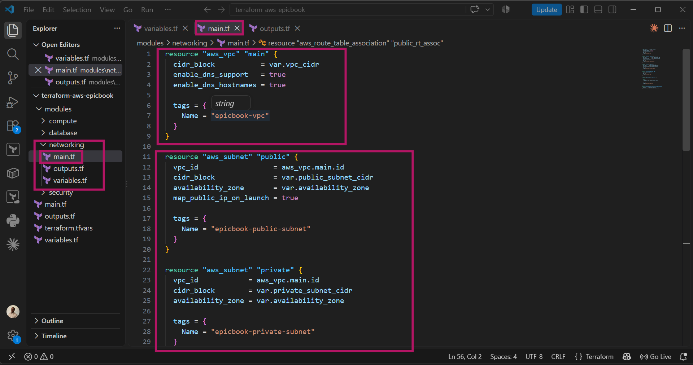

---

#### Screenshot 2 — Terraform configuration showing the Internet Gateway, public route table, and both Security Groups

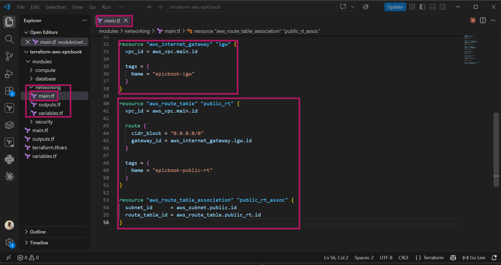
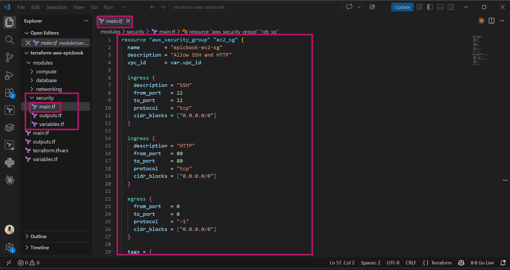
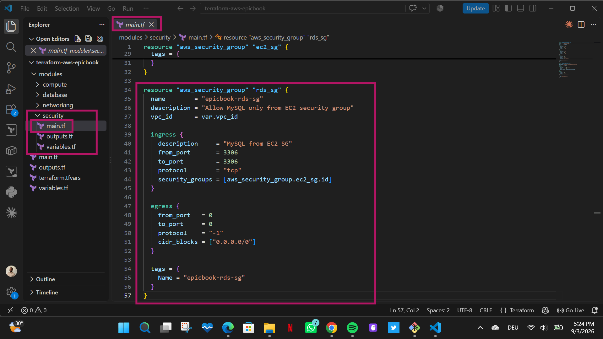

---

# Task 2 — Provision EC2 Virtual Machine (Ubuntu 22.04)

## Goal

Use Terraform to launch a t2.micro Ubuntu 22.04 EC2 instance in the public subnet with a public IP, then install Node.js, npm, Git, Nginx, and MySQL client.

### Evidence

#### Screenshot 3 — Terraform apply output showing successful EC2 provisioning

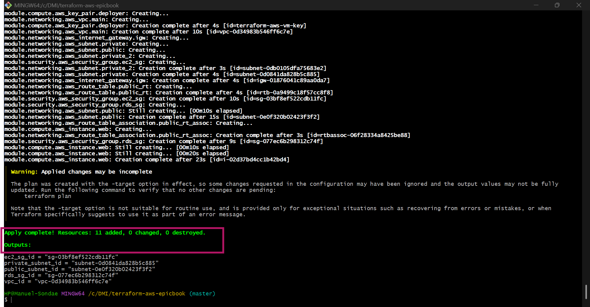

---

#### Screenshot 4 — EC2 instance running in the AWS Console with the public IP and subnet visible

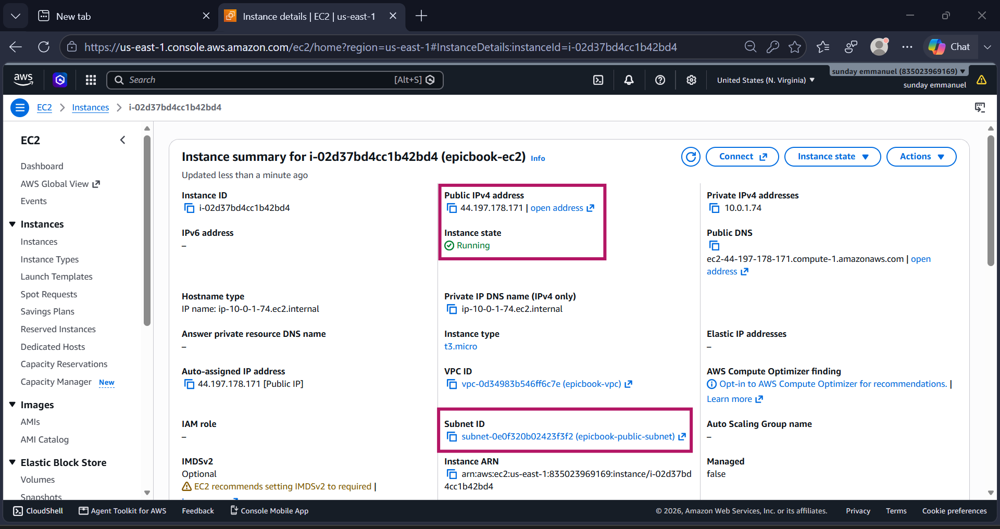

---

#### Screenshot 5 — Terminal showing successful SSH access and installed software

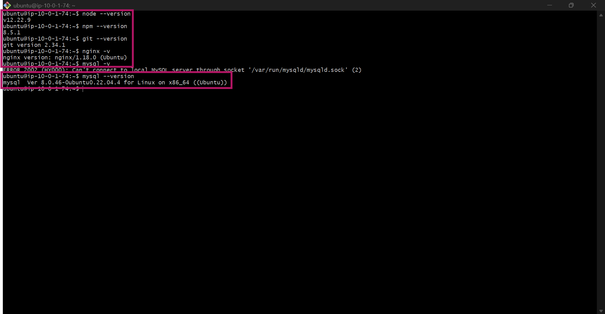

---

# Task 3 — Deploy the EpicBook Application

## Goal

Deploy the EpicBook frontend and backend on the EC2 instance and configure Nginx to serve it, following the Installation, Configuration & Troubleshooting Guide.

### Evidence

#### Screenshot 6 — Terminal showing the EpicBook application files and dependency installation

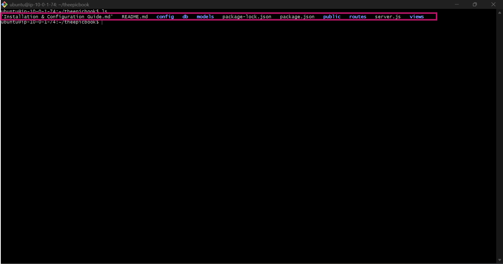

---

#### Screenshot 7 — Terminal showing the application and Nginx services running

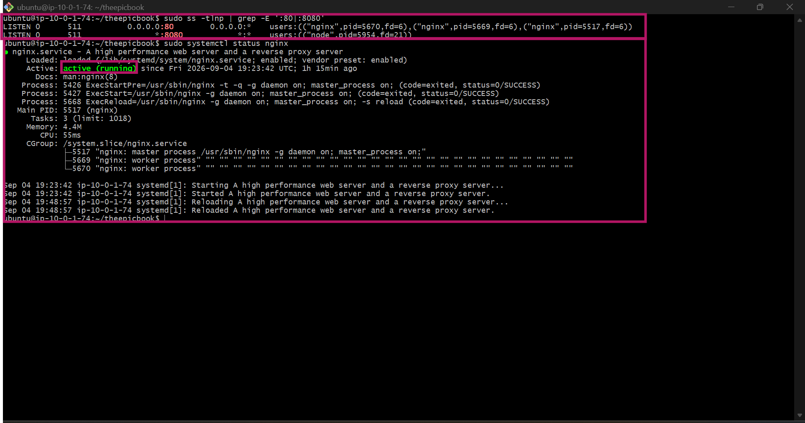

---

# Task 4 — Set Up Amazon RDS for MySQL with Terraform

## Goal

Provision a private Amazon RDS MySQL instance (db.t3.micro, Publicly accessible: false) restricted to the EC2 Security Group, then initialize the database using the provided SQL dump and connect the EpicBook backend to it.

### Evidence

#### Screenshot 8 — Terraform apply output showing successful RDS provisioning

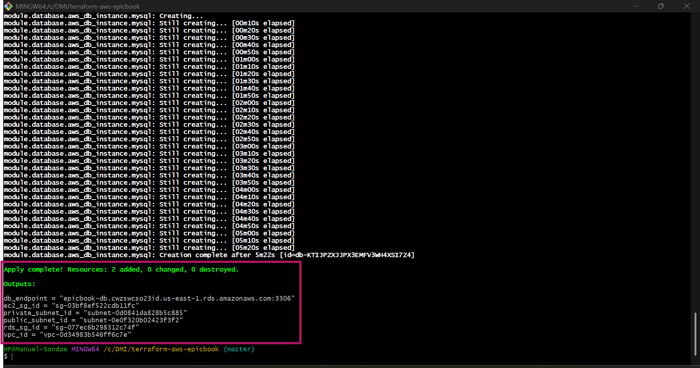

---

#### Screenshot 9 — RDS instance in the AWS Console showing the private network configuration and Publicly accessible: No

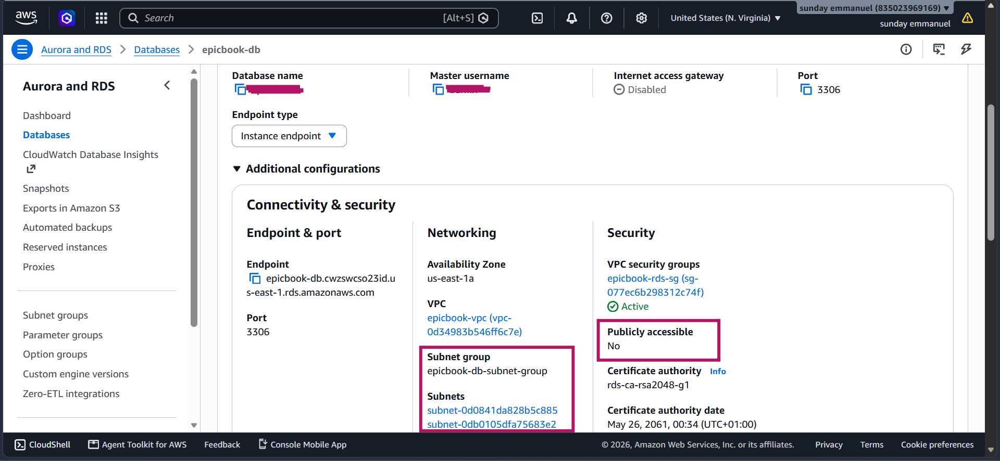

---

#### Screenshot 10 — Terminal showing successful database initialization or table verification from EC2

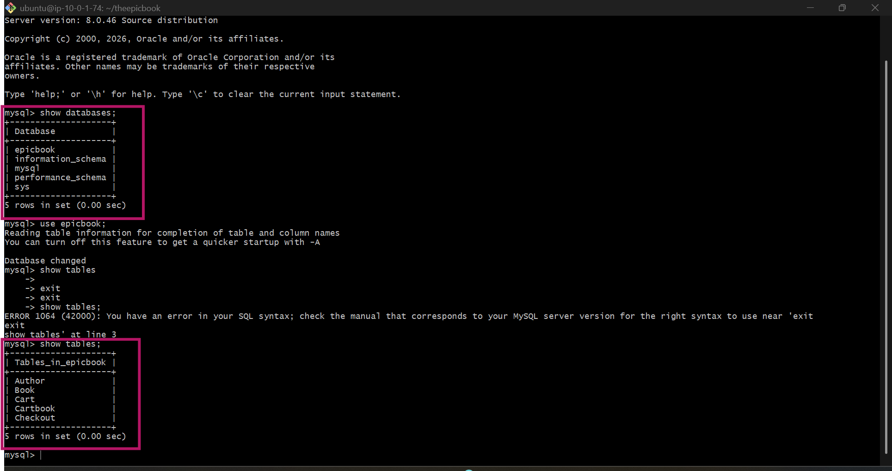

---

# Task 5 — Test End-to-End Functionality

## Goal

Confirm EpicBook is accessible through the EC2 public IP and that navigation, cart, order summary, and checkout all work against the MySQL backend.

### Evidence

#### Screenshot 11 — Browser showing the EpicBook application through the EC2 public IP

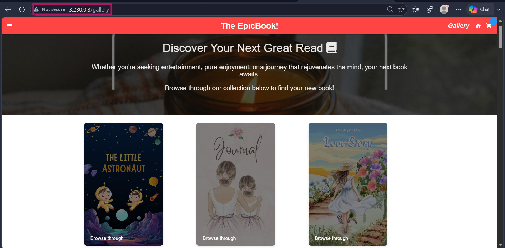

---

#### Screenshot 12 — Browser showing a working product, cart, order summary, or checkout flow

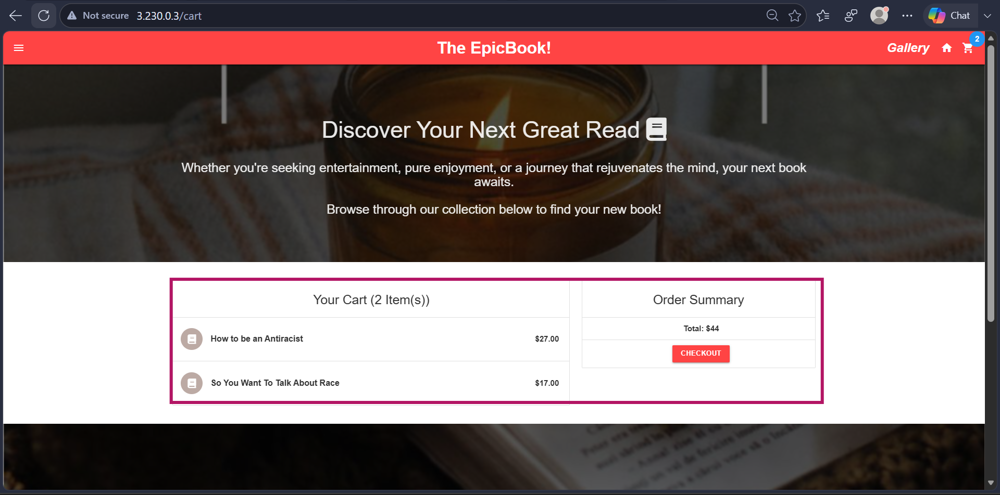

---

### Notes

Write a short note describing any issue you faced, how you fixed it, and what you learned.

While deploying EpicBook, I hit a 502 error in the browser after the site had already been working. It turned out the backend process had crashed after I added books to the database — restarting it with node server.js brought the site back up immediately.

This reinforced something I'd already learned with the Book Review App: a 502 means Nginx itself is fine, but whatever it's proxying to (the backend) isn't responding — either it crashed, isn't running, or hasn't started yet. In this case, the fix wasn't in Nginx's config at all, just restarting the process it depends on.

---

# LinkedIn Post (Required)

## Goal

Publish a LinkedIn post about what you achieved in this assignment, with public or "Anyone" visibility.

## Evidence

#### LinkedIn Post URL

Paste your LinkedIn post URL here:

https://www.linkedin.com/posts/emmanuel-sunday-210a08323_dmibypravinmishra-aws-terraform-activity-7502686252928974848-zos3?utm_source=share&utm_medium=member_desktop&rcm=ACoAAFHXXywBq0IrgBBhbi5ULmCrDuZgCEYc6fQ

---

#### Screenshot 13 — Published LinkedIn post showing the text and at least one image or proof

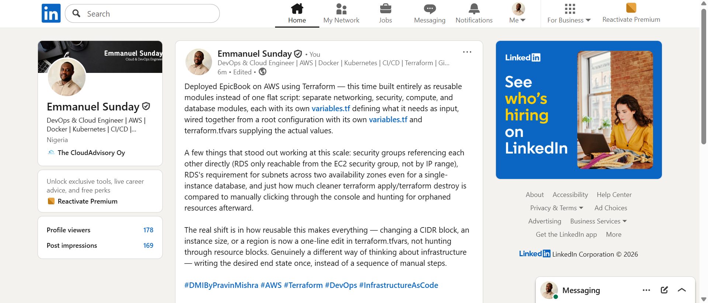

---

# Submission Instructions

- Add all required screenshots in your submission
- Include the EC2 public IP
- Do not expose database passwords, private keys, or other secrets

---

# Completion Checklist

- [ ] Task 1: VPC, subnets, IGW, and Security Groups created with Terraform (Screenshots 1–2)
- [ ] Task 2: EC2 provisioned and required software installed (Screenshots 3–5)
- [ ] Task 3: EpicBook deployed and Nginx serving the app (Screenshots 6–7)
- [ ] Task 4: Private RDS MySQL created and database initialized (Screenshots 8–10)
- [ ] Task 5: End-to-end functionality validated (Screenshots 11–12)
- [ ] Issue/fix/learning note written (Notes)
- [ ] LinkedIn post published and URL submitted (Screenshot 13)
- [ ] No sensitive data exposed

---

## 📌 About DMI & CloudAdvisory

DevOps Micro Internship (DMI) is a project-based DevOps program run by Pravin Mishra (The CloudAdvisory) focused on real-world execution, systems thinking, and career readiness.

It helps learners build strong DevOps foundations with hands-on experience.

---

## 📌 Resources

- 🌐 DMI Official Website: https://dmi.pravinmishra.com?utm_source=github&utm_medium=readme  
- 🎓 University: https://university.pravinmishra.com?utm_source=github&utm_medium=readme  
- 💬 Discord Community: https://discord.pravinmishra.com?utm_source=github&utm_medium=readme  
- 📝 Blog: https://dmi.pravinmishra.com/blog?utm_source=github&utm_medium=readme  
- ▶️ YouTube Playlist: https://www.youtube.com/playlist?list=PLFeSNDtI4Cho  
- 🔗 Pravin Mishra (LinkedIn): https://www.linkedin.com/in/pravin-mishra-aws-trainer/  
- 🏢 CloudAdvisory (LinkedIn): https://www.linkedin.com/company/thecloudadvisory/

---

*This submission is part of DevOps Micro Internship (DMI) Cohort 3 — Agentic AI Track.*
