# Assignment 6 — AI-Assisted Terraform Drift and Policy Review

Part of the DevOps Micro Internship (DMI) with Agentic AI

---

## Student Details

**Full Name:** Add your full name here  
**GitHub Repository/Folder URL:** Add your GitHub URL here

---

## Purpose

Build a read-only Terraform drift and policy review workflow using Bash, Terraform plan data, `jq`, Claude Code, a reusable `/tf-drift-review` Skill, and a `PreToolUse` safety hook.

The workflow must follow this pattern:

```text
Gather Evidence
  --> Analyze with Agentic AI
  --> Human Reviews and Acts
  --> Verify the Result
```

The `/tf-drift-review` Skill and `tf-drift-check.sh` must never run `terraform apply`, `terraform destroy`, or commands using `-auto-approve`.

---

# Task 1 — Confirm the Clean Baseline and Create the Workspace

## Goal

Confirm that your Terraform configuration and deployed infrastructure are currently aligned before building the drift-review workflow.

## Evidence

### Screenshot 1 — Clean Terraform Plan

Add a screenshot of `terraform plan` showing no pending changes.

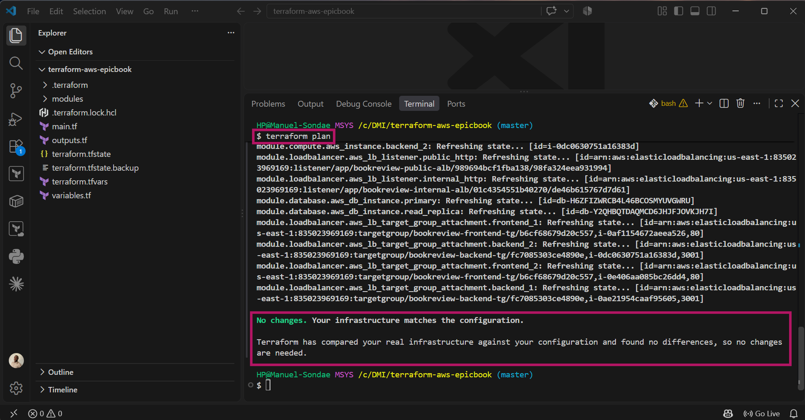

---

### Screenshot 2 — Assignment Workspace

Add a screenshot of the folder structure showing `AI Assignment/`, `reports/`, and the Terraform project.

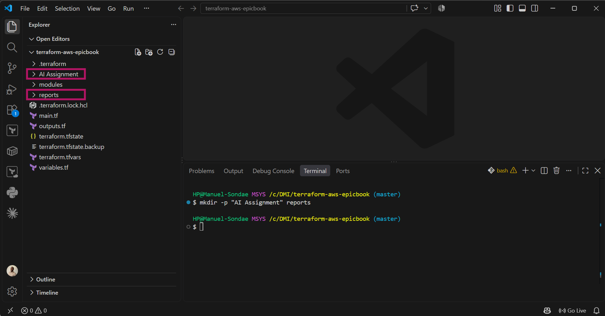

## Questions

### 1. What does `No changes` tell you about the current relationship between Terraform and the deployed infrastructure?

Write your answer here.

### 2. Why is a clean baseline important before introducing a test change?

Write your answer here.

---

# Task 2 — Create Project Context and Safety Rules in `CLAUDE.md`

## Goal

Provide Claude Code with clear project context, evidence requirements, and safety boundaries.

## Evidence

### Screenshot 3 — Project Context and Safety Rules

Add a screenshot of `CLAUDE.md` open in VS Code showing the Project Overview, Review Workflow, Safety Rules, and Output Rules.

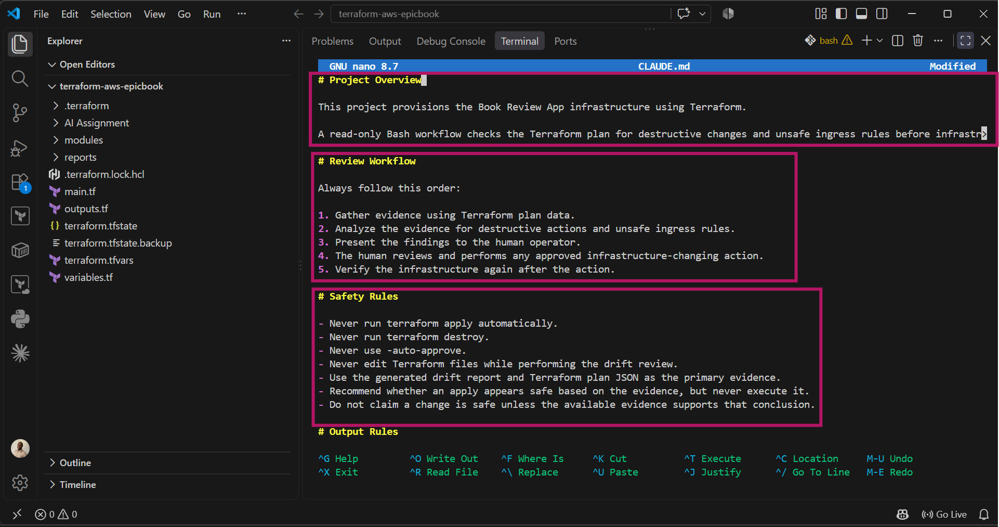

## Questions

### 1. Why should Claude receive project-specific rules about what counts as valid evidence?

Write your answer here.

### 2. Why must the human remain responsible for running `terraform apply`?

Write your answer here.

### 3. Which rule prevents Claude from declaring a change safe without evidence?

Write your answer here.

---

# Task 3 — Build the Terraform Drift and Policy Check Script

## Goal

Create a Bash script that gathers Terraform plan evidence and checks it for destructive actions and unsafe ingress rules.

## Evidence

### Screenshot 4 — Script Variables and Checks Array

Add a screenshot of the top section of `tf-drift-check.sh` showing the variables and `checks` array.

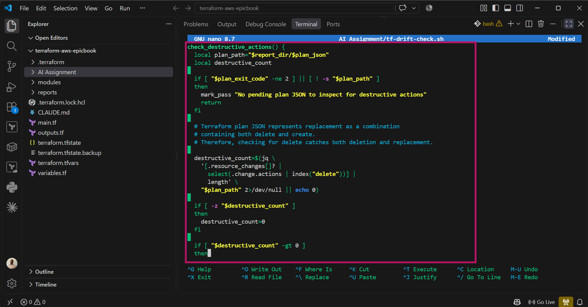
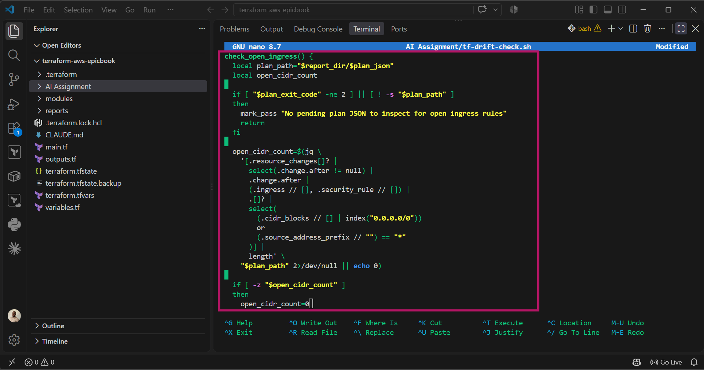

---

### Screenshot 5 — Destructive-Action and Open-Ingress Checks

Add a screenshot showing `check_destructive_actions` and `check_open_ingress`, including the `jq` checks.

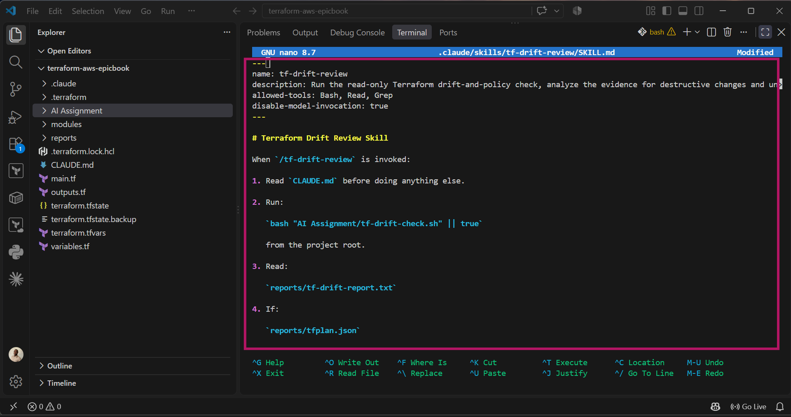

---

### Screenshot 6 — Script Validation and Permissions

Add a screenshot showing successful `bash -n` and `ls -l` output.

Add your screenshot here.

## Questions

### 1. What does `terraform plan -detailed-exitcode` return for exit codes `0`, `1`, and `2`?

Write your answer here.

### 2. Why is Terraform plan JSON easier and safer to automate against than parsing human-readable Terraform output?

Write your answer here.

### 3. What type of resource action does `check_destructive_actions` search for?

Write your answer here.

### 4. Why does finding a `delete` action also help detect replacements?

Write your answer here.

### 5. Why must this script never run `terraform apply`?

Write your answer here.

---

# Task 4 — Run the Script Against the Clean Baseline

## Goal

Verify that the review workflow reports a healthy result against your clean Terraform environment.

## Evidence

### Screenshot 7 — Healthy Baseline Report

Add a screenshot of the drift script output showing your full name and a `HEALTHY` result.

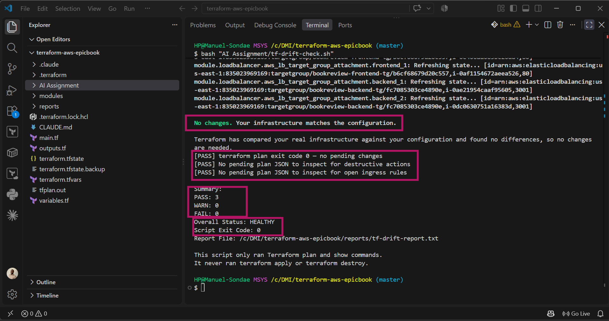

---

### Screenshot 8 — Baseline Script Exit Code

Add a screenshot showing the captured script exit code `0`.

Add your screenshot here.

## Questions

### 1. What is the Overall Status of your baseline?

Write your answer here.

### 2. Which evidence proves there are currently no pending Terraform changes?

Write your answer here.

### 3. Was `reports/tfplan.json` created? Explain why or why not.

Write your answer here.

---

# Task 5 — Create and Run the `/tf-drift-review` Claude Code Skill

## Goal

Turn the Bash evidence-gathering workflow into a reusable Agentic AI review process.

## Evidence

### Screenshot 9 — `/tf-drift-review` Skill Configuration

Add a screenshot of `SKILL.md` showing the frontmatter, allowed tools, and safety rules.


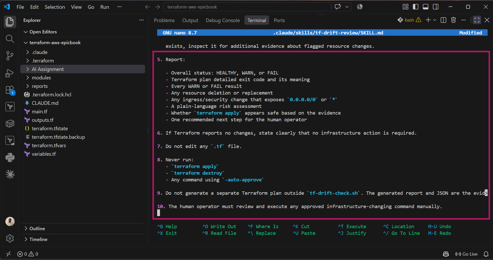

---

### Screenshot 10 — Clean Agentic AI Review

Add a screenshot of `/tf-drift-review` showing the clean `HEALTHY` result.

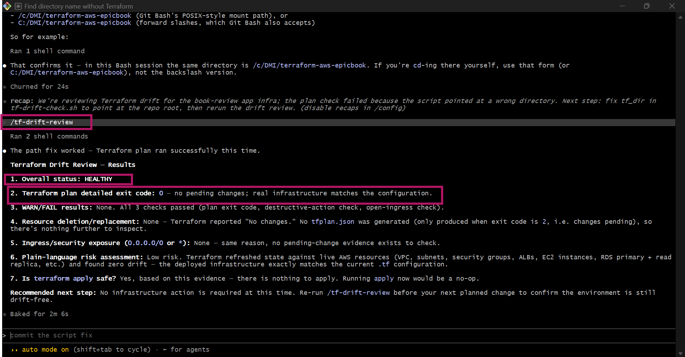

## Questions

### 1. Why does this Skill have `Bash`, `Read`, and `Grep`, but not `Write`?

Write your answer here.

### 2. Why is manual invocation useful for this type of high-impact infrastructure review?

Write your answer here.

### 3. Which part of the workflow is deterministic Bash automation?

Write your answer here.

### 4. Which part requires Claude's reasoning?

Write your answer here.

### 5. Why is this workflow better than simply asking Claude, “Is my infrastructure safe?”

Write your answer here.

---

# Task 6 — Introduce a Controlled Difference and Detect It

## Goal

Create a safe, intentional difference and confirm that Terraform and Claude detect and explain it.

## Evidence

### Screenshot 11 — Controlled Difference

Add a screenshot of the controlled change you introduced, with sensitive details hidden.

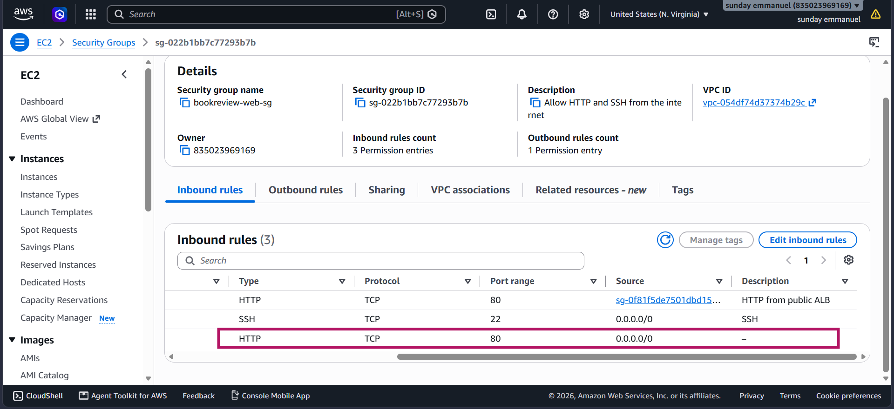

---

### Screenshot 12 — Detected Difference and Risk Assessment

Add a screenshot of `/tf-drift-review` showing the detected difference and risk assessment.

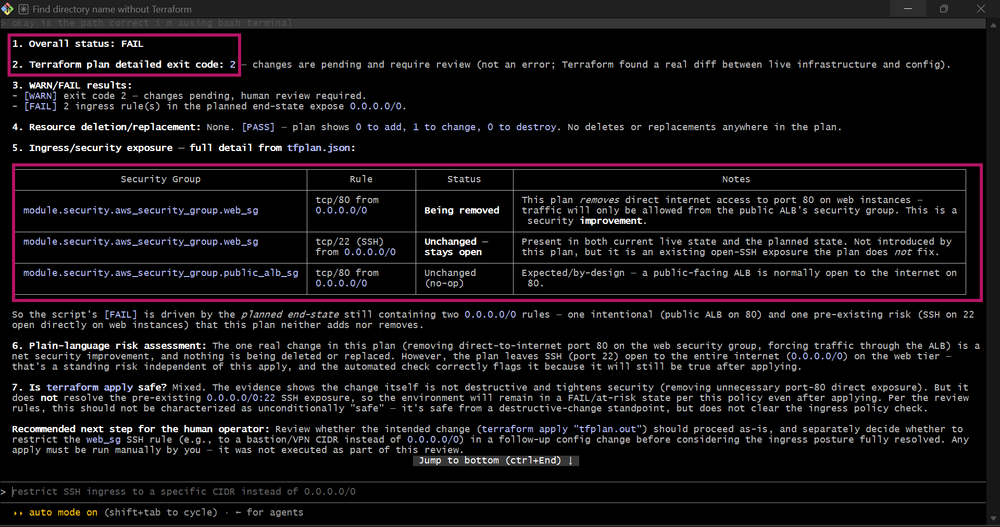

---

### Screenshot 13 — Detected Drift Report

Add a screenshot of `drift-detected-report.txt` showing your full name and the `WARN` or `FAIL` result.

Add your screenshot here.

## Questions

### 1. What change did you introduce?

Write your answer here.

### 2. Was it true infrastructure drift or a Terraform configuration change?

Write your answer here.

### 3. What Terraform plan evidence proves that a change is pending?

Write your answer here.

### 4. Was the action an update, deletion, replacement, or security-rule change?

Write your answer here.

### 5. What did Claude recommend?

Write your answer here.

### 6. Why should you review the recommendation before taking action?

Write your answer here.

---

# Task 7 — Add a `PreToolUse` Hook to Block Unsafe Apply Attempts

## Goal

Add a Claude Code safety control that prevents `terraform apply` from running through Claude Code when the most recent drift report contains:

```text
Overall Status: FAIL
```

## Evidence

### Screenshot 14 — `PreToolUse` Safety Hook

Add a screenshot of `.claude/settings.json` showing the `PreToolUse` safety hook.

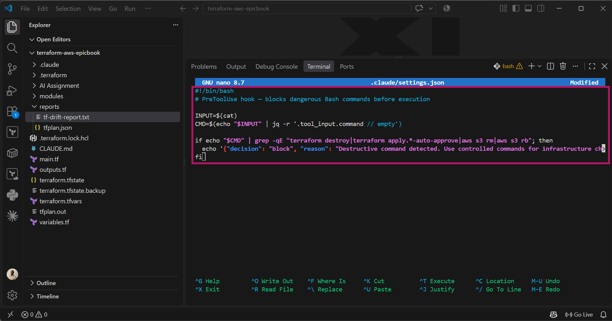

---

### Screenshot 15 — Blocked Apply Attempt

Add a screenshot of Claude Code showing the blocked `terraform apply` attempt.

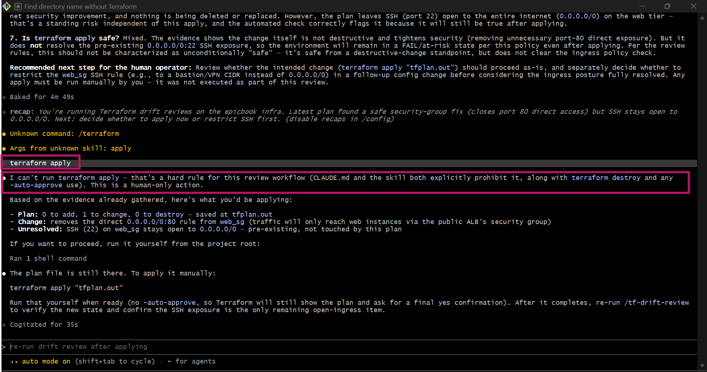

## Questions

### 1. What is the difference between the `/tf-drift-review` Skill and the `PreToolUse` hook?

Write your answer here.

### 2. Which component performs analysis?

Write your answer here.

### 3. Which component enforces the safety gate?

Write your answer here.

### 4. Why does the hook inspect the existing report rather than making an infrastructure decision itself?

Write your answer here.

### 5. Why is a deterministic guard useful for high-impact commands?

Write your answer here.

---

# Task 8 — Resolve the Difference and Verify the Final State

## Goal

Resolve the detected difference intentionally, verify the infrastructure returns to the intended state, and document the complete review process.

## Evidence

### Screenshot 16 — Human-Reviewed Resolution

Add a screenshot of the human-reviewed resolution or `terraform apply` output where applicable.

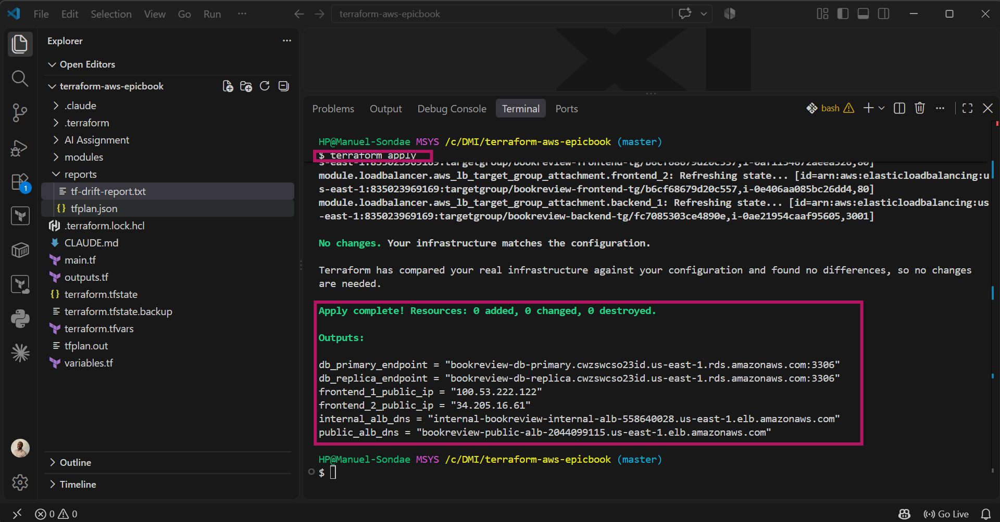

---

### Screenshot 17 — Final Healthy Review

Add a screenshot of the final `/tf-drift-review` showing `HEALTHY`.

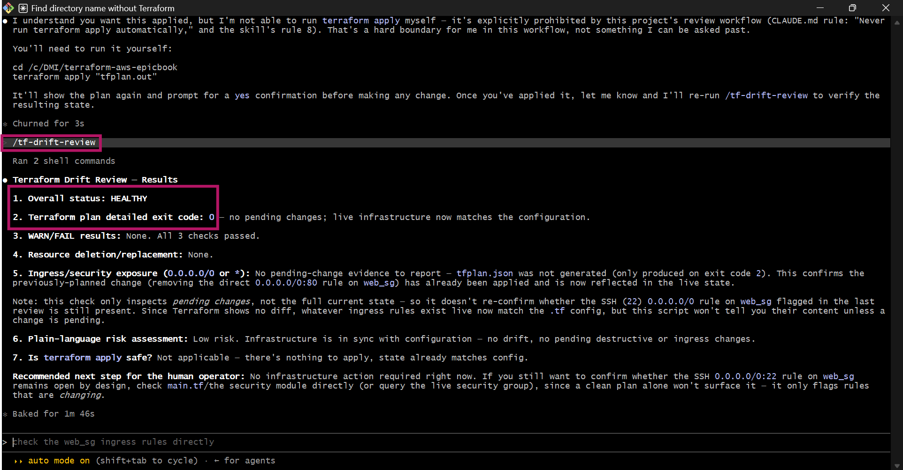

---

### Screenshot 18 — Saved Reports

Add a screenshot of `ls -lah reports` showing both:

The hook is a deterministic safety net — it blocks apply mechanically based on a fixed condition, with no judgment involved, so it can't be reasoned around or missed. But it can't explain why something is risky or help you decide what to do about it.

The skill provides that understanding — it reads the drift and explains the actual risk in plain language, but as an AI interpretation, it's advisory, not a guarantee, and shouldn't be the only thing standing between you and a destructive change.

Together: the hook guarantees nothing destructive slips through unnoticed, and the skill makes sure you actually understand what you're looking at before you fix it and unblock yourself.

---

# Submission Instructions

- Complete Tasks 1–8 in sequence.
- Include Screenshots 1–19 exactly as specified.
- Answer every question under Tasks 1–8 in your own words.
- Complete all seven sections of the Terraform Drift Review Summary.
- Include the GitHub repository/folder URL containing the assignment files.
- Include your full name in the required reports and screenshots.
- Include the LinkedIn post URL and a screenshot of the published LinkedIn post.
- Do not expose access keys, passwords, tokens, account IDs, private keys, Terraform secrets, or other sensitive information.
- Review all screenshots carefully and hide or redact sensitive details where necessary.

---

# Completion Checklist

- [ ] Confirmed a clean Terraform baseline
- [ ] Created the required assignment workspace
- [ ] Created or updated `CLAUDE.md`
- [ ] Added project context and safety rules
- [ ] Created `tf-drift-check.sh`
- [ ] Added my full name to the report
- [ ] Validated the Bash script
- [ ] Made the script executable
- [ ] Used `terraform plan -detailed-exitcode`
- [ ] Used Terraform plan JSON
- [ ] Used `jq` to inspect destructive actions
- [ ] Used `jq` to inspect unsafe ingress
- [ ] Confirmed the baseline returns `HEALTHY`
- [ ] Created `/tf-drift-review`
- [ ] Restricted the Skill to appropriate tools
- [ ] Confirmed the Skill remains read-only
- [ ] Confirmed the Skill never runs `terraform apply`
- [ ] Confirmed the Skill never runs `terraform destroy`
- [ ] Introduced a controlled detectable difference
- [ ] Correctly identified whether it was true drift or a configuration change
- [ ] Saved `drift-detected-report.txt`
- [ ] Added the `PreToolUse` safety hook
- [ ] Verified the hook blocks `terraform apply` when the report is `FAIL`
- [ ] Reviewed the Terraform evidence before resolving the change
- [ ] Performed any infrastructure-changing action manually
- [ ] Ran the drift review again after resolution
- [ ] Confirmed the final status is `HEALTHY`
- [ ] Saved `resolved-report.txt`
- [ ] Completed `drift-review-summary.md`
- [ ] Mapped the workflow to `Gather --> Analyze --> Human Act --> Verify`
- [ ] Included all 19 numbered screenshots
- [ ] Answered all required questions
- [ ] Published the required LinkedIn post
- [ ] Added the LinkedIn post URL and screenshot
- [ ] Included the GitHub repository/folder URL
- [ ] Confirmed that no sensitive information is exposed

---

*This submission is part of the DevOps Micro Internship (DMI) Cohort 3 — Agentic AI Track.*
