# Assignment 01 — Set Up a Team-Ready Ansible Development Workstation

Part of the DevOps Micro Internship (DMI) with Agentic AI

---

## Purpose

In this assignment, you will prepare an isolated and reusable Ansible development workstation.

You will install Ansible and supporting tools inside a Python virtual environment, configure VS Code, prepare SSH access, configure Git and pre-commit hooks, and document the complete setup.

This workstation will be used as the Ansible controller in upcoming assignments.

---

# Task 1 — Create and Initialize the Ansible Workspace

## Goal

Create the assignment workspace, initialize a Git repository, prepare the required directories, and add Git ignore rules for local and sensitive files.

### Evidence

#### Screenshot 1 — Terminal showing the `ansible-onboarding` path, `ls -la` output, and `git status` confirming the Git repository is on the `main` branch

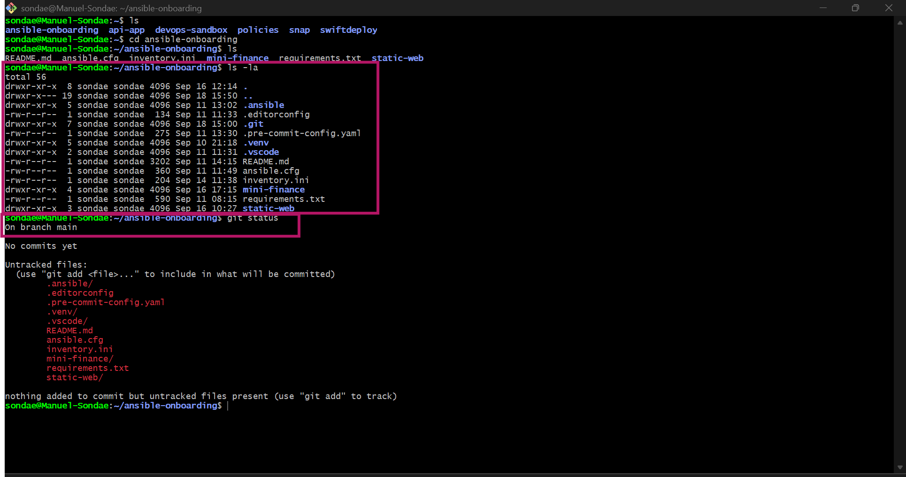

---

# Task 2 — Create the Virtual Environment and Install Ansible Tools

## Goal

Create an isolated Python virtual environment and install Ansible and the required validation tools without modifying the system Python environment.

### Evidence

#### Screenshot 2 — Terminal showing the active `(.venv)` environment, `which ansible`, `ansible --version`, `ansible-lint --version`, `yamllint --version`, and `pre-commit --version`

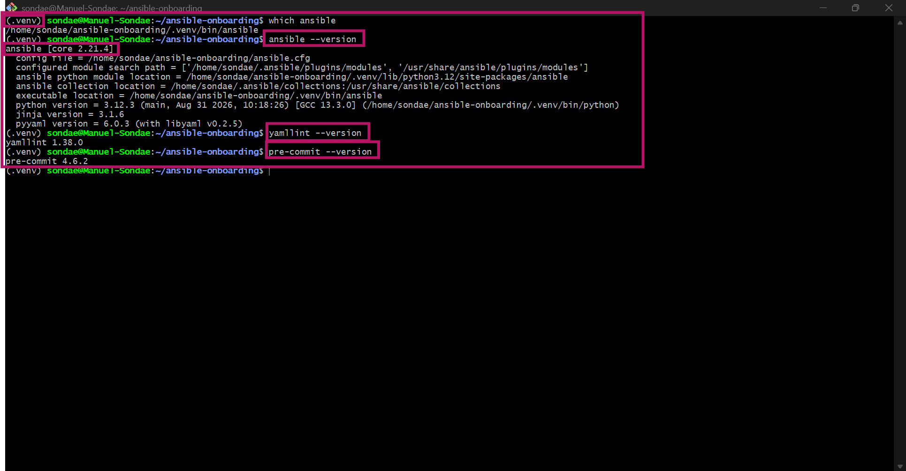

---

# Task 3 — Configure VS Code for Ansible Development

## Goal

Configure Visual Studio Code to use the project’s Python virtual environment and provide validation support for Python, YAML, and Ansible files.

### Evidence

#### Screenshot 3 — VS Code Extensions panel showing the Ansible, YAML, and Python extensions installed

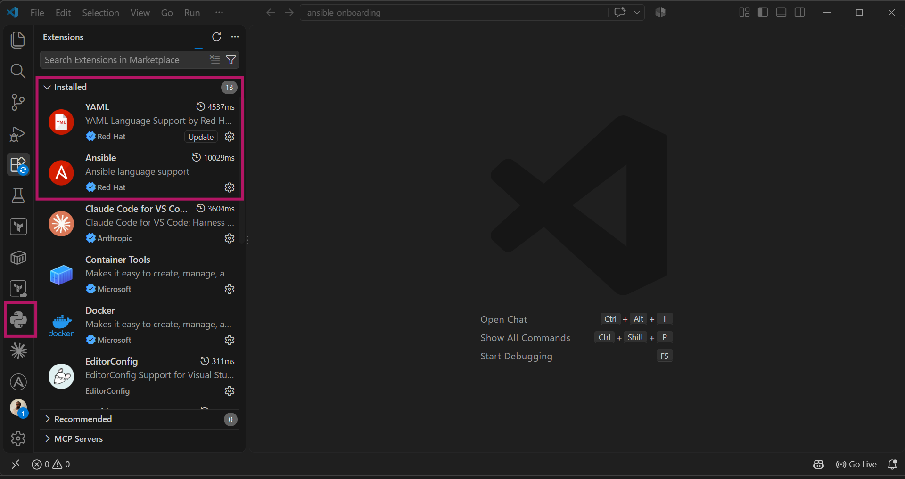

---

#### Screenshot 4 — VS Code showing `.vscode/settings.json` and `.editorconfig` open side by side, with the required settings clearly visible

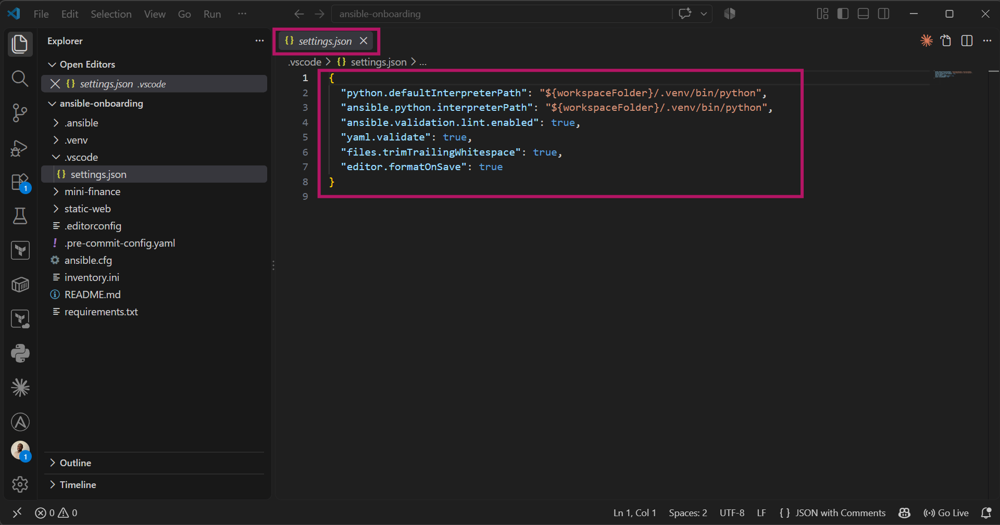
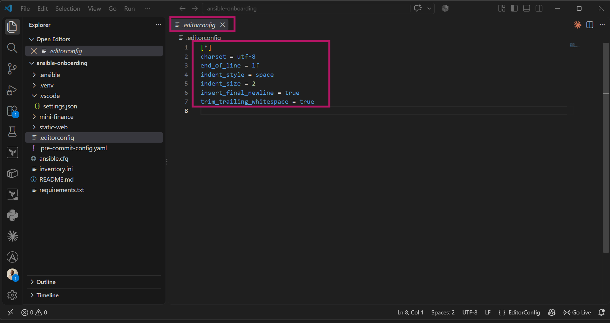
---

# Task 4 — Create the Baseline Ansible Configuration

## Goal

Create a reusable `ansible.cfg` file containing the default settings that will be used in this workspace and upcoming Ansible assignments.

### Evidence

#### Screenshot 5 — `ansible.cfg` open in VS Code or another editor, showing the complete configuration

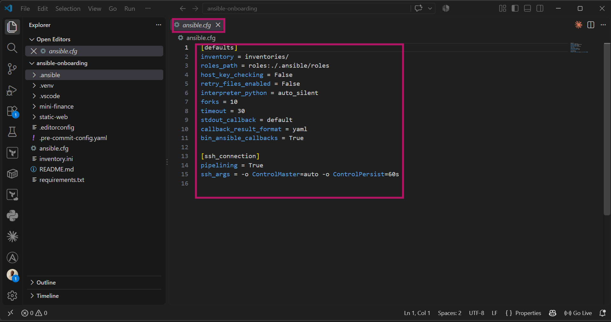

---

#### Screenshot 6 — Terminal showing `ansible --version` with the `ansible.cfg` path and the output of `ansible-config dump --only-changed`

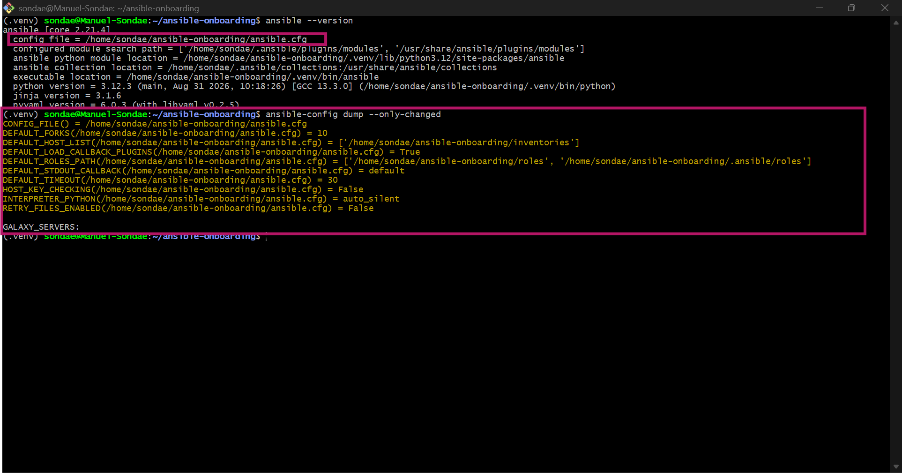

---

# Task 5 — Configure SSH Readiness

## Goal

Prepare SSH key authentication, load the key into the SSH agent, configure reusable SSH client settings, and understand how trusted host fingerprints are stored.

### Evidence

#### Screenshot 7 — Terminal showing `ssh-add -l` with the ED25519 key loaded and the SSH configuration verification output

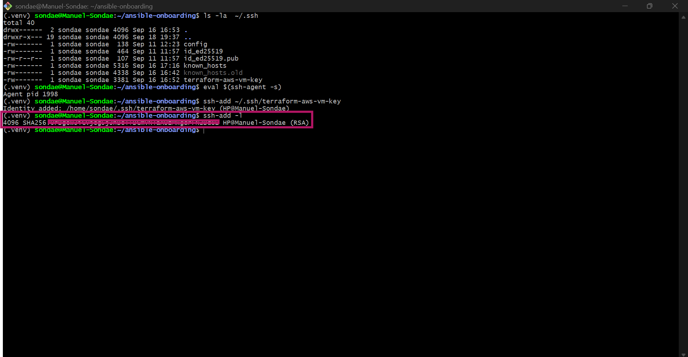

---

# Task 6 — Configure Git Identity and Pre-commit Hooks

## Goal

Configure your Git identity and install pre-commit hooks that validate YAML and Ansible files before commits are created.

### Evidence

#### Screenshot 8 — Terminal showing your Git full name, Git email, default branch, successful `pre-commit install` output, and `.git/hooks/pre-commit`

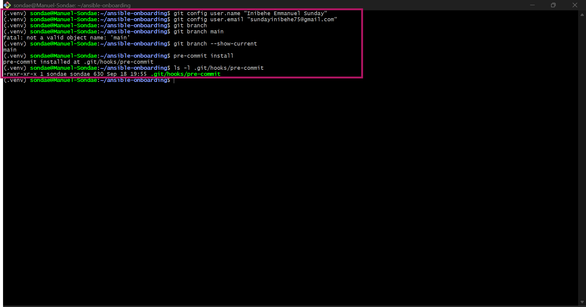

---

# Task 7 — Test the Complete Workstation Setup

## Goal

Verify that Ansible, the linting tools, Git hooks, SSH agent, and Git ignore rules are working correctly.

### Evidence

#### Screenshot 9 — Terminal showing `pre-commit run --all-files` completing successfully

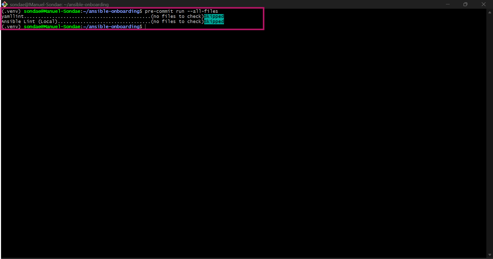

---

#### Screenshot 10 — Terminal showing `ansible --version` with the project configuration path and `ssh-add -l` with the ED25519 key loaded

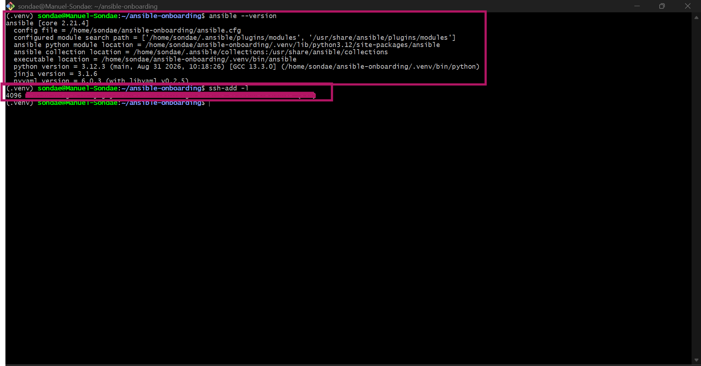

---

# Task 8 — Create the README and Onboarding Checklist

## Goal

Document the completed Ansible workstation setup and create a reusable checklist for preparing another workstation in the future.

### Evidence

#### Screenshot 11 — Terminal showing the final `ansible-onboarding` project structure

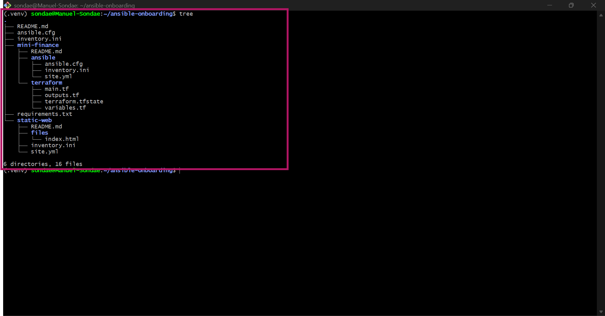

---

#### Screenshot 12 — VS Code Markdown preview showing your full name, project summary, and part of the “New Machine? Do This” checklist

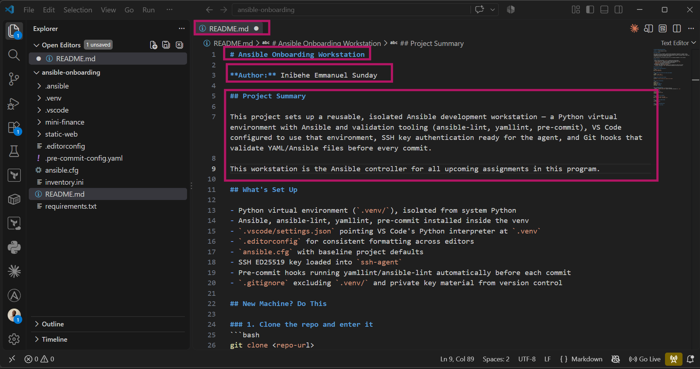
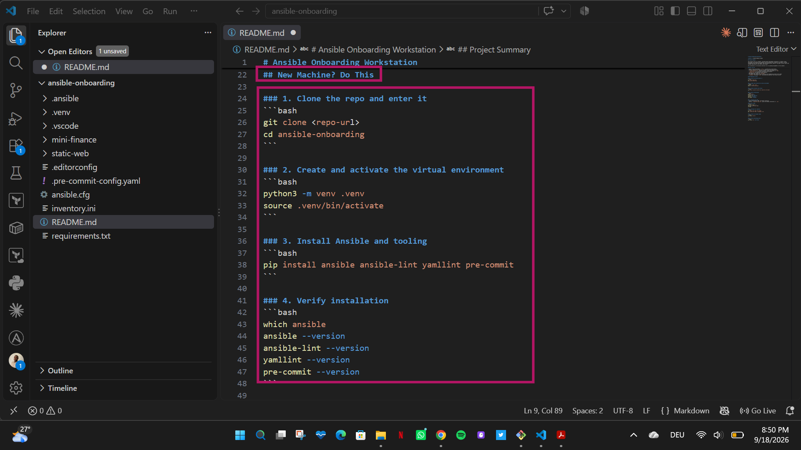
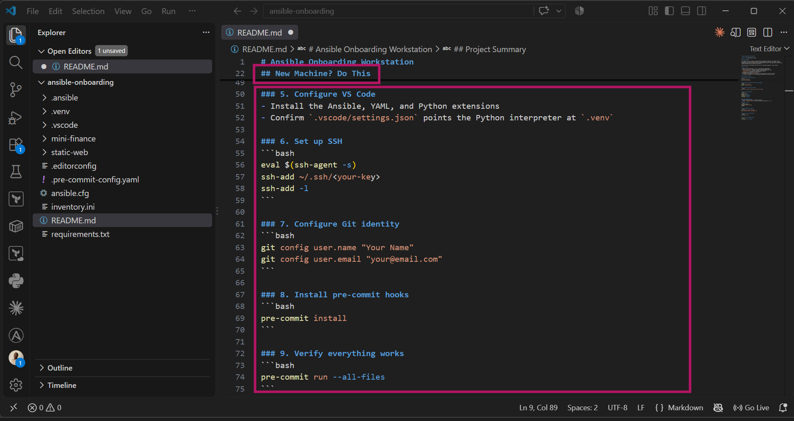

---

# Assignment Questions

Answer the following in your own words:

**1. What is one feature that makes your workstation setup team-friendly?**

The ansible.cfg, .editorconfig, and pre-commit hooks are all committed to the repo, so anyone who clones it gets the same linting rules, formatting settings, and Ansible defaults automatically — nobody has to configure their own environment by hand or guess at team conventions.

---

**2. What is one pitfall you avoided while completing the setup?**

I made sure .venv/ and my private SSH key were excluded via .gitignore before my first commit, rather than committing them and having to remove them afterward. Committing a virtual environment or private key even once means it stays in the Git history permanently unless you rewrite history to remove it.

---

**3. Why should Ansible be installed inside a Python virtual environment?**

A virtual environment isolates this project's Python packages from the system-wide Python installation, so Ansible and its dependencies here don't conflict with anything else on the machine, and other projects aren't affected by whatever versions this project needs.

---

**4. Why must SSH private keys and `.venv/` remain outside version control?**

A private key committed to Git is a real credential exposed to anyone with repo access — even removing it later doesn't fully protect you unless the history itself is rewritten. .venv/ is machine-specific and can be regenerated from requirements.txt/install commands, so committing it just bloats the repo with redundant, non-portable files instead of the actual source of truth.

---

# Required Files

Confirm that the following files are included in your assignment workspace:

- [ ] `README.md`
- [ ] `requirements.txt`
- [ ] `.gitignore`
- [ ] `.editorconfig`
- [ ] `.vscode/settings.json`
- [ ] `ansible.cfg`
- [ ] `.pre-commit-config.yaml`
- [ ] `inventories/`
- [ ] `roles/`

---

# Submission Instructions

- Add all required screenshots in your submission.
- Full Name must be visible in required screenshots.
- All screenshots must be readable.
- Answer all assignment questions clearly in your own words.
- Do not expose SSH private-key contents, passwords, access tokens, API keys, credentials, private certificates, or other sensitive information.

---

# Completion Checklist

- [ ] Task 1: `ansible-onboarding` workspace created
- [ ] Task 1: Git initialized on the `main` branch
- [ ] Task 1: `.gitignore` created
- [ ] Task 2: Python virtual environment created
- [ ] Task 2: Virtual environment activated
- [ ] Task 2: Ansible installed inside `.venv`
- [ ] Task 2: `ansible-lint`, `yamllint`, and `pre-commit` installed
- [ ] Task 2: `requirements.txt` created
- [ ] Task 3: Required VS Code extensions installed
- [ ] Task 3: VS Code uses the Python interpreter from `.venv`
- [ ] Task 3: `.vscode/settings.json` created
- [ ] Task 3: `.editorconfig` created
- [ ] Task 4: `ansible.cfg` created
- [ ] Task 4: Ansible loads `ansible.cfg` from the project directory
- [ ] Task 5: ED25519 SSH key exists
- [ ] Task 5: SSH private key has not been exposed
- [ ] Task 5: SSH key loaded into the SSH agent
- [ ] Task 5: `~/.ssh/config` contains the required settings
- [ ] Task 5: `~/.ssh/known_hosts` exists
- [ ] Task 6: Git identity configured correctly
- [ ] Task 6: Pre-commit hooks installed
- [ ] Task 7: `pre-commit run --all-files` completes successfully
- [ ] Task 8: `README.md` contains your full name and workstation details
- [ ] Task 8: “New Machine? Do This” checklist contains 10–12 items
- [ ] All 12 required screenshots are included
- [ ] Assignment questions are answered
- [ ] No sensitive information is exposed

---

## About DMI & CloudAdvisory

DevOps Micro Internship (DMI) is a project-based DevOps program run by Pravin Mishra and The CloudAdvisory, focused on real-world execution, systems thinking, and career readiness.

It helps learners build strong DevOps foundations with hands-on experience.

---

## Resources

- DMI Official Website: [https://dmi.pravinmishra.com?utm_source=github&utm_medium=readme](https://dmi.pravinmishra.com?utm_source=github&utm_medium=readme)
- University: [https://university.pravinmishra.com?utm_source=github&utm_medium=readme](https://university.pravinmishra.com?utm_source=github&utm_medium=readme)
- Discord Community: [https://discord.pravinmishra.com?utm_source=github&utm_medium=readme](https://discord.pravinmishra.com?utm_source=github&utm_medium=readme)
- Blog: [https://dmi.pravinmishra.com/blog?utm_source=github&utm_medium=readme](https://dmi.pravinmishra.com/blog?utm_source=github&utm_medium=readme)
- YouTube Playlist: [https://www.youtube.com/playlist?list=PLFeSNDtI4Cho](https://www.youtube.com/playlist?list=PLFeSNDtI4Cho)
- Pravin Mishra LinkedIn: [https://www.linkedin.com/in/pravin-mishra-aws-trainer/](https://www.linkedin.com/in/pravin-mishra-aws-trainer/)
- CloudAdvisory LinkedIn: [https://www.linkedin.com/company/thecloudadvisory/](https://www.linkedin.com/company/thecloudadvisory/)

---

*This submission is part of DevOps Micro Internship (DMI) — Agentic AI Track.*