# Assignment 02 — Provision Linux VMs with Terraform and Run Ansible Ad-Hoc Commands

Part of the DevOps Micro Internship (DMI) with Agentic AI

---

## Purpose

In this assignment, you will use Terraform to provision three or four Ubuntu Linux Virtual Machines on either Microsoft Azure or Amazon Web Services.

You will configure SSH key-based authentication, organize the servers using a custom Ansible inventory, and run Ansible ad-hoc commands across individual hosts and inventory groups.

---

# Task 1 — Create the Multi-Host Lab Structure

## Goal

Create a separate project directory for the multi-host lab and prepare the Terraform, Ansible, and documentation files.

This project will use the Git repository and Ansible controller prepared in Assignment 01.

### Evidence

#### Screenshot 1 — Terminal showing the complete `ansible-adhoc-lab` project structure

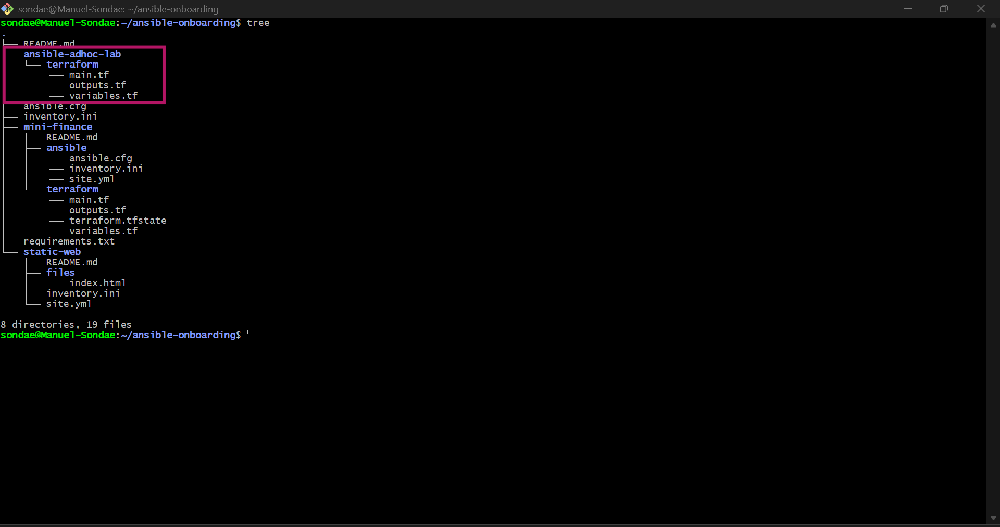

---

#### Screenshot 2 — Terminal showing `git status --short` with the new project files and updated `.gitignore`

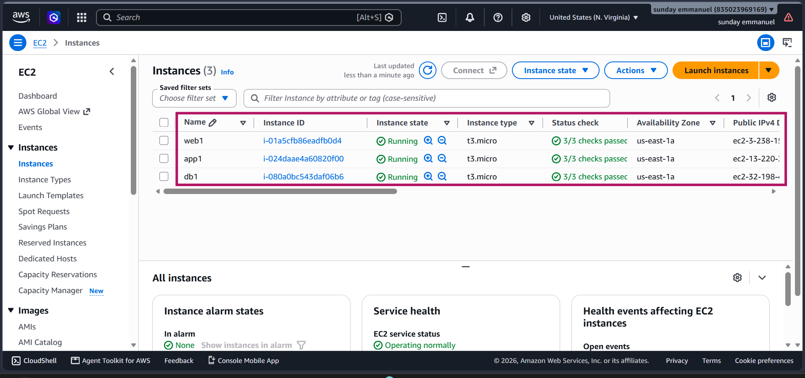

---

### Notes

Reused the Ansible controller and Git repository from Assignment 01, creating ansible-adhoc-lab/ as a new project subfolder rather than a separate repo — kept infrastructure, venv, and config shared across all projects while keeping each project's own inventory/config isolated.

---

# Task 2 — Create the Terraform Configuration

## Goal

Create the Terraform configuration required to provision three or four Ubuntu Linux VMs on your selected cloud platform.

Complete only one option:

- Option A — Microsoft Azure
- Option B — Amazon Web Services

Do not configure both providers for this assignment.

### Evidence

#### Screenshot 3 — Terraform configuration showing the three or four server roles and the `for_each` or `count` implementation

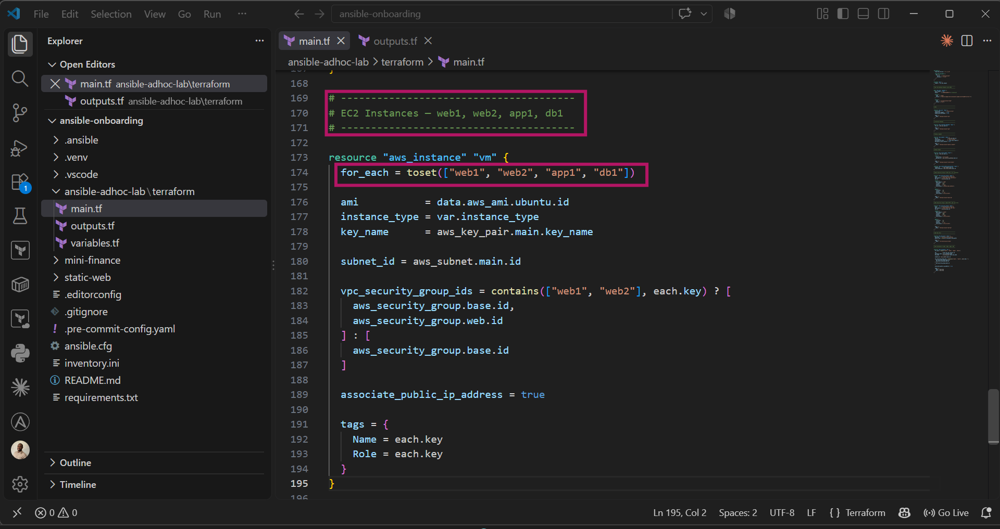

---

#### Screenshot 4 — Terraform configuration showing SSH restricted to the controller IP and HTTP allowed only for web hosts

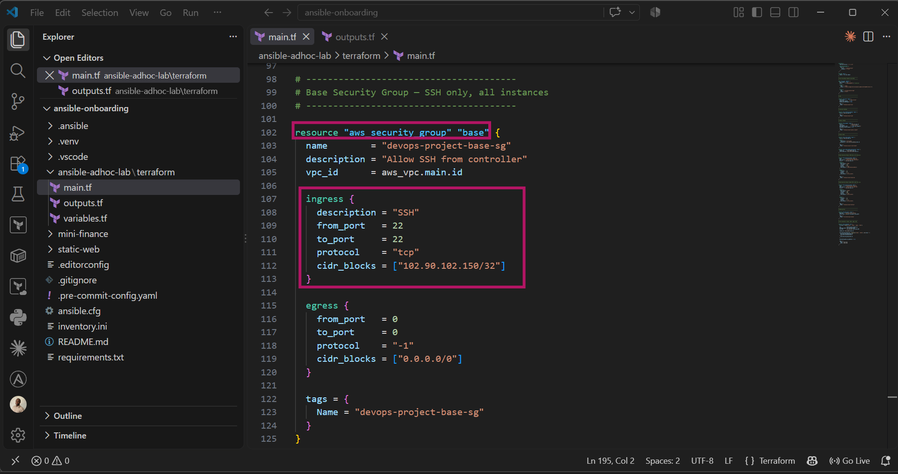
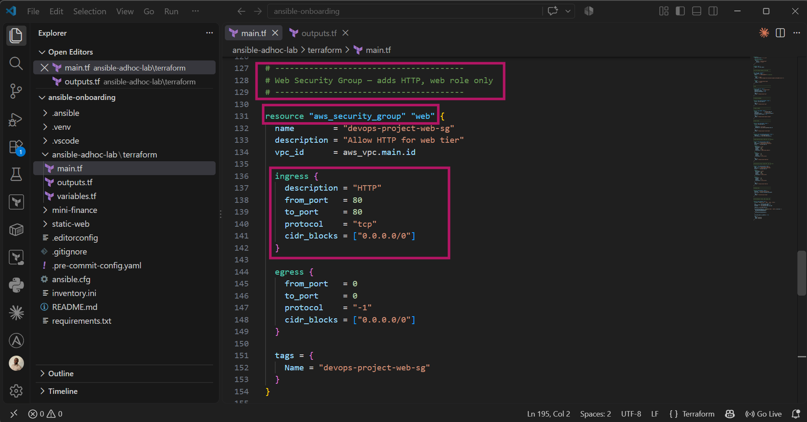

---

#### Screenshot 5 — Terraform output configuration showing how public IP addresses are associated with the server roles

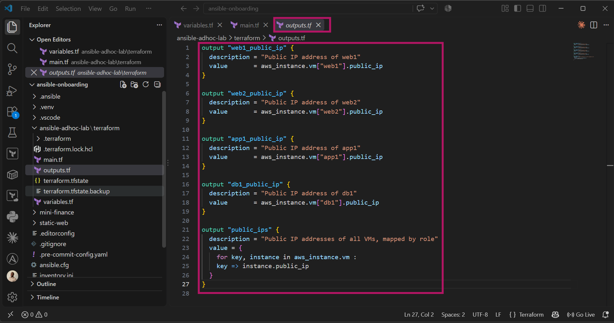

---

### Notes

Split into a base SG (SSH only, scoped to my controller IP) and a web SG (adds HTTP, open to the internet) — web instances get both, app/db only get base. All four VMs have public IPs since SSH needs to reach them directly from my local controller, no bastion involved; isolation is enforced by the SG rules, not by hiding the IP. Scaled to 4 instances by adding web2 and switching the SG conditional to contains() instead of a single equality check.

---

# Task 3 — Provision the Infrastructure with Terraform

## Goal

Initialize and validate the Terraform configuration, review the execution plan, provision the selected three or four VMs, and retrieve their public IP addresses.

### Evidence

#### Screenshot 6 — Final `terraform apply` output showing `Apply complete`

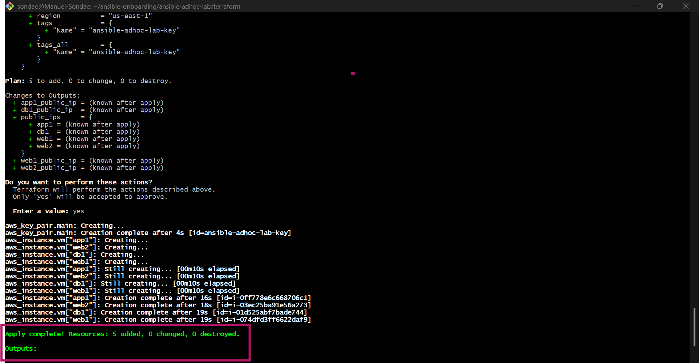

---

#### Screenshot 7 — `terraform output public_ips` showing the role-to-IP mapping for all three or four VMs

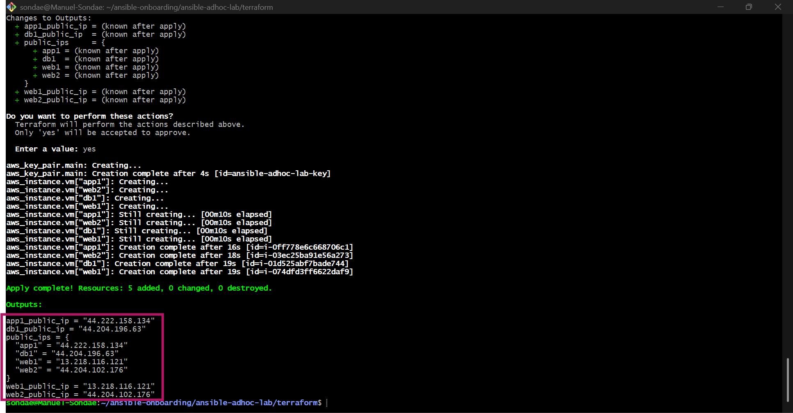

---

#### Screenshot 8 — Azure Portal or AWS Management Console showing all three or four VMs in the `Running` state, with their role-based names visible

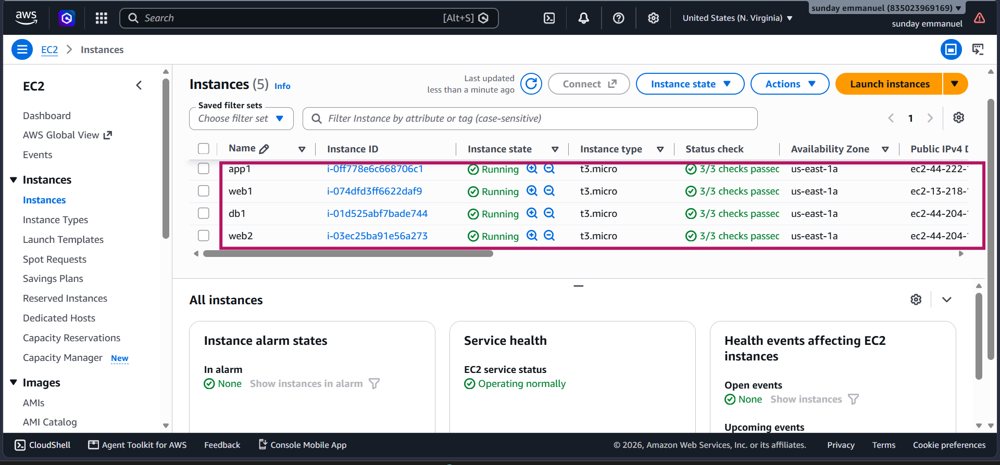

---

### Notes

terraform apply initially failed with a duplicate key pair error — terraform-aws-vm-key was already registered in my AWS account from an earlier project. Fixed by giving this project's key pair a distinct name (ansible-adhoc-lab-key) and pointing it at a fresh key generated natively in WSL, rather than reusing the old Windows-side key across projects — avoids the same naming collision happening again on future projects

---

# Task 4 — Verify SSH Key-Based Access

## Goal

Verify that each managed VM can be accessed from the Ansible controller using SSH key-based authentication.

### Evidence

#### Screenshot 9 — Terminal showing successful SSH hostname output from all VMs

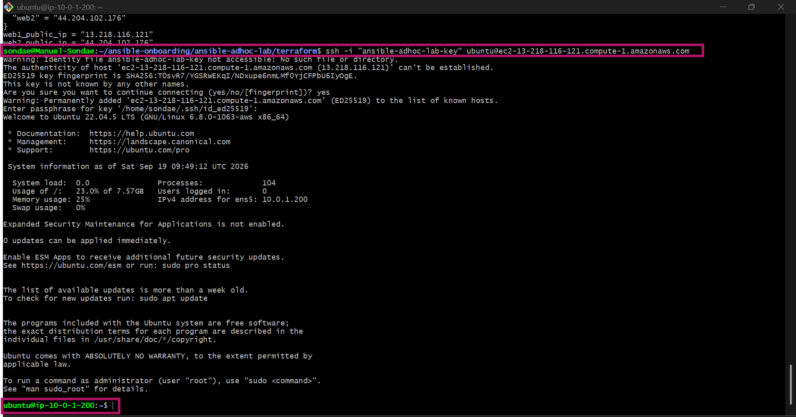
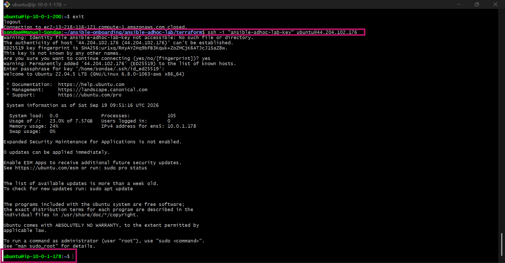
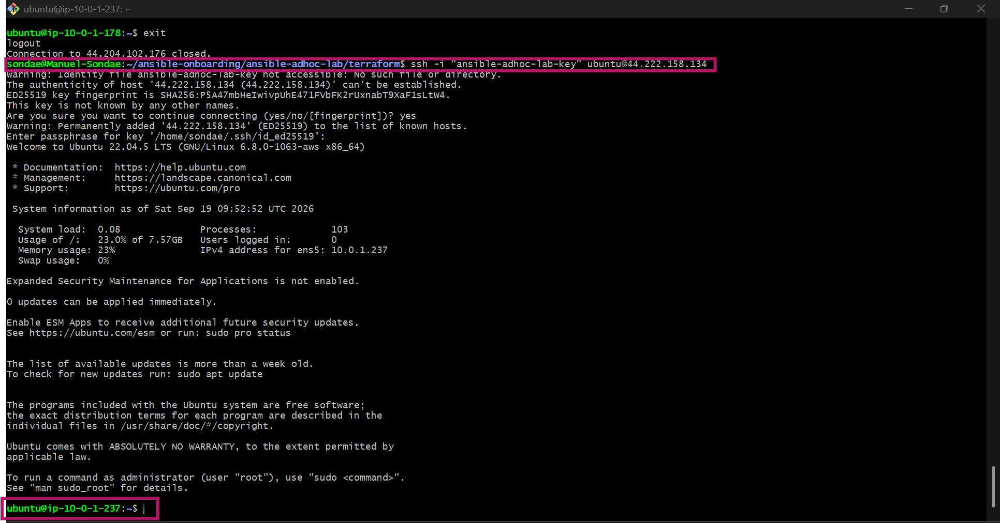
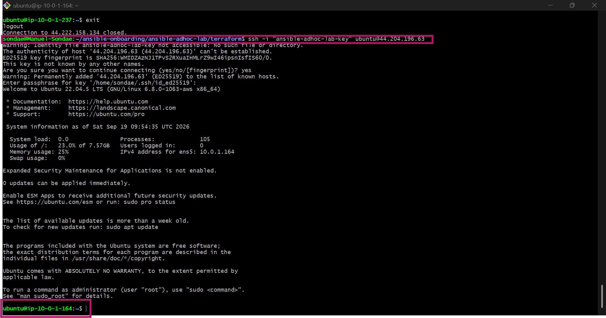

---

### Notes

Verified SSH key-based access to all four VMs from the controller using the ED25519 key generated natively in WSL — no password prompts, confirming the key pair Terraform registered matches what's loaded in the local ssh-agent. Since app1 and db1 have public IPs but their security group only permits SSH from my controller's specific IP, this also confirmed the SG restriction is correctly scoped — access works from my machine but wouldn't from anywhere else.

---

# Task 5 — Create the Custom Ansible Inventory

## Goal

Create an Ansible inventory file that groups the managed VMs by role.

The inventory allows Ansible to run commands against all servers, or only specific groups such as `web`, `app`, or `db`.

### Evidence

#### Screenshot 10 — `inventory.ini` showing the `web`, `app`, and `db` groups

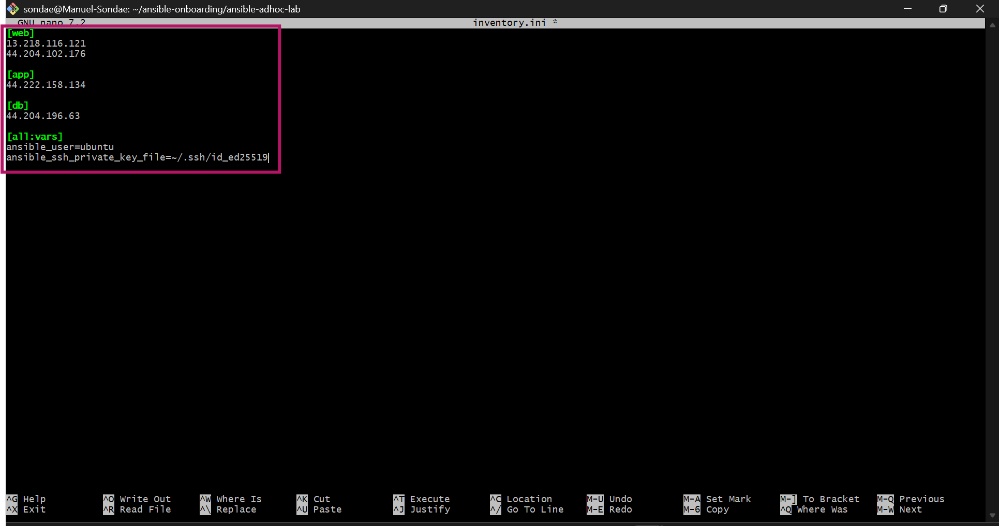

---

#### Screenshot 11 — Output of `ansible-inventory -i inventory.ini --graph`

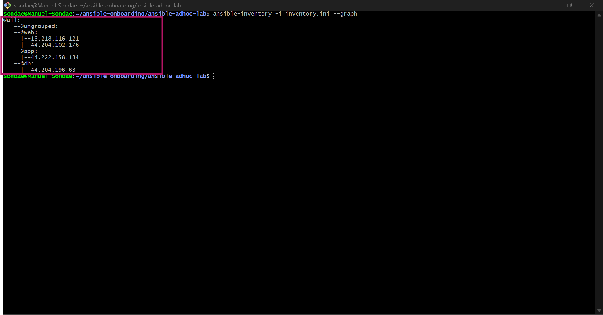

---

### Notes

Grouped the inventory by role (web, app, db) matching the Terraform output's role-based naming, with shared connection settings (user, private key) set once under [all:vars] rather than repeated per host or group. Initially had ProxyJump configured on the app/db groups, assuming they'd need a bastion hop — removed it once I confirmed all four VMs have direct public IPs and SSH access, since ProxyJump is only needed when a host has no public IP at all.

---

# Task 6 — Run Ansible Ad-Hoc Commands

## Goal

Run Ansible ad-hoc commands from the controller to verify connectivity, check server information, and manage packages and services across inventory groups.

This task proves that the inventory is working and that Ansible can control multiple managed VMs without writing a playbook.

### Evidence

#### Screenshot 12 — Output of `ansible all -i inventory.ini -m ping`

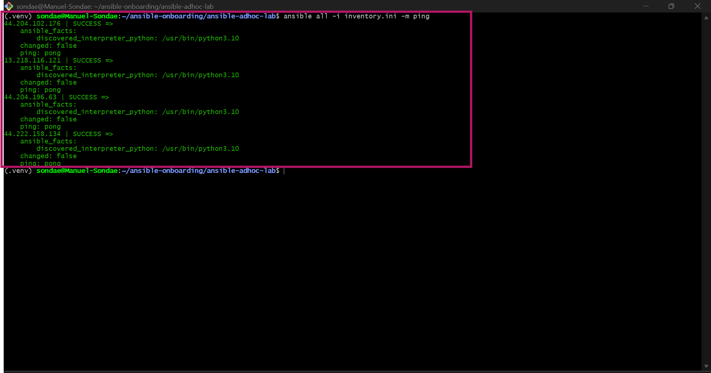

---

#### Screenshot 13 — Output of `ansible all -i inventory.ini -m command -a "uptime"`

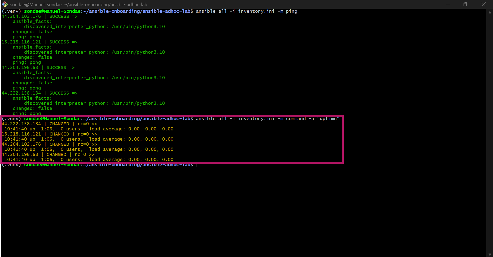

---

#### Screenshot 14 — Output of `ansible web -i inventory.ini -m apt -a "name=nginx state=present update_cache=yes" --become`

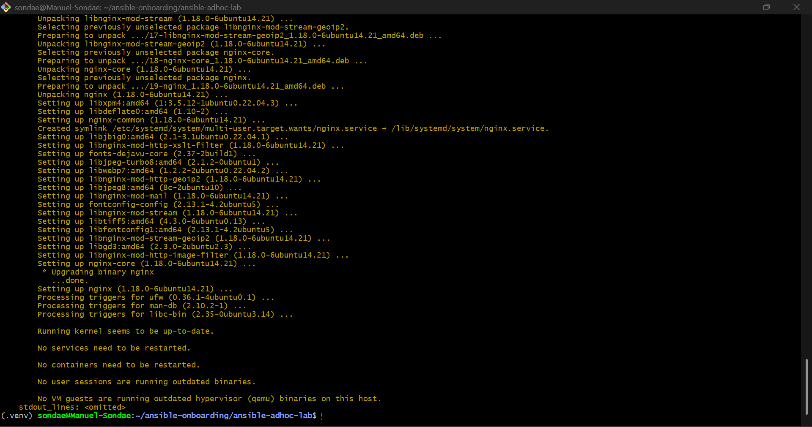

---

#### Screenshot 15 — Output of `ansible web -i inventory.ini -m service -a "name=nginx state=started enabled=yes" --become`

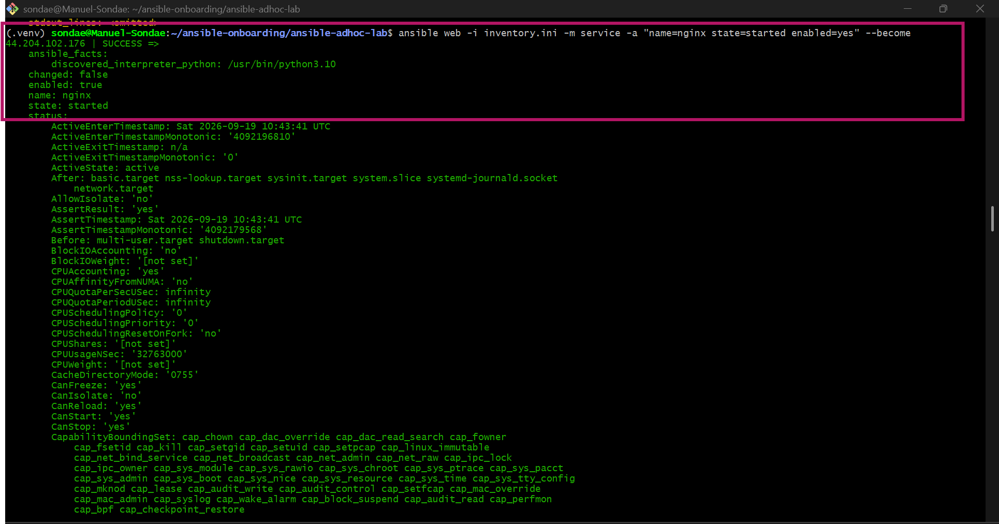

---

#### Screenshot 16 — Output of `ansible all -i inventory.ini -m apt -a "name=htop state=present update_cache=yes" --become`

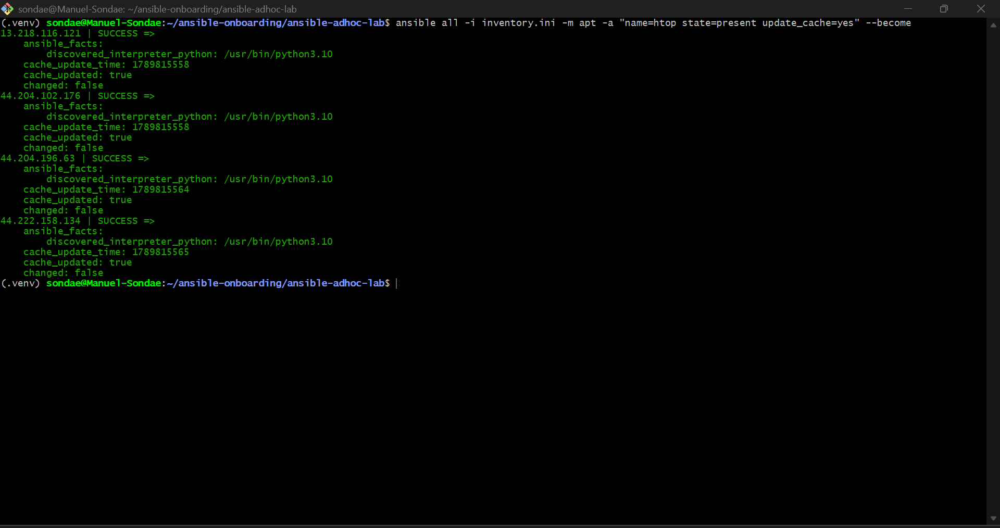

---

#### Screenshot 17 — Output of `ansible web -i inventory.ini -m command -a "systemctl is-active nginx"`

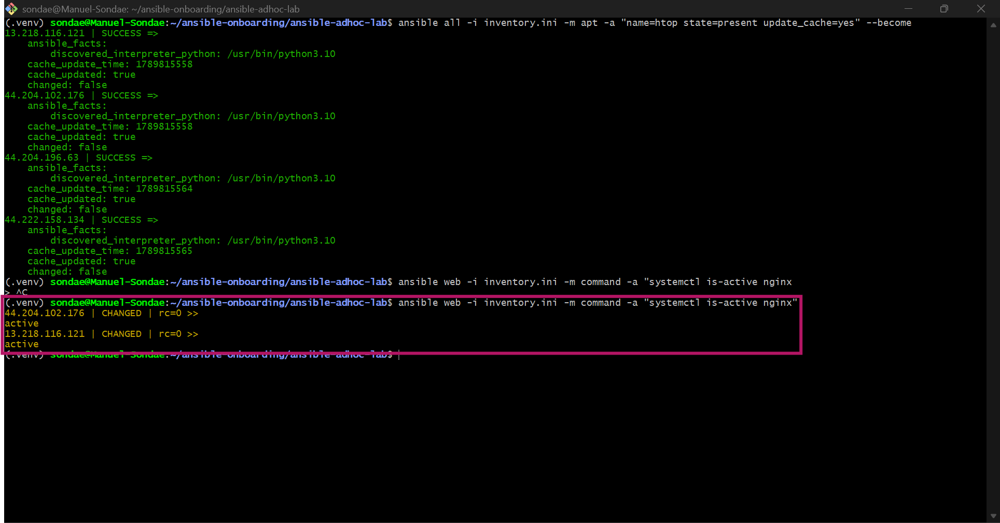

---

### Notes

Initial ping failed across all hosts with Permission denied (publickey), even though a direct manual SSH connection worked fine — turned out my key has a passphrase, and Ansible has no way to supply it interactively the way a manual SSH session does. Fixed by loading the key into ssh-agent once (ssh-add) before running any Ansible commands, so the unlocked key stays available in memory for the rest of the session without needing the passphrase again. host_key_checking = False in ansible.cfg wasn't the cause here, but still correctly handles a separate concern — accepting new host fingerprints non-interactively.

---

# LinkedIn Post Required

## Evidence

#### LinkedIn Post URL

Paste your LinkedIn post URL here:

https://www.linkedin.com/posts/emmanuel-sunday-210a08323_dmibypravinmishra-aws-terraform-activity-7507039934034395136-KFQT?utm_source=share&utm_medium=member_desktop&rcm=ACoAAFHXXywBq0IrgBBhbi5ULmCrDuZgCEYc6fQ

---

#### Screenshot — Published LinkedIn post

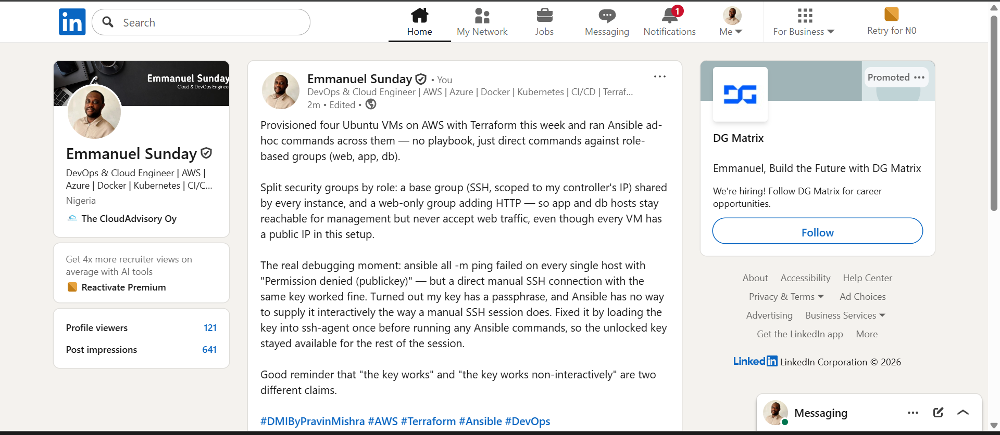

---

# Assignment Questions

Answer the following in your own words:

**1. What is the purpose of an Ansible inventory file?**

It tells Ansible which machines exist and how to reach them, and lets you organize them into groups so commands can target all hosts at once or just a specific subset.

---

**2. What is the difference between the `web`, `app`, and `db` groups in your inventory?**

They separate hosts by role rather than just listing every IP together — web holds the two web-tier instances, app the application-tier instance, and db the database instance — so an ad-hoc command can be scoped to exactly the tier it's meant for, like installing Nginx only on web rather than every host.

---

**3. What does the Ansible `ping` module verify?**

That Ansible can actually connect to and authenticate against the host — it doesn't test network reachability like ICMP ping, it confirms SSH access and that Python is available on the remote machine for Ansible to run modules at all.

---

**4. Why do package installation commands require `--become`?**

Installing packages needs root privileges, and the ubuntu user connects over SSH without them by default — --become tells Ansible to escalate to sudo for that specific task, the same way you'd type sudo apt install manually.

---

**5. When would you use an ad-hoc command instead of a playbook?**

For a one-off, immediate action — checking uptime, installing a single package, restarting a service — where writing and saving a whole playbook would be overkill for something you're not going to repeat or need to track as reusable automation.

---

**6. What is one challenge you faced while setting up SSH or inventory, and how did you fix it?**

ping failed on every host with Permission denied (publickey), even though a direct manual SSH connection worked. My key has a passphrase, and Ansible couldn't supply it non-interactively. Fixed it by loading the key into ssh-agent with ssh-add before running Ansible, so the unlocked key stayed available in memory for the rest of the session.

---

# Required Files

Confirm that the following files are included in your assignment workspace:

- [ ] `ansible-adhoc-lab/README.md`
- [ ] `ansible-adhoc-lab/terraform/providers.tf`
- [ ] `ansible-adhoc-lab/terraform/main.tf`
- [ ] `ansible-adhoc-lab/terraform/variables.tf`
- [ ] `ansible-adhoc-lab/terraform/outputs.tf`
- [ ] `ansible-adhoc-lab/ansible/inventory.ini`
- [ ] Updated `.gitignore`

---

# Submission Instructions

- Add all required screenshots from the tasks.
- Full Name must be visible in required screenshots.
- Mention whether you used Azure or AWS.
- Mention whether you used the three-VM option or four-VM option.
- Add the public IP addresses of the VMs, redacted if preferred.
- Add your `inventory.ini` proof.
- Add a short explanation of what you learned.
- Answer all assignment questions clearly in your own words.
- Add your LinkedIn post URL.
- Do not expose SSH private keys, Terraform state files, cloud credentials, passwords, access keys, secret keys, account IDs, or subscription IDs.

---

# Completion Checklist

- [ ] Task 1: `ansible-adhoc-lab` project structure created
- [ ] Task 1: `.gitignore` updated for Terraform files
- [ ] Task 2: Terraform configuration created
- [ ] Task 2: Server roles defined for either three or four VMs
- [ ] Task 2: `count` or `for_each` used
- [ ] Task 2: SSH restricted to the controller public IP
- [ ] Task 2: HTTP allowed only for web hosts
- [ ] Task 2: Terraform output maps roles to public IPs
- [ ] Task 3: Terraform initialized successfully
- [ ] Task 3: Terraform configuration validated
- [ ] Task 3: Terraform apply completed successfully
- [ ] Task 3: All selected VMs are running
- [ ] Task 4: SSH key-based access works for every VM
- [ ] Task 5: `inventory.ini` contains `web`, `app`, and `db` groups
- [ ] Task 5: `ansible-inventory -i inventory.ini --graph` shows the correct groups
- [ ] Task 6: `ansible all -i inventory.ini -m ping` returns `SUCCESS`
- [ ] Task 6: Ad-hoc commands run successfully
- [ ] Task 6: `--become` was used for package and service tasks
- [ ] Task 6: Nginx is active on the `web` group
- [ ] Screenshots 1–17 are included
- [ ] Assignment questions are answered
- [ ] LinkedIn post published
- [ ] LinkedIn post URL added
- [ ] No sensitive information is exposed

---

## About DMI & CloudAdvisory

DevOps Micro Internship (DMI) is a project-based DevOps program run by Pravin Mishra and The CloudAdvisory, focused on real-world execution, systems thinking, and career readiness.

It helps learners build strong DevOps foundations with hands-on experience.

---

## Resources

- DMI Official Website: [https://dmi.pravinmishra.com?utm_source=github&utm_medium=readme](https://dmi.pravinmishra.com?utm_source=github&utm_medium=readme)
- University: [https://university.pravinmishra.com?utm_source=github&utm_medium=readme](https://university.pravinmishra.com?utm_source=github&utm_medium=readme)
- Discord Community: [https://discord.pravinmishra.com?utm_source=github&utm_medium=readme](https://discord.pravinmishra.com?utm_source=github&utm_medium=readme)
- Blog: [https://dmi.pravinmishra.com/blog?utm_source=github&utm_medium=readme](https://dmi.pravinmishra.com/blog?utm_source=github&utm_medium=readme)
- YouTube Playlist: [https://www.youtube.com/playlist?list=PLFeSNDtI4Cho](https://www.youtube.com/playlist?list=PLFeSNDtI4Cho)
- Pravin Mishra LinkedIn: [https://www.linkedin.com/in/pravin-mishra-aws-trainer/](https://www.linkedin.com/in/pravin-mishra-aws-trainer/)
- CloudAdvisory LinkedIn: [https://www.linkedin.com/company/thecloudadvisory/](https://www.linkedin.com/company/thecloudadvisory/)

---

*This submission is part of DevOps Micro Internship (DMI) — Agentic AI Track.*