# Assignment 03 — Deploy a Static Website to Multiple Servers Using a Multi-Play Ansible Playbook

Part of the DevOps Micro Internship (DMI) with Agentic AI

---

## Student Details

**Full Name:** Inibehe Emmanuel Sunday 

**Cloud Platform Used:** AWS / Azure  

**Server 1 URL:** http://44.199.201.138 

**Server 2 URL:** http://44.192.61.126

---

## Purpose

In this assignment, you will create a multi-play Ansible playbook to install Nginx, deploy a static website to two Ubuntu servers, and verify that the website is accessible from both servers.

You may use either AWS EC2 instances or Azure Virtual Machines as your managed servers.

---

# Task 1 — Create the Project Structure

## Goal

Create the required folders and files for the Ansible project.

## Evidence

### Screenshot 1 — Terminal or VS Code showing the complete `static-web` project structure

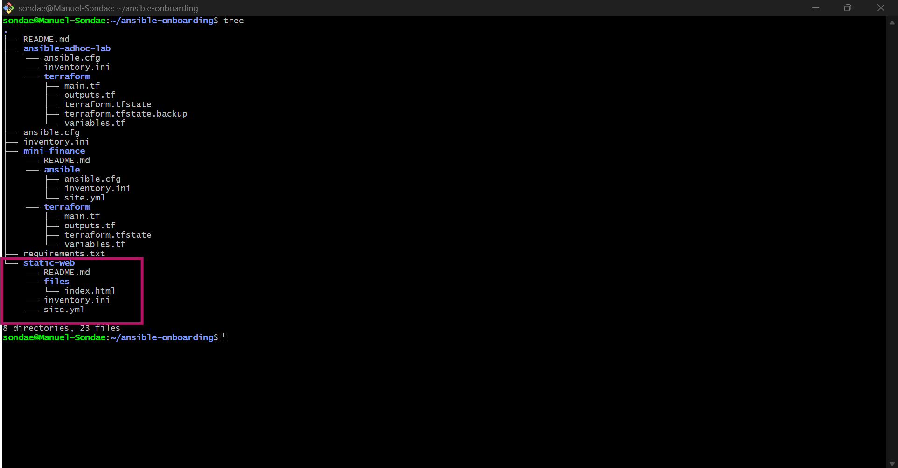

---

# Task 2 — Configure the Ansible Inventory

## Goal

Add both Ubuntu servers to the Ansible inventory.

## Evidence

### Screenshot 2 — Output of `ansible-inventory -i inventory.ini --graph` showing `web1` and `web2`

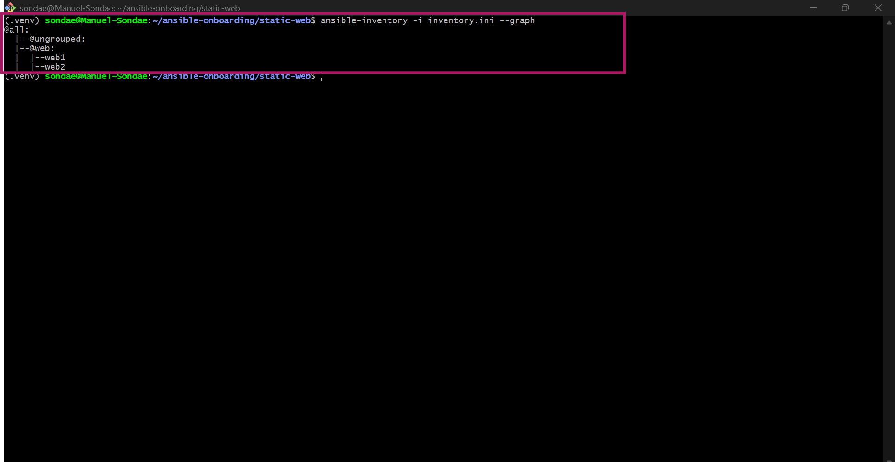

---

## Configuration File

Copy and paste the complete contents of your `inventory.ini` file below:

```ini
[web]
web1 ansible_host=44.199.201.138
web2 ansible_host=44.192.131.132

[all:vars]
ansible_user=ubuntu
ansible_ssh_private_key_file=~/.ssh/terraform-aws-vm-key
```

---

# Task 3 — Verify Ansible Connectivity

## Goal

Confirm that the Ansible controller can connect to both servers.

## Evidence

### Screenshot 3 — Ansible ping output showing `SUCCESS` and `pong` for both servers

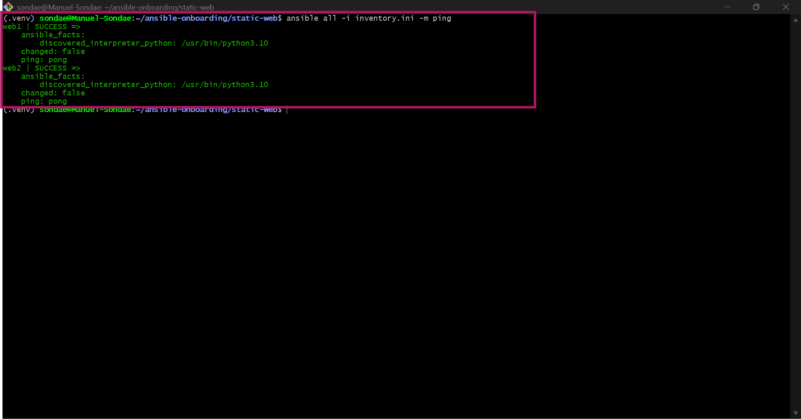

---

# Task 4 — Download and Personalize the Static Website

## Goal

Download `index.html` to the Ansible controller and personalize the website with your full name.

## Evidence

### Screenshot 4 — Edited `files/index.html` showing the footer line with your full name

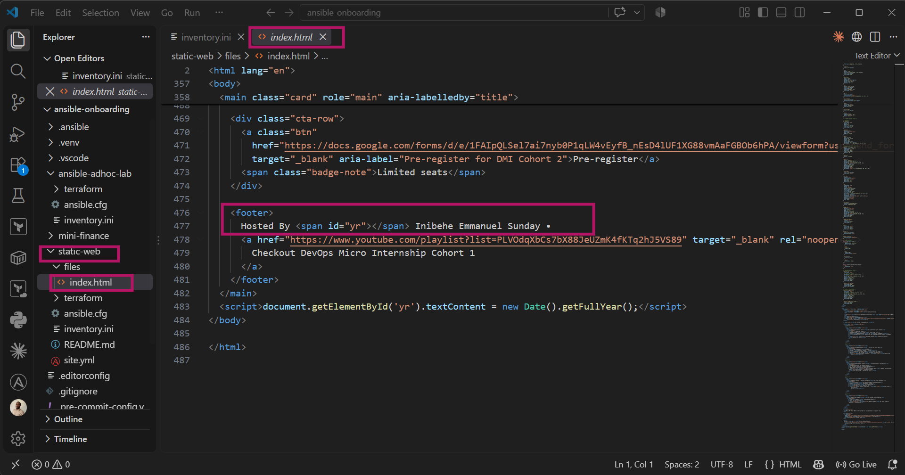

---

# Task 5 — Create the Multi-Play Ansible Playbook

## Goal

Create a single Ansible playbook containing separate plays for installation, deployment, and verification.

## Configuration File

Copy and paste the complete contents of your `site.yml` file below:

```yaml
- name: Install and configure Nginx
  hosts: web
  become: true
  tasks:
    - name: Update the APT package cache
      ansible.builtin.apt:
        update_cache: true

    - name: Install Nginx
      ansible.builtin.apt:
        name: nginx
        state: present

    - name: Start and enable Nginx
      ansible.builtin.service:
        name: nginx
        state: started
        enabled: true

- name: Deploy the static website
  hosts: web
  become: true
  handlers:
    - name: Reload nginx
      ansible.builtin.service:
        name: nginx
        state: reloaded

  tasks:
    - name: Deploy personalized index.html to web root
      ansible.builtin.copy:
        src: files/index.html
        dest: /var/www/html/index.html
        owner: www-data
        group: www-data
        mode: '0644'
      notify: Reload nginx

- name: Verify the deployment from the controller
  hosts: localhost
  connection: local
  gather_facts: false
  tasks:
    - name: Send HTTP request to each web server
      ansible.builtin.uri:
        url: "http://{{ hostvars[item]['ansible_host'] }}"
        status_code: 200
        return_content: no
      register: webpage
      loop: "{{ groups['web'] }}"

    - name: Assert that every website returned HTTP 200
      ansible.builtin.assert:
        that:
          - item.status == 200
        fail_msg: "Website returned status {{ item.status }} instead of 200"
        success_msg: "Website returned HTTP 200 OK"
      loop: "{{ webpage.results }}"
```

---

# Task 6 — Validate the Playbook Syntax

## Goal

Check the playbook for YAML or Ansible syntax errors before running it.

## Evidence

### Screenshot 5 — Successful syntax-check output showing `playbook: site.yml`

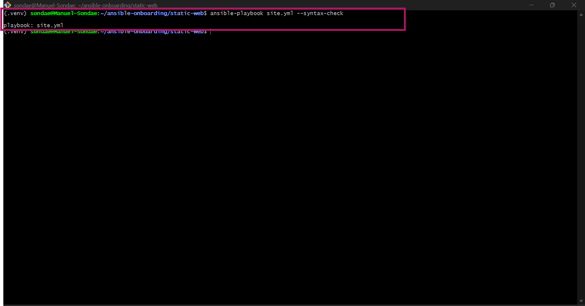

---

# Task 7 — Run the Multi-Play Playbook

## Goal

Install Nginx, deploy the website, and verify both servers in one playbook run.

## Evidence

### Screenshot 6 — Play 3 verification showing HTTP `200` for both servers

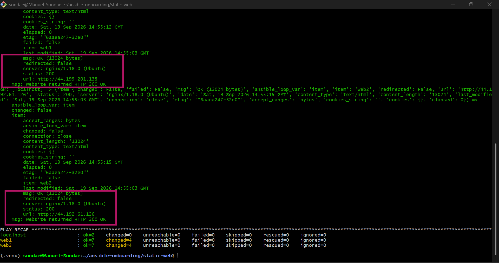

---

### Screenshot 7 — Final play recap showing `unreachable=0` and `failed=0` for `web1`, `web2`, and `localhost`

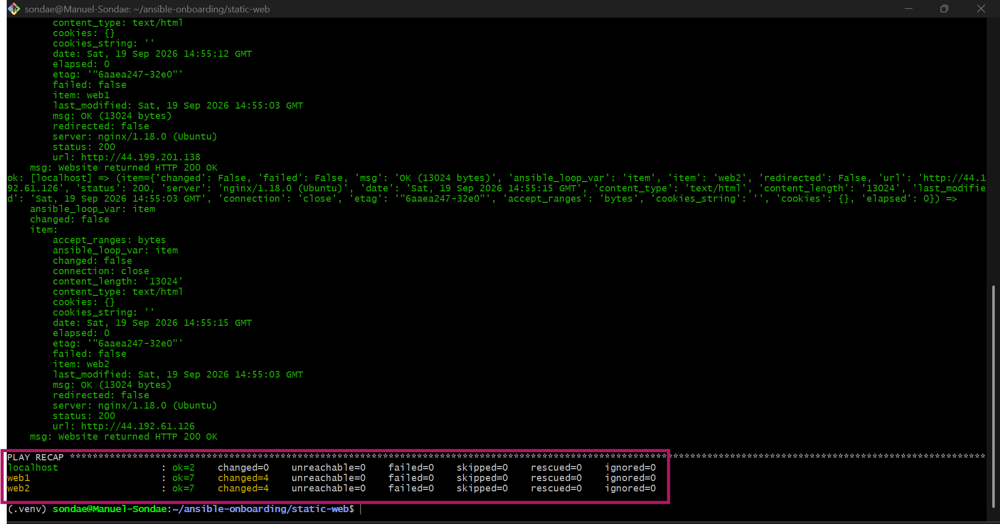

---

# Task 8 — Verify Idempotency

## Goal

Run the playbook again and confirm that it does not make unnecessary changes.

## Evidence

### Screenshot 8 — Second playbook run showing the play recap with `changed=0`, `unreachable=0`, and `failed=0` for both web servers

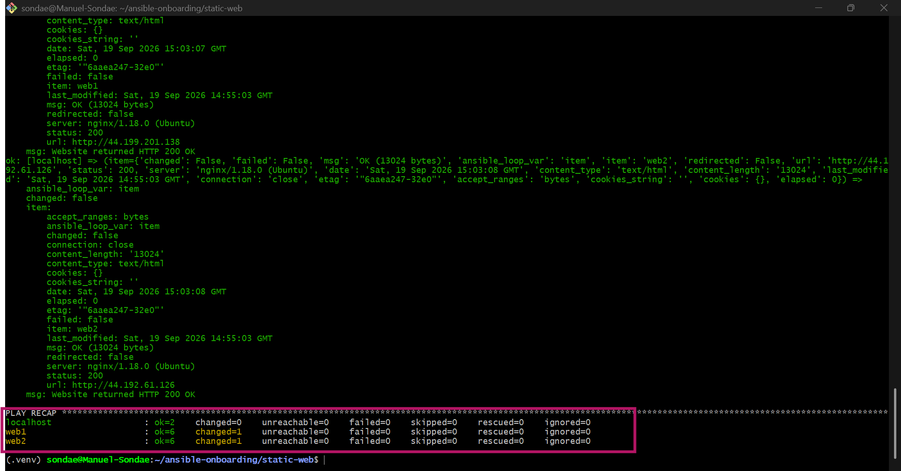

---

# Task 9 — Test Both Websites Manually

## Goal

Confirm that the static website is accessible from both public IP addresses.

## Evidence

### Screenshot 9 — `curl -I` output showing HTTP `200 OK` from both servers

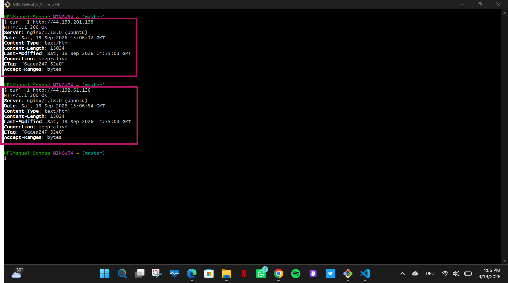

---

### Screenshot 10 — Browser showing the website from Server 1 with the public IP and your full name visible

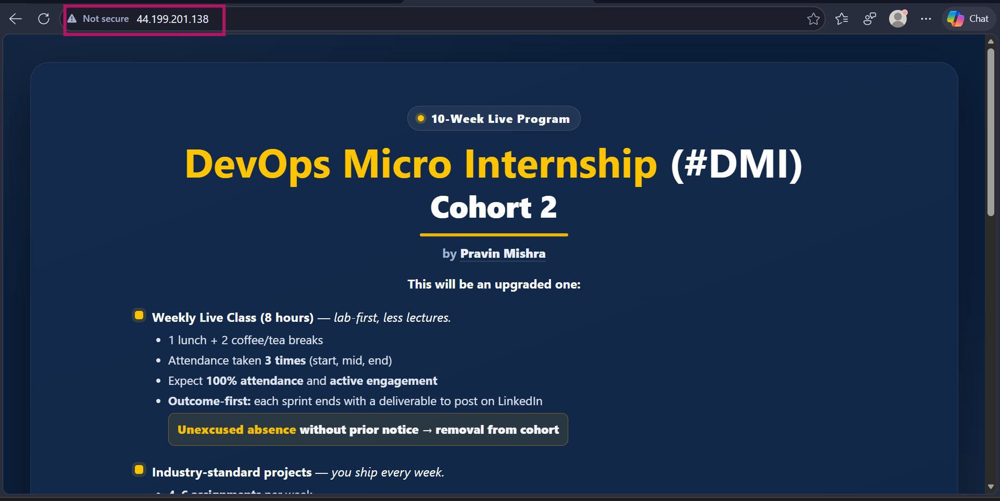
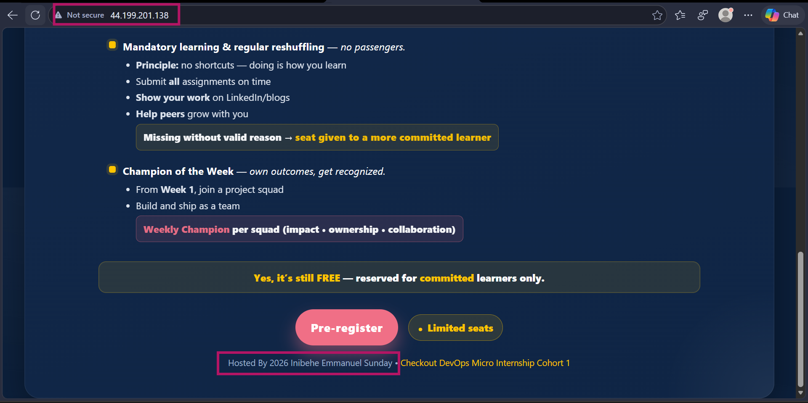

---

### Screenshot 11 — Browser showing the website from Server 2 with the public IP and your full name visible

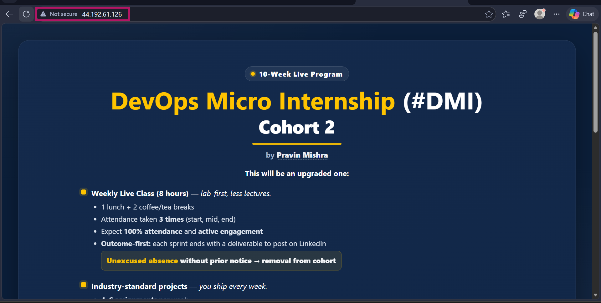
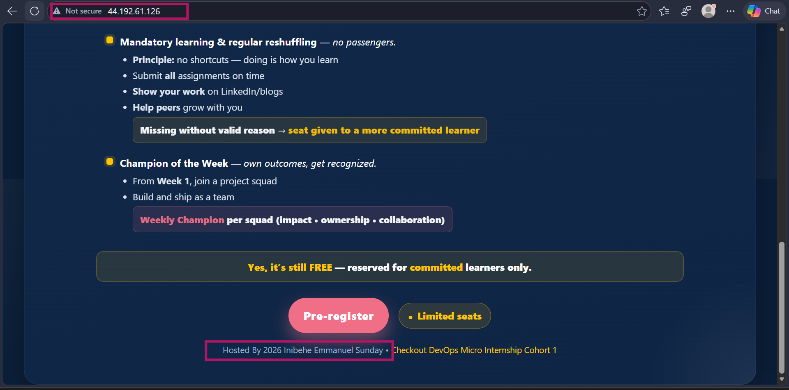

---

## Website URLs

Add both deployed website URLs below:


Server 1: http://44.199.201.138
Server 2: http://44.192.61.126


---

# Task 10 — Complete the Project README

## Goal

Document how the project works and record what you learned.

## README Content

Copy and paste the complete contents of your `README.md` file below:


**Author:** Inibehe Emmanuel Sunday

**Cloud Platform:** AWS

**Server 1:** http://44.199.201.138

**Server 2:** http://44.192.61.126

## What This Project Does

Deploys a personalized static website to two Ubuntu servers using a single multi-play Ansible playbook — Nginx installation, file deployment, and HTTP verification, each as a separate play targeting the appropriate hosts.

## Project Structure

## Project Structure

```
static-web/
├── ansible.cfg
├── inventory.ini
├── site.yml
├── files/
│   └── index.html
└── README.md
```


## How It Works

**Play 1 — Install and configure Nginx** (`hosts: web`)
Updates the APT cache, installs Nginx, and ensures the service is started and enabled on both servers.

**Play 2 — Deploy the static website** (`hosts: web`)
Copies the personalized `index.html` from the controller directly to `/var/www/html/` on each server using the `copy` module, then triggers a handler to reload Nginx only when the file actually changes.

**Play 3 — Verify the deployment** (`hosts: localhost`)
Sends an HTTP request to each server in the `web` group and asserts that every response returns status 200 — proving the site is actually live and reachable, not just that the files were copied.

## Key Design Decisions

- **`copy` instead of `git clone`**: since this is a single static file rather than a full application, copying it directly from the controller is simpler, doesn't require Git on the managed servers, and doesn't depend on the servers having outbound internet access.
- **Verification loops over the `web` group** rather than checking a single host, so both servers are genuinely confirmed independently rather than assuming they're in sync.

## What I Learned

- Running `--syntax-check` without an explicit inventory can silently fall back to an implicit localhost-only inventory if `ansible.cfg`'s default inventory path is misconfigured — worth always confirming the inventory is actually being read correctly before trusting a clean syntax-check result.
- Verifying only `groups['web'][0]` in a play checks just the first host in a group — looping over the full group is necessary to actually confirm every server, not just one.
- Idempotency isn't just a theoretical property — rerunning the playbook a second time with no underlying changes should report `changed=0` across the board, proving each task correctly detects when nothing actually needs to happen.

## Running This Project


source ../.venv/bin/activate

ansible-playbook -i inventory.ini site.yml --syntax-check

ansible-playbook -i inventory.ini site.yml


---

# LinkedIn Post Required

## Evidence

### LinkedIn Post URL

Paste your LinkedIn post URL here:

https://www.linkedin.com/posts/emmanuel-sunday-210a08323_dmibypravinmishra-aws-terraform-activity-7507105072053616643-yxu7?utm_source=share&utm_medium=member_desktop&rcm=ACoAAFHXXywBq0IrgBBhbi5ULmCrDuZgCEYc6fQ

---

### Screenshot — Published LinkedIn post

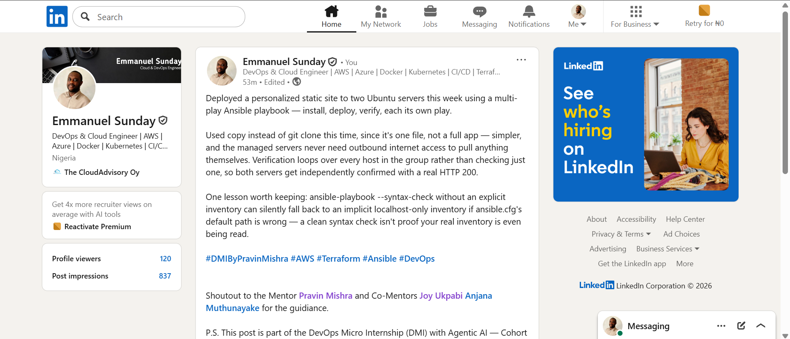

---

# Assignment Questions

Answer the following in your own words:

**1. What issue did you face while completing this assignment, and how did you fix it?**

ansible-playbook --syntax-check came back with warnings about an unparseable inventory and fell back to an implicit localhost-only inventory. Traced it to ansible.cfg's inventory = setting pointing at a nonexistent inventories path instead of my actual inventory.ini file. Fixed by correcting the path in ansible.cfg, which also meant I no longer needed to pass -i inventory.ini explicitly on every command.

---

**2. What did you learn from this assignment?**

That a clean syntax check doesn't guarantee the real inventory is actually being read — mine passed with warnings I almost missed, and it was quietly falling back to localhost only. Also learned that verifying a group properly means looping over every host in it; checking just the first one misses whatever's different about the rest.

---

**3. Why is it useful to split installation, deployment, and verification into separate plays?**

Each play has a single, clear responsibility, so a failure is easy to isolate — if verification fails, I know immediately it's not an install or deploy problem. It also means each play can target a different host group, like running verification from the controller (localhost) while installation and deployment run on the actual web servers.

---

**4. What is one benefit of using the Ansible `copy` module instead of cloning the website directly from Git on every managed server?**

The managed servers never need outbound internet access or Git installed at all — the file travels directly from the controller, which already has it. For a single static file, that's simpler and removes a dependency the servers would otherwise need just to receive one file.

---

**5. What does idempotency mean in this assignment?**

Running the playbook a second time with nothing actually changed should report changed=0 across every task — Ansible checks the current state before acting, so it only makes a change when one is genuinely needed, rather than blindly reapplying every task every time.

---

**6. What does the Ansible `uri` module verify in Play 3?**

That each server actually responds to an HTTP request with status 200 — proving the site is live and reachable over the network, not just that the files were successfully copied onto disk.

---

# Required Files

Confirm that the following files are included in your assignment folder:

- [ ] `inventory.ini`
- [ ] `site.yml`
- [ ] `files/index.html`
- [ ] `README.md`

---

# Submission Instructions

- Add all required screenshots in the correct order.
- Full Name must be visible in required screenshots.
- Include both deployed website URLs.
- Paste `inventory.ini`, `site.yml`, and `README.md` as editable text.
- Answer all assignment questions clearly in your own words.
- Add your LinkedIn post URL.
- Do not expose SSH private keys, passwords, cloud account IDs, or other sensitive information.

---

# Completion Checklist

- [ ] Task 1: `static-web` folder structure is complete
- [ ] Task 2: Both servers are listed under the `[web]` group in `inventory.ini`
- [ ] Task 2: Inventory graph shows `web1` and `web2`
- [ ] Task 3: Ansible ping returns `SUCCESS` and `pong` for both servers
- [ ] Task 4: `files/index.html` contains your full name
- [ ] Task 5: `site.yml` contains three separate plays
- [ ] Task 5: Play 1 installs, starts, and enables Nginx
- [ ] Task 5: Play 2 deploys `index.html` using the `copy` module
- [ ] Task 5: Nginx reload handler is included
- [ ] Task 5: Play 3 verifies both web servers from the controller
- [ ] Task 6: Playbook syntax check passes
- [ ] Task 7: First playbook run completes with `unreachable=0` and `failed=0`
- [ ] Task 7: URI verification returns HTTP `200` for both servers
- [ ] Task 8: Second playbook run demonstrates idempotency
- [ ] Task 8: Second run shows `changed=0` for both web servers
- [ ] Task 9: Both `curl -I` commands return HTTP `200 OK`
- [ ] Task 9: Website loads from Server 1
- [ ] Task 9: Website loads from Server 2
- [ ] Task 9: Full name is visible on both deployed websites
- [ ] Task 10: `README.md` contains all required explanations
- [ ] Screenshots 1–11 are included
- [ ] `inventory.ini`, `site.yml`, and `README.md` are pasted as editable text
- [ ] Both website URLs are included
- [ ] Assignment questions are answered
- [ ] LinkedIn post published
- [ ] LinkedIn post URL added
- [ ] No sensitive information is exposed

---

## About DMI & CloudAdvisory

DevOps Micro Internship (DMI) is a project-based DevOps program run by Pravin Mishra and The CloudAdvisory, focused on real-world execution, systems thinking, and career readiness.

It helps learners build strong DevOps foundations with hands-on experience.

---

## Resources

- DMI Official Website: [https://dmi.pravinmishra.com?utm_source=github&utm_medium=readme](https://dmi.pravinmishra.com?utm_source=github&utm_medium=readme)
- University: [https://university.pravinmishra.com?utm_source=github&utm_medium=readme](https://university.pravinmishra.com?utm_source=github&utm_medium=readme)
- Discord Community: [https://discord.pravinmishra.com?utm_source=github&utm_medium=readme](https://discord.pravinmishra.com?utm_source=github&utm_medium=readme)
- Blog: [https://dmi.pravinmishra.com/blog?utm_source=github&utm_medium=readme](https://dmi.pravinmishra.com/blog?utm_source=github&utm_medium=readme)
- YouTube Playlist: [https://www.youtube.com/playlist?list=PLFeSNDtI4Cho](https://www.youtube.com/playlist?list=PLFeSNDtI4Cho)
- Pravin Mishra LinkedIn: [https://www.linkedin.com/in/pravin-mishra-aws-trainer/](https://www.linkedin.com/in/pravin-mishra-aws-trainer/)
- CloudAdvisory LinkedIn: [https://www.linkedin.com/company/thecloudadvisory/](https://www.linkedin.com/company/thecloudadvisory/)

---

*This submission is part of DevOps Micro Internship (DMI) — Agentic AI Track.*