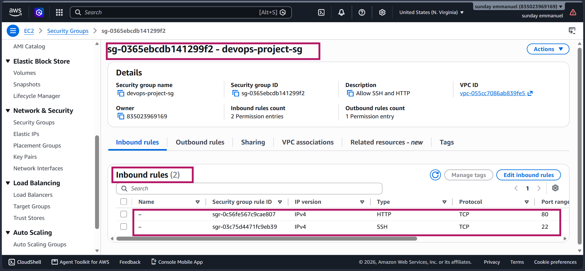
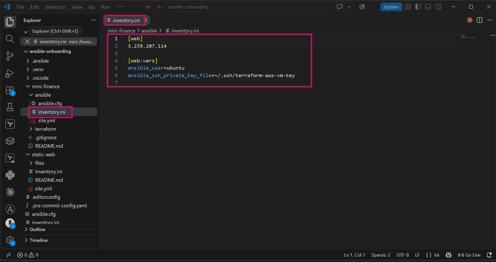
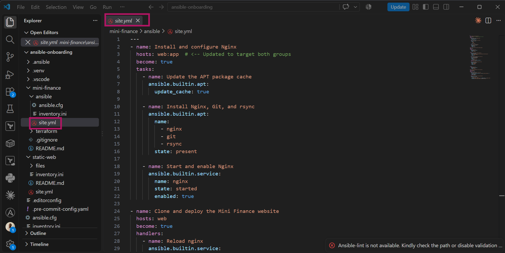
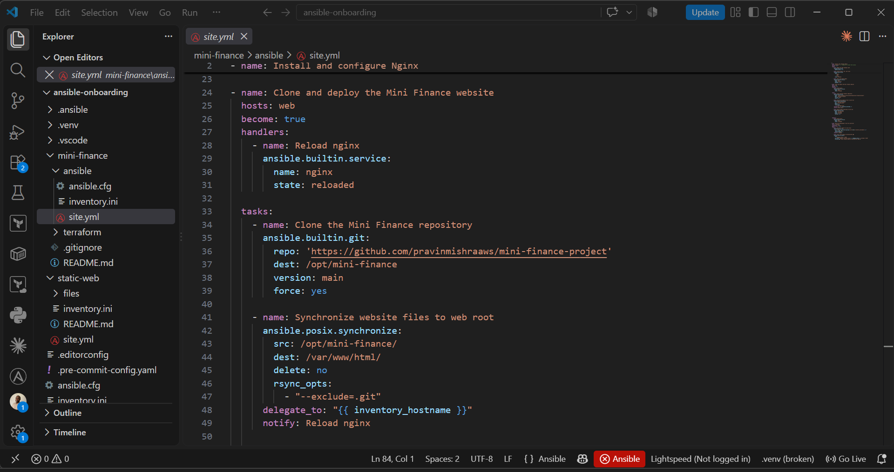
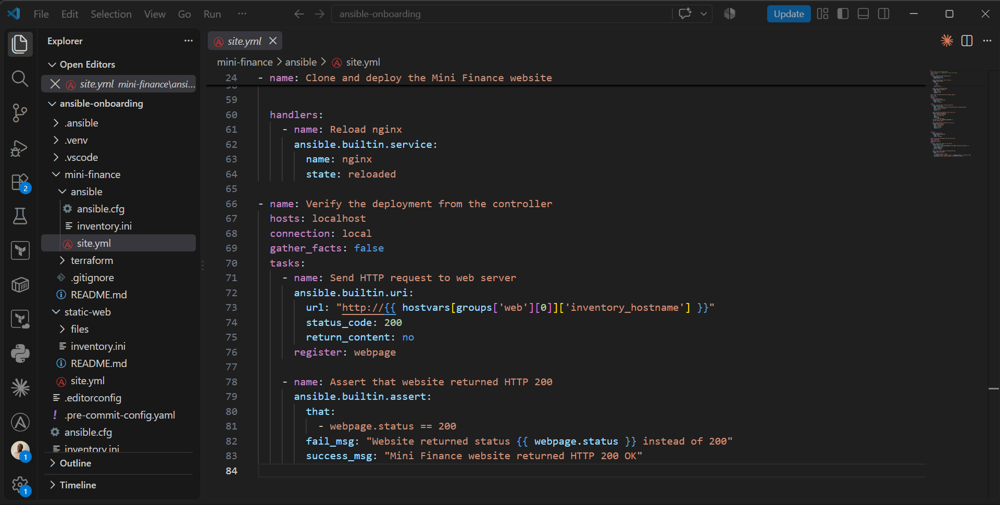
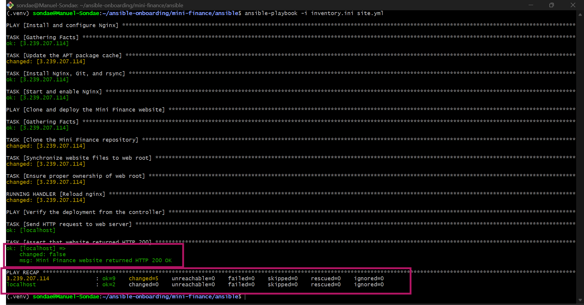
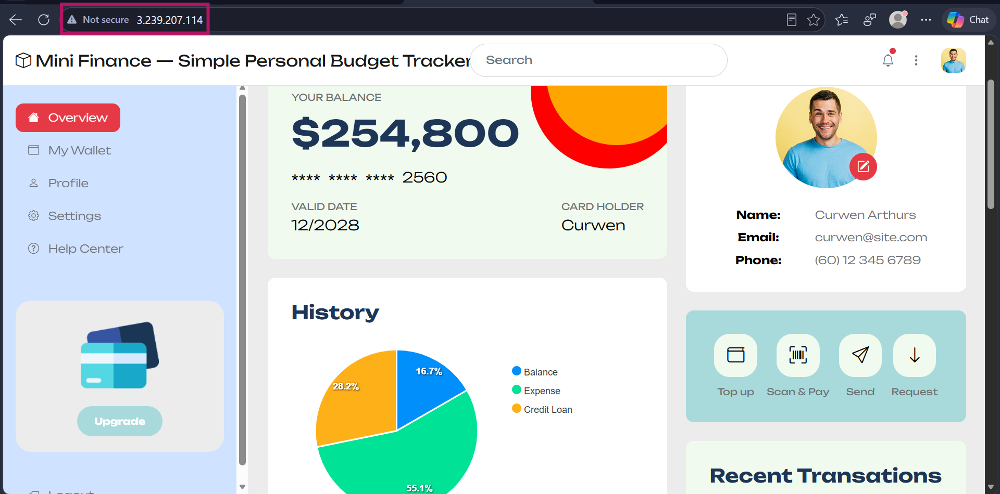

# Assignment 04 — Deploy Mini Finance on Azure Using Terraform and Ansible

Part of the DevOps Micro Internship (DMI) with Agentic AI

---

## Purpose

In this assignment, you will provision Azure infrastructure using Terraform and deploy the Mini Finance website using an Ansible multi-play playbook.

Terraform will create the Azure Virtual Machine and networking resources. Ansible will install Nginx, clone the Mini Finance repository, deploy the website, and verify the deployment.

---

# Task 1 — Create the Project Structure

## Goal

Create separate directories and files for the Terraform infrastructure and Ansible configuration.

### Evidence

#### Screenshot 1 — Terminal or editor showing the complete `mini-finance` project tree


---

# Task 2 — Terraform — Azure VM + NSG (Ports 22/80)

## Goal

Provision an Ubuntu 22.04 Standard_B1s VM with a public IP, SSH key authentication, and an NSG allowing SSH (22) and HTTP (80), and output the public IP.

### Evidence

#### Screenshot 2 — Terminal showing the end of a successful `terraform apply`


---

#### Screenshot 3 — Terminal showing `terraform output public_ip`


---

#### Screenshot 4 — Terraform code or Azure Portal showing NSG inbound rules for ports 22 and 80



---

# Task 3 — Configure Passwordless SSH

## Goal

Connect to the VM with SSH using the injected key and run `hostname` remotely without a password prompt.

### Evidence

#### Screenshot 5 — Terminal showing the successful passwordless SSH hostname check


---

# Task 4 — Ansible — Multi-Play: Install → Deploy → Verify

## Goal

Create `ansible/inventory.ini` and a three-play `site.yml` that installs Nginx and Git, clones and deploys the Mini Finance repository to `/var/www/html/` with a reload handler, and verifies HTTP 200 from `localhost`.

### Evidence

#### Screenshot 6 — Editor showing `inventory.ini` and the three plays in `site.yml`






---

#### Screenshot 7 — Terminal showing `ansible-playbook -i inventory.ini site.yml` with HTTP 200, assertion OK, and no failures



---

# Task 5 — Test End-to-End Functionality

## Goal

Confirm the Mini Finance site is publicly accessible and correctly served by Nginx.

### Evidence

#### Screenshot 8 — Browser showing the Mini Finance site loaded from `http://<public_ip>` with the URL visible



---

### Notes

Describe an issue you faced and how you fixed it, and what you learned.

I faced a "Host Key Verification" block while using Ansible in WSL because the automated tool couldn't interactively accept the new AWS server's security signature. I resolved it by setting ANSIBLE_HOST_KEY_CHECKING=False in the configuration files to safely bypass the manual handshake. This taught me that automated DevOps tools require non-interactive environments to run properly, making environment-specific path translations and silent configurations essential for smooth infrastructure deployment

---

# Task 2 — Create the Azure Infrastructure Using Terraform

## Goal

Use Terraform to provision an Ubuntu Virtual Machine with the required Azure networking and security resources.

### Evidence

#### Screenshot 2 — Terraform code showing the `Allow-SSH` rule for port `22` and the `Allow-HTTP` rule for port `80`

Add your screenshot here.

---

#### Screenshot 3 — Terraform code showing the association between `nsg-mini-finance` and `nic-mini-finance`

Add your screenshot here.

---

### Notes

Add your task notes here.

---

# Task 3 — Initialize and Apply the Terraform Configuration

## Goal

Format and validate the Terraform configuration, review the execution plan, and provision the Azure infrastructure.

### Evidence

#### Screenshot 4 — End of the `terraform apply` output showing `Apply complete!` with no errors

Add your screenshot here.

---

#### Screenshot 5 — Output of `terraform output public_ip` showing the VM’s public IP address

Add your screenshot here.

---

### Notes

Add your task notes here.

---

# Task 4 — Verify Passwordless SSH Access

## Goal

Confirm that the Ansible controller can connect to the Terraform-provisioned Azure VM using SSH key authentication.

### Evidence

#### Screenshot 6 — Passwordless SSH command and the returned `mini-finance` hostname

Add your screenshot here.

---

### Notes

Add your task notes here.

---

# Task 5 — Create the Ansible Inventory and Verify Connectivity

## Goal

Add the Terraform-provisioned Azure VM to the Ansible inventory and confirm that Ansible can connect to it.

### Evidence

#### Screenshot 7 — Ansible ping output showing `SUCCESS` and `pong` from the Azure VM

Add your screenshot here.

---

### Configuration File

Copy and paste the complete contents of your `ansible/inventory.ini` file below:

```ini
Add your inventory.ini content here.
```

---

# Task 6 — Create the Multi-Play Ansible Playbook

## Goal

Create one Ansible playbook containing separate plays to install Nginx, deploy the Mini Finance website, and verify the deployment.

### Evidence

#### Screenshot 8 — `site.yml` showing Play 1 and the beginning of Play 2

Screenshot must show:

- Play 1 targeting the `web` group
- Installation of `nginx`, `git`, and `rsync`
- Nginx service configured as started and enabled
- Beginning of Play 2 with the Git repository URL and synchronization task

Add your screenshot here.

---

#### Screenshot 9 — `site.yml` showing the deployment destination, handler, and Play 3 verification

Screenshot must show:

- Website destination `/var/www/html/`
- Ownership set to `www-data:www-data`
- Nginx reload handler
- Play 3 targeting `localhost`
- The `uri` verification and `assert` condition

Add your screenshot here.

---

### Configuration File

Copy and paste the complete contents of your `ansible/site.yml` file below:

```yaml
Add your site.yml content here.
```

---

# Task 7 — Validate and Run the Ansible Playbook

## Goal

Validate the syntax of the multi-play Ansible playbook and run it to install Nginx, deploy the Mini Finance website, and verify the deployment.

### Evidence

#### Screenshot 10 — Successful playbook syntax check showing `playbook: site.yml`

Add your screenshot here.

---

#### Screenshot 11 — Play 3 output showing the successful HTTP verification and assertion

Add your screenshot here.

---

#### Screenshot 12 — Final `PLAY RECAP` showing `failed=0` and `unreachable=0`

Add your screenshot here.

---

### Notes

Add your task notes here.

---

# Task 8 — Test the Mini Finance Website in a Browser

## Goal

Confirm that the Mini Finance website is publicly accessible through the Azure VM’s public IP address.

### Evidence

#### Screenshot 13 — Mini Finance website successfully loading in the browser, with the Azure VM’s public IP address visible in the address bar

Add your screenshot here.

---

### Website URL

Add your deployed website URL below:

```text
http://<PUBLIC_IP>
```

---

# Task 9 — Create the Project README

## Goal

Create a `README.md` file to document the Mini Finance infrastructure and deployment project.

### Evidence

#### Screenshot 14 — Completed `README.md` displayed in the VS Code Markdown preview or terminal

Add your screenshot here.

---

### README Content

Copy and paste the complete contents of your `README.md` file below:

```markdown
Add your README.md content here.
```

---

# LinkedIn Post Required

## Evidence

#### Screenshot 15 — Published LinkedIn post showing the text and at least one deployment screenshot

Add your screenshot here.

---

#### LinkedIn Post URL

Paste your LinkedIn post URL here:

https://www.linkedin.com/posts/emmanuel-sunday-210a08323_dmibypravinmishra-aws-terraform-activity-7506056771505938432-oG97?utm_source=share&utm_medium=member_desktop&rcm=ACoAAFHXXywBq0IrgBBhbi5ULmCrDuZgCEYc6fQ

---

### LinkedIn Submission Notes


---

# Submission Instructions

- Add all required screenshots in the correct order.
- Full Name must be visible in required screenshots.
- Add the Azure VM public IP address.
- Add the final Mini Finance website URL.
- Paste `inventory.ini`, `site.yml`, and `README.md` as editable text.
- Answer all assignment questions clearly in your own words.
- Add your LinkedIn post URL.
- Do not expose SSH private keys, passwords, Azure credentials, subscription IDs, Terraform state contents, or other sensitive information.

---

# Completion Checklist

- [ ] Task 1: `mini-finance` project structure created
- [ ] Task 1: `.gitignore` created
- [ ] Task 2: Terraform Azure infrastructure code created
- [ ] Task 2: `Allow-SSH` rule configured for port `22`
- [ ] Task 2: `Allow-HTTP` rule configured for port `80`
- [ ] Task 2: NSG associated with the Network Interface
- [ ] Task 3: `terraform fmt` completed
- [ ] Task 3: `terraform init` completed
- [ ] Task 3: `terraform validate` completed successfully
- [ ] Task 3: `terraform apply` completed successfully
- [ ] Task 3: `terraform output public_ip` displayed the VM public IP
- [ ] Task 4: Passwordless SSH works from the Ansible controller
- [ ] Task 5: `inventory.ini` created
- [ ] Task 5: Ansible ping returns `SUCCESS` and `pong`
- [ ] Task 6: `site.yml` contains three separate plays
- [ ] Task 6: Play 1 installs Nginx, Git, and rsync
- [ ] Task 6: Play 2 clones and deploys the Mini Finance website
- [ ] Task 6: Play 3 verifies HTTP status code `200`
- [ ] Task 7: Playbook syntax check passes
- [ ] Task 7: Ansible playbook completes successfully
- [ ] Task 7: Final recap shows `failed=0` and `unreachable=0`
- [ ] Task 8: Mini Finance website loads in the browser
- [ ] Task 8: Azure VM public IP is visible in the browser screenshot
- [ ] Task 9: `README.md` completed
- [ ] Screenshots 1–15 are included
- [ ] `inventory.ini`, `site.yml`, and `README.md` are pasted as editable text
- [ ] Assignment questions are answered
- [ ] LinkedIn post published with Anyone visibility
- [ ] LinkedIn post URL added
- [ ] No sensitive information is exposed

---

## About DMI & CloudAdvisory

DevOps Micro Internship (DMI) is a project-based DevOps program run by Pravin Mishra and The CloudAdvisory, focused on real-world execution, systems thinking, and career readiness.

It helps learners build strong DevOps foundations with hands-on experience.

---

## Resources

- DMI Official Website: [https://dmi.pravinmishra.com?utm_source=github&utm_medium=readme](https://dmi.pravinmishra.com?utm_source=github&utm_medium=readme)
- University: [https://university.pravinmishra.com?utm_source=github&utm_medium=readme](https://university.pravinmishra.com?utm_source=github&utm_medium=readme)
- Discord Community: [https://discord.pravinmishra.com?utm_source=github&utm_medium=readme](https://discord.pravinmishra.com?utm_source=github&utm_medium=readme)
- Blog: [https://dmi.pravinmishra.com/blog?utm_source=github&utm_medium=readme](https://dmi.pravinmishra.com/blog?utm_source=github&utm_medium=readme)
- YouTube Playlist: [https://www.youtube.com/playlist?list=PLFeSNDtI4Cho](https://www.youtube.com/playlist?list=PLFeSNDtI4Cho)
- Pravin Mishra LinkedIn: [https://www.linkedin.com/in/pravin-mishra-aws-trainer/](https://www.linkedin.com/in/pravin-mishra-aws-trainer/)
- CloudAdvisory LinkedIn: [https://www.linkedin.com/company/thecloudadvisory/](https://www.linkedin.com/company/thecloudadvisory/)

---

*This submission is part of DevOps Micro Internship (DMI) — Agentic AI Track.*