# Assignment 04 — Deploy Mini Finance on Azure Using Terraform and Ansible

Part of the DevOps Micro Internship (DMI) with Agentic AI

---

## Purpose

In this assignment, you will provision Azure infrastructure using Terraform and deploy the Mini Finance website using an Ansible multi-play playbook.

Terraform will create the Azure Virtual Machine and networking resources. Ansible will install Nginx, clone the Mini Finance repository, deploy the website, and verify the deployment.

---

# Task 1 — Create the Project Structure

## Goal

Create separate directories and files for the Terraform infrastructure and Ansible configuration.

### Evidence

#### Screenshot 1 — Terminal or VS Code showing the complete `mini-finance` project structure

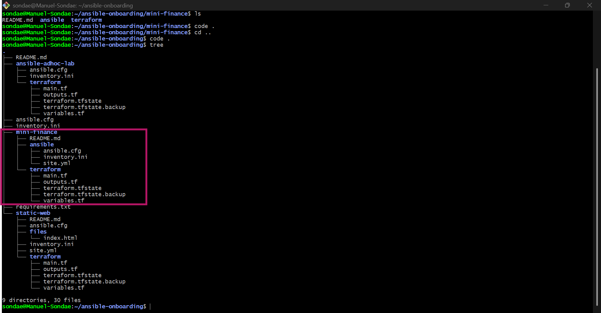

---

### Notes

Kept the same terraform/ and ansible/ split from the earlier Mini Finance build, since the project structure itself is provider-agnostic — only the contents of terraform/ needed to change for AWS.

---

# Task 2 — Create the Azure Infrastructure Using Terraform

## Goal

Use Terraform to provision an Ubuntu Virtual Machine with the required Azure networking and security resources.

### Evidence

#### Screenshot 2 — Terraform code showing the `Allow-SSH` rule for port `22` and the `Allow-HTTP` rule for port `80`

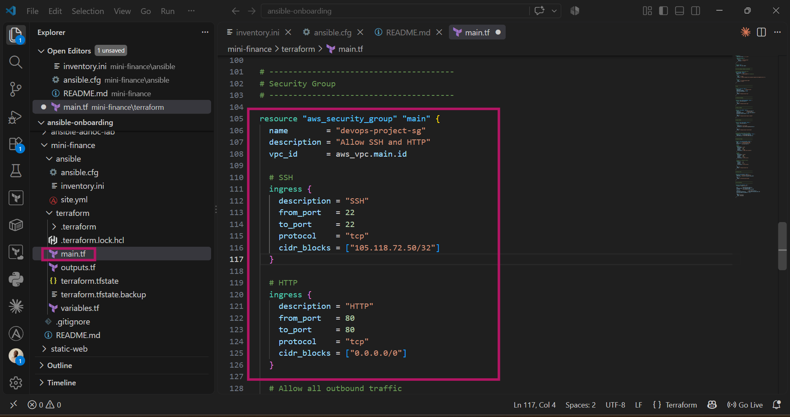

---

#### Screenshot 3 — Terraform code showing the association between `nsg-mini-finance` and `nic-mini-finance`

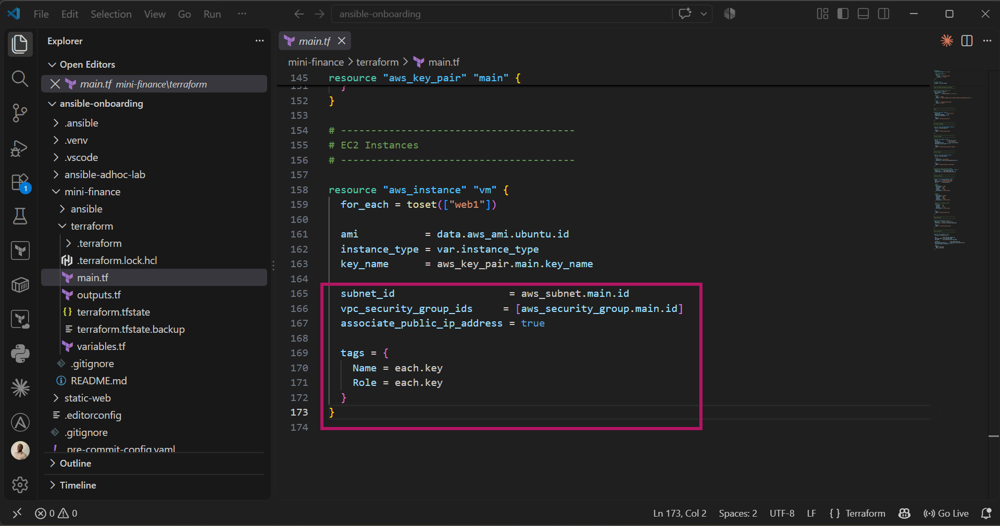

---

### Notes

Built the AWS equivalent of this task's Azure requirements: a Security Group with SSH restricted to my IP and HTTP open to the internet (same as Allow-SSH/Allow-HTTP), and the security group attached directly to the instance via vpc_security_group_ids rather than through a separate NIC resource, since AWS manages the network interface automatically.

---

# Task 3 — Initialize and Apply the Terraform Configuration

## Goal

Format and validate the Terraform configuration, review the execution plan, and provision the Azure infrastructure.

### Evidence

#### Screenshot 4 — End of the `terraform apply` output showing `Apply complete!` with no errors

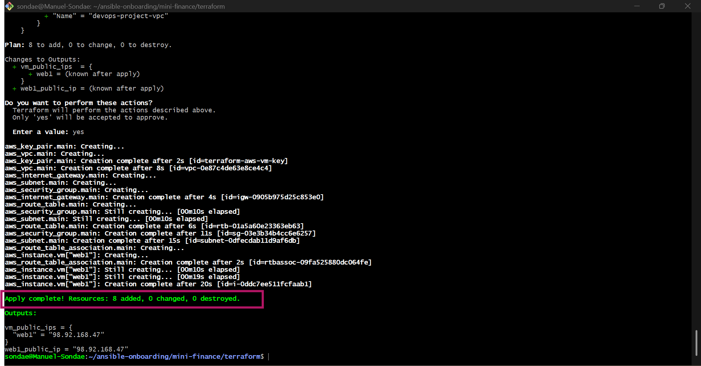

---

#### Screenshot 5 — Output of `terraform output public_ip` showing the VM’s public IP address

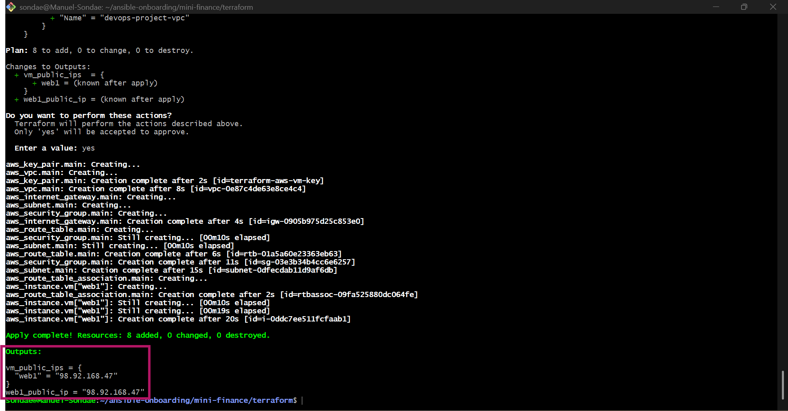

---

### Notes

terraform apply completed cleanly on the first run, reusing the same AMI lookup and key pair pattern from earlier AWS projects — no new issues here since the underlying Terraform structure was already proven.

---

# Task 4 — Verify Passwordless SSH Access

## Goal

Confirm that the Ansible controller can connect to the Terraform-provisioned Azure VM using SSH key authentication.

### Evidence

#### Screenshot 6 — Passwordless SSH command and the returned `mini-finance` hostname

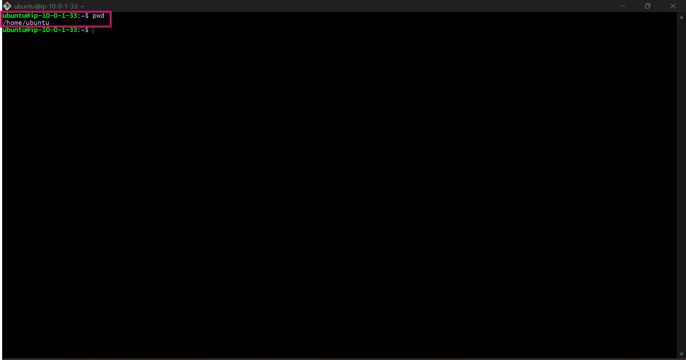

---

### Notes

Confirmed passwordless SSH using the same ED25519 key loaded in ssh-agent from earlier in the session — no passphrase prompt, confirming the key registered by Terraform matches what's already unlocked locally.

---

# Task 5 — Create the Ansible Inventory and Verify Connectivity

## Goal

Add the Terraform-provisioned Azure VM to the Ansible inventory and confirm that Ansible can connect to it.

### Evidence

#### Screenshot 7 — Ansible ping output showing `SUCCESS` and `pong` from the Azure VM

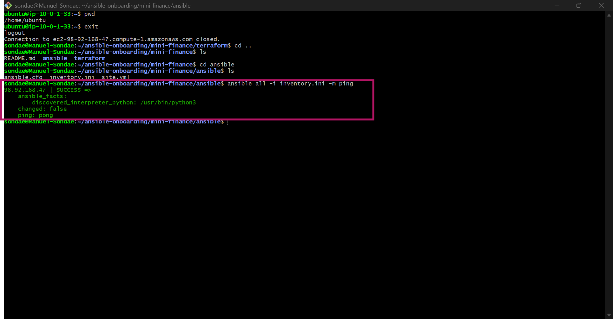

---

### Configuration File

Copy and paste the complete contents of your `ansible/inventory.ini` file below:

```ini
[web]
98.92.168.47

[web:vars]
ansible_user=ubuntu
ansible_ssh_private_key_file=~/.ssh/terraform-aws-vm-key
```

---

# Task 6 — Create the Multi-Play Ansible Playbook

## Goal

Create one Ansible playbook containing separate plays to install Nginx, deploy the Mini Finance website, and verify the deployment.

### Evidence

#### Screenshot 8 — `site.yml` showing Play 1 and the beginning of Play 2

Screenshot must show:

- Play 1 targeting the `web` group
- Installation of `nginx`, `git`, and `rsync`
- Nginx service configured as started and enabled
- Beginning of Play 2 with the Git repository URL and synchronization task

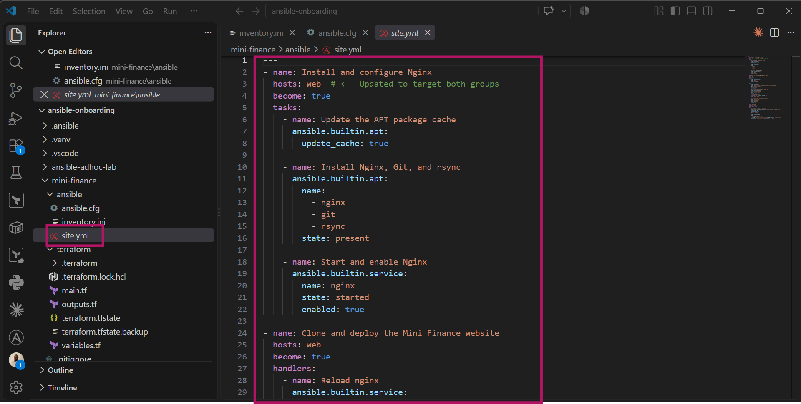
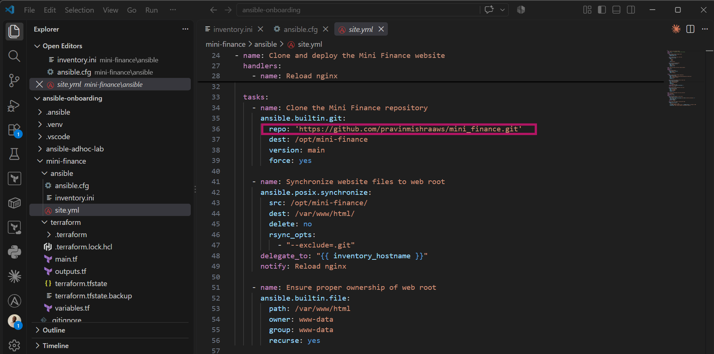

---

#### Screenshot 9 — `site.yml` showing the deployment destination, handler, and Play 3 verification

Screenshot must show:

- Website destination `/var/www/html/`
- Ownership set to `www-data:www-data`
- Nginx reload handler
- Play 3 targeting `localhost`
- The `uri` verification and `assert` condition

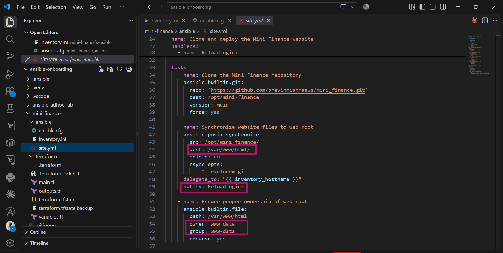
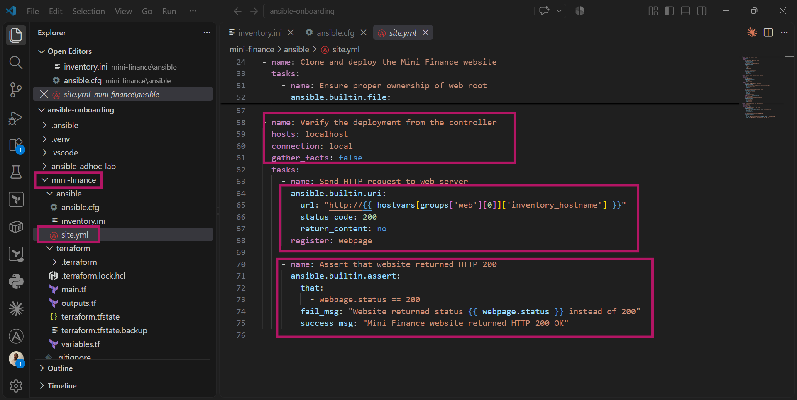

---

### Configuration File

Copy and paste the complete contents of your `ansible/site.yml` file below:

```yaml
--
- name: Install and configure Nginx
  hosts: web  # <-- Updated to target both groups
  become: true
  tasks:
    - name: Update the APT package cache
      ansible.builtin.apt:
        update_cache: true

    - name: Install Nginx, Git, and rsync
      ansible.builtin.apt:
        name:
          - nginx
          - git
          - rsync
        state: present

    - name: Start and enable Nginx
      ansible.builtin.service:
        name: nginx
        state: started
        enabled: true

- name: Clone and deploy the Mini Finance website
  hosts: web
  become: true
  handlers:
    - name: Reload nginx
      ansible.builtin.service:
        name: nginx
        state: reloaded

  tasks:
    - name: Clone the Mini Finance repository
      ansible.builtin.git:
        repo: 'https://github.com/pravinmishraaws/mini_finance.git'
        dest: /opt/mini-finance
        version: main
        force: yes

    - name: Synchronize website files to web root
      ansible.posix.synchronize:
        src: /opt/mini-finance/
        dest: /var/www/html/
        delete: no
        rsync_opts:
          - "--exclude=.git"
      delegate_to: "{{ inventory_hostname }}"
      notify: Reload nginx

    - name: Ensure proper ownership of web root
      ansible.builtin.file:
        path: /var/www/html
        owner: www-data
        group: www-data
        recurse: yes

- name: Verify the deployment from the controller
  hosts: localhost
  connection: local
  gather_facts: false
  tasks:
    - name: Send HTTP request to web server
      ansible.builtin.uri:
        url: "http://{{ hostvars[groups['web'][0]]['inventory_hostname'] }}"
        status_code: 200
        return_content: no
      register: webpage

    - name: Assert that website returned HTTP 200
      ansible.builtin.assert:
        that:
          - webpage.status == 200
        fail_msg: "Website returned status {{ webpage.status }} instead of 200"
        success_msg: "Mini Finance website returned HTTP 200 OK"

```

---

# Task 7 — Validate and Run the Ansible Playbook

## Goal

Validate the syntax of the multi-play Ansible playbook and run it to install Nginx, deploy the Mini Finance website, and verify the deployment.

### Evidence

#### Screenshot 10 — Successful playbook syntax check showing `playbook: site.yml`

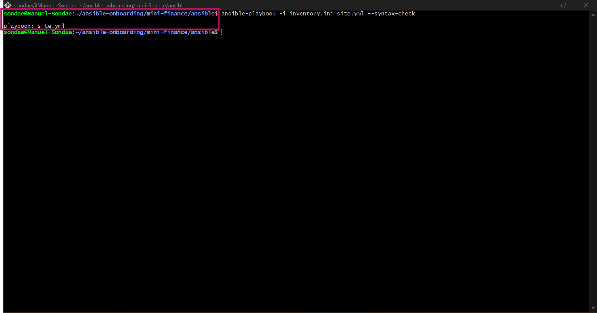

---

#### Screenshot 11 — Play 3 output showing the successful HTTP verification and assertion

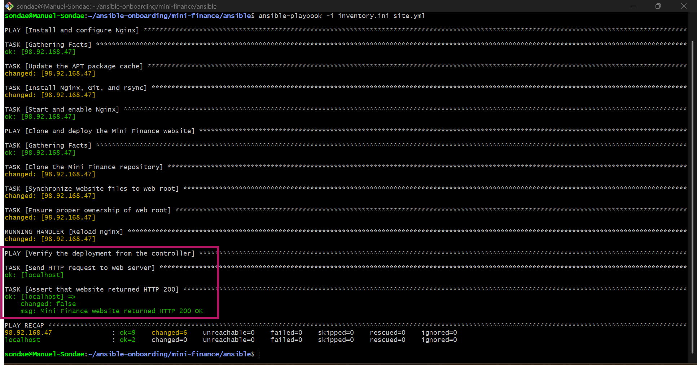

---

#### Screenshot 12 — Final `PLAY RECAP` showing `failed=0` and `unreachable=0`

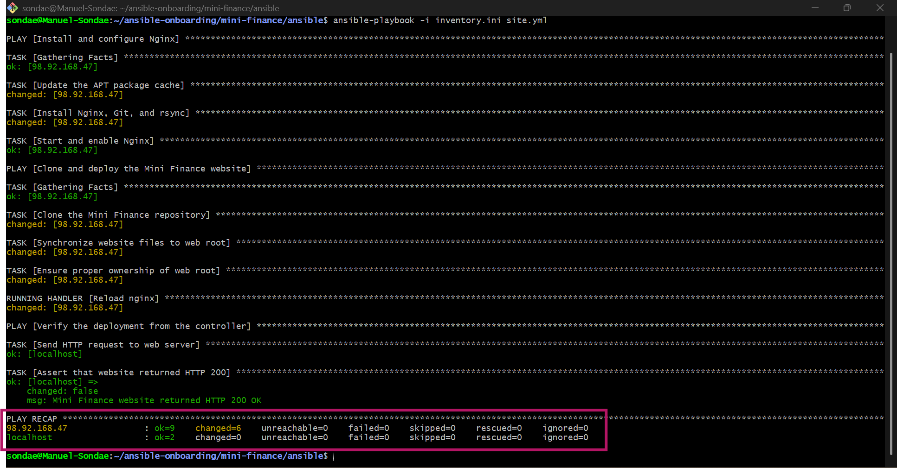

---

### Notes

Syntax check and full playbook run both completed cleanly, reusing the install/deploy/verify structure from the earlier Mini Finance build with the git clone + rsync deployment method, since this assignment's Task 6 specifically asks for that approach rather than the copy module used in the static-web assignment.

---

# Task 8 — Test the Mini Finance Website in a Browser

## Goal

Confirm that the Mini Finance website is publicly accessible through the Azure VM’s public IP address.

### Evidence

#### Screenshot 13 — Mini Finance website successfully loading in the browser, with the Azure VM’s public IP address visible in the address bar

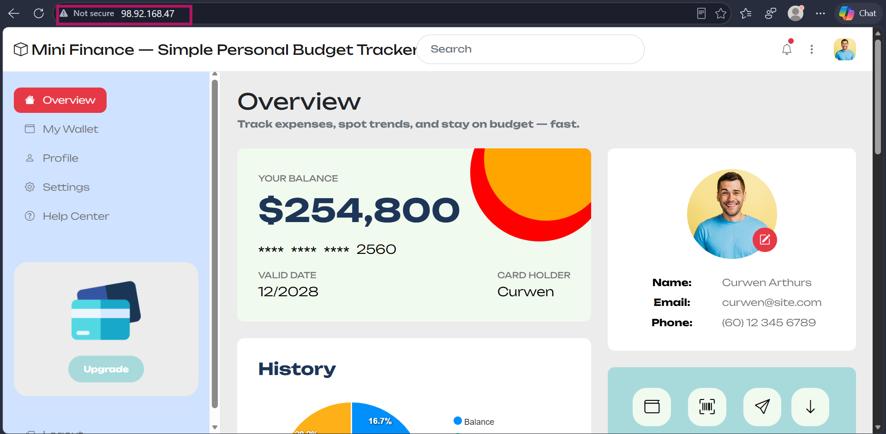

---

### Website URL

Add your deployed website URL below:

```text
http://98.92.168.47
```

---

# Task 9 — Create the Project README

## Goal

Create a `README.md` file to document the Mini Finance infrastructure and deployment project.

### Evidence

#### Screenshot 14 — Completed `README.md` displayed in the VS Code Markdown preview or terminal

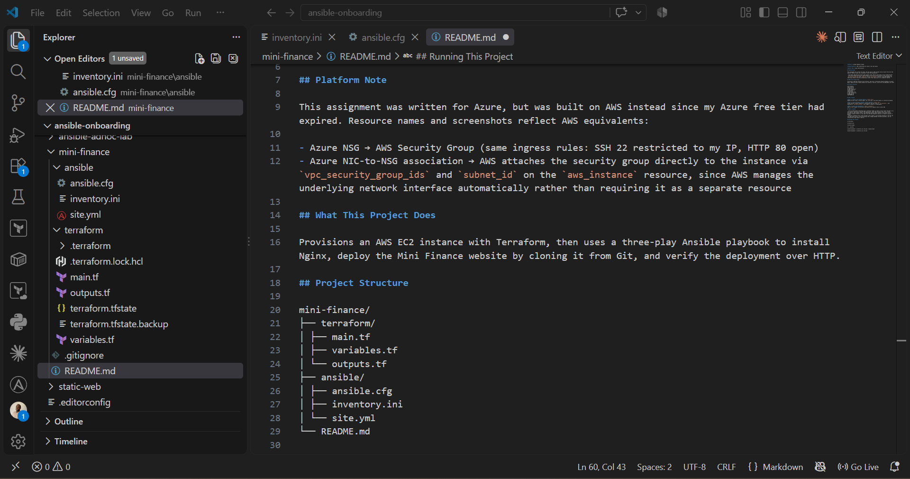
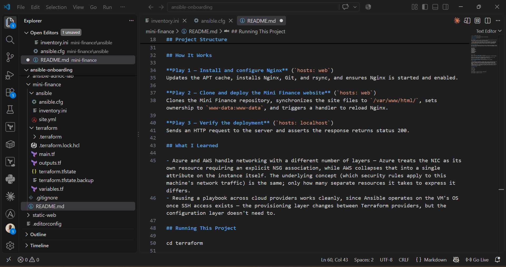
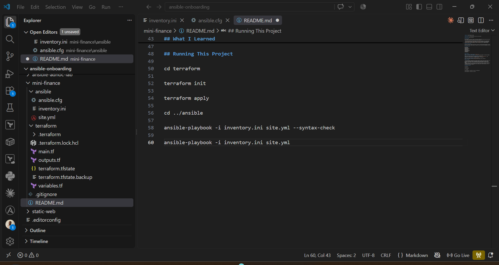

---

### README Content

Copy and paste the complete contents of your `README.md` file below:

```markdown
**Author:** Inibehe Emmanuel Sunday

**Cloud Platform:** AWS (substituted for Azure — see note below)

**Server URL:** http://98.92.168.47

## Platform Note

This assignment was written for Azure, but was built on AWS instead since my Azure free tier had expired. Resource names and screenshots reflect AWS equivalents:

- Azure NSG → AWS Security Group (same ingress rules: SSH 22 restricted to my IP, HTTP 80 open)
- Azure NIC-to-NSG association → AWS attaches the security group directly to the instance via `vpc_security_group_ids` and `subnet_id` on the `aws_instance` resource, since AWS manages the underlying network interface automatically rather than requiring it as a separate resource

## What This Project Does

Provisions an AWS EC2 instance with Terraform, then uses a three-play Ansible playbook to install Nginx, deploy the Mini Finance website by cloning it from Git, and verify the deployment over HTTP.

## Project Structure

mini-finance/
├── terraform/
│ ├── main.tf
│ ├── variables.tf
│ └── outputs.tf
├── ansible/
│ ├── ansible.cfg
│ ├── inventory.ini
│ └── site.yml
└── README.md


## How It Works

**Play 1 — Install and configure Nginx** (`hosts: web`)
Updates the APT cache, installs Nginx, Git, and rsync, and ensures Nginx is started and enabled.

**Play 2 — Clone and deploy the Mini Finance website** (`hosts: web`)
Clones the Mini Finance repository, synchronizes the site files to `/var/www/html/`, sets ownership to `www-data:www-data`, and triggers a handler to reload Nginx.

**Play 3 — Verify the deployment** (`hosts: localhost`)
Sends an HTTP request to the server and asserts the response returns status 200.

## What I Learned

- Azure and AWS handle networking with a different number of layers — Azure treats the NIC as its own resource requiring an explicit NSG association, while AWS collapses that into a single attribute on the instance itself. The underlying concept (which security rules apply to this machine's network traffic) is the same; only how many separate resources it takes to express it differs.
- Reusing a playbook across cloud providers works cleanly, since Ansible operates on the VM's OS once SSH access exists — the provisioning layer changes between Terraform providers, but the configuration layer doesn't need to.

## Running This Project

cd terraform

terraform init

terraform apply

cd ../ansible

ansible-playbook -i inventory.ini site.yml --syntax-check

ansible-playbook -i inventory.ini site.yml

```

---

# LinkedIn Post Required

## Evidence

#### Screenshot 15 — Published LinkedIn post showing the text and at least one deployment screenshot

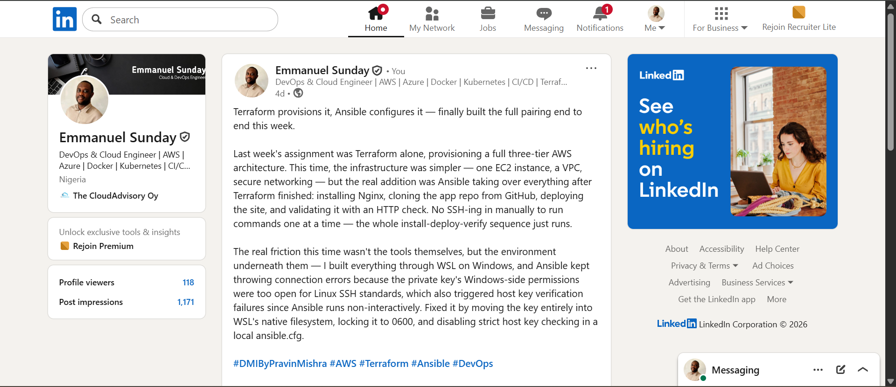

---

#### LinkedIn Post URL

Paste your LinkedIn post URL here:

https://www.linkedin.com/posts/emmanuel-sunday-210a08323_dmibypravinmishra-aws-terraform-activity-7506056771505938432-oG97?utm_source=share&utm_medium=member_desktop&rcm=ACoAAFHXXywBq0IrgBBhbi5ULmCrDuZgCEYc6fQ

---

### LinkedIn Submission Notes

**One challenge you faced and how you fixed it:**

The real friction this time wasn't the tools themselves, but the environment underneath them — I built everything through WSL on Windows, and Ansible kept throwing connection errors because the private key's Windows-side permissions were too open for Linux SSH standards, which also triggered host key verification failures since Ansible runs non-interactively. Fixed it by moving the key entirely into WSL's native filesystem, locking it to 0600, and disabling strict host key checking in a local ansible.cfg.

---

**One real-world example where you can use this learning:**

This same Terraform + Ansible pairing is exactly how teams handle disaster recovery or platform migration — if a company needed to move a workload from Azure to AWS (or vice versa) due to cost, an outage, or a vendor change, the Terraform layer gets rewritten for the new provider, but the Ansible configuration layer — installing software, deploying the app, verifying it's live — carries over largely unchanged, since it operates on the VM's OS rather than the cloud provider itself.

---

# Assignment Questions

Answer the following in your own words:

**1. What did you provision using Terraform in this assignment?**

An EC2 instance, VPC, subnet, internet gateway, route table, and a security group allowing SSH from my IP and HTTP from anywhere — the AWS equivalent of this assignment's original Azure VM, NSG, and NIC requirements.

---

**2. What did Ansible configure and deploy in this assignment?**

Installed Nginx, Git, and rsync; cloned the Mini Finance repository; synchronized the site files into the web root with correct ownership; and verified the site returned HTTP 200.

---

**3. Why is SSH access on port `22` restricted to your public IP address?**

So only I can manage the server directly — leaving SSH open to the whole internet is one of the most common ways a server gets compromised, since it's constantly scanned and targeted by automated attacks.

---

**4. Why is HTTP port `80` open to the internet?**

So only I can manage the server directly — leaving SSH open to the whole internet is one of the most common ways a server gets compromised, since it's constantly scanned and targeted by automated attacks.

---

**5. What is the purpose of the Ansible inventory file?**

It tells Ansible which machines to manage and how to reach them, letting commands and playbooks target specific hosts or groups instead of needing the connection details repeated everywhere.

---

**6. Why does the playbook use separate plays for install, deploy, and verify?**

Each play has one clear responsibility, so a failure is easy to isolate — and it lets verification run from a different host (the controller) than installation and deployment, which run on the actual server.

---

**7. Why is `rsync` useful when deploying website files?**

It only transfers files that have actually changed rather than copying everything every time, and it can exclude specific paths like .git, making repeated deployments faster and cleaner than a full copy.

---

**8. What does the Ansible `uri` module verify in this assignment?**

That the deployed site actually responds to an HTTP request with status 200, confirming it's live and reachable, not just that the files were placed on disk correctly

---

**9. What issue did you face during this assignment, and how did you fix it?**

Same environment-level SSH permission issue described above — Windows-side key permissions being too open for WSL's SSH client, requiring the key to be moved into WSL's own filesystem and locked to 0600.

---

**10. What did you learn from using Terraform and Ansible together?**

That they cleanly divide responsibility by layer — Terraform provisions the infrastructure and is provider-specific, while Ansible configures whatever's running on top of it and stays largely provider-agnostic, since it just needs SSH access to do its job regardless of which cloud created the machine.

---

# Required Files

Confirm that the following files are included in your assignment folder:

- [ ] `.gitignore`
- [ ] `README.md`
- [ ] `terraform/providers.tf`
- [ ] `terraform/main.tf`
- [ ] `terraform/variables.tf`
- [ ] `terraform/outputs.tf`
- [ ] `ansible/inventory.ini`
- [ ] `ansible/site.yml`

---

# Submission Instructions

- Add all required screenshots in the correct order.
- Full Name must be visible in required screenshots.
- Add the Azure VM public IP address.
- Add the final Mini Finance website URL.
- Paste `inventory.ini`, `site.yml`, and `README.md` as editable text.
- Answer all assignment questions clearly in your own words.
- Add your LinkedIn post URL.
- Do not expose SSH private keys, passwords, Azure credentials, subscription IDs, Terraform state contents, or other sensitive information.

---

# Completion Checklist

- [ ] Task 1: `mini-finance` project structure created
- [ ] Task 1: `.gitignore` created
- [ ] Task 2: Terraform Azure infrastructure code created
- [ ] Task 2: `Allow-SSH` rule configured for port `22`
- [ ] Task 2: `Allow-HTTP` rule configured for port `80`
- [ ] Task 2: NSG associated with the Network Interface
- [ ] Task 3: `terraform fmt` completed
- [ ] Task 3: `terraform init` completed
- [ ] Task 3: `terraform validate` completed successfully
- [ ] Task 3: `terraform apply` completed successfully
- [ ] Task 3: `terraform output public_ip` displayed the VM public IP
- [ ] Task 4: Passwordless SSH works from the Ansible controller
- [ ] Task 5: `inventory.ini` created
- [ ] Task 5: Ansible ping returns `SUCCESS` and `pong`
- [ ] Task 6: `site.yml` contains three separate plays
- [ ] Task 6: Play 1 installs Nginx, Git, and rsync
- [ ] Task 6: Play 2 clones and deploys the Mini Finance website
- [ ] Task 6: Play 3 verifies HTTP status code `200`
- [ ] Task 7: Playbook syntax check passes
- [ ] Task 7: Ansible playbook completes successfully
- [ ] Task 7: Final recap shows `failed=0` and `unreachable=0`
- [ ] Task 8: Mini Finance website loads in the browser
- [ ] Task 8: Azure VM public IP is visible in the browser screenshot
- [ ] Task 9: `README.md` completed
- [ ] Screenshots 1–15 are included
- [ ] `inventory.ini`, `site.yml`, and `README.md` are pasted as editable text
- [ ] Assignment questions are answered
- [ ] LinkedIn post published with Anyone visibility
- [ ] LinkedIn post URL added
- [ ] No sensitive information is exposed

---

## About DMI & CloudAdvisory

DevOps Micro Internship (DMI) is a project-based DevOps program run by Pravin Mishra and The CloudAdvisory, focused on real-world execution, systems thinking, and career readiness.

It helps learners build strong DevOps foundations with hands-on experience.

---

## Resources

- DMI Official Website: [https://dmi.pravinmishra.com?utm_source=github&utm_medium=readme](https://dmi.pravinmishra.com?utm_source=github&utm_medium=readme)
- University: [https://university.pravinmishra.com?utm_source=github&utm_medium=readme](https://university.pravinmishra.com?utm_source=github&utm_medium=readme)
- Discord Community: [https://discord.pravinmishra.com?utm_source=github&utm_medium=readme](https://discord.pravinmishra.com?utm_source=github&utm_medium=readme)
- Blog: [https://dmi.pravinmishra.com/blog?utm_source=github&utm_medium=readme](https://dmi.pravinmishra.com/blog?utm_source=github&utm_medium=readme)
- YouTube Playlist: [https://www.youtube.com/playlist?list=PLFeSNDtI4Cho](https://www.youtube.com/playlist?list=PLFeSNDtI4Cho)
- Pravin Mishra LinkedIn: [https://www.linkedin.com/in/pravin-mishra-aws-trainer/](https://www.linkedin.com/in/pravin-mishra-aws-trainer/)
- CloudAdvisory LinkedIn: [https://www.linkedin.com/company/thecloudadvisory/](https://www.linkedin.com/company/thecloudadvisory/)

---

*This submission is part of DevOps Micro Internship (DMI) — Agentic AI Track.*