# Assignment — Deploy EpicBook with Terraform and Ansible Roles

Part of the DevOps Micro Internship (DMI) with Agentic AI

---

## Purpose

In this assignment, you will deploy the EpicBook web application using Terraform and Ansible roles.

Terraform provisions the cloud infrastructure, including one Ubuntu VM and one managed MySQL database. Ansible roles configure the VM, install required software, deploy the EpicBook application, configure Nginx, connect the app to the managed MySQL database, and verify the deployment.

---

# Task 1 — Set Up the Project Folder Layout

## Goal

Create the project folder structure for Terraform and Ansible roles.

Terraform will be used to provision the cloud infrastructure. Ansible roles will be used to configure the VM and deploy the EpicBook application.

### Evidence

#### Screenshot 1 — Terminal showing the completed `epicbook-prod` project structure

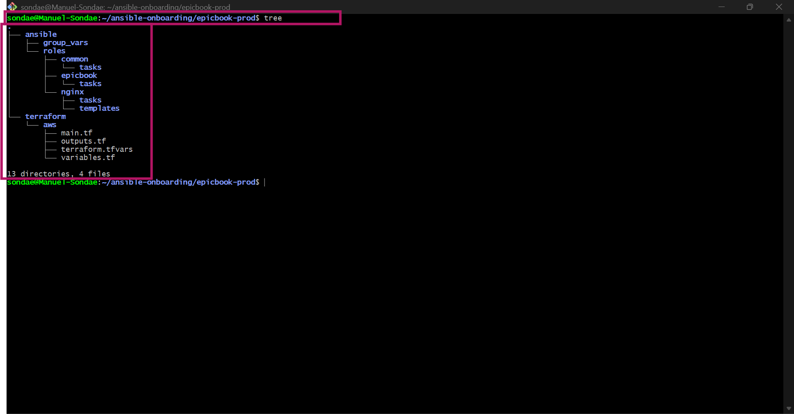

---

### Notes

Answer the following in your own words:

**1. Which cloud provider did you choose for this assignment?**

I used AWS cloud for the Assignment.

---

**2. Why is it useful to keep Terraform files and Ansible files in separate folders?**

They serve genuinely different jobs — Terraform provisions infrastructure, Ansible configures what runs on top of it — so keeping them separate makes it clear which tool owns which concern, and lets each be run, tested, or modified independently without the two getting tangled together.

---

**3. What is the purpose of the `roles` directory in Ansible?**

It organizes tasks into self-contained, reusable units by responsibility — common, nginx, epicbook in this case — instead of putting every task in one flat playbook. Each role can be reused across different projects or called in a different order, and a failure is easier to isolate since each role's job is clearly scoped.

---

# Task 2 — Provision the Infrastructure with Terraform

## Goal

Run Terraform to provision the cloud infrastructure for the EpicBook deployment.

Terraform will create the VM, managed MySQL database, networking, security rules, and required outputs.

### Evidence

#### Screenshot 2 — `terraform apply` completed successfully

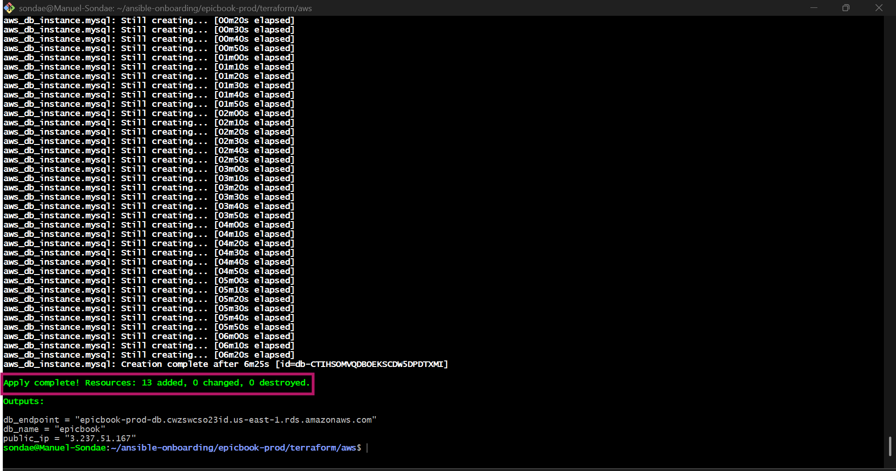

---

#### Screenshot 3 — Output of `terraform output`

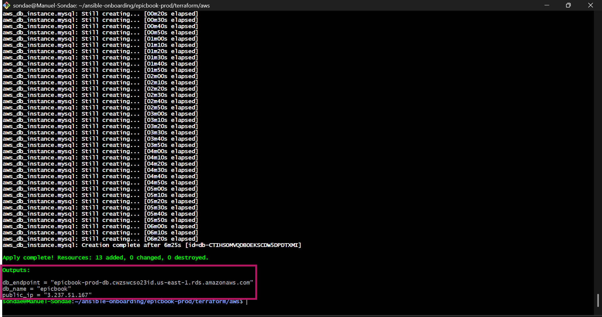

---

#### Screenshot 4 — Azure Portal or AWS Console showing the VM running

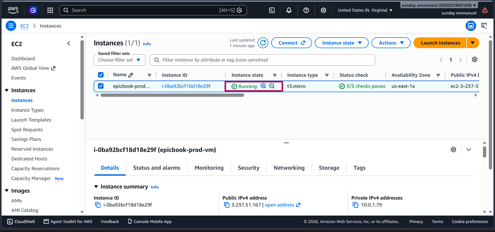

---

#### Screenshot 5 — Azure Portal or AWS Console showing the managed MySQL database created

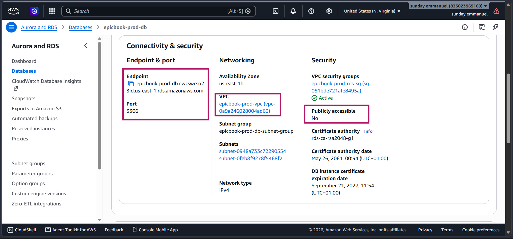

---

### Notes

Answer the following in your own words:

**1. What resources did Terraform create for this assignment?**

A VPC, an internet gateway, one public subnet for the VM and two private subnets across separate AZs for RDS's subnet group, a route table, two security groups (one for the VM allowing SSH and HTTP, one for RDS allowing MySQL only from the VM's security group), an SSH key pair, the EC2 instance, and the RDS MySQL database.

---

**2. Why should you review `terraform plan` before running `terraform apply`?**

plan shows exactly what will be created, changed, or destroyed before anything actually happens — it's the one chance to catch a mistake (wrong CIDR, unintended resource deletion, a misconfigured security rule) while it's still just a preview, rather than after real infrastructure has already been provisioned or torn down.

---

**3. Why should database passwords not be shown in Terraform output?**

Terraform's plan and apply output, and its state file, are often stored, logged, or shared (in CI/CD logs, version control, or just a terminal history) — printing a password in plain text there means it's exposed anywhere that output ends up, even long after the resource itself is gone. Marking the variable sensitive = true keeps it out of the CLI output, though the state file itself still needs separate protection.

---

# Task 3 — Verify SSH Key-Based Access

## Goal

Verify that the cloud VM can be accessed from the Ansible controller using SSH key-based authentication.

### Evidence

#### Screenshot 6 — Successful SSH hostname check from the Ansible controller

---

### Notes

Answer the following in your own words:

**1. What command did you use to verify SSH access?**

ssh -i ~/.ssh/id_ed25519 ubuntu@<public-ip>

---

**2. What proves that SSH key-based access worked successfully?**

The connection succeeds and drops straight into a shell prompt on the remote server with no password prompt at all — if a passphrase-protected key is being used, the only prompt should be the key's own passphrase (asked once by ssh-agent), never a request for the remote user's login password.

---

**3. What would you check if SSH returned `Permission denied (publickey)`?**

Whether the key pair Terraform registered actually matches the key being used to connect, whether the correct private key is loaded in ssh-agent (ssh-add -l), whether the security group allows port 22 from the connecting IP, and whether the username is correct for the AMI (ubuntu for Ubuntu images). In this assignment specifically, this error also showed up when a passphrase-protected key wasn't yet loaded into ssh-agent — the fix was ssh-add before attempting the connection.

---

# Task 4 — Create the Ansible Inventory and Configuration

## Goal

Create the Ansible inventory file and local Ansible configuration for the EpicBook VM.

The inventory tells Ansible which VM to manage and which SSH user to use.

### Evidence

#### Screenshot 7 — `inventory.ini` showing the VM under the `web` group

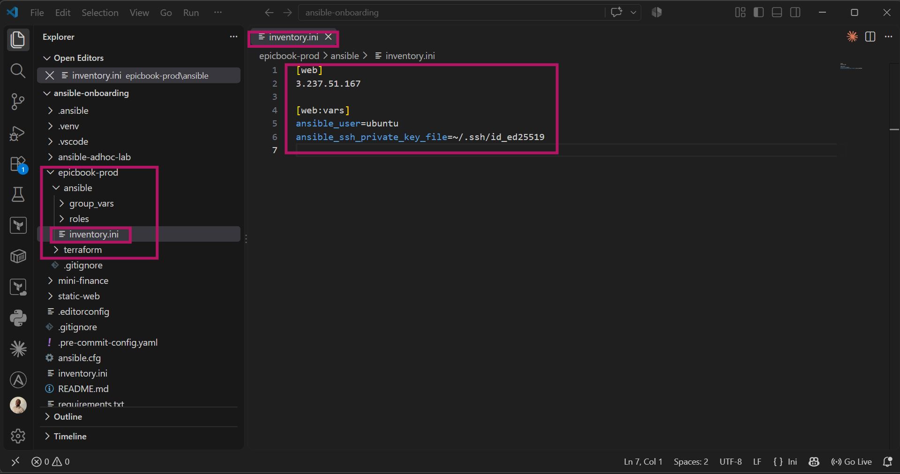

---

#### Screenshot 8 — Output of `ansible-inventory -i inventory.ini --graph`

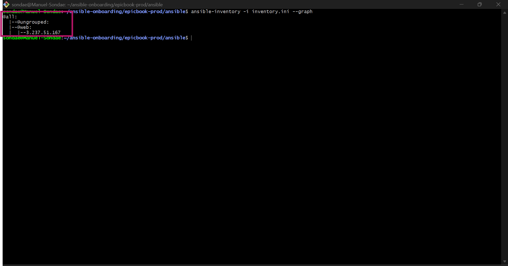

---

#### Screenshot 9 — Output of `ansible web -i inventory.ini -m ping`

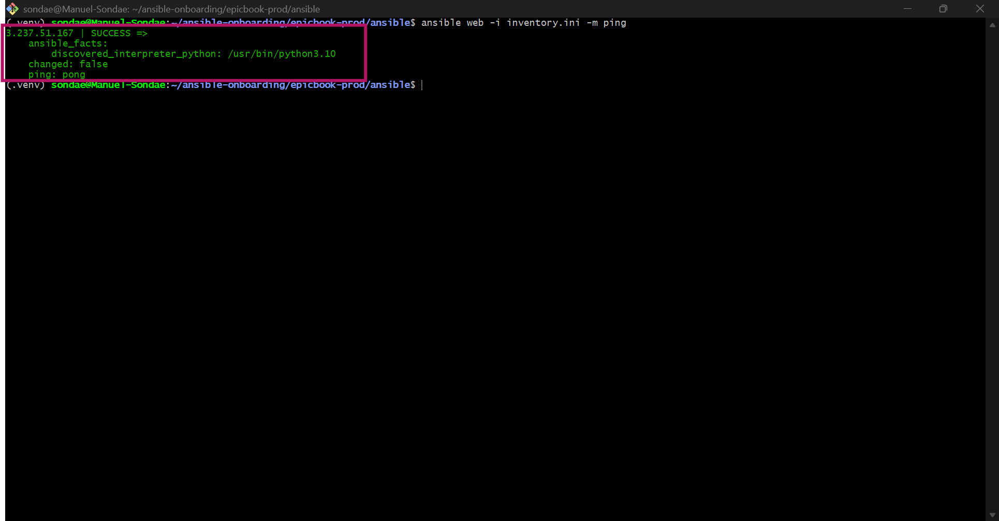

---

### Notes

Answer the following in your own words:

**1. What is the purpose of `inventory.ini`?**

It tells Ansible which machines to manage and how to reach them, letting commands and playbooks target specific hosts or groups by name instead of hardcoding connection details everywhere.

---

**2. What does `ansible_host` store?**

The actual IP address or hostname Ansible should connect to for a given inventory host, separate from the friendly name used to refer to it in the inventory and playbooks.

---

**3. What does `ansible_ssh_private_key_file` tell Ansible?**

Which private key file to use when authenticating over SSH to a given host or group, so it doesn't have to be specified manually on every command.

---

**4. Why is `host_key_checking = False` used only for this temporary lab?**

It skips the interactive "authenticity of host... are you sure?" prompt, which is necessary for non-interactive automation but also means Ansible won't warn you if a host's identity unexpectedly changes — a real security check worth having enabled in a genuine, long-lived production environment, but reasonable to disable for a short-lived lab VM that gets torn down afterward.

---

# Task 5 — Create the Main Ansible Playbook

## Goal

Create the main Ansible playbook that runs the required roles in the correct order.

The `site.yml` file will call the `common`, `nginx`, and `epicbook` roles.

### Evidence

#### Screenshot 10 — `site.yml` showing the roles in the correct order

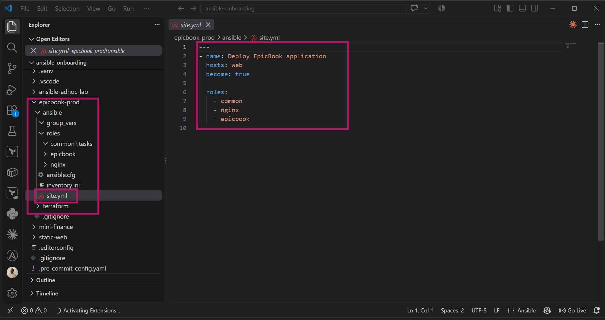

---

#### Screenshot 11 — Output of `ansible-playbook -i inventory.ini site.yml --syntax-check`

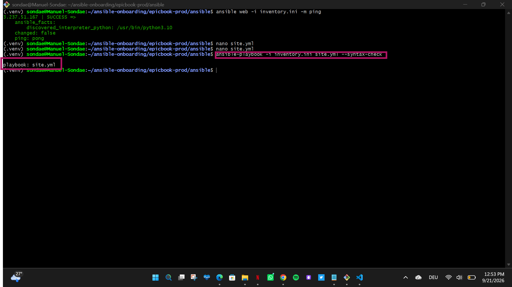

---

### Notes

Answer the following in your own words:

**1. What is the purpose of `site.yml`?**

It's the single entry point that ties the whole deployment together — calling each role in order against the right host group, rather than containing the actual task logic itself, which lives inside each individual role.

---

**2. Why should the roles run in the order `common`, `nginx`, and `epicbook`?**

Each role depends on what came before it — epicbook needs Git and other baseline tools that common installs, and nginx needs to be configured before it makes sense to deploy the app behind it. Running them out of order would mean later roles failing because their prerequisites aren't in place yet.

---

**3. What does `become: true` allow Ansible to do?**

Run a task with elevated (root/sudo) privileges on the remote host, needed for anything a normal user account can't do on its own — installing packages, writing to system directories, managing services.

---

# Task 6 — Create the `common` Role

## Goal

Create the `common` role to prepare the Ubuntu VM with the basic packages required for the EpicBook deployment.

This role handles the common server setup before Nginx and the application are configured.

### Evidence

#### Screenshot 12 — `roles/common/tasks/main.yml` showing the common setup tasks

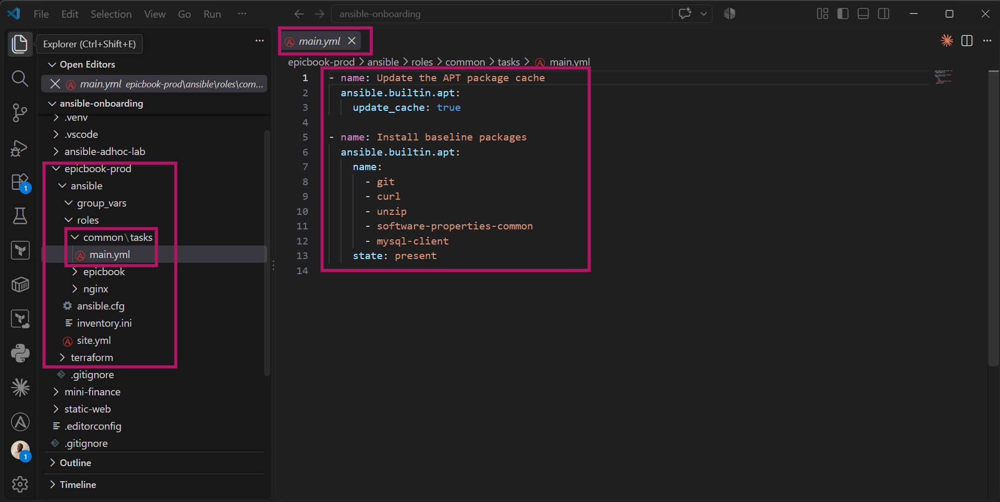

---

### Notes

Answer the following in your own words:

**1. What is the responsibility of the `common` role?**

Installing the baseline OS-level packages every server in this project needs regardless of its specific job — updating the package cache and installing git, curl, unzip, software-properties-common, and mysql-client.

---

**2. Why should Nginx installation not be placed inside the `common` role?**

common is meant to hold genuinely generic, application-agnostic setup — Nginx is specific to the web-serving layer, not something every possible future server in this project would need. Keeping it in its own nginx role means a server that doesn't need a reverse proxy at all wouldn't carry that dependency, and the role stays reusable on its own terms.

---

**3. Why is `mysql-client` useful in this deployment?**

It lets the VM connect directly to the managed MySQL database for tasks like checking whether the schema's already been imported and running the actual SQL import — without it, there'd be no way to interact with the database from the command line at all.

---

# Task 7 — Create the `nginx` Role

## Goal

Create the `nginx` role to install Nginx and configure it as a reverse proxy for the EpicBook application.

Nginx will receive browser traffic on port `80` and forward it to the EpicBook Node.js application running on the VM.

### Evidence

#### Screenshot 13 — `roles/nginx/tasks/main.yml` showing Nginx installation and site configuration tasks

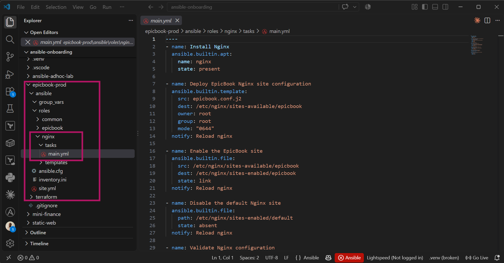

---

#### Screenshot 14 — `roles/nginx/templates/epicbook.conf.j2` showing the reverse proxy configuration

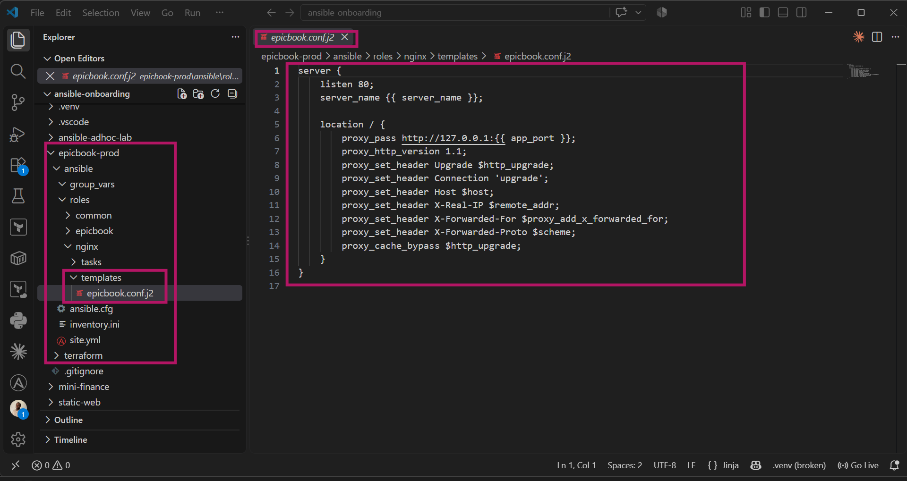

---

### Notes

Answer the following in your own words:

**1. What is the responsibility of the `nginx` role?**

Installing Nginx, deploying the reverse-proxy site configuration from a template, disabling the default site, validating the config, and ensuring the service is running and enabled.

---

**2. Why is Nginx configured as a reverse proxy in this deployment?**

EpicBook runs as a Node.js process on its own port (8080) — Nginx sits in front of it on the standard web port 80, forwarding requests through, so the app doesn't need to run directly on a privileged port and can benefit from Nginx handling things like connection headers consistently.

---

**3. Why should the application port come from `group_vars/web.yml` instead of being hard-coded?**

If the port ever needs to change, it's a one-line edit in a single variables file instead of hunting through every task or template that references it — the Nginx config template and the app's own startup both stay in sync automatically since they read the same variable.

---

# Task 8 — Create the `epicbook` Role

## Goal

Create the `epicbook` role to deploy the EpicBook application, connect it to the managed MySQL database, and run the application on port `8080` using PM2.

### Evidence

#### Screenshot 15 — `roles/epicbook/tasks/main.yml` showing application deployment tasks

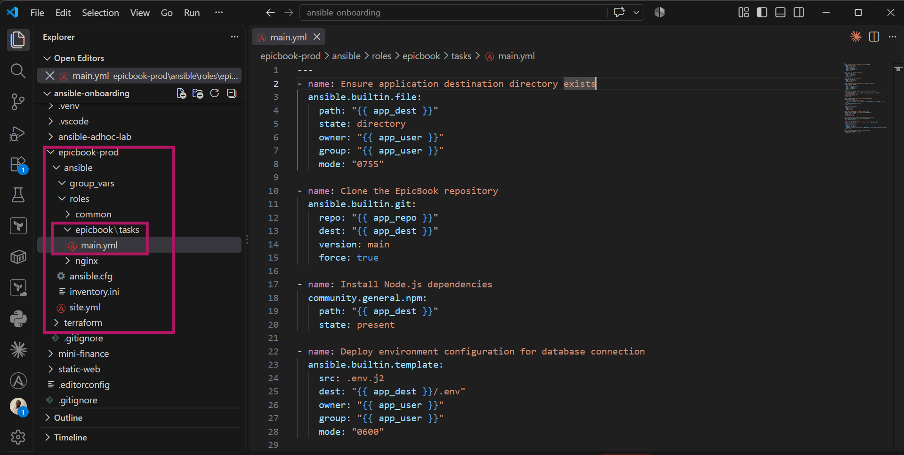
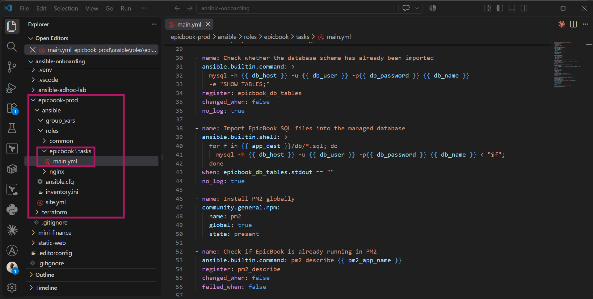
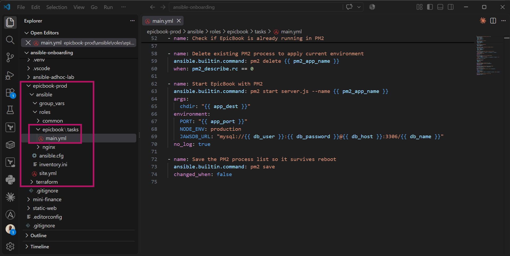

---

#### Screenshot 16 — Task or file showing how the database connection is configured, with secrets hidden

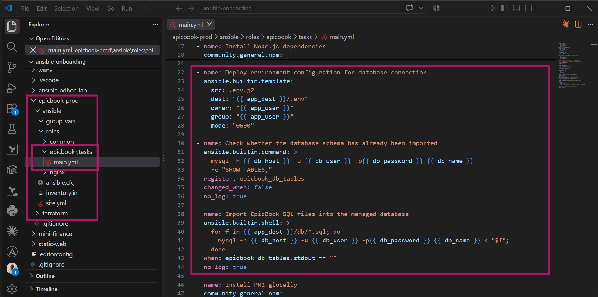

---

#### Screenshot 17 — Task or output showing the EpicBook application managed by PM2

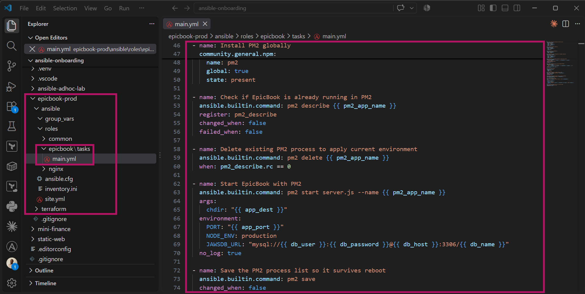

---

### Notes

Answer the following in your own words:

**1. What is the responsibility of the `epicbook` role?**

Installing Node.js, cloning and configuring the EpicBook application, connecting it to the managed database, importing the schema and seed data, and starting the app under PM2

---

**2. Why is PM2 used for the EpicBook Node.js application?**

It keeps the app running in the background independent of the SSH session that started it, restarts it automatically if it crashes, and lets its process list be saved so the app comes back up after a reboot — none of which a plain node server.js foreground process provides on its own.

---

**3. Why should database passwords not be hard-coded in public files?**

A hard-coded password in a task file or template ends up in version control, visible to anyone with repo access and preserved in Git history even if removed later — Ansible Vault keeps the actual secret encrypted at rest, with only the reference to it appearing in plain files.

---

**4. What does it mean for the application to run on port `8080` while Nginx listens on port `80`?**

They're two separate layers — Nginx is what the outside world actually connects to, on the conventional web port; the app itself listens privately on 8080, only reachable from Nginx's proxy_pass, not directly from the internet. Nginx receives the public request and forwards it internally to whatever port the app actually runs on.

---

# Task 9 — Create Group Variables

## Goal

Create reusable variables for the EpicBook deployment.

The `group_vars/web.yml` file stores values that can be reused across the Ansible roles.

### Evidence

#### Screenshot 18 — `group_vars/web.yml` showing the application, PM2, and database variables, with passwords hidden or masked

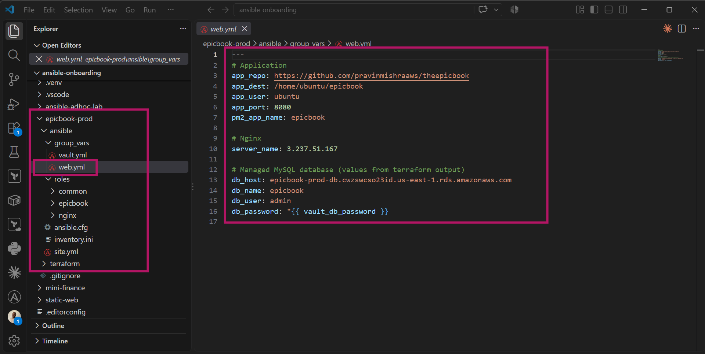

---

### Notes

Answer the following in your own words:

**1. What is the purpose of `group_vars/web.yml`?**

To centralize the variables specific to the web host group — application settings, connection details, and file paths — so every role that needs them reads from one shared source instead of each task hardcoding its own values.

---

**2. Which values did you store in `group_vars/web.yml`?**

App repo URL, deployment path, app user, app port, PM2 process name, the Nginx server name, and the database host, name, and username. The actual password value was kept out of this plain file entirely.

---

**3. How did you handle the database password securely?**

Stored it in a separate group_vars/web/vault.yml file encrypted with Ansible Vault, referenced from vars.yml as "{{ vault_db_password }}" — the plain-text variables file never contains the real secret, and running the playbook requires the vault password to decrypt it at runtime.

---

# Task 10 — Run the Ansible Playbook

## Goal

Run the Ansible playbook to configure the VM and deploy the EpicBook application.

The playbook should run the roles in this order:

1. `common`
2. `nginx`
3. `epicbook`

### Evidence

#### Screenshot 19 — Ansible playbook output showing the roles running

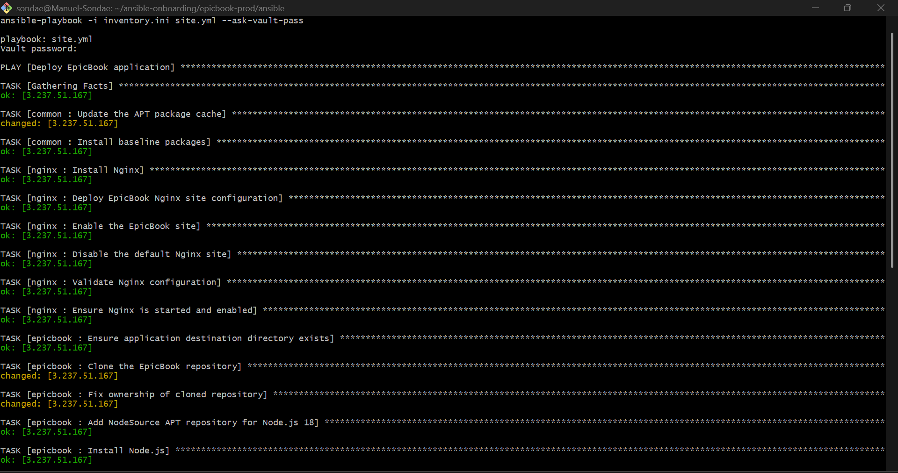

---

#### Screenshot 20 — Final Ansible recap showing `failed=0`

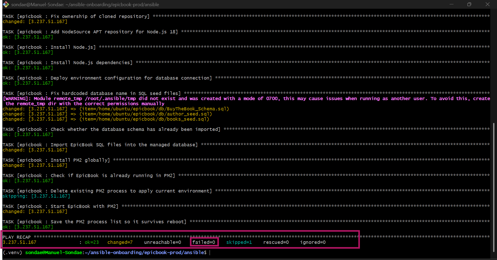

---

#### Screenshot 21 — Output of `ansible web -i inventory.ini -m command -a "systemctl is-active nginx" --become`

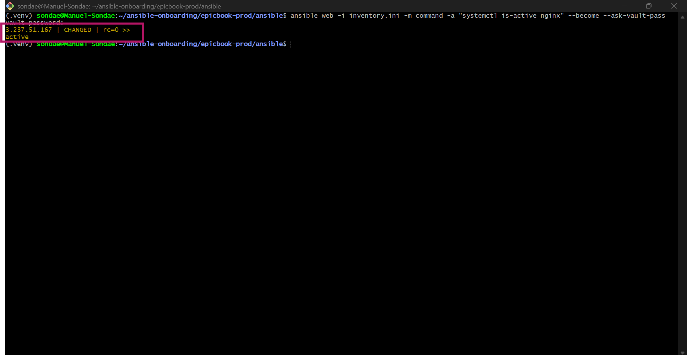

---

#### Screenshot 22 — Output of `ansible web -i inventory.ini -m command -a "pm2 status"`

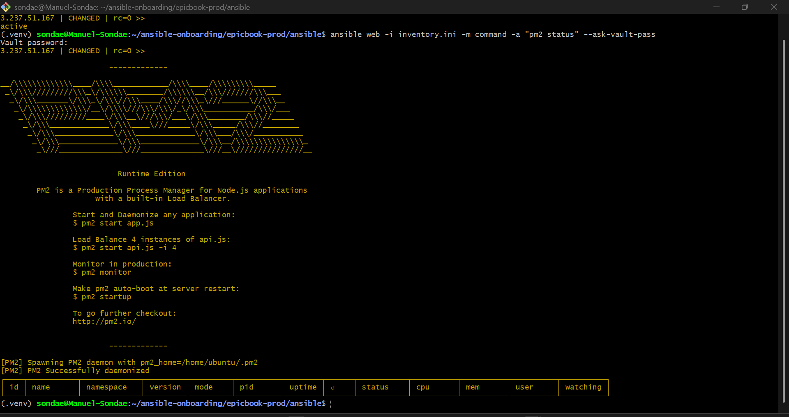

---

#### Screenshot 23 — Output of `ansible web -i inventory.ini -m command -a "curl -I http://localhost:8080"`

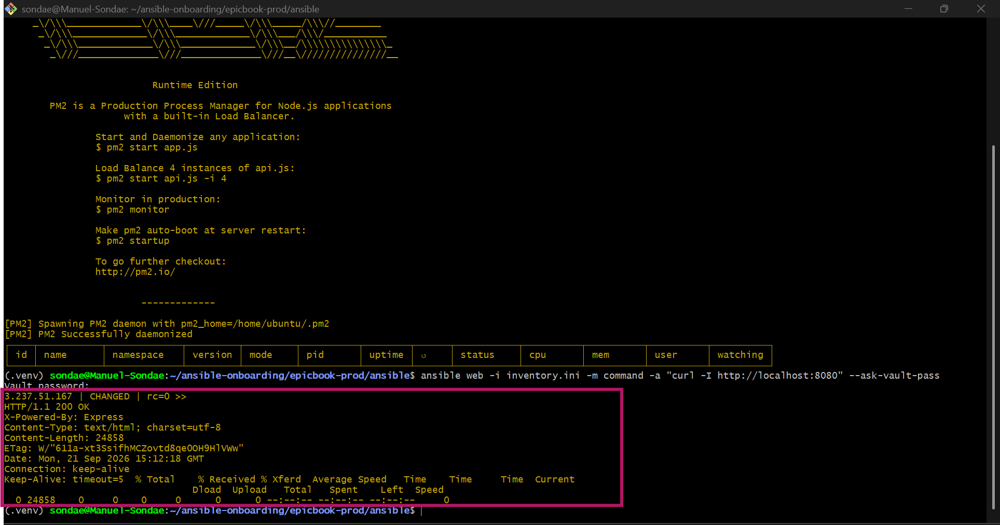

---

### Notes

Answer the following in your own words:

**1. What command did you run to execute the Ansible playbook?**

ansible-playbook -i inventory.ini site.yml --ask-vault-pass

---

**2. How do you know all roles completed successfully?**

The final PLAY RECAP shows failed=0 and unreachable=0 across every host, meaning every task in every role — common, nginx, and epicbook — ran without error.

---

**3. What proves that Nginx is active?**

systemctl is-active nginx
returning active, along with curl -I http://localhost returning a response through port 80.

---

**4. What proves that PM2 is managing the EpicBook application?**

pm2 status
showing the epicbook process listed with status online.

---

**5. What proves that the EpicBook application responds on port `8080`?**

curl -I http://localhost:8080
returning HTTP/1.1 200 OK with X-Powered-By: Express in the headers, confirming the actual Node app is responding, not just that something is listening on the port.

---

# Task 11 — Verify the EpicBook Deployment

## Goal

Verify that the EpicBook application is running, accessible in the browser, and connected to the managed MySQL database.

### Evidence

#### Screenshot 24 — Output of `curl -I http://<public_ip>`

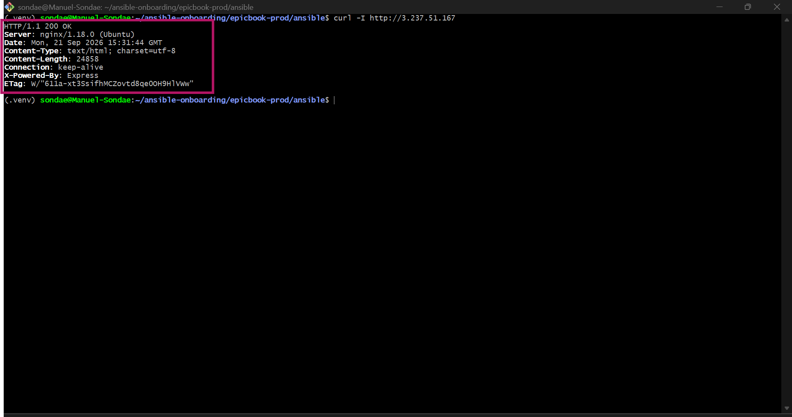

---

#### Screenshot 25 — Output of the cart API test command

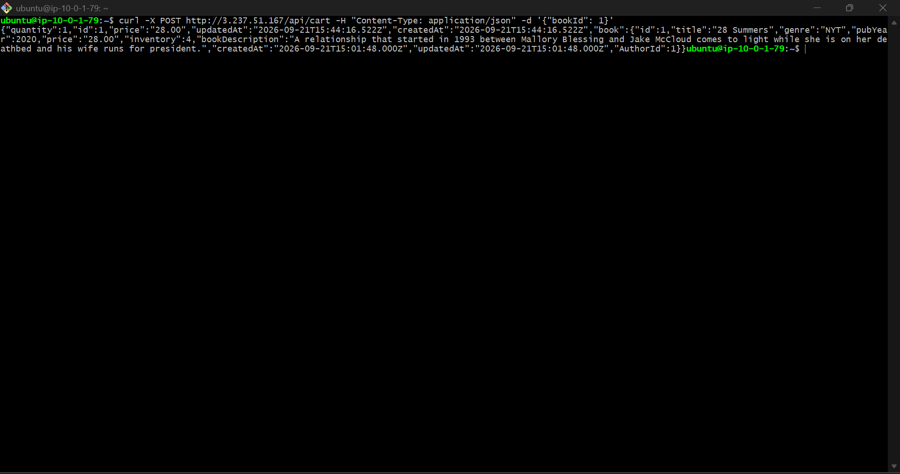

---

#### Screenshot 26 — Output of the `/cart` HTTP status check

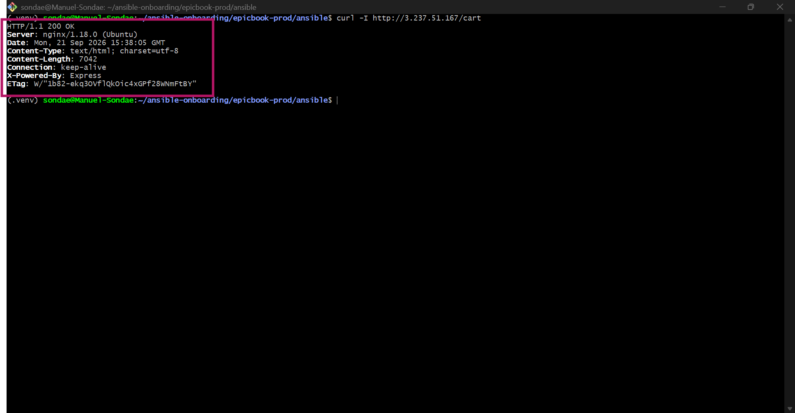

---

#### Screenshot 27 — Browser showing the EpicBook application loaded from `http://<public_ip>`

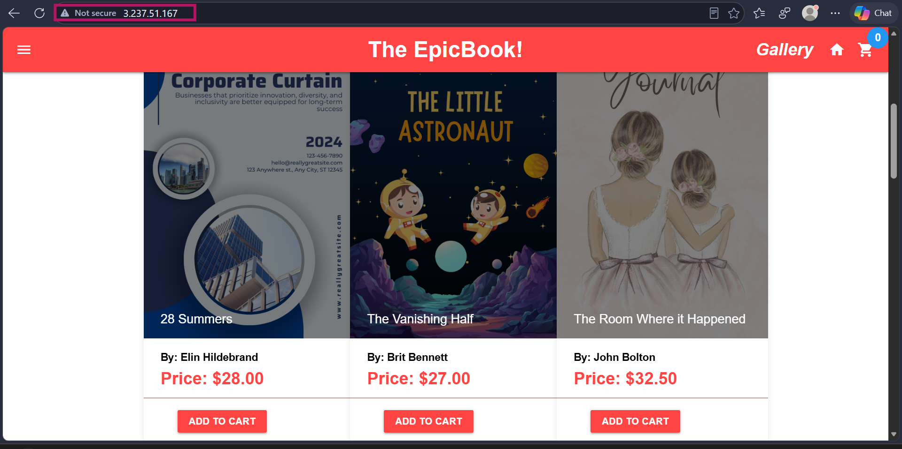

---

### Notes

Answer the following in your own words:

**1. What HTTP response did you receive from the public application URL?**

HTTP/1.1 200 OK, confirming the app is publicly reachable through Nginx on port 80.

---

**2. What did the cart API test prove?**

That the write path actually works end to end — a POST /api/cart request creates a real row in the Cart table, meaning the Express route, Sequelize model, and MySQL connection are all genuinely functioning together, not just that the app boots.

---

**3. What did the `/cart` status check return?**

HTTP/1.1 200 OK, with the actual Express-rendered page content, confirming the route is reachable and serving real data through the full Nginx-to-Node chain

---

**4. What issue did you face during verification, and how did you fix it?**

Nginx kept returning its default static page even with a correct proxy_pass config already on disk — confirmed by seeing Last-Modified/ETag headers that only appear when serving a static file, not a proxied response. A reload hadn't been enough to apply the change; running systemctl restart nginx forced it through and resolved it immediately

---

# LinkedIn Post Required

## Evidence

#### LinkedIn Post URL

Paste your LinkedIn post URL here:

https://www.linkedin.com/posts/emmanuel-sunday-210a08323_dmibypravinmishra-aws-terraform-activity-7507850482233757696-0QCj?utm_source=share&utm_medium=member_desktop&rcm=ACoAAFHXXywBq0IrgBBhbi5ULmCrDuZgCEYc6fQ

---

#### Screenshot — Published LinkedIn post

---

# Assignment Questions

Answer the following in your own words:

**1. Why is Terraform used for infrastructure provisioning?**

It lets you declare the desired end state of your infrastructure in code once, and provision, update, or tear it down consistently — instead of manually clicking through a console, which is slower, harder to repeat exactly, and leaves no record of what was actually built.

---

**2. Why are Ansible roles useful for production-style deployments?**

They break configuration into self-contained, independently reusable units by responsibility, instead of one flat file. A production deployment usually spans multiple concerns — OS baseline, web server, application — and roles let each of those be maintained, tested, and reused separately.

---

**3. What is the purpose of `group_vars/web.yml`?**

Centralizes the variables specific to the web host group — connection details, paths, application settings — so every role reads from one shared source instead of each task hardcoding its own values.

---

**4. Why should database passwords not be committed to GitHub?**

Anything committed to a repository is visible to anyone with access and stays in Git history even after being removed — a leaked database password could give someone direct access to production data, not just the codebase.

---

**5. What is the purpose of Nginx in this deployment?**

Acts as a reverse proxy, receiving public requests on the standard web port and forwarding them internally to the Node.js application running on its own port — keeping the app off a privileged port and giving a consistent public-facing layer.

---

**6. Why should the managed MySQL database not be publicly accessible?**

A publicly accessible database can be reached and attacked directly from the internet, bypassing the application entirely. Restricting it to only the application server's security group means the database is only reachable through a controlled, known path.

---

**7. Why is PM2 used for the EpicBook Node.js application?**

Keeps the app running independently of the SSH session that started it, restarts it automatically if it crashes, and persists the process list so it comes back up after a reboot.

---

**8. What does idempotency mean in Ansible?**

Running a task repeatedly produces the same end state without unnecessary changes — a task that's already satisfied reports ok rather than changed, so rerunning a playbook is safe and doesn't redo work that's already done.

---

**9. What issue did you face during the deployment, and how did you fix it?**

Nginx kept serving its default static page despite a correct reverse-proxy config already on disk, confirmed by static-file-only headers in the response. A reload wasn't sufficient to apply it — a full systemctl restart nginx resolved it.

---

**10. What security improvement would you make before using this setup in production?**

Restrict SSH access to a specific known IP range rather than open access, and move the database password fully into a secrets manager with automatic rotation rather than a manually-managed Vault file.

---

# Required Files

Confirm that the following files are included in your GitHub repository or assignment folder:

- [ ] `README.md`
- [ ] Terraform files under either `terraform/azure/` or `terraform/aws/`
- [ ] `ansible/ansible.cfg`
- [ ] `ansible/inventory.ini`
- [ ] `ansible/site.yml`
- [ ] `ansible/group_vars/web.yml`
- [ ] `ansible/roles/common/tasks/main.yml`
- [ ] `ansible/roles/nginx/tasks/main.yml`
- [ ] `ansible/roles/nginx/templates/epicbook.conf.j2`
- [ ] `ansible/roles/epicbook/tasks/main.yml`

---

# Submission Instructions

- Add all required screenshots in your submission.
- Full Name must be visible in required screenshots.
- Mention the cloud provider used: Azure or AWS.
- Add the VM public IP address.
- Add the final application URL.
- Add Terraform output proof.
- Add Ansible role tree proof.
- Add all required notes and assignment question answers.
- Add your LinkedIn post URL.
- Do not expose SSH private keys, passwords, cloud credentials, database credentials, Terraform state files, subscription IDs, or account IDs.

---

# Completion Checklist

- [ ] Task 1: Project folder layout created
- [ ] Task 2: Terraform infrastructure provisioned
- [ ] Task 3: SSH key-based access verified
- [ ] Task 4: Ansible inventory and configuration created
- [ ] Task 5: Main Ansible playbook created
- [ ] Task 6: `common` role created
- [ ] Task 7: `nginx` role created
- [ ] Task 8: `epicbook` role created
- [ ] Task 9: Group variables created
- [ ] Task 10: Ansible playbook run completed
- [ ] Task 11: EpicBook deployment verified
- [ ] Terraform files created under only one cloud provider folder
- [ ] One Ubuntu VM was created
- [ ] One managed MySQL database was created
- [ ] SSH port `22` is restricted to the controller public IP
- [ ] HTTP port `80` is accessible
- [ ] MySQL port `3306` is not publicly open
- [ ] `ansible web -i inventory.ini -m ping` returns `SUCCESS`
- [ ] `site.yml` calls the roles in the correct order
- [ ] Database secrets are hidden or handled securely
- [ ] Nginx is active
- [ ] PM2 shows the EpicBook application running
- [ ] EpicBook responds on port `8080`
- [ ] Public URL loads in the browser
- [ ] Cart API verification works
- [ ] Playbook completes with `failed=0`
- [ ] Screenshots 1–27 are included
- [ ] Assignment questions are answered
- [ ] LinkedIn post published
- [ ] LinkedIn post URL added
- [ ] No sensitive information is exposed

---

## About DMI & CloudAdvisory

DevOps Micro Internship (DMI) is a project-based DevOps program run by Pravin Mishra and The CloudAdvisory, focused on real-world execution, systems thinking, and career readiness.

It helps learners build strong DevOps foundations with hands-on experience.

---

## Resources

- DMI Official Website: [https://dmi.pravinmishra.com?utm_source=github&utm_medium=readme](https://dmi.pravinmishra.com?utm_source=github&utm_medium=readme)
- University: [https://university.pravinmishra.com?utm_source=github&utm_medium=readme](https://university.pravinmishra.com?utm_source=github&utm_medium=readme)
- Discord Community: [https://discord.pravinmishra.com?utm_source=github&utm_medium=readme](https://discord.pravinmishra.com?utm_source=github&utm_medium=readme)
- Blog: [https://dmi.pravinmishra.com/blog?utm_source=github&utm_medium=readme](https://dmi.pravinmishra.com/blog?utm_source=github&utm_medium=readme)
- YouTube Playlist: [https://www.youtube.com/playlist?list=PLFeSNDtI4Cho](https://www.youtube.com/playlist?list=PLFeSNDtI4Cho)
- Pravin Mishra LinkedIn: [https://www.linkedin.com/in/pravin-mishra-aws-trainer/](https://www.linkedin.com/in/pravin-mishra-aws-trainer/)
- CloudAdvisory LinkedIn: [https://www.linkedin.com/company/thecloudadvisory/](https://www.linkedin.com/company/thecloudadvisory/)

---

*This submission is part of DevOps Micro Internship (DMI) — Agentic AI Track.*