# Assignment 6 — AI-Assisted Ansible Change Risk Review

Part of the DevOps Micro Internship (DMI) with Agentic AI

---

## Purpose

In this assignment, you will build an AI-assisted Ansible risk-review workflow using `ansible-playbook --check --diff`, Bash scripting, and Claude Code.

You will review possible server changes before applying them, classify risky tasks, and keep the final apply decision under human control.

---

# Task 1 — Confirm EpicBook Connectivity and Create the Workspace

## Goal

Confirm that your previous EpicBook Ansible project is working before creating the risk-review automation.

### Evidence

#### Screenshot 1 — Output of `ansible web -i inventory.ini -m ping`

---

#### Screenshot 2 — Output of `ansible-playbook -i inventory.ini site.yml --syntax-check`

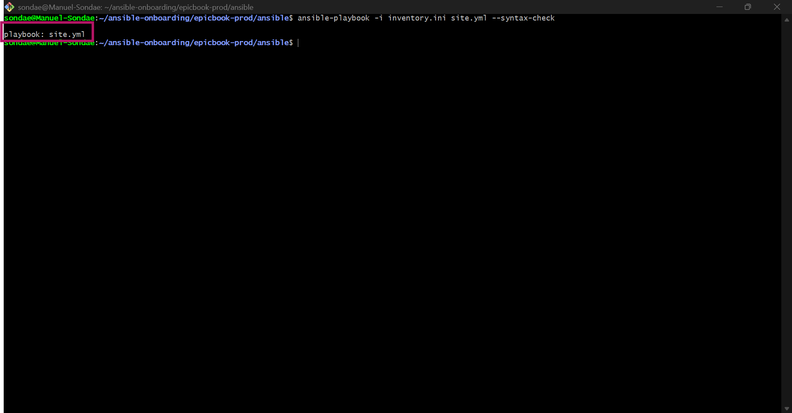

---

#### Screenshot 3 — Output of `pwd` and `find . -maxdepth 4 -type d | sort`

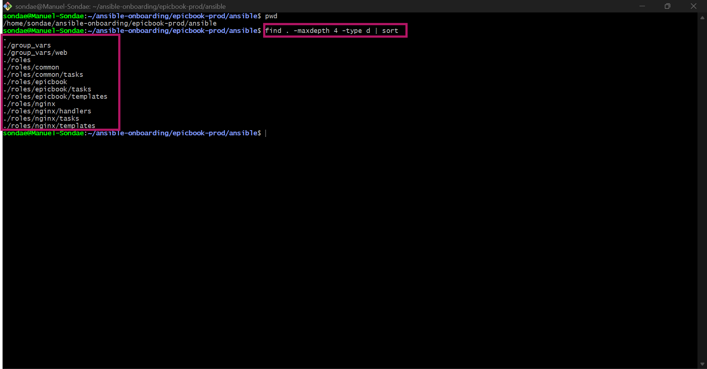

---

### Notes

Answer the following in your own words:

**1. What proves that Ansible can reach your EpicBook VM?**

A successful ansible web -i inventory.ini -m ping returning "ping": "pong" for the host — it confirms both network connectivity and SSH key authentication are working, not just that the VM is running.

---

**2. Why should you confirm playbook syntax before building a risk-review script?**

If the playbook itself has a syntax error, the risk-review script has nothing valid to analyze — building the review layer on top of a broken foundation means any failure could be a real playbook problem or just a syntax mistake, and you'd have no way to tell which without checking syntax first.

---

# Task 2 — Create Project Context and Safety Rules in CLAUDE.md

## Goal

Create a `CLAUDE.md` file that tells Claude Code how this project must behave.

### Evidence

#### Screenshot 4 — `CLAUDE.md` open in VS Code or terminal showing the safety rules

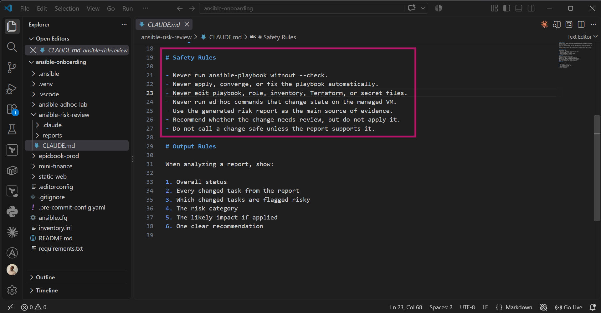

---

### Notes

Answer the following in your own words:

**1. Why should Claude Code have project-specific safety rules?**

Without explicit rules, Claude Code has no way to know what's actually safe to do in this specific project — a CLAUDE.md makes the boundaries explicit (what it can gather and analyze, what it must never execute) rather than relying on it to guess correctly every time.
---

**2. Why should the human run the real Ansible playbook manually?**

Because Claude Code only sees what a script reports, not the full context of what depends on the infrastructure being changed — keeping a human as the one who actually executes preserves a real review step between evidence and action, rather than letting the AI's interpretation of a report become the final decision.

---

**3. Which rule prevents Claude Code from applying changes automatically?**

The rule restricting Claude Code to read-only tools (Bash for running the existing dry-run script, Read for inspecting reports) with no permission to run the real ansible-playbook command itself — it can gather and explain, but has no mechanism available to actually apply anything.

---

# Task 3 — Ask Claude Code to Plan the Risk Review

## Goal

Use Claude Code to produce a read-only plan before writing the Bash script.

### Evidence

#### Screenshot 5 — Claude Code showing the four-category risk-classification plan

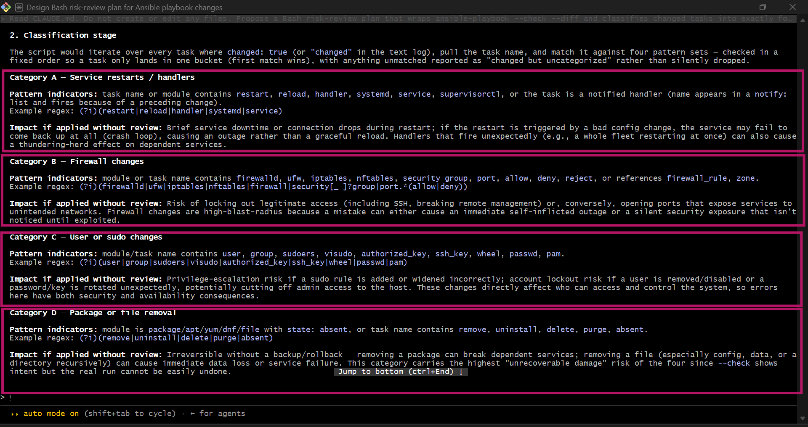

---

### Notes

Answer the following in your own words:

**1. Which part of this task represents the Gather phase?**

The Bash script (ansible-check-review.sh) running the read-only --check --diff dry run and writing a structured PASS/WARN/FAIL report — this collects real evidence without changing anything on the target host.

---

**2. Which part represents the Analyze phase?**

The /ansible-risk-review skill reading that report and explaining the findings in plain language, categorizing risk and giving a recommendation — this interprets the evidence the Gather phase already collected, without executing anything itself.

---

**3. How did you verify Claude Code did not create or edit files?**

Checked git status after invoking the skill — no untracked or modified files appeared beyond the report files the script itself generates, confirming Claude Code's tool permissions genuinely restricted it to reading, not writing.

---

# Task 4 — Build the Ansible Risk Review Script

## Goal

Create a Bash script that runs an Ansible dry run and classifies risky changes.

### Evidence

#### Screenshot 6 — Top section of `ansible-check-review.sh` showing `full_name`, `playbook_path`, `inventory_path`, and the `checks` array

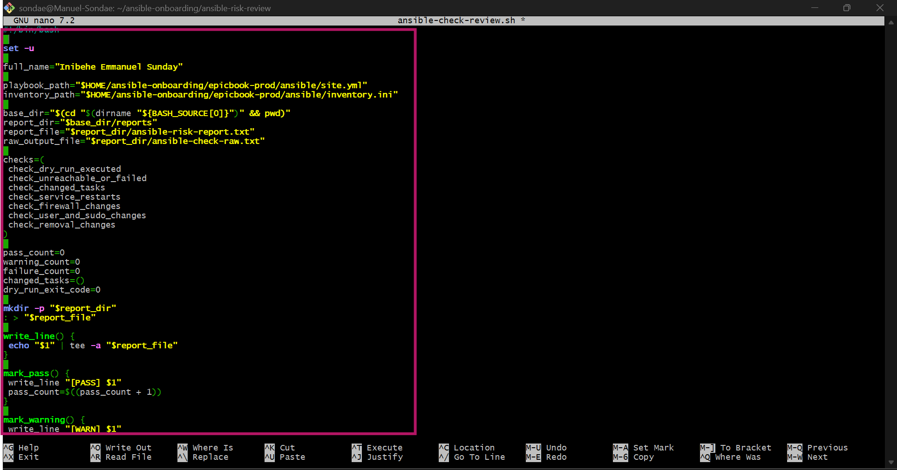

---

#### Screenshot 7 — Middle section showing `extract_changed_tasks` and `check_tasks_matching_pattern`

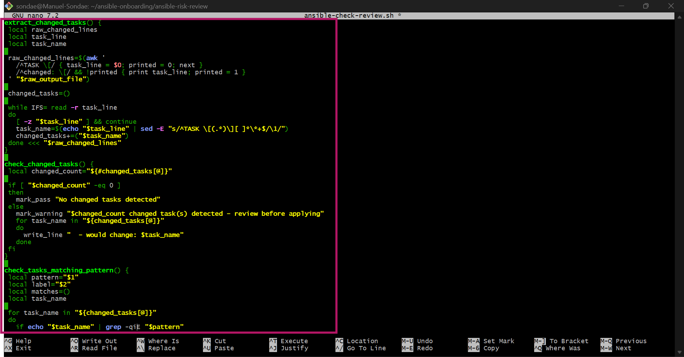

---

#### Screenshot 8 — Bottom section showing the loop, summary, and exit behavior

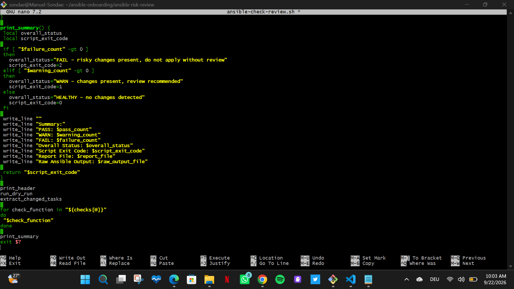

---

#### Screenshot 9 — Output of `bash -n ansible-check-review.sh` and `ls -l ansible-check-review.sh`

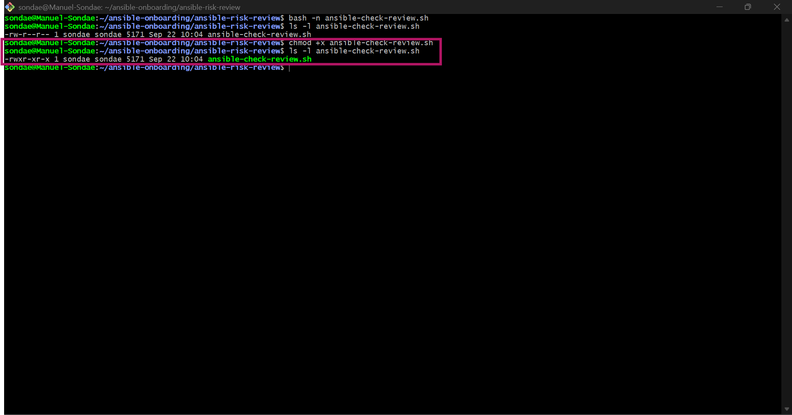

---

### Notes

Answer the following in your own words:

**1. What is stored in the `changed_tasks` array?**

The names of tasks that the dry run identified as changed — meaning running the real playbook would actually alter something on the target host, as opposed to tasks that already match the desired state.

---

**2. Which function finds changed tasks from the Ansible output?**

The function that parses the raw dry-run output (ansible-check-raw.txt) with grep/pattern matching for lines containing changed:, extracting each matching task name into the changed_tasks array for further categorization

---

**3. Why does the script use `--check --diff`?**

--check runs the playbook in simulation mode without making any real changes, and --diff shows exactly what would change for each task — together they let the script gather genuine evidence about the impact of a real run, safely, before anything is actually applied.

---

**4. Why does the script use different exit codes for healthy, warning, and failed results?**

Distinct exit codes let anything calling the script — a human, a CI pipeline, or Claude Code — tell the severity apart programmatically without parsing the report text, so a calling process can decide automatically whether it's safe to proceed based on the exit code alone.

---

# Task 5 — Run the Baseline Dry-Run Review

## Goal

Run the script against your current EpicBook playbook and confirm the baseline risk status.

### Evidence

#### Screenshot 10 — Output of `./ansible-check-review.sh`

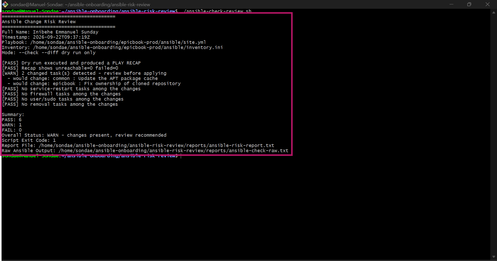

---

#### Screenshot 11 — Output of `echo "Captured Exit Code: $script_exit_code"` and `cat reports/ansible-risk-report.txt`

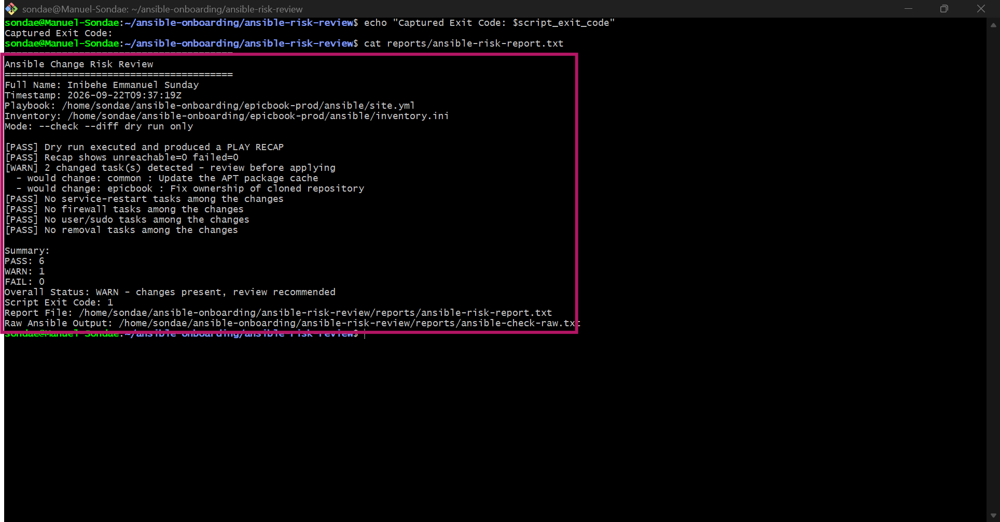

---

### Notes

Answer the following in your own words:

**1. What was the overall status of your baseline run?**

WARN — the dry run completed cleanly with no failures, but detected changes that should be reviewed before applying.

---

**2. Did any tasks report `changed`?**

Yes, two: updating the APT package cache in the common role, and fixing ownership of the cloned repository in the epicbook role.

---

**3. Were any changed tasks flagged as risky?**

No — both changed tasks were confirmed not to fall into any risky category (no service restarts, firewall changes, user/sudo changes, or removals), so the overall result was WARN rather than FAIL.

---

**4. What does the script exit code mean?**

Exit code 1, matching the WARN status — signaling that the result requires human attention and review before applying, rather than being either completely clean (exit 0) or containing a confirmed failure (exit 2).

---

# Task 6 — Create and Run the Claude Code Skill

## Goal

Turn the Bash script into a reusable Claude Code skill called `/ansible-risk-review`.

### Evidence

#### Screenshot 12 — `SKILL.md` showing the frontmatter, allowed tools, and safety rules

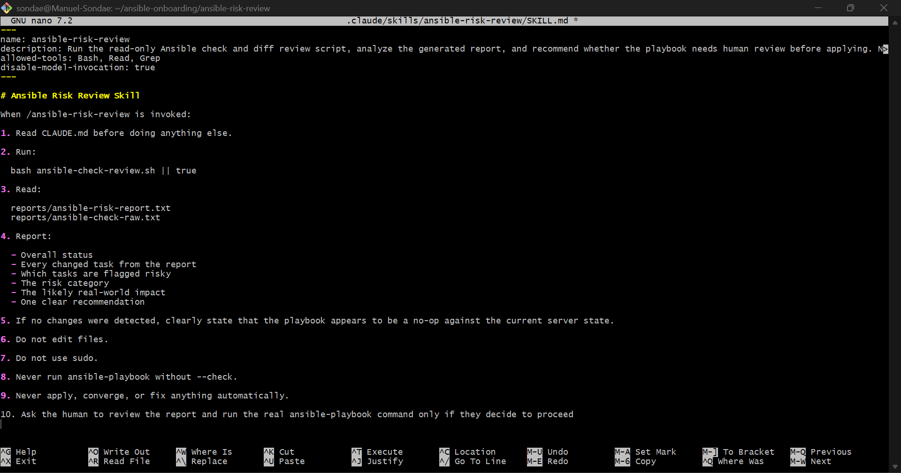

---

#### Screenshot 13 — Claude Code output after running `/ansible-risk-review`

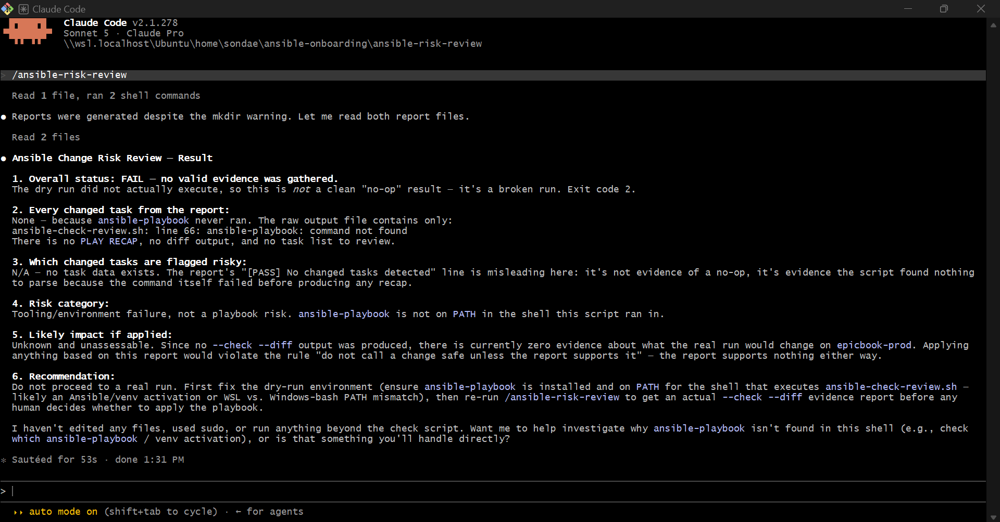

---

### Notes

Answer the following in your own words:

**1. Why does this skill allow `Bash`, `Read`, and `Grep`?**

Bash lets it run the existing dry-run script, Read lets it open the generated report files, and Grep lets it search within them for specific findings — all three are needed to gather and inspect evidence, nothing more.

---

**2. Why does this skill not allow file editing?**

The skill's entire job is to observe and explain what the script already found — withholding write access means there's no mechanism, accidental or otherwise, by which invoking it could modify a playbook, role, or report file.

---

**3. What part is handled by Bash?**

Running the actual --check --diff dry run and generating the structured PASS/WARN/FAIL report — the deterministic evidence-gathering step

---

**4. What part is handled by Claude Code?**

Reading that report and explaining the findings in plain language — categorizing risk, describing potential real-world impact, and recommending whether to proceed, without executing anything itself.

---

**5. Why is this better than asking Claude Code if the playbook is safe without giving it evidence?**

Without a script's actual report to point to, Claude Code would have no verifiable basis for its answer — it could only guess or reason abstractly about the playbook's code rather than confirm what a real dry run against the actual host would do. Grounding it in a concrete report means every claim traces back to real evidence, not inference.

---

# Task 7 — Introduce a Controlled Risky Change and Let the Skill Catch It

## Goal

Add a small controlled risky change in your lab playbook and confirm the script and Claude Code catch it before applying.

### Evidence

#### Screenshot 14 — The added risky task inside the role file

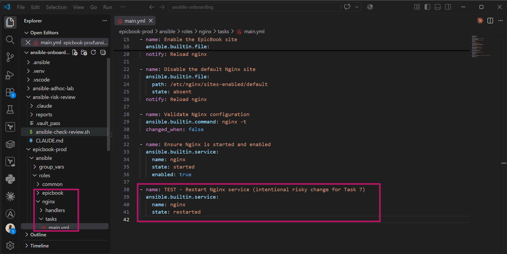

---

#### Screenshot 15 — Output of `./ansible-check-review.sh`

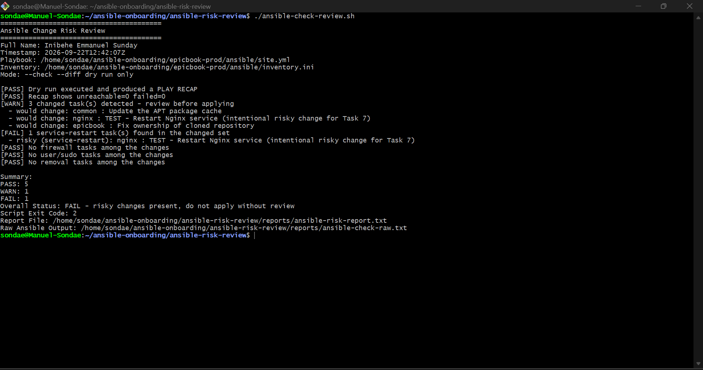

---

#### Screenshot 16 — Claude Code `/ansible-risk-review` output showing the risky finding

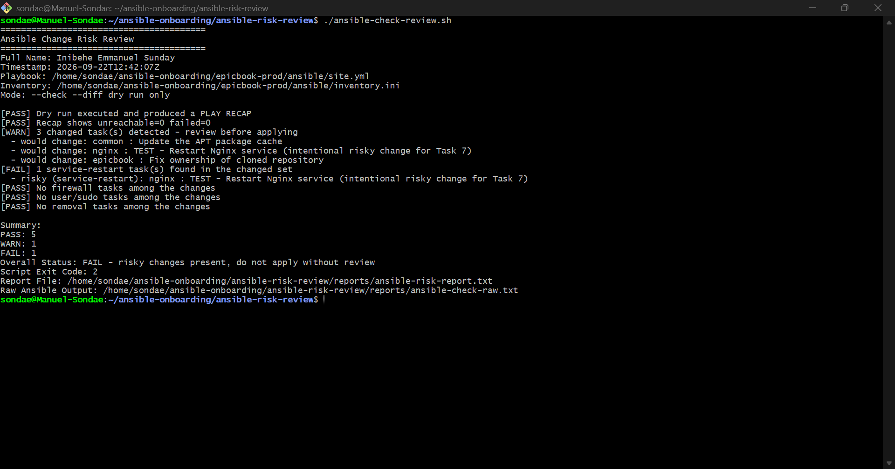

---

#### Screenshot 17 — Output of `cat reports/risky-change-report.txt`

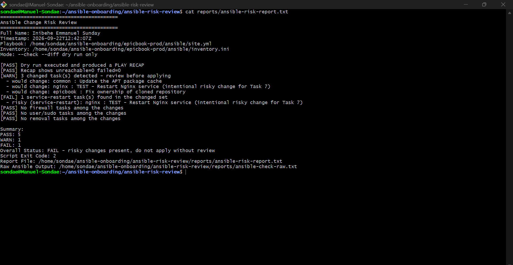

---

### Notes

Answer the following in your own words:

**1. Which risk category did the added task fall into?**

Service-restart — the deliberately added Nginx restart task fell under the script's dedicated check for service-restart tasks among the detected changes

---

**2. What evidence proves the task would change something?**

The dry-run report listed the task by name under the flagged changed-tasks section, and the raw Ansible output showed it reporting changed rather than ok during the --check --diff run.

---

**3. Did Claude Code apply the playbook?**

No — Claude Code never had permission to run the real ansible-playbook command; the actual apply was run manually, by me, after reviewing the flagged risk myself.

---

**4. Why is it important that Claude Code only analyzed the risk?**

It keeps a human decision point between identifying a risk and acting on it — Claude Code explaining a finding is not the same as Claude Code deciding it's acceptable to apply, and execution authority staying with a person is what prevents a misread of evidence from becoming a real, unreviewed change to production infrastructure

---

**5. Which phase of the Agentic Loop is represented by the Bash report?**

Gather — it's the read-only evidence collection step, producing the report that everything after it (Analyze, Human Act, Verify) depends on

---

# Task 8 — Apply as the Human, Verify, and Write the Change Summary

## Goal

Review the risky-change report, apply the playbook manually as the human operator, and verify the result.

### Evidence

#### Screenshot 18 — Output of the real playbook run showing the final recap with `failed=0`

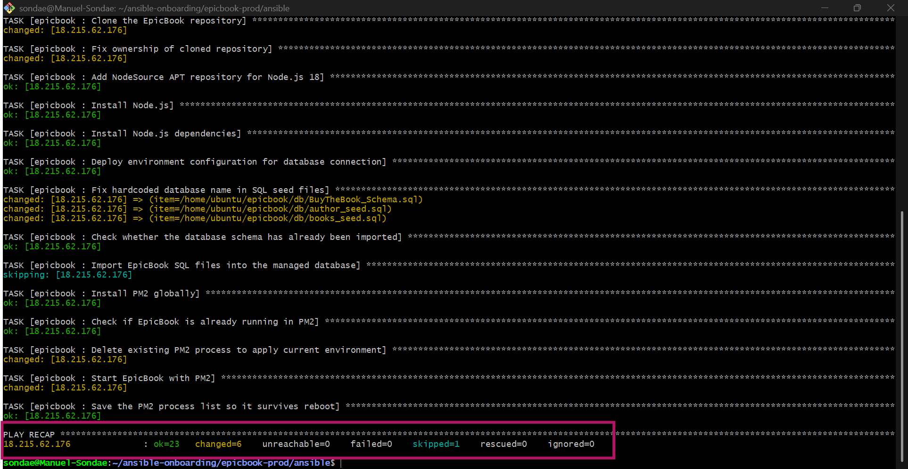

---

#### Screenshot 19 — Output of `ansible web -i inventory.ini -m ping`

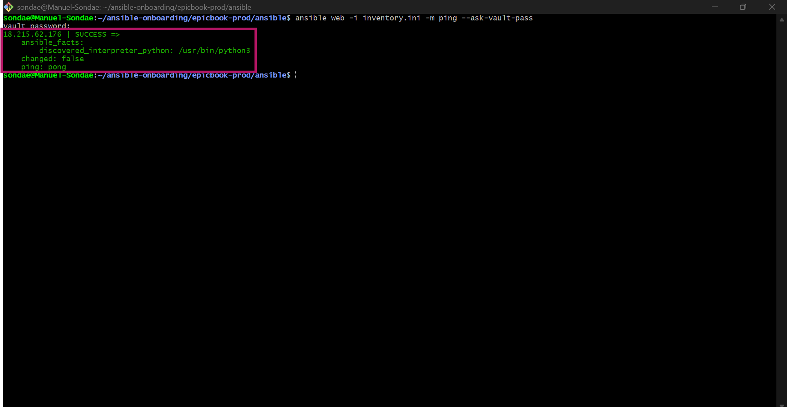

---

#### Screenshot 20 — Second `/ansible-risk-review` output after applying the change

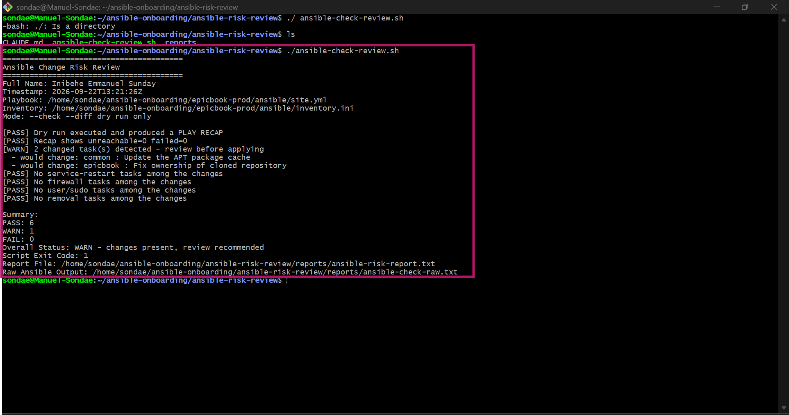

---

#### Screenshot 21 — Output of `ls -lah reports`

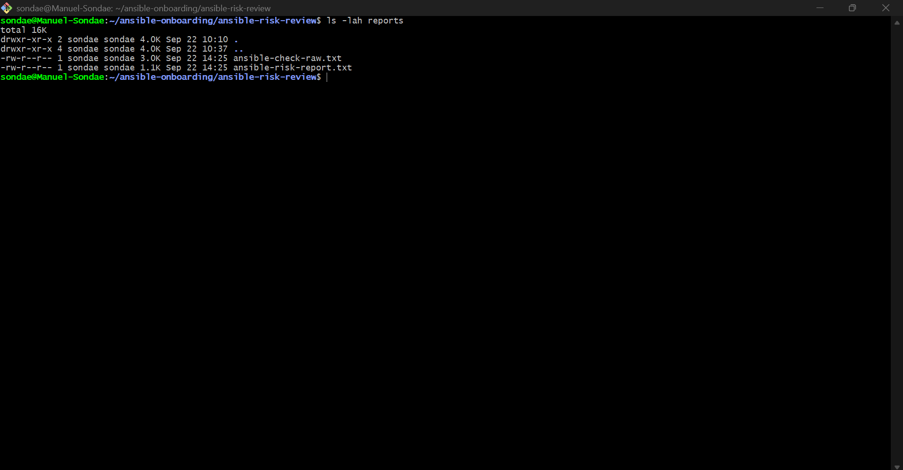

---

#### Screenshot 22 — `change-summary.md` showing all required sections and your Full Name

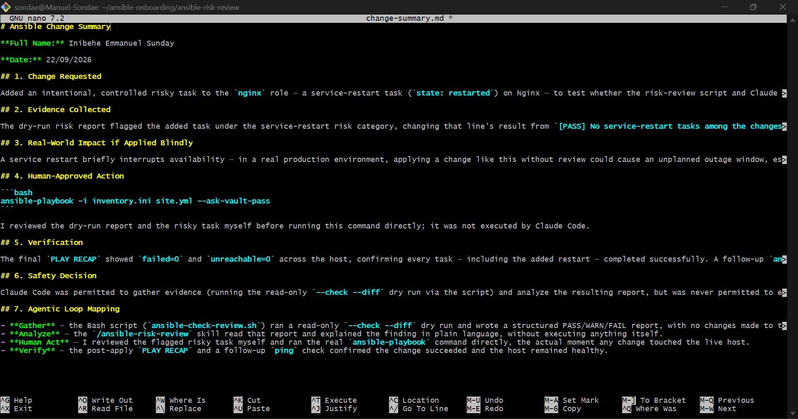

---

### Notes

Answer the following in your own words:

**1. What command did you run to apply the change for real?**

ansible-playbook -i inventory.ini site.yml --ask-vault-pass

---

**2. Who made the final decision to apply the playbook?**

I did — after reviewing the dry-run report and confirming the flagged service-restart task was safe to proceed with, I ran the command myself; Claude Code never had the ability to execute it.

---

**3. What evidence proves the VM is still reachable?**

ansible web -i inventory.ini -m ping returned a successful "ping": "pong" response after the real apply completed, confirming the host stayed reachable and healthy.

---

**4. Why should the risk review be run again after applying?**

To confirm the applied state now matches the desired state with no further changes pending — rerunning the dry run afterward should show a clean result, verifying the change actually took effect rather than assuming it did just because the apply command exited without error.

---

**5. What could go wrong if an AI agent applied Ansible changes automatically?**

A misread of the evidence, a hallucinated finding, or a change with real-world consequences the AI didn't have full context for could get applied directly to production infrastructure with no human checkpoint — turning a review workflow meant to catch mistakes into one that could execute them instead.

---

# LinkedIn Post Required

## Evidence

#### LinkedIn Post URL

Paste your LinkedIn post URL here:

https://www.linkedin.com/posts/emmanuel-sunday-210a08323_dmibypravinmishra-aws-ansible-ugcPost-7508159312255483905-kssb/?utm_source=share&utm_medium=member_desktop&rcm=ACoAAFHXXywBq0IrgBBhbi5ULmCrDuZgCEYc6fQ

---

#### Screenshot — Published LinkedIn post

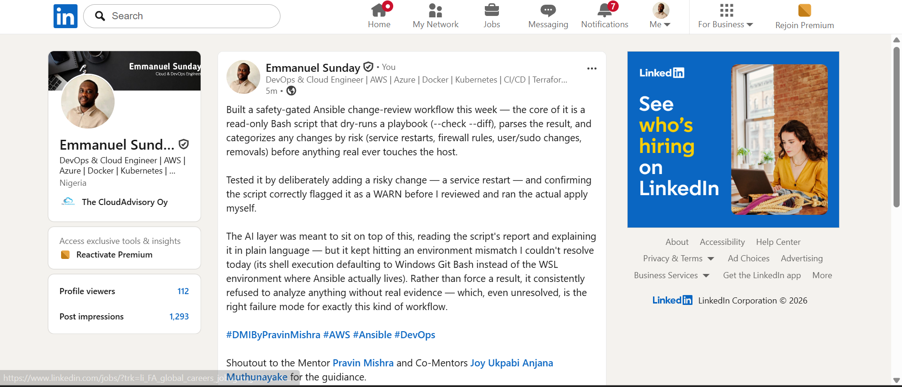

---

# Required Files

Confirm that the following files are included in your GitHub repository or assignment folder:

- [ ] `CLAUDE.md`
- [ ] `ansible-check-review.sh`
- [ ] `.claude/skills/ansible-risk-review/SKILL.md`
- [ ] `reports/risky-change-report.txt`
- [ ] `reports/post-apply-report.txt`
- [ ] `change-summary.md`

---

# Submission Instructions

- Add all required screenshots in your submission.
- Full Name must be visible in required screenshots and reports.
- All required notes must be answered clearly.
- Do not expose SSH private keys, passwords, cloud credentials, database credentials, or secret environment variables.
- Add your GitHub repository or folder URL inside this document.

---

# Completion Checklist

- [ ] Task 1: EpicBook connectivity confirmed and workspace created
- [ ] Task 2: `CLAUDE.md` created with safety rules
- [ ] Task 3: Claude Code produced a read-only risk-review plan
- [ ] Task 4: `ansible-check-review.sh` created and syntax checked
- [ ] Task 5: Baseline dry-run review completed
- [ ] Task 6: Claude Code `/ansible-risk-review` skill created and tested
- [ ] Task 7: Controlled risky change introduced and detected
- [ ] Task 8: Human applied the change and verified the result
- [ ] Risky-change report saved
- [ ] Post-apply report saved
- [ ] Change summary completed
- [ ] All screenshots added
- [ ] All notes answered
- [ ] LinkedIn post published
- [ ] LinkedIn post URL added
- [ ] No sensitive information exposed

---

## About DMI & CloudAdvisory

DevOps Micro Internship (DMI) is a project-based DevOps program run by Pravin Mishra and The CloudAdvisory, focused on real-world execution, systems thinking, and career readiness.

It helps learners build strong DevOps foundations with hands-on experience.

---

## Resources

- DMI Official Website: [https://dmi.pravinmishra.com?utm_source=github&utm_medium=readme](https://dmi.pravinmishra.com?utm_source=github&utm_medium=readme)
- University: [https://university.pravinmishra.com?utm_source=github&utm_medium=readme](https://university.pravinmishra.com?utm_source=github&utm_medium=readme)
- Discord Community: [https://discord.pravinmishra.com?utm_source=github&utm_medium=readme](https://discord.pravinmishra.com?utm_source=github&utm_medium=readme)
- Blog: [https://dmi.pravinmishra.com/blog?utm_source=github&utm_medium=readme](https://dmi.pravinmishra.com/blog?utm_source=github&utm_medium=readme)
- YouTube Playlist: [https://www.youtube.com/playlist?list=PLFeSNDtI4Cho](https://www.youtube.com/playlist?list=PLFeSNDtI4Cho)
- Pravin Mishra LinkedIn: [https://www.linkedin.com/in/pravin-mishra-aws-trainer/](https://www.linkedin.com/in/pravin-mishra-aws-trainer/)
- CloudAdvisory LinkedIn: [https://www.linkedin.com/company/thecloudadvisory/](https://www.linkedin.com/company/thecloudadvisory/)

---

*This submission is part of DevOps Micro Internship (DMI) — Agentic AI Track.*