# Assignment 5 — AI-Assisted Azure DevOps Dual-Pipeline Failure Triage

Part of the DevOps Micro Internship (DMI) — Agentic AI Track

---

## Student Information

**Full Name:** Inibehe Emmanuel Sunday

**GitHub Repository or Fork URL:** https://github.com/sundayinibehe75-afk/theepicbook

**Public LinkedIn Post URL:** https://www.linkedin.com/posts/emmanuel-sunday-210a08323_azuredevops-agenticai-claudecode-ugcPost-7511188229249818624-w7o2/?utm_source=share&utm_medium=member_desktop&rcm=ACoAAFHXXywBq0IrgBBhbi5ULmCrDuZgCEYc6fQ

---

## Purpose

In this assignment, I configured an AI-assisted, read-only failure-triage workflow for the EpicBook Infrastructure and Application Pipelines. The workflow uses Bash to gather Azure DevOps pipeline evidence and Claude Code to analyze the evidence and recommend a recovery action while keeping all changes under human control.

---

# Task 0 — Verify Tools, Authentication, and Pipeline Details

## Goal

Verify the required tools, Azure DevOps authentication, organization and project details, and numeric pipeline IDs.

No screenshot is required for this task.

---

# Task 1 — Capture the Healthy Baseline and Prepare the Supplied Files

## Goal

Confirm that both EpicBook pipelines are healthy and place the supplied assignment files in the correct repository locations.

## Evidence

### Screenshot 1 — Healthy Baseline for Both Pipelines

Terminal output showing the latest completed Infrastructure and Application Pipeline runs with successful results.

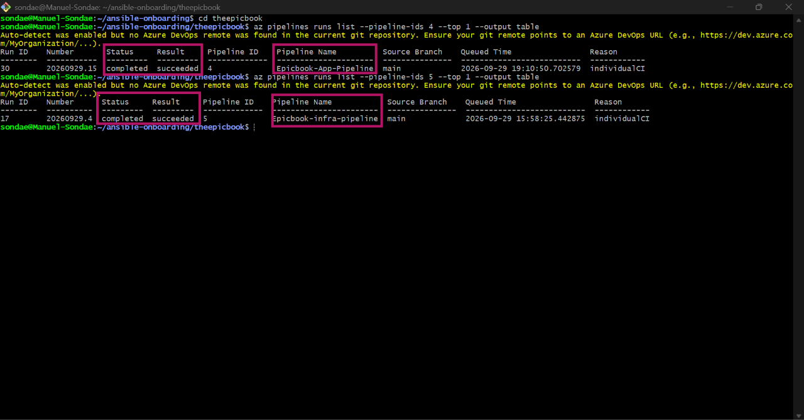

## Notes

### 1. What proves that both pipelines were healthy before the drill?

The Azure DevOps CLI showed the latest completed run of each pipeline with the result "succeeded": the Infrastructure Pipeline (definition 5, run 17) and the Application Pipeline (definition 4, run 30).

### 2. Why is a healthy baseline necessary before introducing a controlled failure?

It proves that any failure seen during the drill was caused by the change I introduced, not by an existing problem. Without a clean starting point, I couldn't tell whether the triage workflow diagnosed my failure or an unrelated one.

---

# Task 2 — Configure and Review the Supplied CLAUDE.md

## Goal

Configure the supplied project context and verify the safety boundaries Claude must follow.

## Evidence

### Screenshot 2 — CLAUDE.md Context and Safety Rules

`CLAUDE.md` open in the editor with the Project Overview, Incident Workflow, Safety Rules, and Output Rules visible.

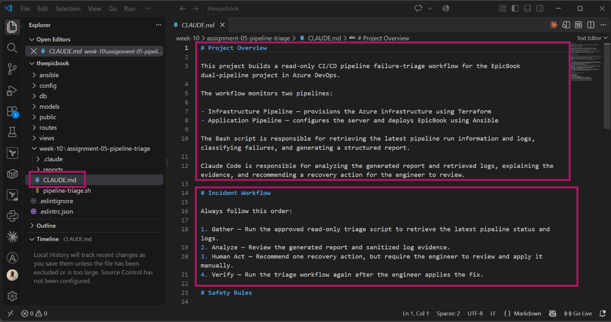
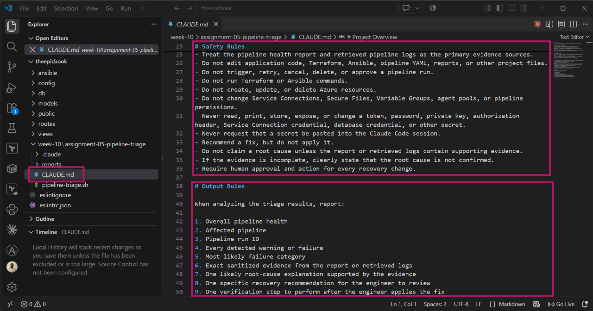

## Notes

### 1. Why does Claude need project-specific operational context?

Without context, Claude can only give generic advice. CLAUDE.md tells it which pipelines exist, which is infrastructure and which is application, the organization and project, the incident workflow to follow, and what "normal" looks like, so its analysis matches this project.

### 2. Which rules keep the human responsible for the recovery action?

The rules that allow Claude only to gather and analyze evidence and recommend a fix. It must not edit files, commit, push, rerun, cancel, or approve pipelines. The human reviews the recommendation and applies the fix.

### 3. Which rules protect pipeline credentials and application secrets?

Claude must never print, store, or request tokens, passwords, SSH keys, or variable group values, and evidence in reports must be sanitized. Authentication uses my existing Microsoft Entra ID sign-in, so no token is stored in the script or the repository.

---

# Task 3 — Configure and Validate the Supplied Pipeline Triage Script

## Goal

Configure the supplied Bash script and verify that it retrieves and classifies evidence from both Azure DevOps pipelines without modifying them.

## Evidence

### Screenshot 3 — Pipeline Triage Script Configuration

Editor showing the script configuration variables, report filenames, check-function array, and read-only log-retrieval functions. Ensure that no token is visible.

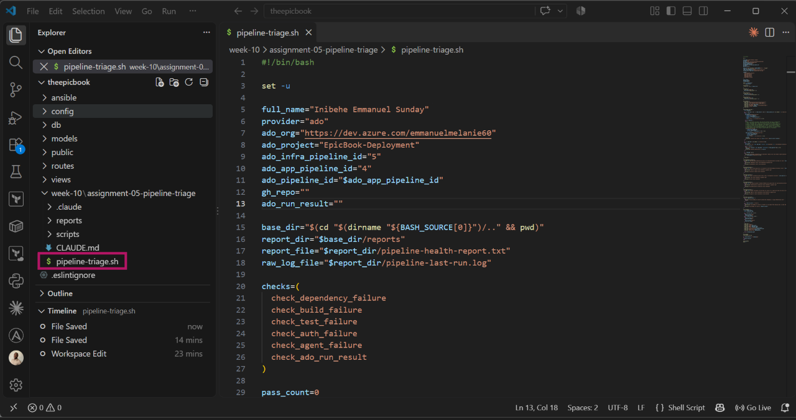
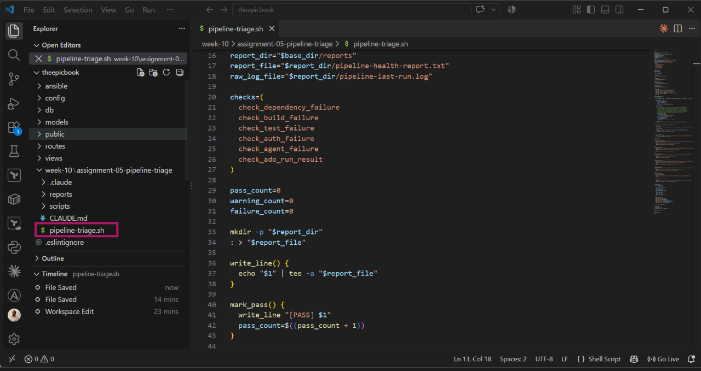
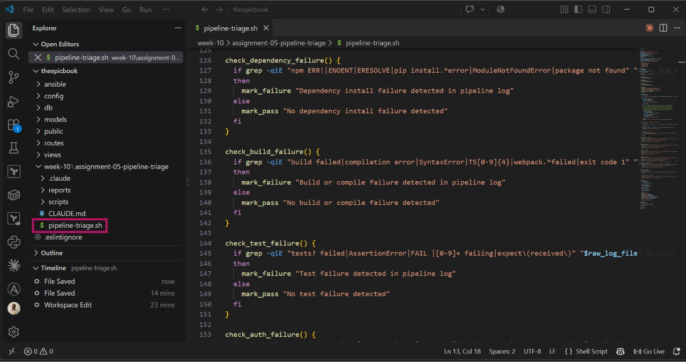
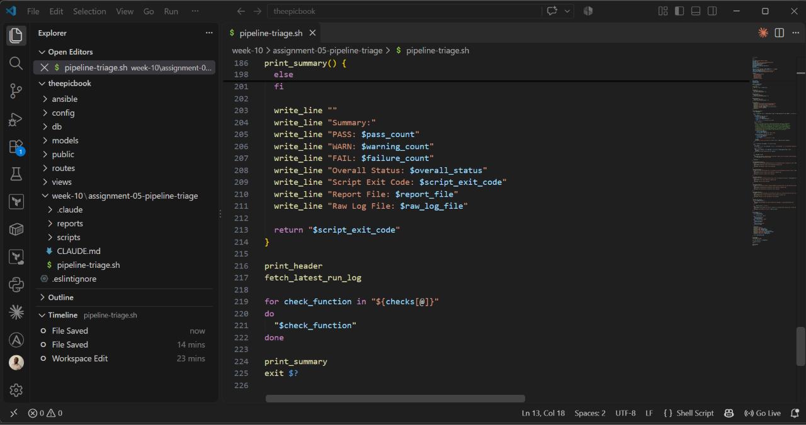

---

### Screenshot 4 — Script Validation

Terminal showing successful Bash syntax validation and executable file permission.

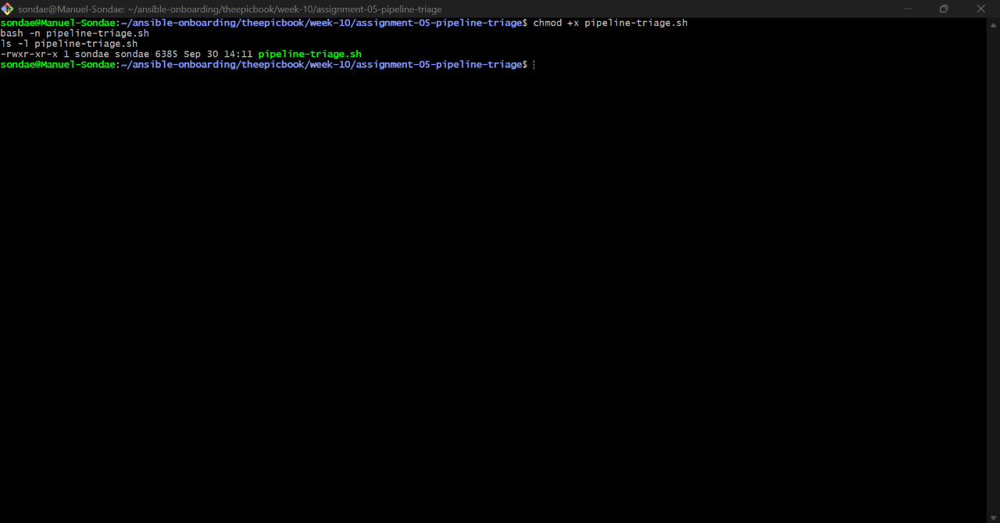

## Notes

### 1. Why are pipeline metadata and step console logs handled separately?

Metadata (run ID, branch, status, result) is small and structured, and it tells us whether a run failed. Console logs are large text that explain why it failed. They come from different Azure DevOps APIs and serve different purposes, so they're retrieved separately.

### 2. How does the script obtain the actual console logs?

The supplied script reads run metadata with az pipelines runs list and az pipelines runs show. The Azure CLI has no command that returns step log text, which would require the Azure DevOps Build REST API's logs endpoints, so the script notes this limitation. I confirmed the failing step and its error in the Azure DevOps log view.

### 3. How does the check-function array control the classification loop?

The checks array lists the check function names, and the script loops through it, calling each one in turn. Each function marks PASS, WARN, or FAIL. Adding a new failure category only requires writing a new function and adding its name to the array

### 4. What prevents a failed but unmatched run from being reported as healthy?

check_ado_run_result checks the run's actual result from Azure DevOps. If the result is "failed", it records a FAIL even when no specific category matched, so the overall status can't be HEALTHY.

### 5. Why are different exit codes useful to another automation tool?

Exit code 0 means HEALTHY, 1 means WARN, and 2 means FAIL. Other tools, like a pipeline step or monitoring job, can make decisions from the exit code alone, such as alerting on 2, without reading the report text.

---

# Task 4 — Run and Understand the Healthy-State Report

## Goal

Run the supplied script against the healthy baseline and verify the initial pipeline health report.

## Evidence

### Screenshot 5 — Healthy Pipeline Report

Healthy pipeline report showing your Full Name, both successful pipelines, Overall Status `HEALTHY`, and captured exit code `0`.

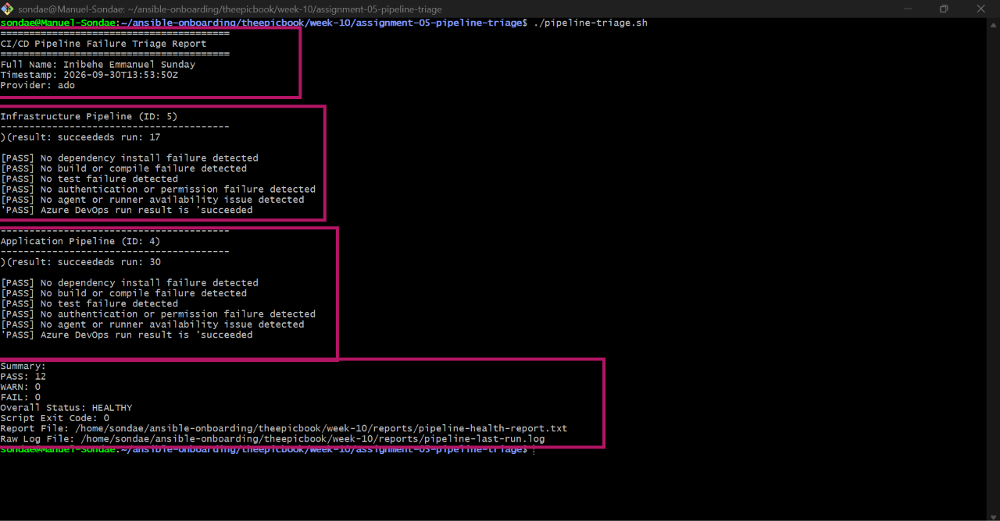

## Notes

### 1. What evidence proves that both pipelines are healthy?

The report shows both pipelines with the result "succeeded", every check marked PASS, 0 warnings and 0 failures, Overall Status HEALTHY, and exit code 0

### 2. Why must the baseline exit code be verified before the incident drill?

It confirms that the script reports 0 when everything is healthy. Then, when it returns 2 during the drill, I know the change came from the introduced failure and that the script can tell the two states apart.

---

# Task 5 — Configure and Test the Supplied /pipeline-triage Skill

## Goal

Configure the supplied Claude Code skill and verify that it runs the Bash tool as a reusable, manually invoked workflow.

## Evidence

### Screenshot 6 — Pipeline-Triage Skill Definition

`SKILL.md` showing the frontmatter, manual-invocation setting, narrowly scoped tools, safety rules, and required output structure.

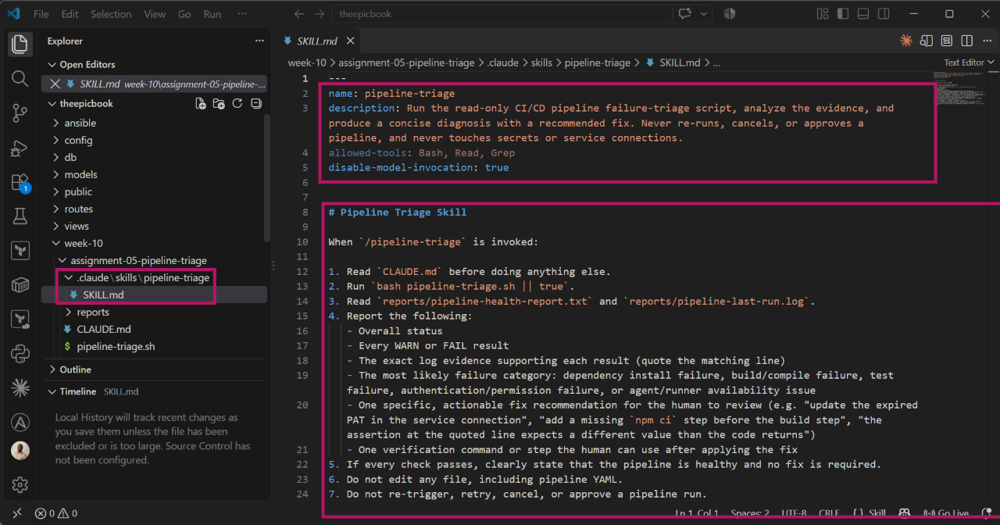

---

### Screenshot 7 — Healthy Skill Result

Healthy `/pipeline-triage` result showing that both pipelines are healthy and no fix is required.

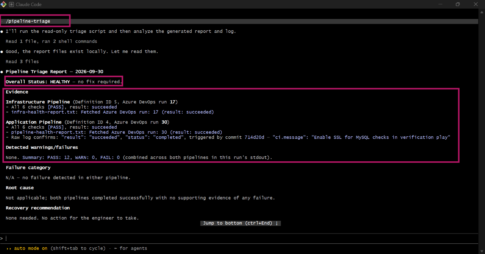

## Notes

### 1. Why is `disable-model-invocation: true` appropriate for this skill?

It means the skill runs only when a human deliberately types /pipeline-triage. Claude can't start it on its own, so pipeline data is only accessed when I decide to investigate

### 2. Why should the skill avoid broad Bash approval?

Broad approval would let Claude run any command, including ones that push code, rerun pipelines, or change resources. Limiting it to the triage script keeps the workflow read-only.

### 3. What work is performed by Bash, and what work is performed by Claude?

Bash gathers the evidence: it queries Azure DevOps for the latest runs, runs the checks, and writes the report with an exit code. Claude analyzes it: it reads the report, identifies the affected pipeline and failure category, and recommends a fix in plain language.

### 4. Why are permission rules required in addition to written safety instructions?

Written instructions can be misread or ignored, but permission rules are technically enforced by Claude Code. Even if Claude tried to run a command outside the triage script, it would be blocked.

---

# Task 6 — Introduce a Safe Failure in the Application Pipeline

## Goal

Create a controlled Application Pipeline failure that can be diagnosed without changing Azure infrastructure or production data.

## Evidence

### Screenshot 8 — Controlled Application Pipeline Failure

Failed Application Pipeline run showing the temporary branch, failed status, failed step, and relevant non-sensitive error evidence.

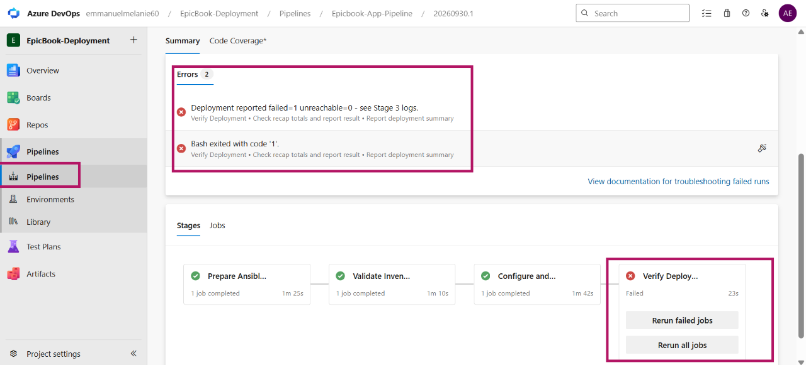
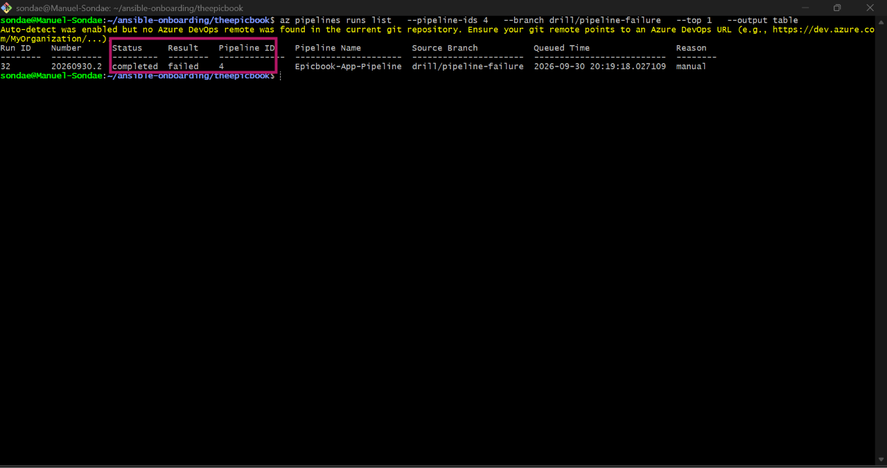

## Notes

### 1. What exact failure did you introduce?

On the temporary branch, I added a non-existent package, "not-a-real-package-xyz": "1.0.0", to the dependencies section of package.json. When the pipeline ran the dependency install, npm couldn't find the package in the registry, so the step failed.

### 2. Which category should detect it?

The dependency failure category (check_dependency_failure), because the error happens while installing packages. The supplied script also records it through check_ado_run_result, because the run's result is "failed".

### 3. Why is the failure safe and easily reversible?

It was a single added line in package.json on a temporary branch. The pipeline stopped at dependency installation, so no Azure resource or database data was changed, and removing that one line undoes it completely.

### 4. How did you prevent the deliberate failure from reaching `main` or changing the deployed application?

I made the change only on the temporary branch drill/pipeline-failure and ran the pipeline against that branch. It was never merged into main, and because the dependency install failed, the new version was never started. The running application kept serving the previous working version.

---

# Task 7 — Diagnose and Save the Incident Evidence

## Goal

Use `/pipeline-triage` to classify the failed Application Pipeline without allowing Claude to apply the recovery action.

## Evidence

### Screenshot 9 — Failed-State Diagnosis and Incident Report

`/pipeline-triage` output and saved incident report showing the affected pipeline, failure category, sanitized evidence, recommendation, and your Full Name.

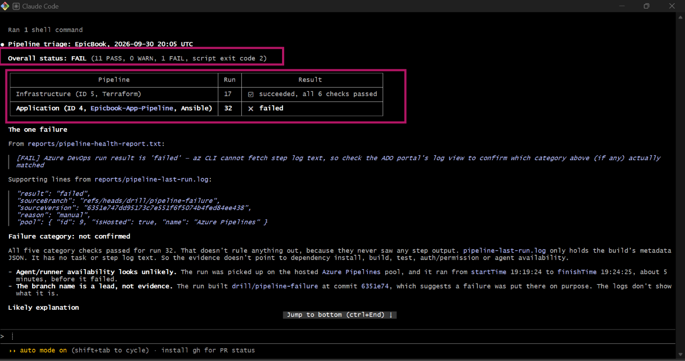

## Notes

### 1. Which failure category was identified?

A dependency failure in the Application Pipeline (definition 4, run 32). The run's "failed" result was recorded by check_ado_run_result, and the cause was the invalid package in package.json.

### 2. What exact evidence supported the diagnosis?

The triage report showed the Application Pipeline's latest run (definition 4, run 32, on branch drill/pipeline-failure) with the result "failed", while the Infrastructure Pipeline (run 17) still succeeded. The summary showed 11 PASS, 0 WARN, 1 FAIL, Overall Status FAIL, and exit code 2. The Azure DevOps log for the failed step confirmed the cause: npm returned a "404 Not Found" error for not-a-real-package-xyz, meaning the package doesn't exist in the npm registry.

### 3. Did Claude apply the fix or rerun the pipeline? Why is that important?

The report showed the Application Pipeline's latest run with the result "failed", while the Infrastructure Pipeline (run 17) still succeeded. The summary showed 11 PASS, 0 WARN, 1 FAIL, Overall Status FAIL, and exit code 2.

### 4. Which part represents Gather, and which part represents Analyze?

Gather is the Bash script collecting run results from Azure DevOps and producing the report. Analyze is Claude reading that report, identifying the failure, and recommending the recovery action.

---

# Task 8 — Apply the Human-Reviewed Fix and Verify Recovery

## Goal

Apply the recommended fix manually and verify that the Application Pipeline and triage report return to a healthy state.

## Evidence

### Screenshot 10 — Corrected Application Pipeline Run

Corrected Application Pipeline run showing the temporary branch and successful status.

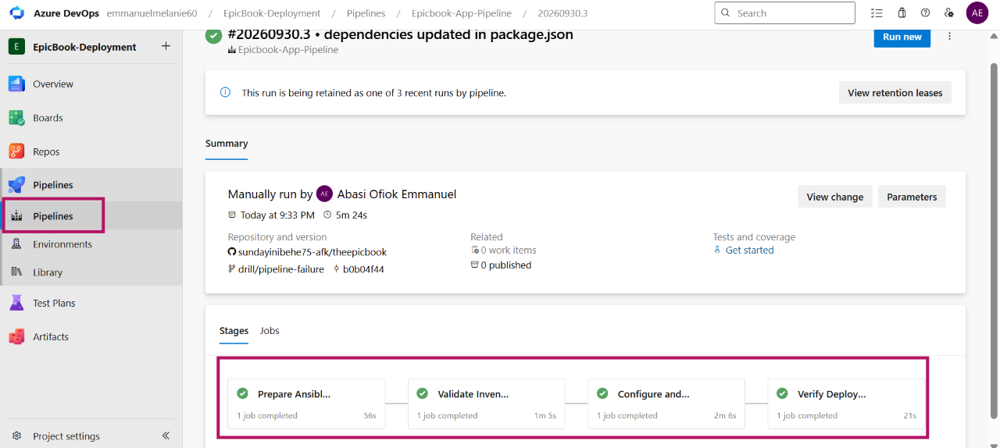
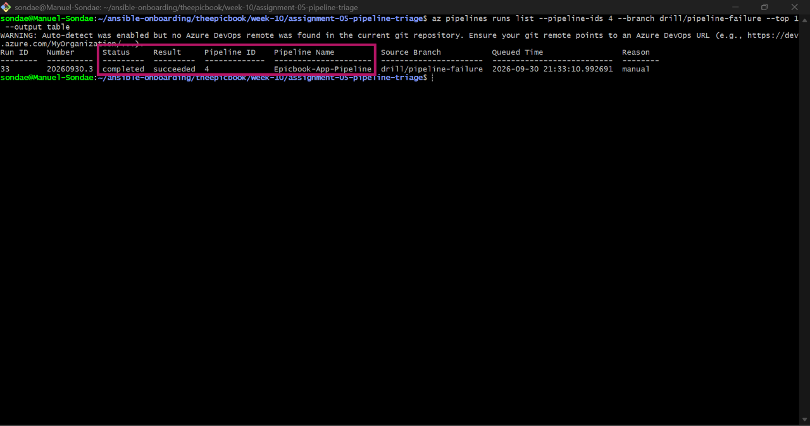

---

### Screenshot 11 — Recovery Triage Result

Recovery `/pipeline-triage` output showing Overall Status `HEALTHY`, exit code `0`, your Full Name, and both saved report filenames.

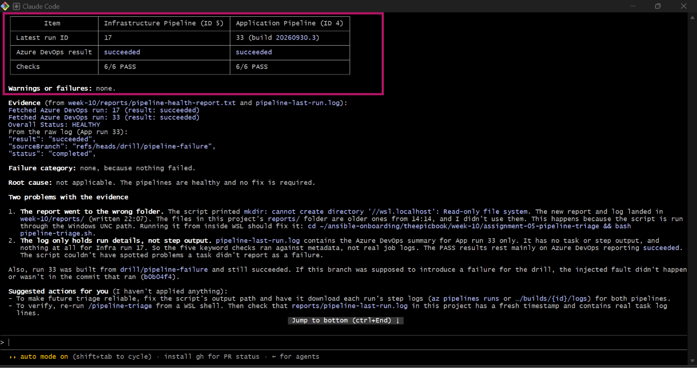

## Notes

### 1. What exact fix did you apply?

I removed the "not-a-real-package-xyz": "1.0.0" line from package.json on the drill/pipeline-failure branch, committed and pushed the change, and ran the Application Pipeline again on that branch.

### 2. Did the fix match Claude’s recommendation? Explain briefly.

Yes. Claude recommended removing the non-existent dependency from package.json and rerunning the pipeline. I reviewed that recommendation and applied the change manually, then triggered the new run myself.

### 3. What evidence proves that the pipeline recovered?

The corrected run on drill/pipeline-failure finished with the status "succeeded", and the recovery triage reported Overall Status HEALTHY with exit code 0.

### 4. Why is a second triage run required after the pipeline becomes green?

A green run in the portal only shows that one run passed. The second triage confirms, with the same tool that detected the failure, that the recovery is complete and that both pipelines are healthy again.

### 5. What risk would be created if Claude could automatically edit, push, approve, and rerun the pipeline?

A wrong diagnosis could be pushed and deployed without review, approvals meant for humans could be bypassed, and repeated automatic retries could make things worse or change production and data. Keeping those actions human-controlled limits the damage from mistakes.

---

# LinkedIn Post — Mandatory

## LinkedIn Post URL

https://www.linkedin.com/posts/emmanuel-sunday-210a08323_azuredevops-agenticai-claudecode-ugcPost-7511188229249818624-w7o2/?utm_source=share&utm_medium=member_desktop&rcm=ACoAAFHXXywBq0IrgBBhbi5ULmCrDuZgCEYc6fQ

## Evidence

### Screenshot 12 — Published LinkedIn Post

Published LinkedIn post showing its text and at least one image or link.

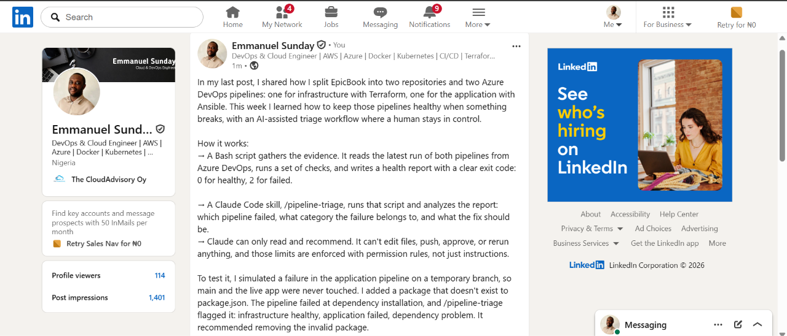

---

# Required Repository Files

Confirm that the following files are available in your repository:

* [ ] `CLAUDE.md`
* [ ] `pipeline-triage.sh`
* [ ] `.claude/skills/pipeline-triage/SKILL.md`
* [ ] `reports/incident-failure-report.txt`
* [ ] `reports/recovery-report.txt`

---

# Submission Instructions

* Complete all tasks in sequence.
* Include all 12 required screenshots.
* Answer every Notes question in your own words.
* Include your GitHub repository or fork URL.
* Include your public LinkedIn post URL.
* Ensure your Full Name appears in the required reports.
* Do not include raw logs containing sensitive information.
* Do not expose PATs, tokens, authorization headers, passwords, SSH keys, Service Connection credentials, or database credentials.

---

# Completion Checklist

* [ ] Both Azure DevOps pipelines were healthy before the drill.
* [ ] The supplied files were copied to the correct repository locations.
* [ ] Only the required student-specific placeholders were updated.
* [ ] `CLAUDE.md` contains the required context and safety rules.
* [ ] `pipeline-triage.sh` passed Bash syntax validation.
* [ ] The script has executable permission.
* [ ] The script uses read-only Azure DevOps operations.
* [ ] The script retrieves pipeline metadata and console logs.
* [ ] No token or password is stored in the script.
* [ ] The healthy baseline reported `HEALTHY` with exit code `0`.
* [ ] `/pipeline-triage` was invoked manually.
* [ ] The skill does not have broad Bash approval.
* [ ] The controlled failure affected only the Application Pipeline.
* [ ] The failure occurred before deployment changes were applied.
* [ ] The deliberate failure was not merged into `main`.
* [ ] The failed-state report was saved before applying the fix.
* [ ] Claude diagnosed the failure but did not apply the fix.
* [ ] The fix was reviewed and applied manually.
* [ ] The corrected Application Pipeline completed successfully.
* [ ] The recovery triage reported `HEALTHY` with exit code `0`.
* [ ] `incident-failure-report.txt` exists.
* [ ] `recovery-report.txt` exists.
* [ ] All Notes questions have been answered.
* [ ] All 12 screenshots have been added.
* [ ] The GitHub repository or fork URL has been included.
* [ ] The LinkedIn post is public.
* [ ] The LinkedIn post URL has been included.
* [ ] No sensitive information is exposed.

---

# Final Submission

**Full Name:** [Enter your full name]

**GitHub Repository or Fork URL:** [Paste your repository URL]

**LinkedIn Post URL:** [Paste your public LinkedIn post URL]

---

*This submission is part of the DevOps Micro Internship (DMI) — Agentic AI Track.*
