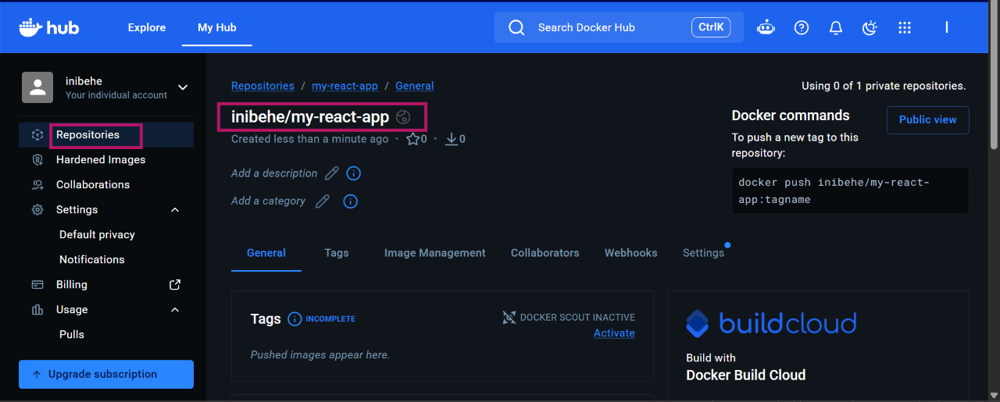
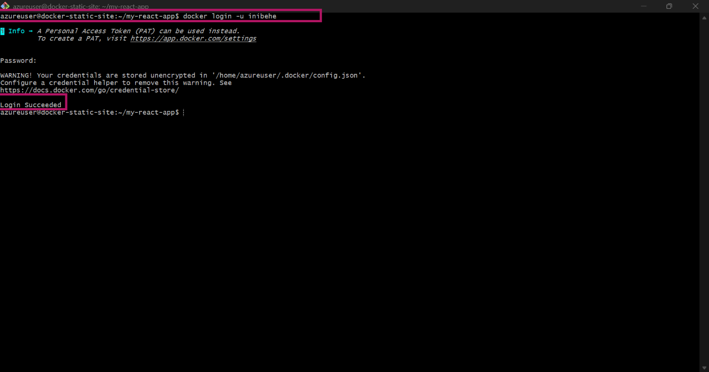
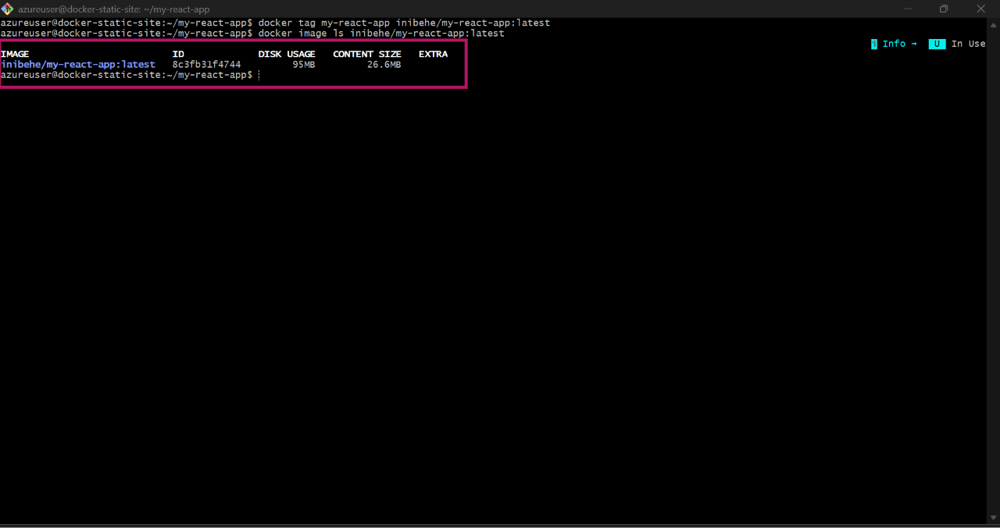
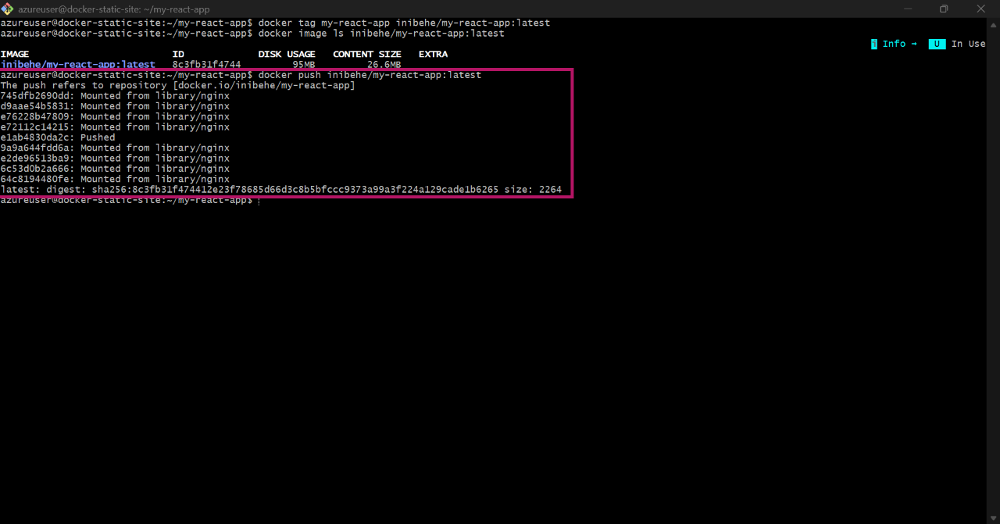
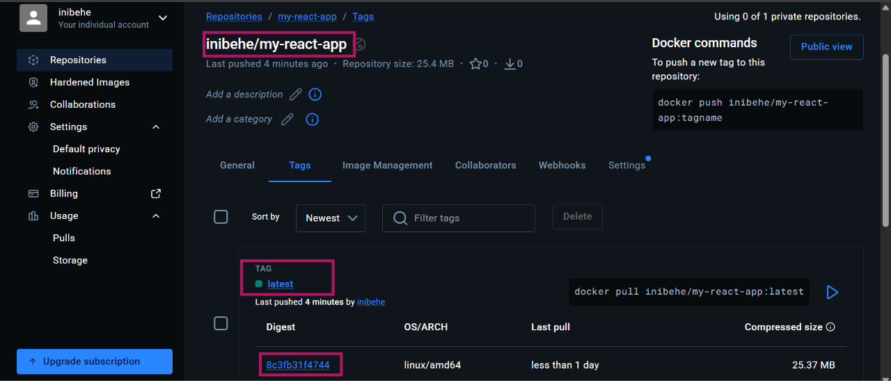
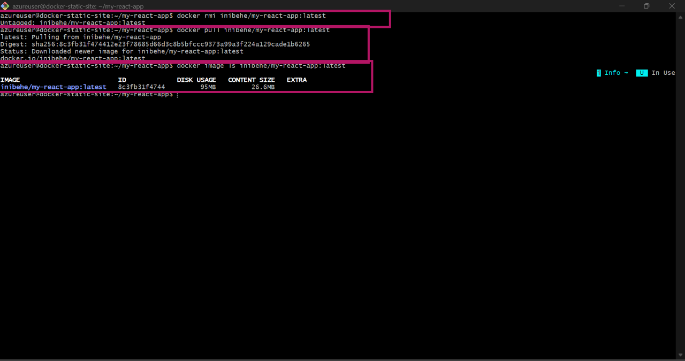
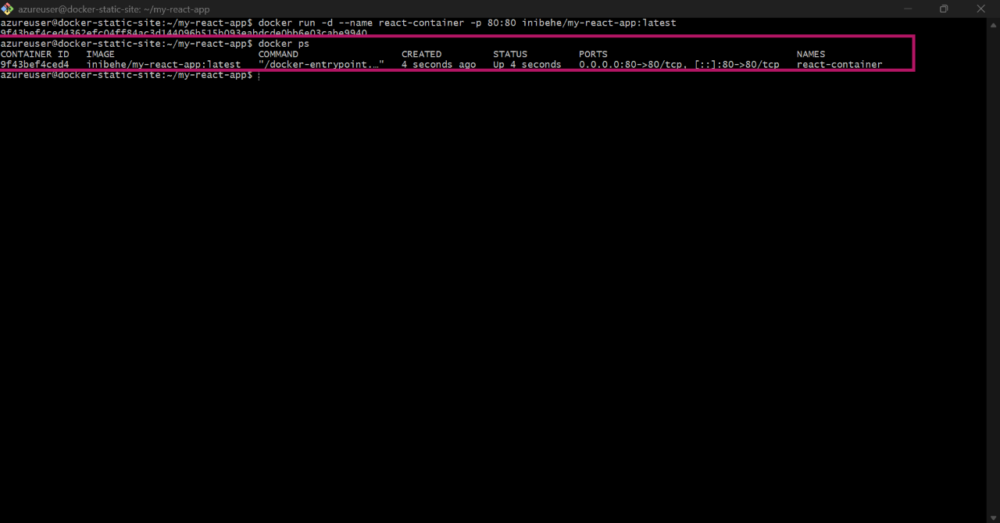
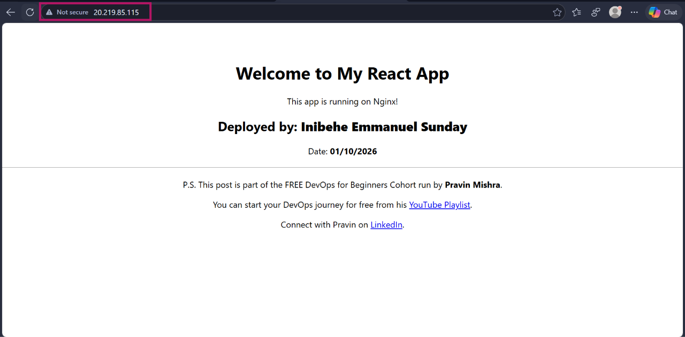
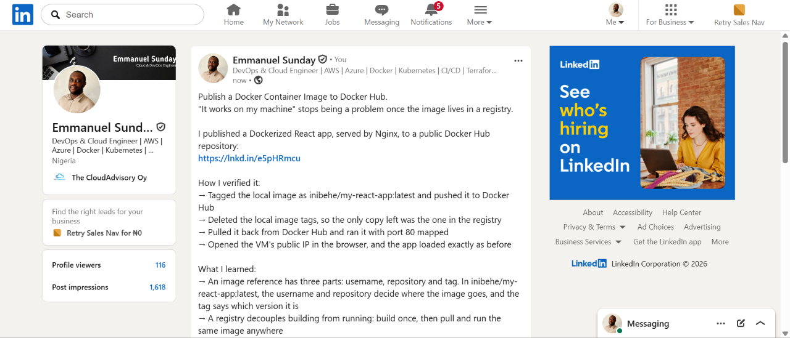

# Assignment 5 — Publish a Docker Container on Docker Hub

Part of the DevOps Micro Internship (DMI) with Agentic AI

---

## Purpose

In this assignment, you will publish a Dockerized React application to Docker Hub, remove the local image tags, pull the image again from Docker Hub, and run it to verify that it can be downloaded and deployed from a container registry.

---

# Task 1 — Publish a Docker Image to Docker Hub

## Goal

Tag a locally built React image, publish it to Docker Hub, remove the local copy, pull it again from Docker Hub, and run it successfully.

### Evidence

#### Screenshot 1 — Public Docker Hub Repository

Add a screenshot of Docker Hub showing your newly created public repository:

```text
my-react-app
```



---

#### Screenshot 2 — Successful Docker Login

Add a screenshot of the terminal showing:

```text
Login Succeeded
```

Ensure that your full name is visible and that no password, Personal Access Token, or device code is exposed.



---

#### Screenshot 3 — Correctly Tagged Image

Add a screenshot of the terminal showing:

```bash
docker image ls <YOUR_DOCKERHUB_USERNAME>/my-react-app
```

The output must show the `latest` tag.



---

#### Screenshot 4 — Successful Docker Push

Add a screenshot of the terminal showing successful completion of:

```bash
docker push <YOUR_DOCKERHUB_USERNAME>/my-react-app:latest
```

The output must include a pushed status or image digest.



---

#### Screenshot 5 — Published `latest` Tag in Docker Hub

Add a screenshot of your Docker Hub repository showing the uploaded `latest` image tag.



---

#### Screenshot 6 — Local Image Removed and Pulled Again

Add a screenshot of the terminal showing:

- The targeted local image tags removed
- Successful `docker pull` output
- `docker image ls` showing the pulled image



---

#### Screenshot 7 — Running Pulled Image

Add a screenshot of the terminal showing:

```bash
docker ps
```

The output must show the running `react-container` with:

```text
0.0.0.0:80->80/tcp
```



---

#### Screenshot 8 — React Application in Browser

Add a browser screenshot showing the React application at:

```text
http://20.219.85.115
```

Ensure that the VM public IP is visible in the address bar. Add your full name as a clear caption directly below the screenshot.



---

# Docker Hub Repository URL

**Repository URL:** https://hub.docker.com/r/inibehe/my-react-app

---

# Registry and Image Tagging Notes

Write a short explanation covering:

- Why image tagging is required before pushing to Docker Hub
- Why a container registry is useful in DevOps workflows
- Why production deployments should use versioned image tags instead of relying only on `latest`

Docker where to push it. The full name follows the pattern <registry>/<username>/<repository>:<tag>, and for Docker Hub the registry part is left out. A locally built image named something like my-react-app has no username, so Docker doesn't know which account or repository it belongs to. Tagging it as <username>/my-react-app:latest links the image to my Docker Hub repository, and the tag (latest) labels which version is being published. Without the correct tag, the push is rejected or sent to the wrong place.

Why a container registry is useful in DevOps workflows: A registry is a central place to store and share images. A CI/CD pipeline can build an image once, push it to the registry, and every environment (dev, staging, production) or teammate can pull the exact same image. This assignment showed that: after deleting the local image, I pulled it back from Docker Hub and ran it with the same result, so the deployment no longer depended on the machine where it was built. Registries also keep a history of image versions, which makes rollbacks possible, and they integrate with orchestration platforms like Kubernetes, which pull images from a registry to run containers.

tag name. It doesn't mean "newest stable" and changes every time someone pushes without a specific tag. If production relies on latest, two servers can end up running different versions, a restart can quietly pull an untested image, and it's hard to know what's actually deployed or roll back to a known-good version. Versioned tags like v1.0.0 or a Git commit SHA are fixed, traceable, and repeatable. I ran into this risk myself in an earlier assignment: a MongoDB image tagged latest pulled a new major version that failed to start on my VM, and pinning it to mongo:7.0 fixed it.

---

# LinkedIn Requirement

## Goal

Create a LinkedIn post about publishing a Docker container image to Docker Hub.

Include:

- Assignment title: **Publish a Docker Container Image to Docker Hub**
- Your Docker Hub repository URL
- What you published
- How you verified the remote image by pulling and running it
- Key learning outcomes

### Evidence

#### LinkedIn Post URL

Paste your LinkedIn post URL here:

https://www.linkedin.com/posts/emmanuel-sunday-210a08323_docker-dockerhub-devops-ugcPost-7512118012913532928-8S1M/?utm_source=share&utm_medium=member_desktop&rcm=ACoAAFHXXywBq0IrgBBhbi5ULmCrDuZgCEYc6fQ

---

#### LinkedIn Post Screenshot



---

# Submission Instructions

- Complete all steps in sequence.
- Include Screenshots 1–8 exactly as specified.
- Include your Docker Hub repository URL.
- Include the Registry and Image Tagging Notes.
- Include the LinkedIn post URL and screenshot.
- Ensure that your full name is visible in all terminal screenshots.
- Add your full name as a clear caption below the browser screenshot.
- Do not expose passwords, Personal Access Tokens, device codes, credentials, or other sensitive information.

---

# Completion Checklist

- [ ] Public `my-react-app` repository created
- [ ] Docker login completed successfully
- [ ] `react-multistage:latest` tagged correctly
- [ ] Image pushed to Docker Hub
- [ ] `latest` tag verified in Docker Hub
- [ ] Targeted local image tags removed
- [ ] Image pulled again from Docker Hub
- [ ] Pulled image runs successfully
- [ ] React application is accessible through the VM public IP
- [ ] Docker Hub repository URL included
- [ ] Registry and image-tagging notes completed
- [ ] LinkedIn post URL and screenshot included
- [ ] All required screenshots included
- [ ] Full name visible in terminal screenshots
- [ ] Browser screenshot has a full-name caption
- [ ] No passwords, tokens, or credentials exposed
---

## 📌 About DMI & CloudAdvisory

DevOps Micro Internship (DMI) is a project-based DevOps program run by Pravin Mishra (The CloudAdvisory) focused on real-world execution, systems thinking, and career readiness.

It helps learners build strong DevOps foundations with hands-on experience.

---

## 📌 Resources

- 🌐 DMI Official Website: https://dmi.pravinmishra.com?utm_source=github&utm_medium=readme  
- 🎓 University: https://university.pravinmishra.com?utm_source=github&utm_medium=readme  
- 💬 Discord Community: https://discord.pravinmishra.com?utm_source=github&utm_medium=readme  
- 📝 Blog: https://dmi.pravinmishra.com/blog?utm_source=github&utm_medium=readme  
- ▶️ YouTube Playlist: https://www.youtube.com/playlist?list=PLFeSNDtI4Cho  
- 🔗 Pravin Mishra (LinkedIn): https://www.linkedin.com/in/pravin-mishra-aws-trainer/  
- 🏢 CloudAdvisory (LinkedIn): https://www.linkedin.com/company/thecloudadvisory/

---

*This submission is part of DevOps Micro Internship (DMI) — Agentic AI Track.*
